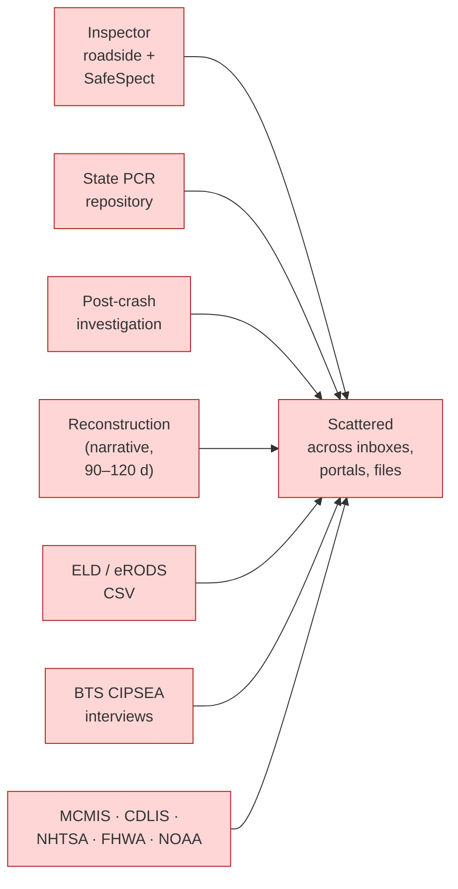
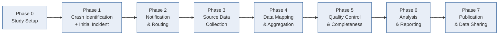

# 01 — Scope Statement

**Phase:** Discover · **Artifact family:** Strategy & Scope
**Document owner:** CCFP delivery team
**Status:** Final for v1.0 build
**Parent spec:** `Documentation/project_documentation.md`
**Version:** 1.0 · **Last reviewed:** 2026-06-03

!!! tip "Where to go next"
    The Scope Statement defines the **boundary**. For the **why** and
    **governance** see [02 — POC Charter](02-poc-charter.md). For
    **who** is in scope see
    [03 — Stakeholders & Personas](03-stakeholders-personas.md). For
    the concrete in-code proof that each scope item is built, see
    [04 — Business Requirements](04-business-requirements.md).

!!! info "Document conventions"
    - **MUST / SHALL / SHOULD** follow RFC 2119 semantics.
    - **In-scope** items are numbered §4.x and cross-referenced to the
      functional modules of `Documentation/project_documentation.md` §8.
    - **Out-of-scope** items are enumerated with their post-Phase-1
      disposition.
    - **Assumptions** are numbered `A1…A24` and trace to the parent
      spec's open-questions and assumptions register (§17).
    - Roles appear in monospace (`MCSAP_INSPECTOR`); status/enum values
      in monospace; file paths are relative to the repo root.

!!! warning "All data on the live demo is 100% synthetic"
    Every crash, person, carrier, vehicle, ELD file, and interview
    reference in the running CCFP demo is **fabricated** for evaluation.
    No real PII, no real CIPSEA-protected interview content, and no
    production FMCSA data are present. The seed `@ccfp.gov` email domain
    is fictitious and non-deliverable. The live demo is served from
    <https://nexgile-dot-ccfp.nexgiletechnologies.com>.

---

## Table of contents

- [1. Purpose](#1-purpose)
- [2. Problem context](#2-problem-context)
- [3. Product vision](#3-product-vision)
- [4. In scope](#4-in-scope-the-v10-build-ships-with)
- [5. Out of scope](#5-out-of-scope)
- [6. Assumptions](#6-assumptions)
- [7. Constraints](#7-constraints)
- [8. Dependencies](#8-dependencies)
- [9. Success criteria](#9-success-criteria-condensed)
- [10. Scope traceability](#10-scope-traceability-matrix)
- [11. Scope change history](#11-scope-change-history)
- [12. Glossary pointer](#12-glossary-pointer)
- [13. Approval](#13-approval)

---

## 1. Purpose

This Scope Statement defines the **boundary**, **deliverables**,
**assumptions**, and **constraints** of the **Crash Causal Factors
Program (CCFP) IT Solution** v1.0 build so the FMCSA CCFP Project Team,
the Volpe analysis team, participating-State MCSAP and crash-data staff,
BTS, and the delivery team share a single understanding of "what is and
is not in this release."

CCFP is a scalable platform for **collecting, integrating, managing,
analyzing, and sharing** data about commercial-motor-vehicle (CMV)
crashes. The v1.0 build delivers **Phase 1 — the Heavy-Duty Truck
Study** end-to-end, while keeping every schema, rule, and UI surface
**configurable for future phases** without a rebuild.

### 1.1 What this document is

A durable, authoritative reference. It:

1. Enumerates every functional and non-functional scope item across the
   **eight-phase CCFP lifecycle** (Study Setup through Publication & Data
   Sharing) defined in `Documentation/project_documentation.md` §5.
2. Traces each scope item to the implementing surface in `Backend/` and
   `Frontend/` and to the Business Requirements in
   [04 — Business Requirements](04-business-requirements.md).
3. Documents every assumption feeding the design so that a change in any
   assumption triggers a formal scope review.
4. Lists what is explicitly out of scope — with the post-Phase-1 path so
   that the choice is never a dead end.

### 1.2 What this document is not

- **Not a statement of work.** Commercial terms live in the delivery
  contract.
- **Not a technical specification.** For technical depth go to
  [Solution Design](../03-design/13-solution-design.md),
  [Architecture & Sequence](../03-design/11-architecture-sequence.md),
  and [Data Model](../02-analyze/08-data-model.md).
- **Not a causation engine.** The platform does **not** determine legal
  causation and does **not** make policy decisions. It provides data,
  analysis tooling, and workflow support so that authorized humans —
  notably the `STATE_CMV_ANALYST` — make the causal-factor judgments. The
  platform manages the *data substrate* around the judgment, not the
  judgment itself.
- **Not a user manual.** For task-level guidance see
  [Use Cases](05-use-cases.md) and
  [User Stories](06-user-stories.md).

### 1.3 Supersession

This document is consistent with the current
`Documentation/project_documentation.md` and with the code shipping on
the live demo at
<https://nexgile-dot-ccfp.nexgiletechnologies.com>. Database connection
details are **not** reproduced here: the API reads its connection from a
`DATABASE_URL` environment variable supplied by the deployment's secrets
source (value not shown).

---

## 2. Problem context

### 2.1 The data lives in too many places

The data required to understand why a fatal heavy-duty-truck crash
happened is spread across many actors and systems. No single environment
brings them together for analysis and sharing today. The inputs include:

- The **responding MCSAP CMV Inspector**, who files an Initial Incident
  Form and collects a post-crash inspection.
- **State CMV Data Analysts** and **State crash repositories** (the
  Police Crash Report / PCR).
- FMCSA-owned systems — **SafeSpect** (U.S. DOT number validation and
  inspection/crash reporting), **MCMIS** (crash and inspection records),
  **eRODS** (ELD / hours-of-service output files).
- The **post-crash investigation** workflow and **crash reconstruction**
  reports (narrative, arriving 90–120 days out).
- **BTS** confidential driver/carrier/witness interviews, protected under
  CIPSEA.
- External federal and third-party sources — **CDLIS** (driver
  licensing), **NHTSA** recalls, **FHWA** HPMS/MIRE roadway data, and
  **NOAA HRRR** weather.

Each actor sees only their slice. There is no stable crash identifier
joining the slices, no provenance trail back to each source value, no
shared completeness view, and no governed path to publish a
de-identified result. Analysts reconcile by hand; States are asked to
re-key data they already collect; and BTS interview data has no
compliant home alongside operational records.

### 2.2 The FMCSA authority and goal

CCFP is a congressionally authorized, multi-year, multi-phase FMCSA
program supporting evidence-based countermeasures, policy decisions,
enforcement planning, and State safety activities. It is part of the
U.S. DOT / FMCSA effort to address the rising number of fatal crashes
and pursue the long-term goal of **zero roadway fatalities**.

### 2.3 Why this project

The platform is a **controlled environment for the existing process**,
not a replacement for authoritative State, FMCSA, or BTS systems. It MUST:

1. **Reduce State burden.** Adapt to each State's existing PCR forms and
   formats rather than forcing standardization before participation.
2. **Join the scattered inputs.** One stable **CCFP identifier** per
   crash, with every source value retaining its provenance.
3. **Make completeness visible.** Per-study required/optional attributes
   and configurable completeness rules, so "is this crash record
   complete?" is answerable on one screen.
4. **Govern sensitivity.** Tag PII and CIPSEA data, enforce least
   privilege server-side, and keep published outputs **de-identified and
   separated** from operational records.
5. **Stay configurable.** Add States, attributes, sources, and entire
   study phases without a rebuild.

### 2.4 Phase-1 framing (formal)

For the avoidance of doubt: the v1.0 build implements **Phase 1 — the
Heavy-Duty Truck Study only**. A **Phase 1 qualifying crash** is a crash
with **≥ 1 fatality AND ≥ 1 heavy-duty truck** — a Class 7 or Class 8
vehicle with a **GVWR ≥ 26,001 lbs**. Every scope item below flows from
that definition, and every schema, rule, and UI surface is built so that
a future phase (medium-duty, buses, serious-injury) changes
*configuration*, not *code*. This is the single most load-bearing framing
decision in the document — see [A1](#6-assumptions) and
[A23](#6-assumptions).

---

## 3. Product vision

### 3.1 A single source of truth across 8 phases

A single web platform — the **CCFP IT Solution** — that:

1. **Configures** a study: vehicle type, crash severity, participating
   States, study dates, qualifying / in-scope / out-of-scope criteria,
   required and optional attributes, and completeness rules.
2. **Captures** the **Initial Incident Form (IIF)** within 24–48 hours of
   a crash, assigns the **CCFP identifier**, validates the U.S. DOT number
   against SafeSpect (mock), and classifies crash scope.
3. **Routes & notifies** — new in-scope crashes go to the
   `STATE_CMV_ANALYST` and to `BTS_CIPSEA_AGENT`s to begin the
   confidential interview workflow; out-of-scope supplemental crashes go
   to the analyst only.
4. **Collects source data** — post-crash inspection, typed §19.2
   post-crash investigation (PCI), Police Crash Report data, reconstruction
   narratives, and ELD/eRODS CSV files — by automated ingestion, file
   upload, direct State connection, or manual entry.
5. **Maps & aggregates** State-specific and external attributes onto the
   CCFP canonical model, links every source record to the CCFP identifier,
   and preserves provenance on each value.
6. **Runs QC & completeness** — configurable quality rules, missing-data
   and missing-IIF detection, and one current completeness status per
   crash.
7. **Analyzes & reports** — dashboards, whitelisted parameterized queries,
   tables, and the PCR-derived **top-three primary contributing factor**
   selection by the analyst.
8. **Publishes & shares** — role-appropriate reports plus **summarized,
   de-identified public outputs** after a study is released.

The 8-phase target lifecycle is below. Each box maps to a section of
`Documentation/project_documentation.md` §5 and to one or more workflow
services in `Backend/app/features/`.

### 3.2 The shape of the v1.0 build

-   :material-database-cog: **One data store**

    PostgreSQL is the **sole** transactional store. It also backs
    analytics, search (SQL `ILIKE` / `pg_trgm`), and document metadata.
    Uploaded files (reconstruction PDFs, ELD CSVs, images, video) go to
    local disk in the demo; the production target is DOT-approved object
    storage with signed-URL access.

-   :material-identifier: **One stable CCFP identifier**

    Every crash carries one durable `ccfp_identifier`. Source records and
    canonical attribute values keep `source_*` provenance so any value
    traces back to its origin system.

-   :material-shield-account: **12 roles, server-side RBAC**

    Twelve roles resolve effective permissions via
    `user_role_assignments → roles → role_permissions`. State users are
    scope-filtered to their State; PII is masked without a data-entry/QC
    permission; CIPSEA data requires `bts:read`.

-   :material-tune-variant: **Configurable, not hardcoded**

    Studies, study parameters, data attributes, attribute requirements,
    quality rules, and completeness rules are all **data**, so a future
    phase changes configuration, not code.

### 3.3 What the platform is *not* trying to be

- It is **not** a replacement for State crash systems, SafeSpect, MCMIS,
  CDLIS, eRODS, or BTS secure systems — it integrates with them.
- It is **not** a causation or policy engine — humans select contributing
  factors and make decisions.
- It does **not** force States to standardize their PCR before
  participating.
- It does **not** expose confidential BTS respondent data outside the
  compliant, CIPSEA-governed access model.

---

## 4. In scope — the v1.0 build ships with

The modules below correspond to `Documentation/project_documentation.md`
§8 and to the 8-phase lifecycle in §5. Each in-scope item carries a §4.x
number for stable cross-reference, an implementing **Code entry**, and a
**Traceability** pointer. Integration adapters ship as **feature-flagged
mocks** behind stable interfaces (see §4.13).

### 4.1 Study Administration (Phase 0)

**Purpose.** Let the `CCFP_PROJECT_ADMIN` stand up a study without
touching code, keeping Phase 1 assumptions out of the schema.

**What ships.** Define study phase, participating States
(`study_states`), qualifying / in-scope / out-of-scope criteria, study
duration, **required / optional / read-only** data attributes
(`data_attributes`, `attribute_requirements`), `study_parameters`
(e.g., CMV type, crash type, crash location), configurable
`completeness_rules`, and publication settings. Example study settings
from the source: CMV type (heavy-duty truck, medium-duty truck, bus),
crash type (fatal; severe-injury convenience sample), and crash location.

**Code entry.** `Backend/app/features/studies.py`,
`Frontend/src/pages/admin/*`, `Frontend/src/pages/studies/*`.

**Traceability.** BR-STU-01.. · [Workflow](../02-analyze/07-workflow-process.md) ·
[RBAC Matrix](../02-analyze/10-rbac-matrix.md).

### 4.2 Initial Incident Form & CCFP identifier (Phase 1)

**Purpose.** Replace the opaque 24–48-hour-post-crash hand-off with a
structured electronic form that creates the CCFP crash record and triggers
routing.

**What ships.**

- The electronic **IIF** completed by the `MCSAP_INSPECTOR` or designated
  officer: local crash report number, crash date/time, vehicle and person
  counts, full location (city/county/State/street/highway), CMV and
  non-CMV vehicle records, U.S. DOT number / make / occupants / carrier
  phone, driver records (name, minor indicator, primary language, address,
  phones, injury status), non-motorist and witness records, a short event
  summary, and supplemental vehicle/non-motorist/witness entries.
- **Assignment of the stable `ccfp_identifier`** on creation.
- **DOT-number validation** against SafeSpect (mock adapter).
- **Crash scope classification** — qualifying, in-scope, out-of-scope —
  written to `crash_scope_classifications`.
- **Save / update / delete (by business rule) / submit** workflow, with
  `incident_vehicles` and `incident_persons` children.

**Code entry.** `Backend/app/features/initial_incident.py`,
`Backend/app/features/crashes.py`,
`Frontend/src/features/initial-incident/*`.

**Traceability.** BR-IIF-01.. · [Data Model](../02-analyze/08-data-model.md) ·
[API Specification](../02-analyze/09-api-specification.md).

### 4.3 Notification & Routing (Phase 2)

**Purpose.** Get the right crash to the right person automatically.

**What ships.** On IIF save the system notifies the `STATE_CMV_ANALYST`.
For **in-scope** crashes it also notifies `BTS_CIPSEA_AGENT`s so the
confidential interview workflow can begin (routing to the BTS secure
database is subject to the approved CIPSEA access model — see
[A6](#6-assumptions)). **Out-of-scope** supplemental crashes route to the
analyst only. Lifecycle events create `notifications`; state-changing
actions write `audit_logs`.

**Code entry.** `Backend/app/features/notifications.py`,
`Backend/app/features/initial_incident.py` (routing),
`Frontend/src/features/notifications/*`.

**Traceability.** BR-RTE-01.. · [RBAC Matrix](../02-analyze/10-rbac-matrix.md).

### 4.4 Post-Crash Inspection ingestion (Phase 3)

**Purpose.** Bring roadside inspection findings (violations and defects)
onto the crash record.

**What ships.** Ingest `post_crash_inspections` from SafeSpect or approved
COTS inspection software and link them to the crash. The source business
rule — inspector uploads to FMCSA within 7 days — is represented as
workflow context, not enforced as a hard gate in v1.0.

**Code entry.** `Backend/app/features/source_data.py`,
`Frontend/src/features/inspections/*`.

**Traceability.** BR-INS-01.. · [Data Model](../02-analyze/08-data-model.md).

### 4.5 Post-Crash Investigation — typed §19.2 PCI (Phase 3)

**Purpose.** Capture the Heavy-Duty Truck Study post-crash investigation
as **structured, typed** data — not just an uploaded form.

**What ships.** A multi-section PCI workspace backed by typed child tables
covering carrier & power unit, driver & load, medical certificate, hours
of service, exemptions, vehicle condition, brake system, seating positions
(per-position seat belt / airbag), axles, tires, trailers, hazmat, and
additional towed units. Each field honors the form's **required vs
not-required** flags from `pci_field_definitions`, and the module produces
an ELD/HOS summary view.

**Code entry.** `Backend/app/features/source_data.py` (investigations),
`Backend/app/models.py` (`pci_*` tables),
`Frontend/src/features/pci/*`.

**Traceability.** BR-PCI-01.. · [Data Model](../02-analyze/08-data-model.md) ·
`Documentation/project_documentation.md` §19.2.

### 4.6 Police Crash Report data + State mapping (Phase 3/4)

**Purpose.** Integrate State PCR data **without forcing States to change
their forms**.

**What ships.**

- PCR ingestion via two paths: (a) **FMCSA crash data** — the MCSAP
  analyst uploads a PCR subset to SafeSpect within 45 days, after which it
  reaches MCMIS for ingestion; and (b) a **direct State-repository
  connection** where feasible, bypassing the MCMIS round-trip.
- **State-specific `pcr_field_mapping`** onto the CCFP attribute model,
  covering MMUCC-aligned categories (Crash, Dynamic, Fatal, Large vehicles
  & hazmat, Non-motorist, Person, Roadway, Vehicle).
- **Per-State coverage tracking** (`state_pcr_coverage`,
  `state_attribute_coverage`) with the source's color-coding — *required &
  collected*, *required & not yet collected*, *optional & not yet
  collected* — counts, completion percentage, and a **State feedback loop**
  so coverage status is correctable when a State reports it already
  collects a flagged attribute.

**Code entry.** `Backend/app/features/source_data.py` (PCR + mapping),
`Backend/app/features/studies.py` (PCR coverage),
`Frontend/src/features/pcr/*`.

**Traceability.** BR-PCR-01.. · [Data Model](../02-analyze/08-data-model.md) ·
`Documentation/project_documentation.md` §19.3–§19.4.

### 4.7 Reconstruction & narrative coding (Phase 3)

**Purpose.** Hold the narrative reconstruction report and let an analyst
code its findings into research attributes.

**What ships.** Upload, store, review, and manually **code**
`reconstruction_reports` (expected 90–120 days post-crash) into CCFP
research attributes.

**Code entry.** `Backend/app/features/source_data.py` (reconstruction),
`Frontend/src/features/reconstruction/*`.

**Traceability.** BR-REC-01.. · [Data Model](../02-analyze/08-data-model.md).

### 4.8 ELD / eRODS upload & extraction (Phase 3)

**Purpose.** Get hours-of-service data onto the right crash record.

**What ships.** Upload **ELD output CSV** files, parse them into
`eld_files` / `eld_events`, and link to the crash using the unique CCFP
code carried in the file's **Output File Comment** (example format
`CCFP-State-Post-Crash-Inspection-Code`). Duty codes and fields map via
`eld_duty_code_mappings` / `eld_field_mappings`.

**Code entry.** `Backend/app/features/source_data.py` (ELD upload/events),
`Frontend/src/features/eld/*`.

**Traceability.** BR-ELD-01.. · `Documentation/project_documentation.md` §8.7.

### 4.9 Data Mapping, QC & Completeness (Phases 4–5)

**Purpose.** Turn many source records into one aggregated, trustworthy,
completeness-scored crash record.

**What ships.**

- **Aggregation** — link all source records to the CCFP identifier and
  build one **current canonical value** per `(crash, attribute)` in
  `crash_attribute_values`, preserving `source_*` provenance.
- **Configurable QC** — `data_quality_rules` + `data_quality_results` for
  missing data, invalid formats, compliance checks, and data-entry issues;
  **CDLIS** driver checks (mock).
- **Completeness** — `completeness_rules` driving one
  `crash_completeness_status` per crash; **missing-IIF** detection.
- **Raw + aggregated views**, edit during QC, **unlock** a complete record
  to edit, and every update tracked by user and timestamp.

**Code entry.** `Backend/app/features/data_management.py`,
`Backend/app/features/crashes.py` (QC / completeness / unlock),
`Frontend/src/features/data-management/*`.

**Traceability.** BR-AGG-01.., BR-QC-01.. ·
[Data Model](../02-analyze/08-data-model.md).

### 4.10 Contributing-factor selection (Phase 6)

**Purpose.** Keep the **causal judgment with the human**.

**What ships.** PCR-derived summaries plus a guided prompt for the
`STATE_CMV_ANALYST` to select the **top three primary contributing
factors** from the BRD-specified groups (`ref_contributing_factor_groups`
/ `ref_contributing_factor_values`): contributing circumstances for
roadways/vehicles/non-motorists; driver actions at time of crash; driver
conditions at time of crash; driver & non-motorists distracted by; and
non-motorist actions at time of crash. Selections persist in
`contributing_factor_selections`.

**Code entry.** `Backend/app/features/data_management.py`
(contributing-factor groups & selection),
`Frontend/src/features/analytics/*`.

**Traceability.** BR-CF-01.. · [Data Model](../02-analyze/08-data-model.md).

### 4.11 Analytics, dashboards & reports (Phase 6)

**Purpose.** A governed analysis environment for federal and State users.

**What ships.** Analytics dashboards; **whitelisted parameterized
queries** (`analytics:query`); report CRUD (`reports`); report **sharing**
(`report_shares`); and report **download**. Reports run scope-aware and
data-sensitivity-aware.

**Code entry.** `Backend/app/features/analytics.py`,
`Backend/app/features/reports.py`,
`Frontend/src/features/analytics/*`.

**Traceability.** BR-RPT-01.. · [API Specification](../02-analyze/09-api-specification.md).

### 4.12 Publication & public de-identified outputs (Phase 7)

**Purpose.** Publish summarized, de-identified study data to the public —
separated from operational records.

**What ships.** A **publish** action that de-identifies a report and
exposes it on the **no-auth** public surface: `/api/v1/public/outputs`,
`/api/v1/public/studies/{study_id}/outputs`, `/api/v1/public/data.json`,
and per-report read/download routes. Published outputs are summarized,
de-identified, and carry open-data metadata.

**Code entry.** `Backend/app/features/public.py`,
`Backend/app/features/reports.py` (publish),
`Frontend/src/features/public/*`.

**Traceability.** BR-PUB-01.. · [API Specification](../02-analyze/09-api-specification.md).

### 4.13 Documents, search, notifications, audit & integrations (cross-cutting)

-   :material-file-upload: **Documents**

    Upload with **malware scan**, metadata in `documents`, **signed-URL**
    download. Files go to local disk in the demo; production target is
    DOT-approved object storage.

-   :material-magnify: **Search**

    Cross-entity, **scope- and PII-aware** search using SQL `ILIKE` /
    `pg_trgm`, never returning data the caller may not see.

-   :material-bell-ring: **Notifications**

    New IIFs, in/out-of-scope routing, missing data, missing IIFs, QC
    failures, completeness changes, and report publish/share.

-   :material-history: **Immutable audit**

    Every state-changing action writes an immutable `audit_logs` entry
    with actor, action, target, and timestamp; audit reads are themselves
    governed by `audit:read`.

-   :material-transit-connection-variant: **Integrations (mocks)**

    `SafeSpect`, `CDLIS`, `MCMIS`, `eRODS` mock adapters behind stable
    interfaces, plus non-FMCSA source stubs (State PCR, NHTSA, FHWA, NOAA,
    BTS). Feature-flagged `CCFP_INTEGRATION_*_LIVE`.

-   :material-account-key: **Auth & RBAC**

    Dev mock-IdP issues a bcrypt-verified JWT for seeded users; production
    swaps a DOT-approved OIDC IdP (MFA / PIV / CAC) when
    `CCFP_DEV_AUTH_ENABLED=false`. All endpoints require auth **except**
    health checks and `/api/v1/public/...`.

**Code entry.** `Backend/app/features/documents.py`,
`Backend/app/features/search.py`,
`Backend/app/features/notifications.py`,
`Backend/app/features/audit.py`,
`Backend/app/features/integrations.py`,
`Backend/app/features/auth.py`, `Backend/app/core/permissions.py`.

**Traceability.** BR-DOC-01.., BR-SCH-01.., BR-AUD-01.., BR-INT-01.. ·
[RBAC Matrix](../02-analyze/10-rbac-matrix.md).

### 4.14 12 user roles

The platform recognizes **12 distinct roles**, catalogued in
[10 — RBAC Matrix](../02-analyze/10-rbac-matrix.md). Permissions resolve
as the role's permission set, scope-filtered to the user's State where
applicable, with PII masked unless a data-entry/QC permission is held and
CIPSEA data gated on `bts:read`.

| Code | Display | State-scoped | Primary purpose |
|---|---|:-:|---|
| `MCSAP_INSPECTOR` | MCSAP CMV Inspector | ● | Files the IIF; inspection & ELD inputs |
| `STATE_CMV_ANALYST` | State CMV Data Analyst | ● | QC, coding, completeness; selects contributing factors |
| `CCFP_PROJECT_TEAM` | CCFP Project Team | — | Program ops, analysis, QC, reporting |
| `CCFP_PROJECT_ADMIN` | CCFP Project Team Administrator | — | Users, roles, study params, attributes, rules |
| `CCFP_DB_ADMIN` | CCFP Database Administrator | — | Mappings & analytical datasets; raw + aggregated views |
| `CCFP_DATA_SCIENTIST` | CCFP Data Scientist | — | Federal causal-factor research |
| `BTS_CIPSEA_AGENT` | BTS CIPSEA Agent | — | Confidential interviews; CIPSEA-governed |
| `FMCSA_CIPSEA_AGENT` | FMCSA CIPSEA Agent | — | Views protected BTS data where permitted |
| `FEDERAL_USER` | Federal User | — | Role-approved reports & tables |
| `STATE_USER` | State User | ● | Non-PII reports; assigned State data |
| `PUBLIC_USER` | Public User | — | De-identified published data only |
| `SYSTEM_ADMIN` | System Administrator | — | Config, environments, audit, support |

### 4.15 Authentication target

**Production target.** A **DOT-approved OIDC IdP** with **MFA** for all
users and **PIV/CAC** for federal users; group memberships map to roles.

**Dev target.** A local mock-IdP issues an **HS256 JWT** after verifying a
seeded email + password (bcrypt) against `users.password_hash`, so the
demo does not depend on a federal IdP bridge. Toggled by
`CCFP_DEV_AUTH_ENABLED`. All seeded demo accounts share the password
`Second@123`; sign in at
<https://nexgile-dot-ccfp.nexgiletechnologies.com/login>. See
[Demo Credentials](../reference/demo-credentials.md) for the full table.

**Code entry.** `Backend/app/features/auth.py`,
`Backend/app/core/permissions.py`.

---

## 5. Out of scope

The following are **explicitly excluded** from the v1.0 build. Each
carries a post-Phase-1 path so the choice is never a dead end.

### 5.1 Replacing authoritative source systems

The platform does **not** replace State crash systems, SafeSpect, MCMIS,
BTS secure systems, CDLIS, or eRODS. It integrates with them as a
consumer/contributor.

**Post-Phase-1 path.** None planned — these remain systems of record;
CCFP integration deepens from mock to live via feature flags.

### 5.2 Live external integrations (v1.0 ships mocks)

All external adapters — `SafeSpect`, `CDLIS`, `MCMIS`, `eRODS`, State PCR,
NHTSA, FHWA, NOAA, BTS — ship as **feature-flagged mocks** behind stable
interfaces. No production credentials or live endpoints are wired in v1.0.

**Post-Phase-1 path.** Flip `CCFP_INTEGRATION_*_LIVE` per source once the
data-sharing agreement / MOU and credentials exist (see [A5](#6-assumptions),
[A6](#6-assumptions)).

### 5.3 Determining legal causation or policy

The platform does **not** determine legal causation and does **not** make
policy decisions. The analyst's top-three contributing-factor selection is
a structured human judgment, not an automated verdict.

**Post-Phase-1 path.** None planned — causal and policy judgment is
retained by authorized humans by design.

### 5.4 Forcing State PCR standardization

States are **not** required to standardize their PCR forms or formats
before participating. The mapping layer adapts to each State.

**Post-Phase-1 path.** None planned — adaptability is a core requirement,
not a temporary concession.

### 5.5 Exposing confidential BTS respondent data

The platform does **not** expose confidential BTS respondent data unless a
compliant, CIPSEA-governed access model is approved. v1.0 ships the
notification trigger and the `bts:read`-gated surface, not an open data
path.

**Post-Phase-1 path.** Implement the approved BTS exchange (read-only,
summary export, into the Data Lake, or out to BTS) once the MOU and access
method are settled (see [A6](#6-assumptions)).

### 5.6 Separate analytical data lake / warehouse engine

The source describes a CCFP **Data Lake** with raw/mapped/curated/
analytical/published zones. v1.0 realizes these as **PostgreSQL**
structures (provenance, canonical values, published outputs), not a
separate lakehouse or warehouse engine.

**Post-Phase-1 path.** Introduce a DOT-approved analytical
warehouse/lakehouse as data volume warrants; the zone model already maps
cleanly onto it.

### 5.7 Native mobile apps

The platform is **responsive web only** — no native iOS/Android shell.

**Post-Phase-1 path.** A PWA install prompt or native shell over the same
API if field usage warrants.

### 5.8 Future study phases

Medium-duty, bus, serious-injury, and other-severity studies are **out of
scope for v1.0** as *content*, but the platform is **built to host them by
configuration** (see §4.1 and [A23](#6-assumptions)).

**Post-Phase-1 path.** Stand up the new phase as study configuration —
new `study_parameters`, `data_attributes`, `attribute_requirements`,
`completeness_rules`, and `study_states` — without a rebuild.

### 5.9 Demo conveniences that disappear post-v1.0

| Demo convenience | Status | Removal / production swap |
|---|---|---|
| Dev mock-IdP + shared password `Second@123` | On in v1.0 dev | Replace via DOT-approved OIDC (MFA/PIV/CAC); set `CCFP_DEV_AUTH_ENABLED=false` |
| Synthetic `@ccfp.gov` seed users | On in v1.0 | Rotate/remove before any non-dev deployment |
| Uploaded files written to local disk | On in v1.0 | DOT-approved object storage with signed-URL access |
| In-process `BackgroundTasks` for async work | On in v1.0 | Celery/Redis (or DOT-approved queue) |
| Mock integration adapters | On in v1.0 | Live adapters behind `CCFP_INTEGRATION_*_LIVE` |

---

## 6. Assumptions

Assumptions are numbered A1…A24 for stable reference and trace to the
parent spec's open-questions and assumptions register
(`Documentation/project_documentation.md` §17).

### 6.1 Scope & study assumptions

| # | Assumption |
|---|---|
| **A1** | **A Phase 1 qualifying crash = ≥ 1 fatality AND ≥ 1 heavy-duty Class 7/8 truck (GVWR ≥ 26,001 lbs).** In-scope = qualifying crash in a participating State. |
| **A2** | **Out-of-scope supplemental crashes are intentionally supported** — qualifying crashes in non-participating States, and serious-injury (non-qualifying) heavy-duty crashes from any State with an advanced investigation — and do **not** require the full CCFP attribute set; they supplement and baseline analysis. |
| **A3** | **The IIF is created within 24–48 h** of a qualifying crash and is what creates the CCFP crash record and triggers routing. |
| **A4** | **Detailed requirements may evolve** during Phase 2 discovery and pilot feedback; the design favors configurability over hardcoded Phase 1 assumptions. |

### 6.2 Integration & data-sharing assumptions

| # | Assumption |
|---|---|
| **A5** | **External integrations are configurable adapters**, shipped as mocks behind stable interfaces and toggled by `CCFP_INTEGRATION_*_LIVE`; the underlying mechanism (API, secure file transfer, manual upload, read-only lookup) can change without disturbing the rest of the system. |
| **A6** | **The BTS data-exchange model is governed by CIPSEA and pending MOU.** The exchange direction (read-only, summary export, into the Data Lake, or out to BTS) and the access method require a BTS MOU; v1.0 ships the notification trigger and a `bts:read`-gated surface, not an open path. |
| **A7** | **States should not be required to make major changes** to existing systems or formats; per-State PCR mapping and a State feedback loop absorb the difference. PCR reaches CCFP via SafeSpect→MCMIS (45-day window) or a direct State-repository connection where feasible. |
| **A8** | **ELD files are linked by the unique CCFP code** carried in the Output File Comment (e.g., `CCFP-State-Post-Crash-Inspection-Code`); files arrive as CSV from eRODS. |

### 6.3 Data-model & provenance assumptions

| # | Assumption |
|---|---|
| **A9** | **One stable `ccfp_identifier` per crash**; every source value retains `source_*` provenance via `source_records` and `crash_attribute_values`. |
| **A10** | **One current canonical value per `(crash, attribute)`** and **one completeness status per crash**, enforced by partial unique indexes. |
| **A11** | **Canonical attributes are per-study required / optional / read-only**, and **completeness logic is per-study** — both are data, not code. |
| **A12** | **Provenance is never discarded** — editing a canonical value does not erase the source value it came from. |

### 6.4 Security, privacy & compliance assumptions

| # | Assumption |
|---|---|
| **A13** | **Authorization is enforced server-side on every request** by role, organization, State, study phase, crash scope, data sensitivity, and resource-level permission. The frontend only hides affordances; the API is the security boundary. |
| **A14** | **PII and CIPSEA data are tagged** (`data_sensitivity`), masked without a data-entry/QC permission, and CIPSEA data is gated on `bts:read`. |
| **A15** | **Published outputs are de-identified and separated** from operational records, served on a no-auth public surface. |
| **A16** | **Audit logs are immutable**; state-changing actions write `audit_logs` and audit reads are themselves governed (`audit:read`). |
| **A17** | **Data-sharing agreements precede State onboarding**; FMCSA IT and the Privacy Office establish the required agreements before a State participates. The FMCSA DACH access model is a candidate reference architecture. |

### 6.5 Platform & deployment assumptions

| # | Assumption |
|---|---|
| **A18** | **PostgreSQL is the sole data store** in v1.0 — it backs transactional records, analytics, search (`ILIKE`/`pg_trgm`), and document metadata; uploaded files go to local disk in the demo. |
| **A19** | **Async work runs in-process** via FastAPI `BackgroundTasks` in v1.0; the production target is Celery/Redis or a DOT-approved queue. |
| **A20** | **The DB connection is supplied via a `DATABASE_URL` environment variable** from the deployment's secrets source; no connection string, host, port, or password appears in the docs. |
| **A21** | **The production stack swaps DOT-approved equivalents** (design system, OIDC IdP, managed PostgreSQL, object storage) for the implemented stack. |
| **A22** | **English only and responsive web** in v1.0; WCAG 2.1 AA / Section 508 is the accessibility target across primary flows. |

### 6.6 Future-phase configurability

| # | Assumption |
|---|---|
| **A23** | **The platform is configurable for future phases without a rebuild** — adding medium-duty, buses, serious-injury studies, more States, attributes, sources, completeness rules, and study parameters is a configuration change, not a code change. Phase 1 assumptions MUST NOT be hardcoded into schemas, rules, or UI. |
| **A24** | **Data management is the first delivery priority**; analysis and sharing build on it. The source sequences a data-management milestone ahead of the analysis/sharing milestone and the pilot. |

---

## 7. Constraints

### 7.1 Federal compliance constraints

1. **Section 508 / WCAG 2.1 AA** across primary flows (508 is the source
   requirement; WCAG 2.1 AA is the technical conformance target).
2. **Federal website standards** — government banner, descriptive page
   titles, metadata; `.gov`/`.mil` domains under the DOTGOV Online Trust
   in Government Act.
3. **Paperwork Reduction Act** — OMB approval and display of the **OMB
   control number** before public information collection.
4. **Privacy Act** documentation — PTA / PIA / SORN where required — and
   **NARA** records-management guidance.
5. **CIPSEA** protection for BTS interview data, with access controls
   gated on `bts:read`.
6. **Plain Writing Act**, open-government/open-data discoverability, and
   information-quality requirements for public outputs.

### 7.2 Security constraints

1. **MFA for all users; PIV/CAC** for federal users (production IdP).
2. **Encryption in transit and at rest**; object storage encryption with
   **signed-URL** access.
3. **Immutable audit logs**, least-privilege access, and **malware
   scanning** on every upload.
4. **Server-side authorization on every request** — three-dimensional by
   role, scope (State/org/study/crash), and data sensitivity.

### 7.3 Data & provenance constraints

1. **One stable CCFP identifier per crash**; provenance retained on every
   source value.
2. **Per-study** required/optional/read-only attributes and **per-study**
   completeness logic.
3. **Published outputs de-identified and physically separated** from
   operational records.

### 7.4 Technical constraints

1. **PostgreSQL** is the required transactional store and the v1.0
   analytics/search/document-metadata store; uploaded files go to local
   disk in the demo.
2. **FastAPI / Pydantic / SQLAlchemy / PyJWT** on the API tier;
   **React + TypeScript + Vite** on the web tier. REST, JSON, versioned
   under `/api/v1/...`.
3. **The DB connection is read from a single config source** (a
   `DATABASE_URL` env var); credentials are never committed or shown in
   docs (see [A20](#6-assumptions)).
4. All endpoints **require auth except** health checks (`/health`,
   `/health/db`) and the public surface (`/api/v1/public/...`).

### 7.5 Non-functional targets

| Target | Value |
|---|---|
| Availability | 24/7 except scheduled maintenance |
| Concurrency | ≥ 1,000 concurrent users without response-time degradation |
| Scalability | Horizontal; add users, States, attributes, sources, and studies |
| Responsiveness | Mobile-responsive, device-agnostic |
| Auditability | Track record updates, user actions, provenance, completeness changes |
| Data flexibility | Structured, semi-structured, and unstructured data |

---

## 8. Dependencies

### 8.1 Identity Provider

- **Production:** a DOT-approved **OIDC IdP** with MFA and PIV/CAC for
  federal users; group memberships map to the 12 roles.
- **Dev:** a local mock-IdP issuing an HS256 JWT after bcrypt-verifying a
  seeded password, toggled by `CCFP_DEV_AUTH_ENABLED`.

### 8.2 FMCSA-owned source systems (mocked in v1.0)

**SafeSpect** (U.S. DOT number validation, inspection/crash reporting),
**MCMIS** (crash & inspection records), **eRODS** (ELD / HOS), and the
broader FMCSA data ecosystem (ACE, DataQs, DIR, DACH, DSMS, SMS, TPR) —
consumed via stable adapter interfaces, mocked in v1.0.

### 8.3 Non-FMCSA & State sources (mocked in v1.0)

**State crash repositories** (PCR), **CDLIS** (driver licensing via
AAMVA), **NHTSA** recalls, **FHWA** HPMS/MIRE roadway data, **NOAA HRRR**
weather, and **BTS** confidential interviews — adapters mocked, live
behind feature flags.

### 8.4 BTS MOU (CIPSEA)

A **Memorandum of Understanding** with BTS specifying the data shared
(e.g., summary data excluding driver PII), security protocols, and access
method — a prerequisite for any live BTS exchange (see [A6](#6-assumptions)).

### 8.5 State data-sharing agreements

A signed **data-sharing agreement** per State, established by FMCSA IT and
the Privacy Office, **before** that State is onboarded (see
[A17](#6-assumptions)).

### 8.6 Object storage & malware scanning (production)

DOT-approved encrypted **object storage** with versioning and signed-URL
access, plus **upload malware scanning**. In the demo, files are written
to local disk and scanned by a mock scanner.

### 8.7 Async runtime & email (production)

A DOT-approved **queue/worker** runtime (Celery/Redis or equivalent) for
ingestion, mapping, validation, notifications, and report generation; and
a DOT-approved **email/notification gateway**. v1.0 uses in-process
`BackgroundTasks`.

---

## 9. Success criteria (condensed)

The v1.0 build is "done" when, in a live demonstration on
<https://nexgile-dot-ccfp.nexgiletechnologies.com>, the following can all
be observed end-to-end with **100% synthetic** data:

- [x] A `CCFP_PROJECT_ADMIN` **configures a study** — States, qualifying /
      in-scope / out-of-scope criteria, required/optional attributes, and
      completeness rules — without touching code.
- [x] A `MCSAP_INSPECTOR` **files an Initial Incident Form**; the system
      assigns a `ccfp_identifier`, validates the U.S. DOT number against
      SafeSpect (mock), and classifies crash scope.
- [x] **Routing fires** — an in-scope crash notifies the
      `STATE_CMV_ANALYST` and `BTS_CIPSEA_AGENT`s; an out-of-scope
      supplemental crash notifies the analyst only.
- [x] **Source data is collected** — a post-crash inspection, a typed
      **§19.2 PCI**, PCR data with **State mapping**, a reconstruction
      narrative coded into attributes, and an **ELD CSV** parsed and linked
      by the CCFP code.
- [x] **Mapping & aggregation** build one canonical value per
      `(crash, attribute)` with `source_*` provenance preserved.
- [x] **QC & completeness** run configurable rules, flag missing data and
      missing IIFs, and set one `crash_completeness_status` per crash;
      a complete record can be **unlocked** and edited.
- [x] The `STATE_CMV_ANALYST` **selects the top-three primary contributing
      factors** from the BRD-specified groups.
- [x] **Analytics & reports** run scope- and sensitivity-aware; a report is
      **published**, **de-identified**, and appears on the no-auth public
      surface (`/api/v1/public/outputs`, `/api/v1/public/data.json`).
- [x] A **document** uploads with a malware scan and downloads via a
      signed URL; **search** returns only data the caller may see.
- [x] **A State-scoped user sees only their State's data** — a `KS` analyst
      cannot read a `TX` crash (verified by a 403/404).
- [x] Every action above writes an immutable `audit_logs` entry; lifecycle
      events create `notifications`.
- [x] **All 12 demo seed roles log in** with the shared password
      `Second@123` and exercise role-appropriate flows.

Full requirement-to-KPI traceability lives in
[04 — Business Requirements](04-business-requirements.md); the full exit
checklist lives in [02 — POC Charter](02-poc-charter.md).

---

## 10. Scope traceability matrix

Every in-scope item maps to one or more implementing surfaces in code and
to a BR family. The reverse mapping (BR ID → scope §) lives in
[04 — Business Requirements](04-business-requirements.md).

| Scope § | BR family | Implementing surface |
|---|---|---|
| §4.1 Study Administration | BR-STU | `Backend/app/features/studies.py`, `Frontend/src/pages/admin/*` |
| §4.2 Initial Incident Form | BR-IIF | `Backend/app/features/initial_incident.py`, `Backend/app/features/crashes.py`, `Frontend/src/features/initial-incident/*` |
| §4.3 Notification & Routing | BR-RTE | `Backend/app/features/notifications.py`, `Backend/app/features/initial_incident.py` |
| §4.4 Post-Crash Inspection | BR-INS | `Backend/app/features/source_data.py`, `Frontend/src/features/inspections/*` |
| §4.5 Post-Crash Investigation (PCI) | BR-PCI | `Backend/app/features/source_data.py`, `Backend/app/models.py` (`pci_*`), `Frontend/src/features/pci/*` |
| §4.6 PCR data + State mapping | BR-PCR | `Backend/app/features/source_data.py`, `Backend/app/features/studies.py`, `Frontend/src/features/pcr/*` |
| §4.7 Reconstruction & coding | BR-REC | `Backend/app/features/source_data.py`, `Frontend/src/features/reconstruction/*` |
| §4.8 ELD / eRODS | BR-ELD | `Backend/app/features/source_data.py`, `Frontend/src/features/eld/*` |
| §4.9 Mapping, QC & Completeness | BR-AGG, BR-QC | `Backend/app/features/data_management.py`, `Backend/app/features/crashes.py`, `Frontend/src/features/data-management/*` |
| §4.10 Contributing factors | BR-CF | `Backend/app/features/data_management.py`, `Frontend/src/features/analytics/*` |
| §4.11 Analytics & reports | BR-RPT | `Backend/app/features/analytics.py`, `Backend/app/features/reports.py` |
| §4.12 Public outputs | BR-PUB | `Backend/app/features/public.py`, `Backend/app/features/reports.py` |
| §4.13 Documents / Search / Notify / Audit / Integrations | BR-DOC, BR-SCH, BR-AUD, BR-INT | `Backend/app/features/{documents,search,notifications,audit,integrations}.py` |
| §4.14 12 user roles | BR-RBAC | `Backend/app/core/permissions.py`, `Backend/database/seeds/*` |
| §4.15 Auth (OIDC target + dev JWT) | BR-AUTH | `Backend/app/features/auth.py` |

The matrix is exhaustive: every §4.x scope item resolves to a BR family
that itself resolves to concrete code in the repository.

---

## 11. Scope change history

| Date | Version | Change | Owner |
|---|---|---|---|
| — | v0.1 | Initial program design memo from the CCFP BRD | CCFP Project Team |
| — | v0.5 | Eight-phase lifecycle and Phase 1 (Heavy-Duty Truck Study) scope confirmed | Delivery |
| — | v1.0 | Project Documentation — scope, 12 roles, 8-phase lifecycle, ~38-table data model | Delivery |
| — | v1.x | Typed §19.2 Post-Crash Investigation (PCI) model + multi-section form; State-PCR→CCFP field mapping | Delivery |
| 2026-06-03 | this | Scope Statement published for v1.0 build sign-off | Delivery |

Any future scope change MUST be logged here and reflected in the
Assumptions register (A1..A24).

---

## 12. Glossary pointer

Unfamiliar terms used in this document — **CCFP**, **FMCSA**, **MCSAP**,
**IIF (Initial Incident Form)**, **CCFP identifier**, **PCR (Police Crash
Report)**, **MMUCC**, **PCI (Post-Crash Investigation)**, **ELD / eRODS**,
**HOS (Hours of Service)**, **SafeSpect**, **MCMIS**, **CDLIS**,
**CIPSEA**, **BTS**, **PII**, **de-identification**, **completeness rule**,
**contributing factor**, **qualifying / in-scope / out-of-scope crash**,
**Class 7/8 truck**, **GVWR**, **provenance**, **data sensitivity** — are
defined in the project-wide [Glossary](../glossary.md).

---

## 13. Approval

| Role | Name | Date | Signature |
|---|---|---|---|
| Delivery Sponsor | _on file_ | 2026-06-03 | _on file_ |
| Technical Lead | _on file_ | 2026-06-03 | _on file_ |
| CCFP Project Team | _pending_ | | |
| FMCSA Privacy Office | _pending_ | | |
| BTS (CIPSEA) | _pending_ | | |
| DOT Records Officer | _pending_ | | |
| Security Officer | _pending_ | | |

---

## Related documents

- [02 — POC Charter](02-poc-charter.md) — governance, team, timeline,
  risks, exit criteria
- [03 — Stakeholders & Personas](03-stakeholders-personas.md) — all 12
  roles in narrative form
- [04 — Business Requirements](04-business-requirements.md) — every
  requirement traced to code and a KPI
- [05 — Use Cases](05-use-cases.md) — task-level flows behind each §4.x item
- [07 — Workflow / Process Diagrams](../02-analyze/07-workflow-process.md)
  — the 8-phase lifecycle behind every scope item
- [08 — Data Model](../02-analyze/08-data-model.md) — the PostgreSQL
  table-by-table schema for every scope item
- [09 — API Specification](../02-analyze/09-api-specification.md) — the
  endpoint-by-endpoint view of the API
- [10 — RBAC Matrix](../02-analyze/10-rbac-matrix.md) — the 12 roles ×
  permission-family authorization matrix
- [13 — Solution Design](../03-design/13-solution-design.md) — the design
  depth behind the scope items
- [14 — Operations Runbook](../04-release/14-operations-runbook.md) —
  bring-up and day-2 operations
- [Demo Credentials](../reference/demo-credentials.md) — the 12 synthetic
  sign-in accounts
- [Glossary](../glossary.md) — term definitions

*End of 01 — Scope Statement.*
