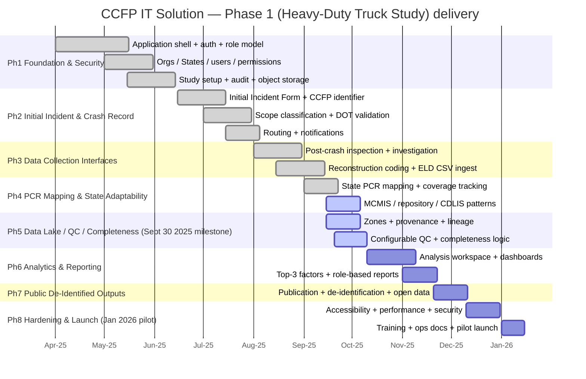
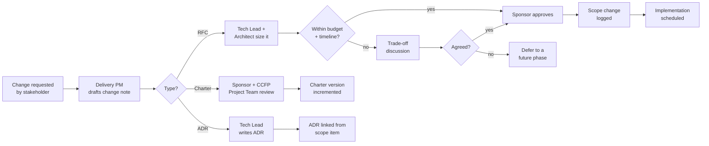
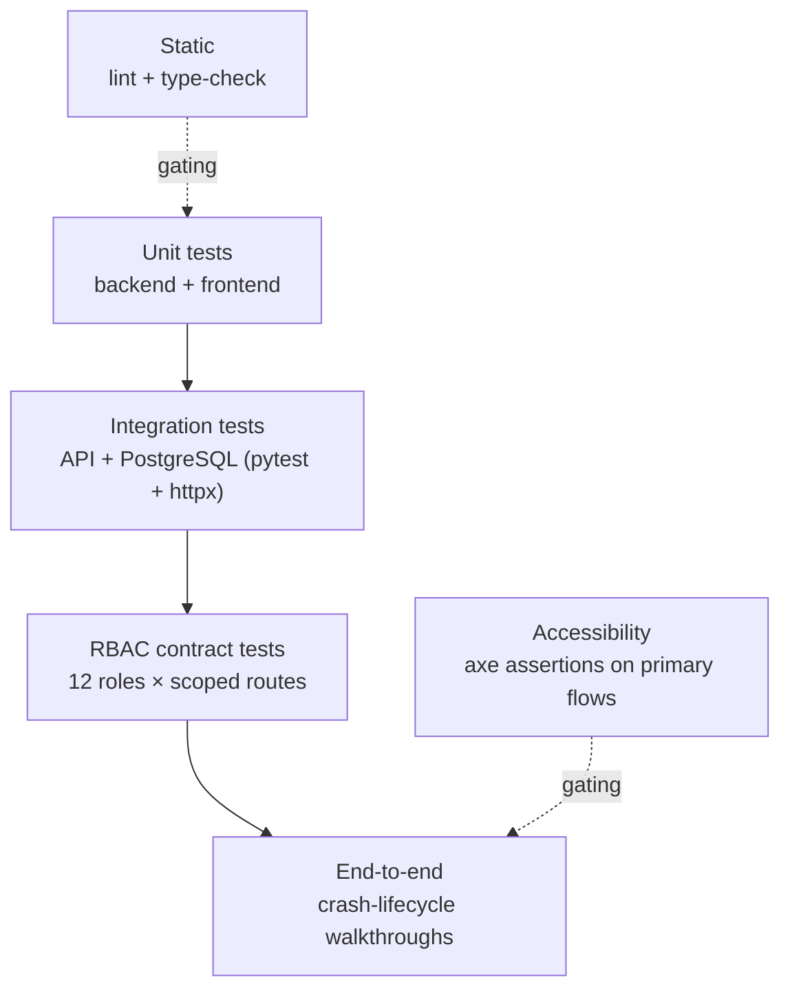

# Program / POC Charter

**Phase:** Discover · **Artifact family:** Charter & Governance
**Charter version:** 1.0 — June 2026
**Sponsor:** FMCSA — Crash Causal Factors Program (CCFP), in partnership with the Volpe National Transportation Systems Center
**Authorizing source:** `Documentation/project_documentation.md` §1 (Executive Summary), §2 (Program Background), §15 (Non-Functional Requirements), §16 (Implementation Roadmap)
**Last reviewed:** 2026-06-03

!!! tip "Where to go next"
    The Charter covers **governance**: who is accountable, by when,
    under what risks. For the **boundary** (what Phase 1 does and does
    not build) go to [01 — Scope Statement](01-scope-statement.md).
    For the **twelve roles** the Charter governs go to
    [03 — Stakeholders & Personas](03-stakeholders-personas.md). For
    the **measurable requirements** behind each Charter objective go to
    [04 — Business Requirements](04-business-requirements.md). For the
    **technical realization** of what the Charter authorizes, go to
    [13 — Solution Design](../03-design/13-solution-design.md).

!!! info "Relationship to the Scope Statement"
    The [Scope Statement](01-scope-statement.md) defines **what** the
    Phase 1 build delivers and **what it explicitly excludes**. This
    Charter defines **why** it exists, **who** is accountable for each
    workstream, **how** it is governed, and **when** it will be
    measured complete. Both are required CCFP program-record artifacts.
    Where the two appear to disagree, the Scope Statement is
    authoritative on **what** ships, and this Charter is authoritative
    on **how** decisions are made.

!!! warning "100% synthetic data"
    Every crash record, user, organization, and credential referenced
    in this Charter and the live demo is **fully synthetic**. The
    `@ccfp.gov` domain is fictitious and non-deliverable; there is no
    real PII, no real CIPSEA respondent data, and no production
    content anywhere in the demo environment.

---

## Table of contents

- [1. Charter objective](#1-charter-objective)
- [2. Problem statement and business case](#2-problem-statement-and-business-case)
- [3. Product vision](#3-product-vision)
- [4. Objectives and key results](#4-objectives-and-key-results)
- [5. Scope at a glance](#5-scope-at-a-glance)
- [6. Governance — RACI summary](#6-governance-raci-summary)
- [7. Program team](#7-program-team)
- [8. Timeline and milestones](#8-timeline-and-milestones)
- [9. Risks and mitigations](#9-risks-and-mitigations)
- [10. Assumptions carried into the Charter](#10-assumptions-carried-into-the-charter)
- [11. Communications plan](#11-communications-plan)
- [12. Change-management process](#12-change-management-process)
- [13. Quality-management plan](#13-quality-management-plan)
- [14. Governance cadence](#14-governance-cadence)
- [15. Exit and acceptance criteria](#15-exit-and-acceptance-criteria)
- [16. Charter authorization](#16-charter-authorization)

---

## 1. Charter objective

Authorize and resource the **Phase 1 proof of concept** of the Crash
Causal Factors Program (CCFP) IT Solution — a single, scalable FMCSA
platform that collects, integrates, manages, analyzes, and shares data
about commercial-motor-vehicle crashes. Phase 1 is the **Heavy-Duty
Truck Study**: fatal crashes involving Class 7/8 trucks
(GVWR ≥ 26,001 lbs). The build must demonstrate the full crash data
lifecycle end-to-end while remaining **configurable for future phases**
(medium-duty, buses, serious-injury, more States, more attributes, more
sources) without a rebuild.

### 1.1 Success statement

**A reviewer signs in as any of the 12 roles and walks a qualifying
crash from the Initial Incident Form through source-data collection,
mapping, QC, contributing-factor selection, and de-identified
publication — and every state-changing action is recorded in
`audit_logs`.** Specifically, the reviewer can:

1. Sign in as `MCSAP_INSPECTOR` (`nora.kowalczyk@ccfp.gov`), create an
   Initial Incident Form within the 24–48 h window, and watch the
   platform mint a stable **CCFP identifier** and validate the U.S. DOT
   number against the SafeSpect mock adapter.
2. Sign in as `STATE_CMV_ANALYST` (`elliot.fontaine@ccfp.gov`),
   receive the routed in-scope crash, ingest the post-crash inspection,
   upload an ELD/eRODS CSV, and map a State PCR onto the canonical
   attribute catalog.
3. Sign in as `CCFP_DB_ADMIN` (`victor.delacruz@ccfp.gov`) to view raw
   and aggregated data and run completeness logic against the crash.
4. Sign in as `STATE_CMV_ANALYST` again to review the PCR-derived
   summary and select the **top three primary contributing factors**.
5. Sign in as `BTS_CIPSEA_AGENT` (`helena.brandt@ccfp.gov`) and confirm
   that confidential interview data is access-gated by CIPSEA (`bts:read`).
6. Sign in as `CCFP_DATA_SCIENTIST` (`priya.ramanathan@ccfp.gov`) to run
   whitelisted analytics queries and build a report.
7. Sign in as `CCFP_PROJECT_TEAM` to publish a **de-identified** output,
   then sign in as `PUBLIC_USER` (`public.demo@ccfp.gov`) and see only
   the published summary — no operational record, no PII.
8. Open the audit view and see one row per state-changing action, keyed
   to actor, crash, and a UTC timestamp.

### 1.2 Why a Charter separately from the Scope Statement

The Scope Statement is **durable** — it answers "what does Phase 1
ship?" — and changes only via a logged scope-change event. This
Charter is **governance** — it answers "who is accountable, by when,
under what risks" — and is reviewed at the monthly sponsor brief. Both
are required artifacts of the CCFP program-of-record set.

### 1.3 Authority

This Charter is issued under the authority of the **CCFP Project Team**
(FMCSA / Volpe), who serve as program sponsor for the Phase 1 build. It
is countersigned by the Delivery Sponsor (commercial owner), the
Technical Lead (architecture authority), and the Delivery Program
Manager (scope and timeline authority).

---

## 2. Problem statement and business case

### 2.1 The gap the platform closes

The data needed to understand why heavy-duty truck crashes happen is
**spread across many actors and systems** that do not talk to each
other. There is no single environment where a qualifying crash is
identified, enriched from every source, quality-checked, analyzed, and
published. Today the inputs live in disconnected places:

- **MCSAP CMV inspectors** and **State CMV data analysts** working in
  State tooling and spreadsheets.
- **State crash repositories** and **Police Crash Reports (PCRs)** in
  dozens of State-specific formats.
- **SafeSpect** (inspections), **MCMIS** (carrier/census), **CDLIS**
  (driver licensing), and **eRODS** (ELD/HOS) — separate FMCSA-owned
  systems.
- **Post-crash investigation** workflows and **crash reconstruction**
  narratives that are unstructured.
- **ELD/eRODS** CSV exports that must be parsed and matched to a crash.
- **BTS CIPSEA** confidential interview data under strict protection.

The CCFP IT Solution brings these inputs into **one controlled
environment** — automated ingestion plus manual entry — consolidates
structured and unstructured crash data, identifies complete crash
records, supports QC and causal-factor analysis, and publishes
role-appropriate outputs (federal, State, BTS, public).

### 2.2 Why the program exists

The CCFP is authorized by Congress and is part of the U.S. DOT and
FMCSA effort to address the **rising number of fatal crashes** and
pursue the long-term goal of **zero roadway fatalities**. It supports
evidence-based countermeasures, policy decisions, enforcement planning,
and State safety activities. The IT Solution is the **digital substrate**
that makes the underlying research program executable at scale; it does
not replace State systems or make legal-causation determinations.

### 2.3 Why a proof of concept first

Three reasons the Phase 1 POC must precede a full production / ATO-track
rollout:

1. **Feasibility of the 8-phase lifecycle.** Prove that Study Setup →
   Crash Identification → Notification & Routing → Source Data
   Collection → Data Mapping & Aggregation → QC & Completeness →
   Analysis & Reporting → Publication & Data Sharing can be modeled as
   one workflow without forcing a user to switch tools mid-crash.
2. **Feasibility of the 12-role scope-isolation model.** Prove that 12
   distinct roles each see the appropriate slice of a crash — State
   users scoped to their own State, PII masked unless a data-entry/QC
   permission applies, CIPSEA gated behind `bts:read` — under
   server-side authorization on every request.
3. **Feasibility of State adaptability.** Prove that a State can map its
   **own PCR** onto the canonical attribute catalog **without
   significantly changing its forms or formats**, and that
   required/optional attribute coverage is tracked per State.

### 2.4 Cost of inaction

Staying with today's disconnected substrate pays five recurring costs:

| Cost | What it looks like today |
|---|---|
| **Source-data fragmentation** | A single crash's inspection, PCR, ELD, reconstruction, and investigation data live in five systems with no shared key. |
| **No stable crash identity** | Without one **CCFP identifier**, the same crash is re-keyed differently across systems and cannot be reconciled. |
| **Lost provenance** | When a value is corrected, the original source and lineage are not retained, so QC and audit rebuild context from memory. |
| **Manual completeness tracking** | "Is this crash record complete?" is answered by hand against per-State expectations, inconsistently. |
| **Opaque, unsafe sharing** | De-identified public outputs are produced ad hoc, risking re-identification and inconsistent role gating. |

### 2.5 Alternatives considered

| Alternative | Pros | Cons | Verdict |
|---|---|---|---|
| **Off-the-shelf case-management / low-code workflow** | Fast to stand up; vendor-managed configuration UIs. | No first-class model of per-study canonical attributes, provenance, completeness logic, or State PCR mapping; CIPSEA and PII gating must be bolted on. | Rejected — wrong domain model; every CCFP specific becomes a workaround. |
| **Generic data-warehouse / BI stack only** | Strong analytics and dashboards out of the box. | No crash lifecycle, no Initial Incident Form, no routing, no role-scoped operational records; analysis with no governed intake is half a system. | Rejected — solves §16 Phase 6 only, not Phases 0–5. |
| **Custom build (FastAPI + React + PostgreSQL)** | Domain-accurate model of the full lifecycle; first-class scope isolation, provenance, completeness, and per-study config; explicit adapter surface for SafeSpect / CDLIS / MCMIS / eRODS. | Requires a delivery team; longer initial build than configuring an off-the-shelf tool. | **Selected** — fidelity to the CCFP data lifecycle and configurability for future phases are the decisive design dimensions. |

### 2.6 What a successful POC unlocks

- A concrete basis to plan the **production ATO track** — DOT-approved
  hosting, DOT-approved OIDC IdP with MFA/PIV/CAC, full Section 508
  audit, managed PostgreSQL.
- A concrete basis to **onboard more States** under data-sharing
  agreements, each mapping its own PCR with minimal burden.
- A concrete basis to extend into **future study phases** — medium-duty,
  buses, serious-injury — on the same per-study configurable substrate.

---

## 3. Product vision

The Charter commits to a single product vision statement that every
objective traces back to:

!!! abstract "Vision"
    **One scalable FMCSA platform where a qualifying crash is identified
    once, enriched from every source with provenance retained, quality
    controlled against per-study rules, analyzed for causal factors, and
    published as a de-identified output — configurable for future study
    phases without a rebuild.**

The vision rests on five non-negotiable product pillars:

-   :material-identifier:{ .lg .middle } **One stable identity**

    ---

    Every crash carries one durable **CCFP identifier** from the Initial
    Incident Form onward, so all source data reconciles to a single record.

-   :material-source-branch:{ .lg .middle } **Provenance everywhere**

    ---

    Every source value retains its origin and lineage; canonical attributes
    are per-study required / optional / read-only, never overwritten silently.

-   :material-tune-variant:{ .lg .middle } **Per-study configurability**

    ---

    Study parameters, attributes, and completeness rules are data, not code —
    future phases configure, they do not rebuild.

-   :material-shield-lock:{ .lg .middle } **Least-privilege access**

    ---

    Server-side authorization on every request by role, organization, State,
    phase, scope, and sensitivity; PII masked; CIPSEA gated; signed-URL files.

-   :material-earth:{ .lg .middle } **Safe public sharing**

    ---

    Published outputs are de-identified and physically separated from
    operational records — the public sees summaries only.

---

## 4. Objectives and key results

OKRs are the Charter's unambiguous "done" gate. Each maps to one or more
requirements in [04 — Business Requirements](04-business-requirements.md)
and the lifecycle in [07 — Workflow & Process](../02-analyze/07-workflow-process.md),
verifiable against the live demo at
<https://nexgile-dot-ccfp.nexgiletechnologies.com>.

| # | Objective | Key result | Traceability | Status |
|---|---|---|---|---|
| **KR1** | **Lifecycle coverage** — the full 8-phase crash lifecycle exercised end-to-end on synthetic crashes | Demo crashes traverse Study Setup → Crash Identification → Routing → Source Collection → Mapping → QC & Completeness → Analysis → Publication; the Initial Incident Form mints a CCFP identifier and classifies in-scope vs out-of-scope | [Workflow §1](../02-analyze/07-workflow-process.md) · §16 roadmap | In progress |
| **KR2** | **Role-scoped access proven** — every persona's view demonstrably gated | All **12 roles** have a seeded synthetic user; each sees only what its permissions allow; State users are scope-filtered to their State; PII is masked without a data-entry/QC permission; CIPSEA requires `bts:read` | [RBAC Matrix](../02-analyze/10-rbac-matrix.md) · `Backend/app/core/permissions.py` | In progress |
| **KR3** | **State adaptability proven** — a State maps its own PCR without reformatting | The Kansas synthetic PCR maps onto the canonical attribute catalog; required/optional attribute coverage is tracked per State; mapping does not require the State to change its form | [Data Model](../02-analyze/08-data-model.md) · `Backend/database/` | In progress |
| **KR4** | **Source ingestion working** — every Phase 1 source enters one record | Post-crash inspection, post-crash investigation (typed §19.2 PCI), PCR + mapping, reconstruction coding, and ELD/eRODS CSV upload+parse all attach to one CCFP identifier with provenance | [API Specification](../02-analyze/09-api-specification.md) · `Backend/app/features/` | In progress |
| **KR5** | **Completeness & contributing factors** — completeness logic and top-3 selection demonstrated | Configurable QC rules run; complete/incomplete status is computed per crash; the PCR-derived summary prompts selection of the **top three primary contributing factors** | [Workflow §5–6](../02-analyze/07-workflow-process.md) · `Backend/app/features/` | In progress |
| **KR6** | **Safe publication & audit** — de-identified public output plus immutable audit | A de-identified output is published via `/api/v1/public/...` (no auth) and is separated from operational records; every state-changing action writes an immutable `audit_logs` row with actor, crash, and UTC timestamp | [Workflow §7](../02-analyze/07-workflow-process.md) · [Operations Runbook](../04-release/14-operations-runbook.md) | In progress |

Each KR is verified at exit-criteria sign-off (§15). Status flips from
"In progress" to "Met" only after verification on the live demo and is
recorded against the corresponding Business Requirement.

---

## 5. Scope at a glance

| Workstream | In scope (Phase 1) | Out of scope (Phase 1) | Cross-link |
|---|---|---|---|
| **Study Setup** | Study, study-states, study parameters, data attributes, completeness rules, attribute requirements | Future-phase study definitions (configurable, not built) | [Scope §3](01-scope-statement.md) |
| **Crash Identification** | Initial Incident Form (24–48 h), CCFP identifier, qualifying / in-scope / out-of-scope classification, U.S. DOT validation via SafeSpect | Real-time automated crash feeds | [Scope §3.3](01-scope-statement.md) |
| **Notification & Routing** | Routing of in-scope crashes to State analysts and BTS CIPSEA agents; out-of-scope to State analysts; lifecycle notifications | DOT-approved production notification channels | [Workflow §3](../02-analyze/07-workflow-process.md) |
| **Source Data Collection** | Post-crash inspection ingestion; post-crash investigation (typed §19.2); reconstruction upload + coding; ELD/eRODS CSV upload + parse; manual entry | Live source-system APIs (mock adapters in POC) | [Scope §3.3](01-scope-statement.md) |
| **Mapping & Aggregation** | State PCR mapping; canonical attribute aggregation; CDLIS driver check; per-(crash, attribute) one current canonical value with provenance | Forcing States to standardize their PCRs | [Data Model](../02-analyze/08-data-model.md) |
| **QC & Completeness** | Configurable quality rules (missing data, invalid formats, compliance); complete/incomplete crash logic; missing-IIF detection | — | [Workflow §5](../02-analyze/07-workflow-process.md) |
| **Analysis & Reporting** | Analysis workspace; dashboards/visualizations; whitelisted parameterized queries; top-3 contributing-factor selection; role-based report share/download | DOT-approved BI platform selection | [Solution Design §6](../03-design/13-solution-design.md) |
| **Publication & Sharing** | De-identification controls; published summary access via public routes; open-data metadata | Final public de-identification standard (open question) | [Workflow §7](../02-analyze/07-workflow-process.md) |
| **Audit & Admin** | Immutable `audit_logs`; admin tools for users, roles, study parameters, attributes, completeness rules | SIEM forwarding (deferred to ATO track) | [RBAC Matrix](../02-analyze/10-rbac-matrix.md) |

Full detail — including out-of-scope items with their post-Phase-1
disposition (DOT-approved OIDC IdP, live source integrations, full
Section 508 audit, additional States, future study phases) — is in the
[Scope Statement](01-scope-statement.md).

---

## 6. Governance — RACI summary

The full personas inventory (12 roles, motivations, scope) is in
[03 — Stakeholders & Personas](03-stakeholders-personas.md). The matrix
below is the **governance RACI** for the lifecycle workstreams — who is
**R**esponsible, **A**ccountable (exactly one per row), **C**onsulted,
**I**nformed. Roles align with the codes enforced in
`Backend/app/core/permissions.py`.

| Workstream | MCSAP Insp. | State Analyst | Project Team | Project Admin | DB Admin | Data Scientist | BTS Agent | FMCSA Agent | Federal | State User | Sys Admin |
|---|---|---|---|---|---|---|---|---|---|---|---|
| **Study Setup** | I | C | **R** | **A** | C | C | I | I | I | I | C |
| **Initial Incident** | **R** | C | C | **A** | I | I | I | I | I | I | I |
| **Routing & Notify** | I | **R** | **A** | C | I | I | C | C | I | I | I |
| **Source Collection** | **R** | **R** | C | I | **A** | I | C | C | I | I | I |
| **Mapping & Agg.** | I | **R** | C | C | **A** | C | I | I | I | I | I |
| **QC & Completeness** | I | **R** | **A** | C | **R** | I | I | I | I | I | I |
| **Contributing Factors** | I | **R** (selects top-3) | **A** | I | C | C | I | I | I | I | I |
| **Analysis & Reports** | I | C | **R** | I | C | **A** | I | I | C | I | I |
| **Publication** | I | I | **A** | **R** | C | C | I | I | I | I | I |
| **CIPSEA (BTS data)** | — | — | I | I | I | C | **R** | **A** | I | I | I |
| **Audit & Admin** | I | I | I | **A** | I | I | I | I | I | I | **R** |

### 6.1 RACI rules of record (enforced in code, not just here)

1. **State scope is hard-isolated.** A State-scoped user
   (`MCSAP_INSPECTOR`, `STATE_CMV_ANALYST`, `STATE_USER`) sees only
   their own State's crashes; the scope filter is applied server-side on
   every request.
2. **Only `STATE_CMV_ANALYST` selects the top-three contributing
   factors** for a crash, after reviewing the PCR-derived summary —
   gated on `contributing_factor:select`.
3. **CIPSEA interview data requires `bts:read`.** `BTS_CIPSEA_AGENT`
   conducts and owns it; `FMCSA_CIPSEA_AGENT` may view protected BTS
   data only where permitted. No other role can read it.
4. **PII is masked by default.** Unmasked PII is visible only to roles
   holding a data-entry/QC permission for that crash.
5. **`CCFP_PROJECT_ADMIN` is Accountable for study configuration** —
   users, roles, study parameters, data attributes, and completeness
   rules — and for the publication gate.

### 6.2 What the RACI does NOT govern

- **Legal causation.** The platform supports analysis and records the
  selected contributing factors; it does not determine legal causation.
- **State system ownership.** SafeSpect, MCMIS, CDLIS, eRODS, BTS
  systems, and State crash repositories remain owned and operated by
  their authorities; the platform integrates, it does not replace.
- **Final compliance standards.** The OMB/PRA control number, the public
  de-identification standard, and the approved IdP are stewarded by the
  respective federal authorities (see §10 open questions).

---

## 7. Program team

| Role | Responsibility | Headcount | FTE % |
|---|---|---|---|
| **Project Sponsor (Delivery)** | Commercial, contract, and client escalation; signs Charter and amendments | 1 | 15% |
| **CCFP Project Team (FMCSA / Volpe) — Sponsor** | Program owner; signs Charter and scope changes; chairs monthly sponsor brief | 1 | 10% |
| **Technical Lead / Architect** | System boundary, adapter surface, RBAC model, schema, ADR authority | 1 | 100% |
| **Backend engineers (FastAPI / SQLAlchemy / Pydantic)** | API surface, lifecycle services, QC engine, ingestion adapters, migrations, contract tests | 2 | 100% each |
| **Frontend engineers (React / TypeScript / Vite)** | Role-aware screens, design system, accessibility, dashboards | 2 | 100% each |
| **Delivery / Program Manager** | Scope control, milestone tracking, weekly burn-down, monthly sponsor brief, change-request log | 1 | 100% |
| **Security / Compliance Lead** | RBAC + audit review, CIPSEA/PII posture, Privacy Act (PTA/PIA/SORN) prep, Section 508 tracking | 1 | 50% |
| **QA / Test Engineer** | Contract tests, role-scope tests, accessibility audit, demo rehearsal | 1 | 75% |
| **Data Engineer** | Schema, migrations, synthetic seeds, provenance and completeness logic | 1 | 50% |
| **Documentation Lead** | This MkDocs delivery site, runbook upkeep, release notes | 1 | 50% |

### 7.1 Why the team is structured this way

The team is **small and durable** rather than large and short-lived.
The CCFP data model — per-study canonical attributes, provenance,
completeness rules, State PCR mapping, CIPSEA gating — is specific
enough that continuity beats headcount. Every adapter surface
(SafeSpect, CDLIS, MCMIS, eRODS, IdP, object storage) is sized so a
swap to a DOT-approved equivalent is achievable without a
re-architecture, letting the core team defer production complexity to
the ATO track where a larger engineering org is present.

### 7.2 Team working agreement

- **Daily async standup** on the team channel; weekly 30-minute sync.
- **PR review SLA: 1 business day** for non-architecture PRs; architect
  sign-off for any change to the schema, RBAC model, or adapter
  interfaces.
- **Schema changes** require both architect and data-engineer sign-off,
  plus a migration paired with the synthetic-seed update.
- **No direct pushes to `main`**; all changes via reviewed PR.
- **ADRs** are written for any decision touching the swap surface
  (adapter, schema, role model, study-config model).

---

## 8. Timeline and milestones

The build follows the **eight-phase roadmap** from
`Documentation/project_documentation.md`
§16. The source states two firm sequencing anchors: **data-management
capability is the first critical delivery priority** (BRD milestone
**September 30, 2025**), and **analysis and data-sharing capabilities
may follow but must land before the pilot study begins in January
2026.** The roadmap below is engineering sequencing toward those anchors,
sized to ship a deployable increment per phase rather than a single
big-bang.

| Phase | Roadmap §16 focus | Outcome | Status |
|---|---|---|---|
| **1 — Foundation & Security** | Shell, auth, role model, orgs/States/users/permissions, study setup, audit, object storage | Deployable system; users created; audit baseline live | Done |
| **2 — Initial Incident & Crash Record** | Initial Incident Form, CCFP identifier, scope classification, SafeSpect DOT validation, routing & notifications | A qualifying crash is created, classified, and routed | Done |
| **3 — Data Collection Interfaces** | Inspection ingestion, investigation form, reconstruction coding, ELD CSV ingest, manual entry | Every Phase 1 source attaches to one crash record | Done |
| **4 — PCR Mapping & State Adaptability** | State PCR mapping, coverage tracking, MCMIS/repository patterns, CDLIS validation | A State maps its own PCR with minimal burden | In progress |
| **5 — Data Lake, QC & Completeness** | Zones, provenance/lineage, configurable QC rules, completeness logic, missing-IIF detection | **First critical priority** — data management complete (Sept 30 2025 anchor) | In progress |
| **6 — Analytics & Reporting** | Analysis workspace, dashboards, top-3 factor selection, role-based share/download | Causal-factor analysis and role-gated reporting | Pending |
| **7 — Public De-Identified Outputs** | Publication workflow, de-identification, public summary access, open-data metadata | Safe public sharing, separated from operations | Pending |
| **8 — Hardening & Launch** | Accessibility, performance (1,000 concurrent), security assessment, training, ops docs | Pilot-ready (Jan 2026 anchor) | Pending |

### 8.1 Critical-path dependencies

- **Data management (Phase 5)** is the **first critical priority** per
  the BRD; analysis and sharing (Phases 6–7) explicitly depend on it.
- **State PCR mapping (Phase 4)** gates QC and completeness (Phase 5),
  which gates contributing-factor analysis (Phase 6).
- **De-identification (Phase 7)** cannot ship until the public
  de-identification standard is confirmed (open question, §10).
- **Section 508 / WCAG 2.1 AA audit (Phase 8)** starts only when the
  primary UI flows are feature-complete (end of Phase 7).

### 8.2 Buffer and float

Each phase carries ~10% calendar buffer for re-work surfaced in review
(contract-test gaps, accessibility findings, security findings).
Buffer is allocated at the phase boundary, not consumed mid-phase.

---

## 9. Risks and mitigations

| # | Risk | Likelihood | Impact | Mitigation |
|---|---|---|---|---|
| **R1** | **IdP not yet selected** — no DOT-approved OIDC provider chosen for State and non-federal users | M | M | Dev mock-IdP issues a bcrypt-verified JWT for seeded users; `CCFP_DEV_AUTH_ENABLED=false` swaps the DOT-approved OIDC (MFA/PIV/CAC) in production via a stable interface — UI unchanged. Open question §10. |
| **R2** | **Live source integrations unavailable** — SafeSpect, CDLIS, MCMIS, eRODS, State repositories not yet wired live | M | M | **Mock adapters** behind stable interfaces, feature-flagged `CCFP_INTEGRATION_*_LIVE`; the POC ships mocks; going live is an adapter swap, not a re-architecture. |
| **R3** | **CIPSEA exchange model unresolved** — whether BTS data is read-only, summary export, integrated, or exchanged otherwise is undecided | M | H | Access is gated behind `bts:read`; data is tagged `CIPSEA`; the model is contained behind the BTS integration surface. Open question §10. |
| **R4** | **State PCR heterogeneity** — every State's PCR differs; risk of forcing States to reformat | M | M | State PCR mapping maps each State's form onto the canonical catalog **without changing the form**; per-State required/optional coverage is tracked; the Kansas synthetic sample is the reference. |
| **R5** | **Public de-identification standard undefined** — no confirmed standard for what may be published | M | H | Published outputs are de-identified and separated from operational records; the de-identification standard is a config slot pending the federal decision. Open question §10. |
| **R6** | **Future-phase configurability regresses** — Phase 1 assumptions leak into schema/rules/UI | M | H | Study parameters, attributes, and completeness rules are **data, not code**; per-study required/optional/read-only is enforced; no hardcoded Phase 1 constants in shared paths. |
| **R7** | **Completeness logic ambiguity** — "complete record" differs per study and per State coverage | M | M | Completeness is **per-study configurable**; one completeness status per crash (partial unique index); missing-IIF detection is explicit. |
| **R8** | **Provenance loss on correction** — a corrected value loses its source | L | H | One current canonical value per (crash, attribute) with `source_*` provenance; `source_records` retained; corrections are tracked, not overwritten silently. |
| **R9** | **PII / CIPSEA over-exposure** | L | H | Server-side authorization on every request; PII masked unless data-entry/QC permission; CIPSEA behind `bts:read`; signed-URL object access; immutable `audit_logs`. |
| **R10** | **OMB/PRA control number pending** — required on federal forms | M | L | Control-number display is a config slot; final language pending federal approval. Open question §10. |
| **R11** | **Concurrency / scale target** — must support ≥1,000 concurrent users | L | M | Three-tier horizontally scalable design; async work via FastAPI `BackgroundTasks` in POC → Celery/Redis in production; performance test is a Phase 8 gate (§15). |
| **R12** | **Records-management schedule open** — NARA retention not finalized | M | L | Audit logs immutable; retention durations are config; final schedule slot exists. |
| **R13** | **Data-sharing agreements gate onboarding** — a State cannot onboard before its agreement is in place | M | M | Onboarding is gated on the data-sharing agreement; study-states and parameters are configured per State only after sign-off. |
| **R14** | **ELD/eRODS parse fidelity** — CSV exports vary | L | M | ELD field mappings and duty-code mappings are reference data; parse is validated against the synthetic ELD sample; events match to the crash by CCFP identifier. |

### 9.1 Top-3 risks summary

1. **R3 — CIPSEA exchange model.** The approved BTS data-exchange model
   is undecided. Mitigation: full `bts:read` gating and `CIPSEA`
   tagging so any approved model drops into a contained surface.
2. **R5 — public de-identification standard.** Publication cannot be
   final until the standard is confirmed. Mitigation: outputs already
   de-identified and operationally separated; standard is a config slot.
3. **R6 — future-phase configurability.** Phase 1 assumptions must not
   ossify. Mitigation: study config as data, enforced per-study
   required/optional/read-only, no hardcoded Phase 1 constants.

---

## 10. Assumptions carried into the Charter

This Charter inherits the assumptions and open questions from
`Documentation/project_documentation.md`
§17. If an assumption changes, it is a **scope-change event** requiring
a logged change request (§12).

| # | Assumption / open question | Area |
|---|---|---|
| **A1** | Development is agile with regular stakeholder review and UAT; the CCFP Project Team participates in all UAT | Delivery |
| **A2** | **Data management is the first critical delivery priority** (Sept 30 2025 anchor); analysis and sharing follow but precede the **Jan 2026** pilot | Sequencing |
| **A3** | The platform must be **configurable for future study phases without major rebuild** | Configurability |
| **A4** | States are **not** required to make major changes to existing systems or formats; their dev/test/validation burden is minimal | State adaptability |
| **A5** | Public users receive **only summarized, de-identified data** | Publication |
| **A6** | The DOT-approved technology stack, hosting environment, and IdP are **open questions** to be confirmed | Open question |
| **A7** | The **BTS/CIPSEA data-exchange model** (read-only, summary export, integrated, or other secure mechanism) is an open question | Open question |
| **A8** | The **public de-identification standard** to apply before publication is an open question | Open question |
| **A9** | The **OMB/PRA control number** and final approval language to display are open questions | Open question |
| **A10** | The authoritative **CDLIS integration** approach and which State repositories support direct/file integration are open questions | Open question |

The full list with rationale is in
`Documentation/project_documentation.md`
§17.

---

## 11. Communications plan

### 11.1 Regular forums

| Forum | Frequency | Audience | Purpose |
|---|---|---|---|
| **Daily standup** | Daily 15 min | Delivery team | Blocker list + burn-down |
| **Weekly build sync** | Weekly 30 min | Team + Delivery PM | Milestone check + WIP demo |
| **Bi-weekly product review** | Fortnightly 45 min | Team + CCFP Project Team reviewer | Demo of a complete user story |
| **Monthly sponsor brief** | Monthly 60 min | Delivery Sponsor + CCFP Project Team + Tech Lead + PM | Roadmap progress, risk register, scope-change log |
| **UAT sessions** | Per increment | CCFP Project Team | Acceptance against requirements (A1) |
| **Final Phase 1 acceptance review** | Once at Phase 8 | All stakeholders | Acceptance against exit criteria (§15) |

### 11.2 Demo cadence

- **Internal demo** every weekly sync — current-sprint WIP.
- **Reviewer demo** every bi-weekly review — a complete user story
  (e.g., "Create an Initial Incident Form and route an in-scope crash").
- **Sponsor demo** monthly — phase outcomes, not feature detail.
- **Stakeholder rehearsal** before each phase exit — end-to-end against
  the phase's acceptance criteria.

### 11.3 Escalation modes

| Trigger | Channel | Response SLA |
|---|---|---|
| **P1 — security/privacy incident** | Phone + Security Lead + Sponsor | 1 hour |
| **P2 — dev environment outage / blocker** | Chat + ticket | 4 business hours |
| **P3 — question / clarification** | Chat + ticket | 1 business day |
| **Scope-change request** | Change-request form | 5 business days for sponsor disposition |

---

## 12. Change-management process

Any change to the Charter or the Scope Statement MUST follow this
process — the cost of bypassing it is exactly the data drift and
audit-trail loss the platform exists to eliminate.

### 12.1 Three change vehicles

| Vehicle | What it captures | Authority |
|---|---|---|
| **RFC** | Any non-trivial proposed change before commit | Author + Technical Lead |
| **Charter amendment** | Any change to this Charter | Delivery Sponsor + CCFP Project Team |
| **ADR** | Any decision touching the swap surface (adapter, schema, role model, study-config model) | Technical Lead |

### 12.2 Change-request workflow

### 12.3 What requires a change request

- Any addition to in-scope items in the [Scope Statement](01-scope-statement.md).
- Any change to an assumption A1..A10 (§10).
- Any change to the OKRs (§4) or exit criteria (§15).
- Any change to the role model or permission set in
  `Backend/app/core/permissions.py`.
- Any change to the per-study study-config, attribute, or completeness model.

### 12.4 What does NOT require a change request

- Internal implementation choices with no observable behavior change.
- Bug fixes (logged in release notes).
- Documentation improvements.
- Adapter-implementation changes that preserve the interface.
- Purely additive migrations that do not change existing semantics.

---

## 13. Quality-management plan

### 13.1 Definition of Done

A backlog item is **Done** when:

1. Code is merged to `main` via a reviewed PR (≥ 1 reviewer; ≥ 2 for
   schema / RBAC / adapter changes).
2. **Static checks** pass: lint, type-check, and format on backend and
   frontend.
3. **Contract tests** assert the role × permission behavior matches
   `Backend/app/core/permissions.py`.
4. **Role-scope tests** exercise each of the 12 roles against routes
   that take a crash identifier; State scope isolation is verified.
5. Any **schema change** has a migration + synthetic-seed update + ADR.
6. Any **new permission** is added to the [RBAC Matrix](../02-analyze/10-rbac-matrix.md).
7. Any **new endpoint** is added to the [API Specification](../02-analyze/09-api-specification.md).
8. Any **new screen** has a smoke test and an accessibility assertion.

### 13.2 Definition of Ready

A backlog item is **Ready** when it maps to a Business Requirement, has
acceptance criteria, has its permission gate defined (which role ×
action), has its implementing surface identified, and has its
dependencies (schema, seed, permission, study-config) itemized.

### 13.3 Quality gates per phase

| Phase | Gate |
|---|---|
| **1 Foundation & Security** | Login works on the live demo; RBAC enforced on a smoke endpoint; audit baseline present |
| **2 Initial Incident** | An IIF mints a CCFP identifier, classifies scope, validates the DOT number, and routes the crash |
| **3 Data Collection** | Inspection, investigation, reconstruction, and ELD CSV all attach to one crash with provenance |
| **4 PCR Mapping** | The Kansas synthetic PCR maps onto the catalog; per-State coverage tracked |
| **5 Data Lake / QC** | Configurable QC rules run; complete/incomplete computed; missing-IIF detected (Sept 30 2025 anchor) |
| **6 Analytics** | Dashboards render; top-3 factors selected; role-based report share/download |
| **7 Publication** | De-identified output published via public routes; separated from operational records |
| **8 Hardening & Launch** | Section 508 / WCAG 2.1 AA primary flows pass; 1,000-concurrent-user performance baseline met; security assessment clean |

### 13.4 Test pyramid

### 13.5 Accessibility target

**Section 508** is the source requirement; **WCAG 2.1 AA** is the
recommended technical conformance target (§15 NFRs). Flows in scope for
the audit: login and each role's home screen; the Initial Incident Form;
source-data ingestion and ELD upload; QC and completeness review;
contributing-factor selection; report build/share; and the public
de-identified output view.

---

## 14. Governance cadence

| Forum | Frequency | Participants | Output |
|---|---|---|---|
| **Daily standup** | Daily 15 min | Delivery team | Burn-down + blocker list |
| **Bi-weekly product review** | Fortnightly 45 min | Team + CCFP Project Team reviewer | Demo of a complete user story |
| **Monthly sponsor brief** | Monthly 60 min | Sponsor + CCFP Project Team + Tech Lead + PM | Progress, risk, scope-change log |
| **UAT sessions** | Per increment | CCFP Project Team | Acceptance against requirements |
| **Ad-hoc security/privacy review** | As needed | Security Lead + Architect | Posture delta + findings |
| **Final Phase 1 acceptance** | Once at Phase 8 | All stakeholders | Acceptance against exit criteria (§15) |

### 14.1 Decision rights

- **Architectural decisions** above ~0.5 day effort: Technical Lead
  authorizes; ADR required.
- **Scope additions/changes**: Delivery PM drafts; Sponsor + CCFP
  Project Team approve; logged.
- **Charter amendments**: Sponsor + CCFP Project Team sign; this
  document version incremented.
- **Study-config / attribute / completeness-rule changes**:
  `CCFP_PROJECT_ADMIN` owns; logged in `audit_logs` automatically.
- **Role / permission changes**: Technical Lead authorizes; RBAC test +
  RBAC-matrix update required.

---

## 15. Exit and acceptance criteria

The Phase 1 build moves out of delivery and into the production /
pilot hand-off when **all of the following** are true:

1. **All 12 roles seeded and demonstrably scoped.** At least one
   synthetic user per role; signing in as each role on the live demo
   shows only its permitted resources; State-scoped users see only
   their State; the role-scope contract tests pass.
2. **A qualifying crash traverses the full 8-phase lifecycle.** An
   Initial Incident Form mints a CCFP identifier, classifies in-scope
   vs out-of-scope, validates the DOT number, and routes; source data
   from all Phase 1 sources attaches with provenance.
3. **State adaptability demonstrated.** The Kansas synthetic PCR maps
   onto the canonical catalog without reformatting the State's form;
   per-State required/optional coverage is tracked.
4. **QC and completeness working.** Configurable QC rules run;
   complete/incomplete is computed per crash; missing-IIF detection
   fires; the top-three contributing factors are selectable by the
   State analyst.
5. **Safe publication demonstrated.** A de-identified output is
   published via `/api/v1/public/...` (no auth), separated from
   operational records; a `PUBLIC_USER` sees only the summary.
6. **`audit_logs` shows ≥ 1 row per state-changing action**, keyed to
   actor, crash, event type, and UTC timestamp; audit logs are
   immutable.
7. **PII and CIPSEA controls verified.** PII masked unless a
   data-entry/QC permission applies; CIPSEA gated behind `bts:read`;
   signed-URL object access enforced.
8. **Docs build cleanly.** This MkDocs delivery site builds with
   resolving internal links; every cross-reference to the Scope
   Statement, RBAC Matrix, Data Model, and API Specification is valid.
9. **Section 508 / WCAG 2.1 AA primary flows pass** axe smoke plus a
   manual screen-reader pass.
10. **Performance baseline met** — the platform sustains the target of
    **≥ 1,000 concurrent users** without negative response-time impact.
11. **Security assessment findings remediated** to "no Highs / no
    Criticals open"; Mediums logged with disposition.
12. **Operations runbook complete and tested from scratch** — an
    operator unfamiliar with the build can stand up a fresh environment
    using the [Operations Runbook](../04-release/14-operations-runbook.md) alone.
13. **Charter exit-criteria checklist signed off** by the Delivery
    Sponsor and the CCFP Project Team.

---

## 16. Charter authorization

| Role | Name | Date | Signature |
|---|---|---|---|
| **Delivery Sponsor** | _on file_ | 2026-06-03 | _on file_ |
| **CCFP Project Team (FMCSA / Volpe)** | _pending_ | | |
| **Technical Lead** | _on file_ | 2026-06-03 | _on file_ |
| **Delivery Program Manager** | _on file_ | 2026-06-03 | _on file_ |
| **Security / Compliance Lead** | _pending_ | | |
| **FMCSA ISSO (for ATO track)** | _pending_ | | |

Signatures above authorize the resourcing, governance, and exit
criteria committed in this Charter. Any deviation from the authorized
scope, team composition, or exit criteria requires a **Charter
amendment** under §12.

!!! note "Try it"
    Sign in at <https://nexgile-dot-ccfp.nexgiletechnologies.com/login>.
    All seeded synthetic accounts share the password `Second@123` (for
    example `avery.thornton@ccfp.gov` for the CCFP Project Team
    Administrator, or `elliot.fontaine@ccfp.gov` for the State CMV Data
    Analyst, KS-scoped). Full table on the
    [Demo Credentials](../reference/demo-credentials.md) page.

---

## Related documents

- [01 — Scope Statement](01-scope-statement.md) — the **what** the
  Charter resources: the Phase 1 boundary, deliverables, and out-of-scope
  items.
- [03 — Stakeholders & Personas](03-stakeholders-personas.md) — the
  **twelve roles** the RACI in §6 governs.
- [04 — Business Requirements](04-business-requirements.md) — the
  measurable requirements behind each Charter OKR.
- [07 — Workflow & Process](../02-analyze/07-workflow-process.md) — the
  8-phase crash lifecycle the milestones in §8 deliver.
- [10 — RBAC Matrix](../02-analyze/10-rbac-matrix.md) — the role ×
  permission model behind the governance rules in §6.
- [13 — Solution Design](../03-design/13-solution-design.md) — the
  **technical realization** of what this Charter authorizes.
- [14 — Operations Runbook](../04-release/14-operations-runbook.md) — the
  bring-up, health-check, and incident procedures the Charter expects at exit.
- [Demo Credentials](../reference/demo-credentials.md) — the full
  synthetic login table for the live demo.
- [Glossary](../glossary.md) — CCFP acronyms and terms used in this Charter.
- [Release Notes](../release-notes.md) — phase-exit deltas referenced by
  the change-management process in §12.

*End of Program / POC Charter.*
