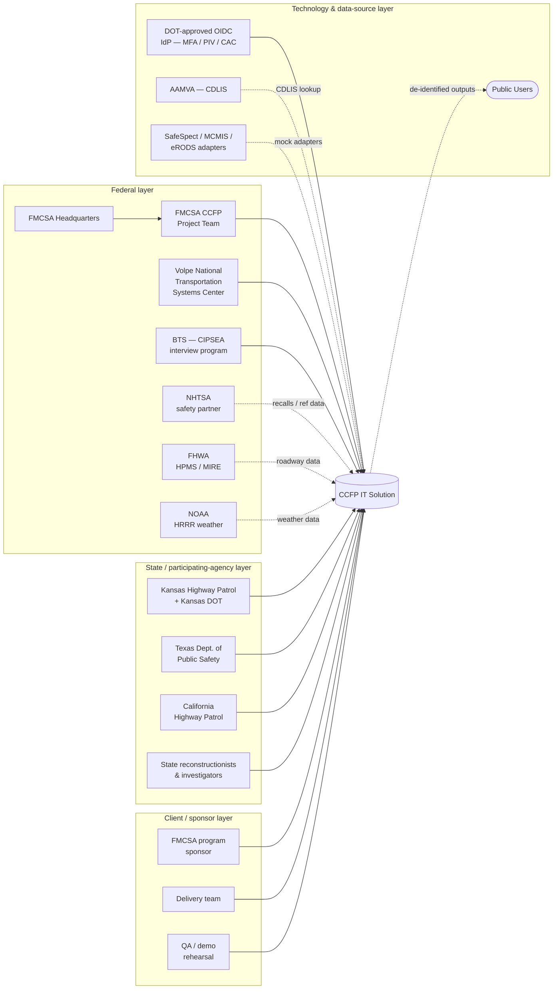
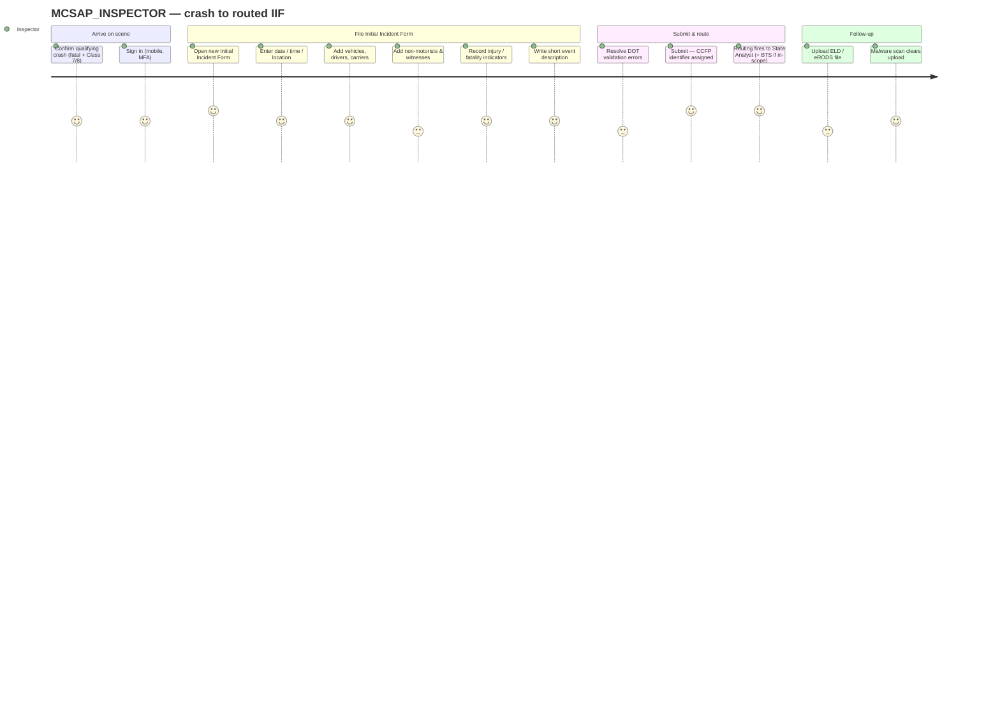
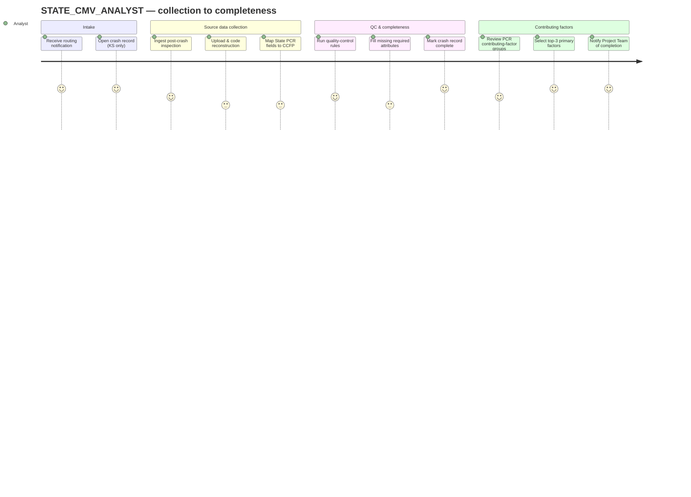
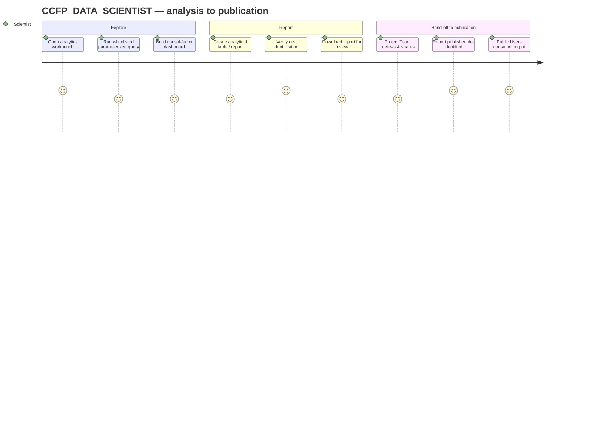
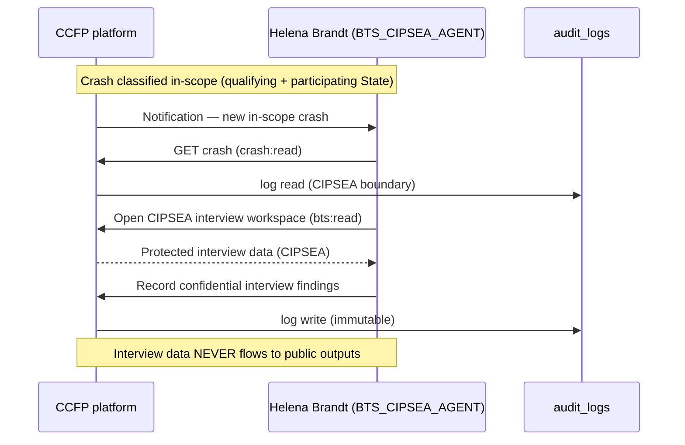
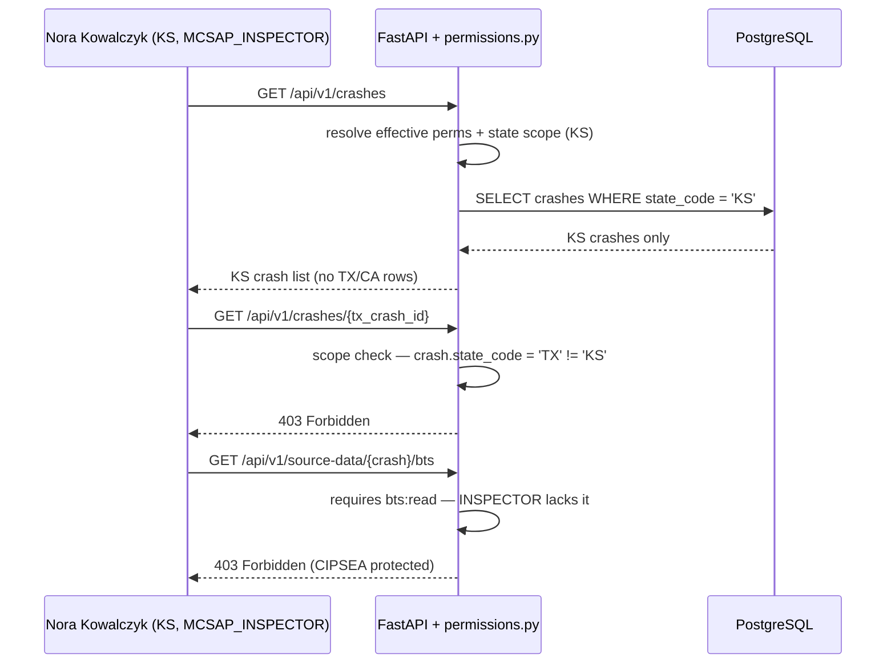

# 03 — Stakeholders & Personas

**Phase:** Discover · **Artifact family:** Stakeholders & Roles
**Document owner:** CCFP delivery team
**Status:** Final for Phase 1 build (Heavy-Duty Truck Study)
**Parent spec:** `Documentation/project_documentation.md`
**Version:** 1.0 · **Last reviewed:** 2026-06-03

!!! tip "Where to go next"
    Persona definitions drive every screen and every API gate. For the
    **role × permission grid** see [10 — RBAC Matrix](../02-analyze/10-rbac-matrix.md).
    For each persona's actual workflow walkthroughs see
    [05 — Use Cases](05-use-cases.md). For QA-ready acceptance criteria see
    [06 — User Stories](06-user-stories.md).

!!! info "Source of truth"
    The 12 in-app personas below are not speculative. They exist as rows in the
    `users`, `organizations`, `roles`, and `user_role_assignments` tables of the
    development database; their bindings are seeded by
    `Backend/database/seeds/0002_rbac_orgs_users.sql`; their effective
    permissions resolve through `user_role_assignments → roles →
    role_permissions`; and the gating is enforced server-side by
    `Backend/app/core/permissions.py` on every `/api/v1/*` route. The "Demo
    sign-in" column in every persona table below points to a real, importable
    synthetic account.

!!! warning "Synthetic data only"
    Every name, email, organization, and crash record referenced on this page is
    **100% synthetic**. The `@ccfp.gov` domain is fictitious and non-deliverable,
    contains no real PII, and is used for development, testing, and demonstration
    only — never production. State-scoped users see only their own State's data.

---

## Table of contents

- [1. External stakeholders](#1-external-stakeholders)
    - [1.1 Federal stakeholders](#11-federal-stakeholders)
    - [1.2 State & participating-agency stakeholders](#12-state-participating-agency-stakeholders)
    - [1.3 Client / sponsor stakeholders](#13-client-sponsor-stakeholders)
    - [1.4 Technology & data-source stakeholders](#14-technology-data-source-stakeholders)
- [2. Delivery-team stakeholders](#2-delivery-team-stakeholders)
- [3. Engagement matrix](#3-engagement-matrix)
- [4. In-app personas summary — the twelve roles](#4-in-app-personas-summary-the-twelve-roles)
- [5. Persona cards (extended)](#5-persona-cards-extended)
- [6. Persona comparison matrix](#6-persona-comparison-matrix)
- [7. Persona journey maps](#7-persona-journey-maps)
- [8. Communication & training preferences](#8-communication-training-preferences)
- [9. Scope-isolation behaviour in the application](#9-scope-isolation-behaviour-in-the-application)
- [10. Persona governance](#10-persona-governance)
- [11. Anti-personas and exclusions](#11-anti-personas-and-exclusions)
- [Demo access & login credentials](#demo-access-login-credentials)
- [Related documents](#related-documents)

---

## 1. External stakeholders

The Crash Causal Factors Program sits at the intersection of federal motor-carrier
safety policy, State CMV enforcement, confidential statistical research, and a
dense lattice of authoritative data sources. The diagram below shows the four
external stakeholder layers (federal, State/participating-agency, client/sponsor,
technology & data-source) and how each connects to the platform — directly through
a persona, indirectly through a data integration, or governance-wise through a
non-persona oversight relationship.

### 1.1 Federal stakeholders

CCFP is an FMCSA program. The federal stakeholders surrounding the platform fall
into three groups: program operators (whose people hold CCFP personas in-app),
data partners (who supply authoritative reference data through integration
adapters), and oversight reviewers (who consume outputs but do not operate the
system).

| Stakeholder | Interest | Engagement with platform |
|---|---|---|
| **FMCSA Headquarters** | Strategic posture of the Heavy-Duty Truck Study; agency briefings on crash causal factors, completeness rates, and publication readiness. | Read/download role-approved reports and tables via the `FEDERAL_USER` group; PII access only where authorized. Demo org: *FMCSA Headquarters*. |
| **FMCSA CCFP Project Team** | Day-to-day program operations: study configuration, QC, analysis, reporting, and administration of users and rules. | Direct users via `CCFP_PROJECT_TEAM`, `CCFP_PROJECT_ADMIN`, `CCFP_DB_ADMIN`, `CCFP_DATA_SCIENTIST`, and `FMCSA_CIPSEA_AGENT`. Demo org: *FMCSA CCFP Project Team*. |
| **Volpe National Transportation Systems Center** | U.S. DOT support center that staffs much of the CCFP Project Team for analysis and platform operations. | Volpe analysts authenticate as Project Team / Data Scientist personas. Demo org: *Volpe National Transportation Systems Center*. |
| **Bureau of Transportation Statistics (BTS)** | Conducts confidential driver, carrier, and witness interviews for in-scope crashes; the interview data is **CIPSEA-protected**. | Direct users via `BTS_CIPSEA_AGENT`; access governed by CIPSEA and the approved BTS data-sharing model (MOU). Demo org: *Bureau of Transportation Statistics*. |
| **NHTSA** | Federal safety partner; supplies the vehicle/component recalls reference data and consumes role-approved tables. | Federal-user reporting access; recalls feed via integration. Demo org: *National Highway Traffic Safety Administration*. |
| **FHWA** | Roadway extent, condition, performance, and characteristics via HPMS / MIRE. | Reference-data partner; ingested into the aggregated crash record. Demo org: *Federal Highway Administration*. |
| **NOAA** | Real-time weather (solar radiation, humidity, wind, temperature, precipitation, visibility) via the HRRR database. | Reference-data partner; weather snapshot attached per crash. Demo org: *National Oceanic and Atmospheric Administration*. |
| **Oversight reviewers (DOT Privacy, records management, IG)** | Privacy Act (PTA/PIA/SORN), NARA records management, and immutable audit trail. | Not personas; the `audit_logs` table is the system-of-record for their reviews. See [10 — RBAC Matrix](../02-analyze/10-rbac-matrix.md). |

### 1.2 State & participating-agency stakeholders

Phase 1 onboards three demo participating States — **Kansas, Texas, and
California**. A data-sharing agreement must be in place before any State is
onboarded. State actors are State-scoped: their personas see only their own
State's crash records, enforced server-side on every request.

| Stakeholder | Interest | Engagement with platform |
|---|---|---|
| **Kansas Highway Patrol** | State CMV enforcement; responding inspectors create the Initial Incident Form and supply inspection inputs. | Direct users via `MCSAP_INSPECTOR` and `STATE_CMV_ANALYST`, scoped to `KS`. Demo org: *Kansas Highway Patrol*. |
| **Kansas Department of Transportation** | State crash-data repository; supplies the Police Crash Report (PCR) data mapped to CCFP attributes. | Direct user via `STATE_USER` (scoped `KS`) plus the State PCR repository integration. Demo org: *Kansas Department of Transportation*. |
| **Texas Department of Public Safety** | State CMV enforcement (second demo State) for scope-isolation testing. | Direct users via `MCSAP_INSPECTOR` and `STATE_CMV_ANALYST`, scoped to `TX`. Demo org: *Texas Department of Public Safety*. |
| **California Highway Patrol** | State CMV enforcement (third demo State). | Direct user via `STATE_CMV_ANALYST`, scoped to `CA`. Demo org: *California Highway Patrol*. |
| **State reconstructionists & post-crash investigators** | Produce crash-reconstruction reports and post-crash investigation findings that feed source-data collection. | Participate as `STATE_USER`; reconstruction narratives are coded by the State CMV Data Analyst. |
| **AAMVA** | CDLIS — CDL records, driver status, and driver history. | Reference-data partner via the CDLIS integration adapter. Demo org: *American Association of Motor Vehicle Administrators*. |

### 1.3 Client / sponsor stakeholders

The client/sponsor for the build is FMCSA, operating through the CCFP Project Team.
The Project Team Administrator acts as the day-to-day delivery counterpart, while
FMCSA HQ holds the strategic interest in the Heavy-Duty Truck Study outcomes.

| Stakeholder | Interest | Engagement |
|---|---|---|
| **FMCSA program sponsor (HQ)** | Strategic sponsor of the build; primary stakeholder for scope changes; owner of the study mission and publication mandate. | Sponsorship + read-only reporting. |
| **CCFP Project Team Administrator** | Day-to-day delivery counterpart; configures study parameters, attributes, completeness rules; approves seed data and runs UAT. | Daily contact + direct user (`CCFP_PROJECT_ADMIN`). |
| **DOT IT / security** | FedRAMP/FISMA alignment, ATO checklist, encryption, signed-URL object access, audit. | Reviews [13 — Solution Design](../03-design/13-solution-design.md) and [14 — Operations Runbook](../04-release/14-operations-runbook.md). |
| **DOT privacy / records office** | PTA/PIA/SORN, CIPSEA controls, NARA records management. | Governance relationship; consumes audit evidence, not a persona. |

### 1.4 Technology & data-source stakeholders

| Stakeholder | Interest | Engagement |
|---|---|---|
| **DOT-approved OIDC IdP (MFA / PIV / CAC)** | Identity provider for federal users in production; replaces the dev mock-IdP when `CCFP_DEV_AUTH_ENABLED=false`. | OIDC integration; the platform stores no production passwords. |
| **SafeSpect / MCMIS / CDLIS / eRODS** | FMCSA-owned authoritative sources for inspections, carrier/census, driver licensing, and ELD/HOS data. | Mock adapters behind stable interfaces, feature-flagged `CCFP_INTEGRATION_*_LIVE`. See [11 — Architecture & Sequence](../03-design/11-architecture-sequence.md). |
| **State PCR / crash repositories** | State-owned PCR data ingested and mapped to canonical CCFP attributes per State. | File transfer, API, or direct connection; provenance preserved per source value. |
| **Anti-malware upload scanning** | Scans every uploaded document (ELD files, reconstruction PDFs, images) before clearing it for read. | Background-worker step; results recorded on the `documents` metadata. |
| **Object / file storage** | Holds large artifacts and generated reports; access via signed URLs. | Uploaded files written to local disk in the implemented stack; DOT-approved object storage in production. |
| **Public outputs surface** | Summarized, de-identified published data for anonymous Public Users. | The only no-auth surface: `/api/v1/public/...`. Live demo: <https://nexgile-dot-ccfp.nexgiletechnologies.com>. |

---

## 2. Delivery-team stakeholders

| Role | Responsibility | Count |
|---|---|---|
| Delivery sponsor / engagement manager | Commercial relationship + escalation path to the FMCSA program sponsor | 1 |
| Technical architect | Schema, RBAC, integration surfaces, completeness-rule engine | 1 |
| Backend engineers | FastAPI, SQLAlchemy, Pydantic, PyJWT, BackgroundTasks, integration adapters | 2 |
| Frontend engineers | React 18 + Vite SPA, role-aware navigation, structured forms, dashboards | 2 |
| Data engineer | Data mapping, aggregation, provenance, analytical datasets | 1 |
| QA / test engineer | Functional + RBAC + scope-isolation + completeness + accessibility (508 / WCAG 2.1 AA) | 1 |
| Documentation lead | This delivery documentation package + the OpenAPI artefact | 1 |
| Program manager | Scope, milestones, risk register, sponsor reporting | 1 |
| Demo / UAT facilitator | Drives sponsor demos against the seeded synthetic data | 0.5 |

---

## 3. Engagement matrix

### 3.1 Stakeholder × engagement type

| Stakeholder | Interviewed | Demo audience | Integration partner | Persona in-app | Reference data only | Oversight (read-only) |
|---|:-:|:-:|:-:|:-:|:-:|:-:|
| FMCSA Headquarters | yes | yes | — | `FEDERAL_USER` | — | yes |
| CCFP Project Team | yes | yes | — | `CCFP_PROJECT_TEAM`, `CCFP_PROJECT_ADMIN` | — | — |
| Volpe | yes | yes | — | `CCFP_PROJECT_TEAM`, `CCFP_DATA_SCIENTIST` | — | — |
| BTS | yes | yes | yes (CIPSEA interview data) | `BTS_CIPSEA_AGENT` | — | — |
| NHTSA | — | yes | yes (recalls) | `FEDERAL_USER` | recalls feed | — |
| FHWA | — | — | yes (HPMS/MIRE) | — | roadway data | — |
| NOAA | — | — | yes (HRRR) | — | weather data | — |
| Kansas Highway Patrol | yes | yes | — | `MCSAP_INSPECTOR`, `STATE_CMV_ANALYST` | — | — |
| Kansas DOT | yes | yes | yes (State PCR) | `STATE_USER` | PCR data | — |
| Texas DPS | yes | yes | — | `MCSAP_INSPECTOR`, `STATE_CMV_ANALYST` | — | — |
| California Highway Patrol | — | yes | — | `STATE_CMV_ANALYST` | — | — |
| AAMVA | — | — | yes (CDLIS) | — | CDL records | — |
| Public Users | — | yes | — | `PUBLIC_USER` | — | — |
| DOT-approved OIDC IdP | — | — | yes (OIDC) | — | — | — |
| DOT privacy / records | — | — | — | — | — | yes (audit + SORN) |

### 3.2 Engagement strategy per stakeholder layer

| Layer | Strategy | Cadence | Touchpoints |
|---|---|---|---|
| Federal program (HQ + Project Team) | Deep engagement; steering-committee sign-off on every workflow and rule change. | Bi-weekly | Sponsor demos; UAT walkthroughs; the [02 — POC Charter](02-poc-charter.md) RACI. |
| Federal data partners | Integration-contract relationship; pinned adapter versions; mock-to-live cutover by feature flag. | Per release | Adapter contract tests in CI; the [09 — API Specification](../02-analyze/09-api-specification.md). |
| Participating States | Data-sharing agreement first; close onboarding support; per-State PCR mapping. | Per onboarding | State quick starts; PCR-coverage review; scope-isolation acceptance. |
| BTS (CIPSEA) | MOU-governed; confidential; access strictly gated by `bts:read`. | Per in-scope crash | Notification of in-scope crashes; CIPSEA workflow. |
| Public | Information-only; consume de-identified outputs; no login required. | Continuous | Public outputs surface; `data.json` open-data export. |

---

## 4. In-app personas summary — the twelve roles

The 12 personas below correspond exactly to the role vocabulary seeded into the
`roles` table by `Backend/database/seeds/0002_rbac_orgs_users.sql` and enforced by
`Backend/app/core/permissions.py`. Each row links a real synthetic demo account —
every email in the table is importable today and signs in with the shared demo
password `Second@123`.

| Role code | Persona | Demo sign-in | Org | Primary actions | Scope | State-scoped? |
|---|---|---|---|---|---|:-:|
| `MCSAP_INSPECTOR` | MCSAP CMV Inspector | Nora Kowalczyk (`nora.kowalczyk@ccfp.gov`) | Kansas Highway Patrol | Create the Initial Incident Form, supply inspection inputs, upload ELD files | Own State | yes (KS) |
| `STATE_CMV_ANALYST` | State CMV Data Analyst | Elliot Fontaine (`elliot.fontaine@ccfp.gov`) | Kansas Highway Patrol | Enter missing data, QC, code reconstruction, map PCR, manage completeness, select top-3 contributing factors | Own State | yes (KS) |
| `CCFP_PROJECT_TEAM` | CCFP Project Team | Dana Whitfield (`dana.whitfield@ccfp.gov`) | FMCSA CCFP Project Team | QC, edit/aggregate data, dashboards, create/share/download reports | All States | no |
| `CCFP_PROJECT_ADMIN` | CCFP Project Team Administrator | Avery Thornton (`avery.thornton@ccfp.gov`) | FMCSA CCFP Project Team | Manage users/roles, study parameters, attributes, completeness rules | All States | no |
| `CCFP_DB_ADMIN` | CCFP Database Administrator | Victor De La Cruz (`victor.delacruz@ccfp.gov`) | FMCSA CCFP Project Team | Manage data mappings (PCR/ELD), ingest sources, view raw & aggregated data | All States | no |
| `CCFP_DATA_SCIENTIST` | CCFP Data Scientist | Priya Ramanathan (`priya.ramanathan@ccfp.gov`) | FMCSA CCFP Project Team | Run queries, build dashboards, create/download analytical reports on aggregated data | All States | no |
| `BTS_CIPSEA_AGENT` | BTS CIPSEA Agent | Helena Brandt (`helena.brandt@ccfp.gov`) | Bureau of Transportation Statistics | Conduct confidential interviews; read CIPSEA-protected BTS data | In-scope crashes | no |
| `FMCSA_CIPSEA_AGENT` | FMCSA CIPSEA Agent | Marcus Ellingsworth (`marcus.ellingsworth@ccfp.gov`) | FMCSA CCFP Project Team | View protected BTS data where permitted; aggregated data; reports | All States | no |
| `FEDERAL_USER` | Federal User | Omar Haddad (`omar.haddad@ccfp.gov`) | NHTSA | View/download role-approved reports & public outputs | All States | no |
| `STATE_USER` | State User | Tomasz Bialek (`tomasz.bialek@ccfp.gov`) | Kansas Department of Transportation | View assigned State crash data; download non-PII reports & public outputs | Own State | yes (KS) |
| `PUBLIC_USER` | Public User | Public Demo Account (`public.demo@ccfp.gov`) | — | View summarized, de-identified published outputs only | Published only | no |
| `SYSTEM_ADMIN` | System Administrator | Morgan Castellano (`sysadmin@ccfp.gov`) | FMCSA CCFP Project Team | System configuration, audit, environments, support (all permissions) | All States | no |

!!! note "Scope is enforced server-side"
    Two independent dimensions gate every request. **State scope**: a
    `STATE` assignment limits a user to their `state_code` (e.g. Nora Kowalczyk
    sees only `KS` crashes). **Data sensitivity**: PII is masked unless the user
    holds a data-entry / QC permission, and CIPSEA-protected interview data
    requires `bts:read`. A federal `CCFP_PROJECT_TEAM` member is cross-State but
    is **not** automatically CIPSEA-cleared; only the BTS and FMCSA CIPSEA Agents
    hold `bts:read`.

---

## 5. Persona cards (extended)

Each persona card below covers operational context, the permission keys it
carries, the screens it lands on, and the failure modes it cares about. Permission
grants are enumerated fully in [10 — RBAC Matrix](../02-analyze/10-rbac-matrix.md).
Permission keys are taken directly from the `role_permissions` mapping in
`Backend/database/seeds/0002_rbac_orgs_users.sql`.

### 5.1 `MCSAP_INSPECTOR` — Responding CMV inspector

| Dimension | Value |
|---|---|
| **Demo sign-in** | Nora Kowalczyk, `nora.kowalczyk@ccfp.gov` (password `Second@123`) |
| **Org / scope** | Kansas Highway Patrol — State-scoped to `KS` |
| **Goals** | Create the electronic **Initial Incident Form** within 24–48 h of a qualifying Class 7/8 fatal crash; record crash date/time/location, vehicles, drivers, motor carriers, non-motorists, witnesses, and injury/fatality indicators; submit the form to trigger routing; upload ELD/eRODS files. |
| **Permission keys** | `crash:read`, `crash:create`, `initial_incident:read/write/submit/delete`, `source_data:read`, `source_data:ingest`, `eld:upload`, `notification:read` |
| **Landing surface** | Initial Incident Form workspace · My assigned crashes · ELD upload |
| **Tech skill** | Medium — field officer comfortable with State enforcement systems, not a developer; mobile-responsive UI matters. |
| **Daily time** | Bursty — 30–60 min per crash within the 24–48 h window; otherwise occasional. |
| **Red flags** | Cannot submit the Initial Incident Form (routing never fires); a `TX`/`CA` crash leaks into their `KS` queue (scope-isolation breach); ELD upload rejected by malware scan. |

### 5.2 `STATE_CMV_ANALYST` — State data coordinator

| Dimension | Value |
|---|---|
| **Demo sign-in** | Elliot Fontaine, `elliot.fontaine@ccfp.gov` (password `Second@123`) |
| **Org / scope** | Kansas Highway Patrol — State-scoped to `KS` |
| **Goals** | Coordinate State data collection and QC; enter missing data; edit crash records; map State PCR attributes to canonical CCFP attributes; code reconstruction narrative findings; run quality-control rules; manage complete/incomplete status; and **select the top three primary contributing factors** from the PCR-derived prompt. |
| **Permission keys** | `crash:read/create/update`, `initial_incident:read/write/submit`, `source_data:read/ingest`, `eld:upload`, `recon:upload`, `recon:code`, `pcr:read`, `pcr:map`, `data_mgmt:read_raw/read_aggregated/edit/qc/complete`, `contributing_factor:select`, `report:read`, `notification:read` |
| **Landing surface** | QC & Completeness workspace · PCR mapping · Contributing-factor selection · Reconstruction coding |
| **Tech skill** | High — power user of the data-management surfaces; the busiest State role. |
| **Daily time** | 2–4 hours per active crash through the collection → completeness arc. |
| **Red flags** | A crash cannot be marked complete despite all required attributes present; PCR mapping does not persist; contributing-factor prompt missing a BRD group; cross-State data visible. |

### 5.3 `CCFP_PROJECT_TEAM` — Program operations & analysis

| Dimension | Value |
|---|---|
| **Demo sign-in** | Dana Whitfield, `dana.whitfield@ccfp.gov` (password `Second@123`) |
| **Org / scope** | FMCSA CCFP Project Team (Volpe-staffed) — cross-State |
| **Goals** | Run program operations across all participating States; perform QC; edit and aggregate data during QC; build dashboards and visualizations; create, share, and download reports; review crash records nearing completeness. |
| **Permission keys** | `study:read`, `crash:read/update`, `source_data:read`, `pcr:read`, `data_mgmt:read_raw/read_aggregated/edit/qc/complete`, `analytics:query`, `analytics:dashboard`, `report:read/create/share/download`, `notification:read` |
| **Landing surface** | Program dashboard (cross-State) · Analytics workbench · Reports |
| **Tech skill** | High — analytical and QC power user. |
| **Daily time** | 4–6 hours; the most active federal operational role. |
| **Red flags** | Aggregated view diverges from raw provenance; report share fails; a study they should see is missing. |

### 5.4 `CCFP_PROJECT_ADMIN` — Program administrator

| Dimension | Value |
|---|---|
| **Demo sign-in** | Avery Thornton, `avery.thornton@ccfp.gov` (password `Second@123`) |
| **Org / scope** | FMCSA CCFP Project Team — cross-State |
| **Goals** | Configure the study so Phase 1 assumptions are **not** hardcoded: define study parameters, participating States, qualifying/in-scope criteria, required/optional attributes, and completeness rules; manage users, roles, and permissions. Owns the levers that keep the platform configurable for future phases. |
| **Permission keys** | `study:read/create/update/configure`, `crash:read`, `admin:users`, `admin:roles`, `admin:attributes`, `admin:completeness`, `report:read`, `notification:read` |
| **Landing surface** | Study Administration · User & Role Admin · Attribute catalog · Completeness rules |
| **Tech skill** | High — configuration-focused administrator. |
| **Daily time** | 2–4 hours; spikes at study setup and onboarding of new States/attributes. |
| **Red flags** | Attribute/completeness-rule edit lands without an audit row; a new State cannot be configured without code; role change not reflected in effective permissions. |

### 5.5 `CCFP_DB_ADMIN` — Data mapping & platform data

| Dimension | Value |
|---|---|
| **Demo sign-in** | Victor De La Cruz, `victor.delacruz@ccfp.gov` (password `Second@123`) |
| **Org / scope** | FMCSA CCFP Project Team — cross-State |
| **Goals** | Manage data mappings (State PCR field maps, ELD field/duty-code maps) and analytical datasets; ingest and link source records to the stable CCFP identifier; view raw source data and aggregated crash data while preserving provenance. |
| **Permission keys** | `study:read`, `crash:read`, `source_data:read`, `source_data:ingest`, `pcr:read`, `pcr:map`, `data_mgmt:read_raw`, `data_mgmt:read_aggregated`, `data_mgmt:edit`, `notification:read` |
| **Landing surface** | Data mapping console · Raw source viewer · Aggregated record viewer |
| **Tech skill** | High — data/integration specialist. |
| **Daily time** | 3–5 hours during onboarding and mapping cycles. |
| **Red flags** | A source value loses its provenance link; ELD duty-code mapping mis-aligned; PCR map yields a duplicate canonical value for a `(crash, attribute)` pair. |

### 5.6 `CCFP_DATA_SCIENTIST` — Causal-factor research

| Dimension | Value |
|---|---|
| **Demo sign-in** | Priya Ramanathan, `priya.ramanathan@ccfp.gov` (password `Second@123`) |
| **Org / scope** | FMCSA CCFP Project Team — cross-State |
| **Goals** | Federal analytical role for crash causal-factor research: run whitelisted parameterized queries, build dashboards, and create/download analytical tables and reports — operating on **aggregated, de-identified** data rather than raw PII. |
| **Permission keys** | `study:read`, `crash:read`, `data_mgmt:read_aggregated`, `analytics:query`, `analytics:dashboard`, `report:read`, `report:create`, `report:download`, `notification:read` |
| **Landing surface** | Analytics workbench · Dashboards · Report builder |
| **Tech skill** | Very high — quantitative analyst / statistician. |
| **Daily time** | 3–6 hours during analysis & reporting phases. |
| **Red flags** | A query returns row-level PII (must be aggregated); a dashboard cannot be saved; export blocked when it should be permitted. |

### 5.7 `BTS_CIPSEA_AGENT` — Confidential interviewer

| Dimension | Value |
|---|---|
| **Demo sign-in** | Helena Brandt, `helena.brandt@ccfp.gov` (password `Second@123`) |
| **Org / scope** | Bureau of Transportation Statistics — in-scope crashes |
| **Goals** | Receive notifications for **in-scope** crashes; conduct confidential driver, carrier, and witness interviews; read CIPSEA-protected BTS interview data. Access is governed by CIPSEA and the approved BTS data-sharing model (MOU). |
| **Permission keys** | `crash:read`, `bts:read`, `notification:read` |
| **Landing surface** | In-scope crash notifications · CIPSEA interview workspace |
| **Tech skill** | Medium — confidential-interview specialist. |
| **Daily time** | Per in-scope crash; interview scheduling and write-up. |
| **Red flags** | CIPSEA data visible to a non-`bts:read` role (sev-1 confidentiality breach); out-of-scope crash routed to BTS; interview data appearing in a public output. |

### 5.8 `FMCSA_CIPSEA_AGENT` — FMCSA-side CIPSEA access

| Dimension | Value |
|---|---|
| **Demo sign-in** | Marcus Ellingsworth, `marcus.ellingsworth@ccfp.gov` (password `Second@123`) |
| **Org / scope** | FMCSA CCFP Project Team — cross-State |
| **Goals** | FMCSA role authorized to view protected BTS data **where permitted** by the BTS agreement and CIPSEA controls; also reads aggregated data and reports to connect interview insights with crash data. |
| **Permission keys** | `crash:read`, `bts:read`, `data_mgmt:read_aggregated`, `report:read`, `notification:read` |
| **Landing surface** | Aggregated crash records · Permitted CIPSEA views · Reports |
| **Tech skill** | Medium-high — analyst with a confidentiality clearance. |
| **Daily time** | Variable; tied to interview availability and analysis cycles. |
| **Red flags** | Access exceeds the BTS-agreement boundary; CIPSEA boundary not reflected in the audit log. |

### 5.9 `FEDERAL_USER` — Approved federal consumer

| Dimension | Value |
|---|---|
| **Demo sign-in** | Omar Haddad, `omar.haddad@ccfp.gov` (password `Second@123`) |
| **Org / scope** | NHTSA (representative of FMCSA HQ, enforcement, NHTSA, BTS approved users) — cross-State, reports only |
| **Goals** | View and download role-approved reports and tables, plus public de-identified outputs; PII access only where explicitly authorized. The "Federal Users (PII)" access category is layered over this operational role per the BRD. |
| **Permission keys** | `report:read`, `report:download`, `public:read`, `notification:read` |
| **Landing surface** | Reports library · Public outputs |
| **Tech skill** | Medium — report consumer. |
| **Daily time** | 15–45 min as reports publish. |
| **Red flags** | A report they are entitled to is not visible; PII appears in a table they are not authorized to see. |

### 5.10 `STATE_USER` — State enforcement / investigator participant

| Dimension | Value |
|---|---|
| **Demo sign-in** | Tomasz Bialek, `tomasz.bialek@ccfp.gov` (password `Second@123`) |
| **Org / scope** | Kansas Department of Transportation — State-scoped to `KS`, **No-PII** access category |
| **Goals** | View assigned State crash data and download **non-PII** reports and public outputs; participate as a State enforcement officer, reconstructionist, or post-crash investigator within their State's scope. |
| **Permission keys** | `crash:read`, `report:read`, `report:download`, `public:read`, `notification:read` |
| **Landing surface** | My State's crashes (No-PII) · Reports · Public outputs |
| **Tech skill** | Medium. |
| **Daily time** | Occasional; tied to their State's caseload. |
| **Red flags** | PII surfaces despite the No-PII category; another State's data visible; a report download blocked that should be permitted. |

### 5.11 `PUBLIC_USER` — De-identified output consumer

| Dimension | Value |
|---|---|
| **Demo sign-in** | Public Demo Account, `public.demo@ccfp.gov` (password `Second@123`) |
| **Org / scope** | None — published, de-identified outputs only |
| **Goals** | Consume summarized, de-identified, published CCFP outputs only. The public surface (`/api/v1/public/...`) is the **only** no-auth area of the API; published outputs are de-identified and separated from operational records. |
| **Permission keys** | `public:read` |
| **Landing surface** | Public outputs portal · Published reports · `data.json` open-data export |
| **Tech skill** | Any — general public, researchers, journalists. |
| **Daily time** | One-off / on-demand. |
| **Red flags** | Any operational, raw, PII, or CIPSEA data reachable from the public surface (would be a sev-1 invariant breach); a published report fails to download. |

### 5.12 `SYSTEM_ADMIN` — Technical operations

| Dimension | Value |
|---|---|
| **Demo sign-in** | Morgan Castellano, `sysadmin@ccfp.gov` (password `Second@123`) |
| **Org / scope** | FMCSA CCFP Project Team — cross-State; **all permissions** (seeded via `roles × permissions` cross join) |
| **Goals** | System configuration, environment management, audit-log read/export (never edit), and operational support. Holds every permission key but operates as an IT role rather than a data-entry or analytical persona. |
| **Permission keys** | All — every row in the `permissions` catalog (the only role with `audit:read` and `admin:system`). |
| **Landing surface** | System config · User & role admin · Audit log · Health & support |
| **Tech skill** | Very high — platform operator. |
| **Daily time** | 2–3 hours steady state; full-day during incidents. |
| **Red flags** | A `SYSTEM_ADMIN` action without an audit row; configuration change un-audited; backup verification failing. See [14 — Operations Runbook](../04-release/14-operations-runbook.md). |

---

## 6. Persona comparison matrix

The matrix pivots the 12 personas against the most load-bearing capabilities in the
application. ✅ = full grant; ◐ = scoped grant (State-limited, sensitivity-limited,
or in-scope-only); ❌ = never. Every row corresponds to a real permission key in
`role_permissions`.

| Capability | INSP | ANALYST | TEAM | ADMIN | DBADM | DATASCI | BTS | FMCSA-CIP | FED | STATE | PUBLIC | SYSADM |
|---|:-:|:-:|:-:|:-:|:-:|:-:|:-:|:-:|:-:|:-:|:-:|:-:|
| Create Initial Incident Form | ✅ | ✅ | ❌ | ❌ | ❌ | ❌ | ❌ | ❌ | ❌ | ❌ | ❌ | ✅ |
| Submit / route IIF | ✅ | ✅ | ❌ | ❌ | ❌ | ❌ | ❌ | ❌ | ❌ | ❌ | ❌ | ✅ |
| Upload ELD / eRODS | ✅ | ✅ | ❌ | ❌ | ◐ ingest | ❌ | ❌ | ❌ | ❌ | ❌ | ❌ | ✅ |
| Map State PCR attributes | ❌ | ✅ | ❌ | ❌ | ✅ | ❌ | ❌ | ❌ | ❌ | ❌ | ❌ | ✅ |
| Run QC / completeness | ❌ | ✅ | ✅ | ❌ | ❌ | ❌ | ❌ | ❌ | ❌ | ❌ | ❌ | ✅ |
| Select top-3 contributing factors | ❌ | ✅ | ❌ | ❌ | ❌ | ❌ | ❌ | ❌ | ❌ | ❌ | ❌ | ✅ |
| Read raw source data | ❌ | ✅ | ✅ | ❌ | ✅ | ❌ | ❌ | ❌ | ❌ | ❌ | ❌ | ✅ |
| Read aggregated data | ❌ | ✅ | ✅ | ❌ | ✅ | ✅ | ❌ | ✅ | ❌ | ❌ | ❌ | ✅ |
| Analytics queries / dashboards | ❌ | ❌ | ✅ | ❌ | ❌ | ✅ | ❌ | ❌ | ❌ | ❌ | ❌ | ✅ |
| Create / share reports | ❌ | ◐ read | ✅ | ◐ read | ❌ | ✅ create | ❌ | ◐ read | ◐ read | ◐ read | ❌ | ✅ |
| Read CIPSEA / BTS data | ❌ | ❌ | ❌ | ❌ | ❌ | ❌ | ✅ | ✅ | ❌ | ❌ | ❌ | ✅ |
| Configure study / attributes | ❌ | ❌ | ❌ | ✅ | ❌ | ❌ | ❌ | ❌ | ❌ | ❌ | ❌ | ✅ |
| Manage users / roles | ❌ | ❌ | ❌ | ✅ | ❌ | ❌ | ❌ | ❌ | ❌ | ❌ | ❌ | ✅ |
| Read public outputs | ❌ | ❌ | ❌ | ❌ | ❌ | ❌ | ❌ | ❌ | ✅ | ✅ | ✅ | ✅ |
| Read audit log | ❌ | ❌ | ❌ | ❌ | ❌ | ❌ | ❌ | ❌ | ❌ | ❌ | ❌ | ✅ |

!!! note "Reading the matrix"
    A cell tells you whether the affordance *exists* for the role — not whether a
    specific request succeeds. A `✅` for `CCFP_PROJECT_TEAM` on "Read raw source
    data" still gates on study phase and data-sensitivity tagging; an
    `STATE_CMV_ANALYST` grant is additionally filtered to their `state_code`. For
    the endpoint-level grid see [10 — RBAC Matrix](../02-analyze/10-rbac-matrix.md).

---

## 7. Persona journey maps

### 7.1 `MCSAP_INSPECTOR` — crash to routed Initial Incident Form (Phase 1 → 2)

A fatal crash involving a Class 7/8 truck has occurred in Kansas. Nora Kowalczyk
must file the Initial Incident Form within the 24–48 h window, which assigns the
stable CCFP identifier and triggers routing.

### 7.2 `STATE_CMV_ANALYST` — collection to completeness (Phase 3 → 5)

Elliot Fontaine picks up the routed crash and drives it from source-data
collection through QC, completeness, and contributing-factor selection.

### 7.3 `CCFP_DATA_SCIENTIST` — analysis to publication (Phase 6 → 7)

Priya Ramanathan analyzes the aggregated, de-identified dataset and prepares
outputs that flow toward publication.

### 7.4 `BTS_CIPSEA_AGENT` — confidential interview on an in-scope crash

---

## 8. Communication & training preferences

### 8.1 Per-persona communication preferences

| Persona | Primary | Secondary | Notification cadence |
|---|---|---|---|
| `MCSAP_INSPECTOR` | In-app + mobile | Email | Per-crash (24–48 h window) |
| `STATE_CMV_ANALYST` | In-app | Email digest | Per routing event + daily digest |
| `CCFP_PROJECT_TEAM` | In-app | Email digest | Hourly during business hours |
| `CCFP_PROJECT_ADMIN` | In-app | Email | Real-time on config/onboarding |
| `CCFP_DB_ADMIN` | In-app | Email | Per ingestion/mapping event |
| `CCFP_DATA_SCIENTIST` | In-app | Email | On dataset/publish events |
| `BTS_CIPSEA_AGENT` | In-app | Secure email | Per in-scope crash |
| `FMCSA_CIPSEA_AGENT` | In-app | Email | Per permitted CIPSEA event |
| `FEDERAL_USER` | Email | In-app | On report publish |
| `STATE_USER` | In-app | Email | Per State caseload event |
| `PUBLIC_USER` | Web (no login) | — | On-demand |
| `SYSTEM_ADMIN` | In-app + on-call | Email | Real-time on incident |

### 8.2 Training expectations per persona

| Persona | Training need | Approach |
|---|---|---|
| `MCSAP_INSPECTOR` | Medium | Field quick start; mobile IIF walkthrough; 24–48 h timing rules |
| `STATE_CMV_ANALYST` | High | Full QC/completeness/PCR-mapping/contributing-factor training |
| `CCFP_PROJECT_TEAM` | High | Operations + analytics + reporting walkthrough |
| `CCFP_PROJECT_ADMIN` | High | Study configuration; user/role; completeness-rule authoring |
| `CCFP_DB_ADMIN` | High | Data mapping; provenance; ELD/PCR field maps |
| `CCFP_DATA_SCIENTIST` | Medium | Analytics workbench; whitelisted query model; de-identification |
| `BTS_CIPSEA_AGENT` | Medium | CIPSEA handling; interview workspace |
| `FMCSA_CIPSEA_AGENT` | Medium | CIPSEA boundary; permitted-view rules |
| `FEDERAL_USER` | Low | Reports library quick start |
| `STATE_USER` | Low | No-PII reports + public outputs guide |
| `PUBLIC_USER` | None | Self-service public portal |
| `SYSTEM_ADMIN` | High | Operations runbook; audit; environments |

### 8.3 Support channels

- **In-app help** — context-aware help on every page; FAQ cross-link.
- **CCFP Project Team support** — the Project Team Administrator is the named
  escalation point for State and federal users.
- **Operations on-call** — for system-level issues, see
  [14 — Operations Runbook](../04-release/14-operations-runbook.md).
- **Email digest opt-in** — every authenticated persona can configure digest
  cadence in their profile.

---

## 9. Scope-isolation behaviour in the application

The application enforces **State scope** and **data sensitivity** strictly,
server-side, on every request. This is observable in the seed data: three
participating States are configured (KS, TX, CA) with State-scoped accounts so
isolation can be verified directly.

### 9.1 What State scope changes

- **Crash list** — a `STATE`-assigned user only sees crashes whose `state_code`
  matches their assignment. Nora Kowalczyk (`KS`) cannot see Rosa Menendez's `TX`
  crashes, and vice-versa.
- **Reports & dashboards** — State users see their State's slices; federal
  Project Team and Data Scientist roles are cross-State.
- **Notifications** — only events for in-scope, in-State crashes appear in a
  State user's feed.
- **Audit log** — every read/write is recorded with the acting user and effective
  role, supporting Privacy Act and oversight review.

### 9.2 What data-sensitivity changes

- **PII masking** — PII is masked unless the user holds a data-entry / QC
  permission (`data_mgmt:edit`, `data_mgmt:qc`, or the State Analyst grants).
  Public and most read-only roles never see PII.
- **CIPSEA gating** — BTS interview data is tagged CIPSEA and requires `bts:read`;
  only `BTS_CIPSEA_AGENT` and `FMCSA_CIPSEA_AGENT` hold it.
- **Publication separation** — published outputs are de-identified and physically
  separated from operational records; the public surface never returns
  operational, PII, or CIPSEA data.

### 9.3 Worked example — scope-isolation invariant

---

## 10. Persona governance

### 10.1 Adding a new role

The 12 personas are the seeded set for Phase 1, but the platform is built to add
roles without a rebuild. Adding a role requires:

1. Update `Documentation/project_documentation.md` §4 with the role definition.
2. Insert the role into `roles` and map its permission codes in `role_permissions`
   (see `Backend/database/seeds/0002_rbac_orgs_users.sql`).
3. Confirm `Backend/app/core/permissions.py` resolves the new grants correctly.
4. Update the [10 — RBAC Matrix](../02-analyze/10-rbac-matrix.md) with the row.
5. Add a synthetic demo user + `user_role_assignments` row.
6. Add the persona card to this document (§5).

### 10.2 Adding a user under an existing role

A `CCFP_PROJECT_ADMIN` does this from the User Admin console (`admin:users`,
`admin:roles`). The user is created in `users` with an `idp_subject` mapped to
their IdP claim, then a row is inserted in `user_role_assignments` carrying the
role, `scope_type`, and `state_code` (for State-scoped roles).

### 10.3 Removing a user

Deactivation is the soft-delete mechanism — JWT issuance refuses inactive users,
and their historical actions remain in `audit_logs`. Role assignments can be left
in place for audit trace; the server short-circuits on inactive users.

### 10.4 Scope-isolation invariants

The platform carries three isolation invariants enforced server-side:

- **State scope is the default for State roles.** A State-scoped user never sees
  another State's data.
- **Sensitivity gating is independent of State.** PII masking and CIPSEA gating
  apply regardless of State; being cross-State does not grant PII or CIPSEA access.
- **The public surface is one-directional and de-identified.** Operational data
  never reaches `/api/v1/public/...`.

### 10.5 Access categories layered over roles

Per the BRD, three view/download access categories are layered over the
operational roles: **Federal Users (PII)** (CCFP Project Team incl. the FMCSA
CIPSEA Agent, DB Admin, Data Scientist, FMCSA HQ, NHTSA, BTS CIPSEA Agents);
**State Users (No-PII)** (MCSAP CMV Inspector, State CMV Data Analyst, State
enforcement, reconstructionists/investigators); and **Public Users** (No-PII,
summarized, de-identified only). The category determines PII visibility; the role
determines operational capability.

---

## 11. Anti-personas and exclusions

For clarity, here is who the platform does **not** serve in Phase 1:

| Anti-persona | Why excluded |
|---|---|
| **Non-qualifying crash reporters** (no fatality, or no Class 7/8 truck) | Phase 1 covers only qualifying crashes: ≥1 fatality **and** ≥1 heavy-duty Class 7/8 truck (GVWR ≥ 26,001 lbs). |
| **Non-participating-State users** | Out-of-scope. A crash in a non-participating State is not ingested as in-scope. |
| **Serious-injury / advanced-investigation submitters** | A heavy-duty **serious-injury** crash with advanced investigation data is explicitly out-of-scope for Phase 1. |
| **Medium-duty / bus crash reporters** | Reserved for future phases; the platform is configurable for them but they are not Phase 1 personas. |
| **General-public data-entry users** | The public has read-only, de-identified access; no operational write surface exists for the public. |
| **External researchers seeking raw microdata** | Receive de-identified published outputs only; raw/PII/CIPSEA data is never published. |
| **Carriers / drivers as self-service users** | Subjects of the data, not platform operators; their data is entered by inspectors/analysts, not by themselves. |

### 11.1 Out-of-scope adjacent systems

| System | Why out of scope |
|---|---|
| **FMCSA enforcement case-management** | CCFP consumes authoritative data (SafeSpect/MCMIS/DSMS) but does not replace enforcement systems. |
| **State crash-record systems of record** | CCFP ingests and maps PCR data; the State repository remains the system of record for the raw report. |
| **BTS production statistical environment** | CCFP exchanges CIPSEA interview data under MOU but does not host BTS's statistical environment. |
| **Public FOIA portal** | DOT operates FOIA separately; CCFP supplies de-identified outputs and audit evidence, not a FOIA workflow. |

---

## Demo access & login credentials

!!! abstract "Sign in to the live demo"
    Sign in at <https://nexgile-dot-ccfp.nexgiletechnologies.com/login>.
    **All seeded accounts share the password `Second@123`.** These are 100%
    synthetic demo accounts on a fictitious, non-deliverable `@ccfp.gov` domain —
    no real PII. State-scoped users see only their State's data. In production the
    dev mock-IdP is disabled (`CCFP_DEV_AUTH_ENABLED=false`) and a DOT-approved
    OIDC provider (MFA / PIV / CAC) takes over.

| Role | Name | Email | Password | State scope |
|---|---|---|---|---|
| System Administrator | Morgan Castellano | `sysadmin@ccfp.gov` | `Second@123` | — |
| CCFP Project Team Administrator | Avery Thornton | `avery.thornton@ccfp.gov` | `Second@123` | — |
| CCFP Project Team | Dana Whitfield | `dana.whitfield@ccfp.gov` | `Second@123` | — |
| CCFP Data Scientist | Priya Ramanathan | `priya.ramanathan@ccfp.gov` | `Second@123` | — |
| CCFP Database Administrator | Victor De La Cruz | `victor.delacruz@ccfp.gov` | `Second@123` | — |
| BTS CIPSEA Agent | Helena Brandt | `helena.brandt@ccfp.gov` | `Second@123` | — |
| FMCSA CIPSEA Agent | Marcus Ellingsworth | `marcus.ellingsworth@ccfp.gov` | `Second@123` | — |
| Federal User | Omar Haddad | `omar.haddad@ccfp.gov` | `Second@123` | — |
| MCSAP CMV Inspector | Nora Kowalczyk | `nora.kowalczyk@ccfp.gov` | `Second@123` | KS |
| State CMV Data Analyst | Elliot Fontaine | `elliot.fontaine@ccfp.gov` | `Second@123` | KS |
| State User | Tomasz Bialek | `tomasz.bialek@ccfp.gov` | `Second@123` | KS |
| Public User | Public Demo Account | `public.demo@ccfp.gov` | `Second@123` | — |

Extra State-scoped accounts (same password `Second@123`) for verifying
scope-isolation across States:

| Role | Email | State scope |
|---|---|---|
| MCSAP CMV Inspector | `rosa.menendez@ccfp.gov` | TX |
| State CMV Data Analyst | `grant.holloway@ccfp.gov` | TX |
| State CMV Data Analyst | `linh.tran@ccfp.gov` | CA |

!!! tip "Verify isolation in two minutes"
    Sign in as `nora.kowalczyk@ccfp.gov` (KS) and as `rosa.menendez@ccfp.gov`
    (TX). Each sees only their own State's crashes — the clearest way to confirm
    the server-side State-scope invariant from §9. The full credential reference
    also lives at [Demo Credentials](../reference/demo-credentials.md).

---

## 12. Persona → documentation cross-reference

| Persona | Most-relevant documents |
|---|---|
| `MCSAP_INSPECTOR` | [05 — Use Cases](05-use-cases.md), [06 — User Stories](06-user-stories.md), [07 — Workflow](../02-analyze/07-workflow-process.md) |
| `STATE_CMV_ANALYST` | [05 — Use Cases](05-use-cases.md), [07 — Workflow](../02-analyze/07-workflow-process.md), [10 — RBAC Matrix](../02-analyze/10-rbac-matrix.md) |
| `CCFP_PROJECT_TEAM` | [04 — Business Requirements](04-business-requirements.md), [09 — API Specification](../02-analyze/09-api-specification.md) |
| `CCFP_PROJECT_ADMIN` | [10 — RBAC Matrix](../02-analyze/10-rbac-matrix.md), [14 — Operations Runbook](../04-release/14-operations-runbook.md) |
| `CCFP_DB_ADMIN` | [08 — Data Model](../02-analyze/08-data-model.md), [09 — API Specification](../02-analyze/09-api-specification.md) |
| `CCFP_DATA_SCIENTIST` | [09 — API Specification](../02-analyze/09-api-specification.md), [13 — Solution Design](../03-design/13-solution-design.md) |
| `BTS_CIPSEA_AGENT` | [10 — RBAC Matrix](../02-analyze/10-rbac-matrix.md), [07 — Workflow](../02-analyze/07-workflow-process.md) |
| `FMCSA_CIPSEA_AGENT` | [10 — RBAC Matrix](../02-analyze/10-rbac-matrix.md), [08 — Data Model](../02-analyze/08-data-model.md) |
| `FEDERAL_USER` | [05 — Use Cases](05-use-cases.md), [09 — API Specification](../02-analyze/09-api-specification.md) |
| `STATE_USER` | [05 — Use Cases](05-use-cases.md), [10 — RBAC Matrix](../02-analyze/10-rbac-matrix.md) |
| `PUBLIC_USER` | [04 — Business Requirements](04-business-requirements.md), [13 — Solution Design](../03-design/13-solution-design.md) |
| `SYSTEM_ADMIN` | [14 — Operations Runbook](../04-release/14-operations-runbook.md), [10 — RBAC Matrix](../02-analyze/10-rbac-matrix.md) |

---

## Related documents

- [Home](../index.md) · [Glossary](../glossary.md) · [FAQ](../faq.md)
- [02 — POC Charter](02-poc-charter.md) — RACI driven by the personas above
- [04 — Business Requirements](04-business-requirements.md) — each persona's goals traced to requirements
- [05 — Use Cases](05-use-cases.md) — actor-goal walkthroughs per persona
- [06 — User Stories](06-user-stories.md) — acceptance criteria per persona
- [07 — Workflow & Process](../02-analyze/07-workflow-process.md) — the 8-phase lifecycle personas move through
- [09 — API Specification](../02-analyze/09-api-specification.md) — endpoint-level view of who can call what
- [10 — RBAC Matrix](../02-analyze/10-rbac-matrix.md) — role × permission grid
- [13 — Solution Design](../03-design/13-solution-design.md) — how persona scope maps onto the architecture
- [Demo Credentials](../reference/demo-credentials.md) — full synthetic sign-in reference

*End of 03 — Stakeholders & Personas.*
