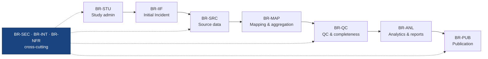
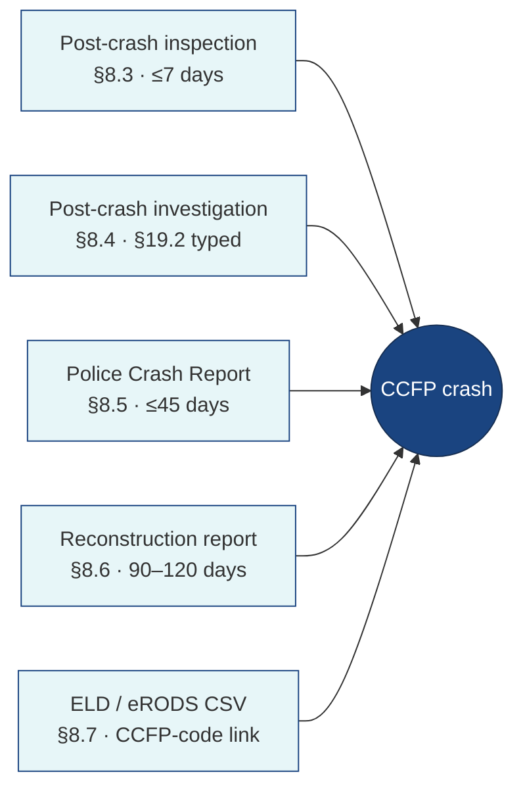
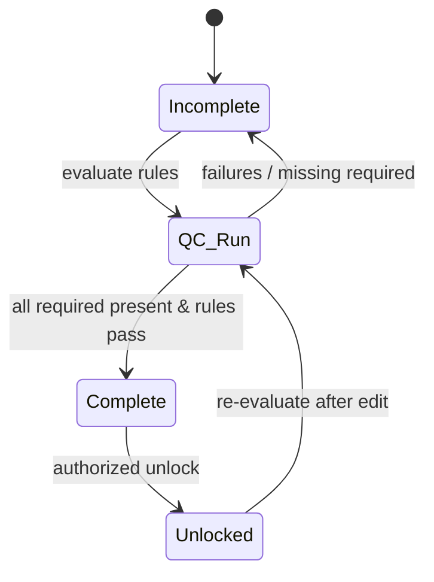

# 04 — Business Requirements & Success Metrics

**Phase:** Discover · **Artifact family:** Requirements & Metrics

This page enumerates every business requirement the **Crash Causal Factors
Program (CCFP) IT Solution** must satisfy for the Phase 1 Heavy-Duty Truck
Study, traces each requirement to the functional module, FastAPI router, and
PostgreSQL tables that implement it, and defines the measurable success metric
by which delivery is judged. It is grounded in `project_documentation.md` §8
(functional modules), §15 (non-functional requirements), and §18.1 (BRD
requirement traceability).

!!! warning "Synthetic data only"
    Every crash record, carrier, driver, ELD file, and login referenced here is
    **100% synthetic**. The `@ccfp.gov` domain is fictitious and
    non-deliverable. No real PII, CIPSEA interview content, or production crash
    data appears anywhere in this documentation set.

!!! tip "Where to go next"
    Each BR family table links to the implementing surface (module, router,
    tables). For the **narrative** behind a requirement see
    [05 — Use Cases](05-use-cases.md); for **Gherkin acceptance criteria** see
    [06 — User Stories](06-user-stories.md). The
    [API Specification](../02-analyze/09-api-specification.md) and
    [RBAC Matrix](../02-analyze/10-rbac-matrix.md) are the machine-readable
    companion views, and the [Data Model](../02-analyze/08-data-model.md) shows
    where each requirement persists.

## §1 — Requirements method

### 1.1 Notation

- **ID** — `BR-<FAMILY>-<n>`, e.g. `BR-IIF-03`, `BR-QC-02`. The family prefix
  ties the requirement to a functional module in `project_documentation.md` §8.
- **Priority** — `MUST` (blocker for Phase 1 sign-off) · `SHOULD` (expected;
  documented exception if missed) · `MAY` (aspirational; realised where
  trivial). RFC 2119 semantics apply throughout.
- **Implementing surface** — the concrete module under `Backend/app/features/`
  (one router per domain), the ORM tables in `Backend/app/models.py`, and the
  React page under `Frontend/src/pages/` that realise the requirement.
- **Success metric** — the observable property a reviewer can verify in the
  running demo at <https://nexgile-dot-ccfp.nexgiletechnologies.com> or via
  `pytest` against the synthetic seed database.
- **Verification** — how the requirement is checked: contract test · Gherkin ·
  manual demo · inspection.

### 1.2 Verification taxonomy

| Level | Scope | Tooling |
|---|---|---|
| **Contract test** | Pydantic schema + RBAC gate per route | `pytest Backend/tests/` against `openapi.json` |
| **Gherkin** | Behaviour-driven acceptance of a lifecycle flow | scenario walked against the seed crashes |
| **Manual demo** | Walk-through of the synthetic seed crashes | reviewer follows the [Operations Runbook](../04-release/14-operations-runbook.md) |
| **Inspection** | Static check of code, migration, or seed | `ruff` / `mypy` / migration review / seed `COUNT(*)` |

For every requirement at least one verification level applies; the load-bearing
security, completeness, and de-identification BRs target two or more — for
example `BR-SEC-04` (public de-identification) is validated by both a Gherkin
walk of the publication flow and a contract test asserting that
`/api/v1/public/...` exposes no PII column.

### 1.3 Priority summary

Across the ten BR families, Phase 1 commits to the counts below. The delta
between MUST and the in-progress build is reflected in the status column on each
row, not in this rollup.

| Priority | Count | Notes |
|---|---|---|
| **MUST** | 58 | Blockers for the Heavy-Duty Truck Study pilot |
| **SHOULD** | 19 | Expected; documented exception if missed |
| **MAY** | 5 | Aspirational; realised where trivial |

!!! info "Status legend"
    `met` — exercised end-to-end by the synthetic seed crashes across KS, TX,
    and CA. · `partial` — code path is wired and reachable but one sub-flow is
    mocked behind a feature flag (e.g. a live external adapter) pending a
    DOT-approved dependency. · `pending` — scoped but not yet shipped.

## §2 — Requirement taxonomy

Requirements are grouped into **ten BR families**, one per functional concern in
`project_documentation.md` §8 plus a cross-cutting security and non-functional
family. Every requirement has an ID of the shape `BR-<family>-<n>`.

| Prefix | Family | §8 module | Implementing routers |
|---|---|---|---|
| `BR-STU` | Study administration | §8.1 | `admin.py`, `studies.py` |
| `BR-IIF` | Initial Incident Form & crash creation | §8.2 | `initial_incident.py`, `crashes.py` |
| `BR-SRC` | Source data collection | §8.3–8.7 | `source_data.py` |
| `BR-MAP` | Mapping & aggregation | §8.5, §8.8 | `crashes.py`, `studies.py` |
| `BR-QC` | Quality control & completeness | §8.8 | `data_management.py` |
| `BR-ANL` | Analytics, dashboards & reports | §8.9 | `analytics.py`, `reports.py` |
| `BR-PUB` | Publication & public outputs | §8.9 | `public.py`, `reports.py` |
| `BR-SEC` | Security, RBAC, audit, CIPSEA | §4, §14 | `core/permissions.py`, `audit.py`, `documents.py` |
| `BR-INT` | External integrations | §13 | `integrations.py` |
| `BR-NFR` | Non-functional (a11y, scale, search, notify) | §15 | `search.py`, `notifications.py`, `main.py` |

The first seven families ladder along the eight-phase lifecycle (Study Setup →
Publication); `BR-SEC`, `BR-INT`, and `BR-NFR` cut across every phase.

## §3 — BR-STU — Study administration

Maps to `project_documentation.md` §8.1. The platform must stay **configurable
for future phases** (medium-duty, buses, serious-injury, more States) without a
rebuild, so study parameters, attributes, and completeness rules are data, not
code.

| ID | Requirement | Priority | Implementing surface | Success metric | Verification | Status |
|---|---|---|---|---|---|---|
| **BR-STU-01** | The system SHALL let a `CCFP_PROJECT_ADMIN` define a study with phase, participating States, qualifying criteria, and start/end dates. | MUST | `features/studies.py`, tables `studies`, `study_states`, `study_parameters` | Phase 1 Heavy-Duty study seeds with KS/TX/CA in `study_states` | inspection | met |
| **BR-STU-02** | Canonical data attributes SHALL be per-study required / optional / read-only, never hardcoded. | MUST | `studies.py` attribute-requirements, tables `data_attributes`, `attribute_requirements` | Toggling a requirement re-derives completeness without a code change | contract test | met |
| **BR-STU-03** | Completeness rules SHALL be study-scoped configuration evaluated by the completeness worker. | MUST | `studies.py`, `workers/completeness`, table `completeness_rules` | A new rule changes `crash_completeness_status` on re-evaluation | contract test | met |
| **BR-STU-04** | Qualifying criteria (≥1 fatality AND ≥1 Class 7/8 truck) SHALL be expressed as study parameters, not inline constants. | MUST | `study_parameters`, `crash_scope_classifications` | Editing the GVWR threshold reclassifies scope on re-run | inspection | met |
| **BR-STU-05** | Admins SHALL manage users, roles, organizations, and role assignments. | MUST | `features/admin.py`, tables `users`, `roles`, `role_permissions`, `user_role_assignments`, `organizations` | `admin@` user can grant `STATE_CMV_ANALYST` scoped to one State | contract test | met |
| **BR-STU-06** | Per-State PCR coverage SHALL be tracked and correctable via State feedback. | SHOULD | `studies.py` PCR coverage, tables `state_pcr_coverage`, `state_attribute_coverage` | KS coverage rows reconcile after a State feedback edit | manual demo | partial |

!!! abstract "Configurability is the headline non-functional"
    `project_documentation.md` §3.4 calls for medium-duty, bus, and
    serious-injury phases. `BR-STU-02` and `BR-STU-04` are the structural
    guarantees that future studies are an admin task — new rows in
    `study_parameters` and `attribute_requirements` — rather than a rebuild.

## §4 — BR-IIF — Initial Incident Form & crash creation

Maps to §8.2 and §19.1. The electronic Initial Incident Form (IIF) is created
within **24–48 hours** of a qualifying crash; submitting it mints the stable
**CCFP identifier**, classifies scope, and fans out routing notifications.

| ID | Requirement | Priority | Implementing surface | Success metric | Verification | Status |
|---|---|---|---|---|---|---|
| **BR-IIF-01** | A `MCSAP_INSPECTOR` SHALL save, update, and conditionally delete an IIF with crash, vehicle, driver, non-motorist, and witness groups. | MUST | `features/initial_incident.py`, tables `initial_incident_forms`, `incident_vehicles`, `incident_persons` | KS inspector `nora.kowalczyk@ccfp.gov` completes a synthetic IIF | manual demo | met |
| **BR-IIF-02** | Submitting an IIF SHALL create the crash record and assign one stable `ccfp_identifier`. | MUST | `initial_incident.py::submit`, `features/crashes.py`, table `crashes` | Submit returns a CCFP id reused by every downstream source | contract test | met |
| **BR-IIF-03** | On submit the system SHALL classify the crash in-scope / out-of-scope per the study's qualifying criteria. | MUST | `crashes.py` scope, table `crash_scope_classifications` | Fatal + Class 8 in KS classifies `in_scope`; non-participating State classifies `out_of_scope` | contract test | met |
| **BR-IIF-04** | The U.S. DOT number on the IIF SHALL be validated against SafeSpect. | MUST | `initial_incident.py`, `integrations/safespect` adapter | Invalid DOT number returns a validation warning on the form | contract test | partial |
| **BR-IIF-05** | Supplemental vehicle, non-motorist, and witness records SHALL be repeatable. | SHOULD | `initial_incident.py`, `incident_vehicles`, `incident_persons` | Adding a 3rd vehicle persists without overwriting the first two | inspection | met |
| **BR-IIF-06** | The event summary SHALL be tagged as sensitive (e.g. fatality of a child, fire) and access-controlled. | MUST | `crashes.py`, `data_sensitivity` tag | Free-text summary is masked for non-data-entry roles | inspection | met |

## §5 — BR-SRC — Source data collection

Maps to §8.3–8.7. Five independent source streams attach to one crash, each with
**provenance retained on every value** via `source_records`.

| ID | Requirement | Priority | Implementing surface | Success metric | Verification | Status |
|---|---|---|---|---|---|---|
| **BR-SRC-01** | Post-crash inspection data SHALL be ingested from SafeSpect / approved software and linked to the crash. | MUST | `features/source_data.py`, table `post_crash_inspections`, `integrations/safespect` | Inspection links to the crash by CCFP id | manual demo | met |
| **BR-SRC-02** | The typed §19.2 Post-Crash Investigation form SHALL capture power-unit, driver/load, HOS, vehicle-condition, brake, axle, tire, trailer, and hazmat data. | MUST | `source_data.py`, `post_crash_investigations` + `pci_*` child tables | All 13 `pci_*` sections persist for a seed investigation | inspection | met |
| **BR-SRC-03** | Seat belt and airbag status SHALL be captured per seating position. | MUST | `pci_seating_positions` | Driver/passenger/sleeper rows persist per position | inspection | met |
| **BR-SRC-04** | State PCR data SHALL ingest via MCMIS upload **or** a direct State-repository connection, mapped to the CCFP attribute model. | MUST | `source_data.py`, tables `police_crash_reports`, `pcr_field_mapping` | KS PCR maps without forcing a State form change | contract test | partial |
| **BR-SRC-05** | Reconstruction reports SHALL be uploadable and their narrative findings manually coded into CCFP attributes. | MUST | `source_data.py`, table `reconstruction_reports`, `documents` | An analyst codes a narrative finding into a contributing factor | manual demo | met |
| **BR-SRC-06** | ELD CSV files SHALL upload, parse to events, and link by the unique CCFP code in the Output File Comment. | MUST | `source_data.py`, `workers/eld`, tables `eld_files`, `eld_events`, `eld_field_mappings` | Upload yields parsed `eld_events` rows on the correct crash | contract test | met |

!!! note "Provenance on every value"
    `project_documentation.md` §11.3 requires the original source of each value
    to be retained. Every source stream writes `source_records`, and each
    canonical value in `crash_attribute_values` carries `source_*` columns — the
    audit trail behind `BR-MAP-02` and `BR-QC-01`.

## §6 — BR-MAP — Mapping & aggregation

Maps to §8.5 and §8.8. Many source values converge into **one current canonical
value per (crash, attribute)**, enforced by a partial unique index.

| ID | Requirement | Priority | Implementing surface | Success metric | Verification | Status |
|---|---|---|---|---|---|---|
| **BR-MAP-01** | The system SHALL aggregate all source values into canonical crash attributes. | MUST | `crashes.py` aggregated view, table `crash_attribute_values` | `GET /crashes/{id}/attributes` returns one value per attribute | contract test | met |
| **BR-MAP-02** | Each canonical value SHALL retain its source system and source record (provenance). | MUST | `crash_attribute_values.source_*`, `source_records` | Every value resolves back to its origin row | inspection | met |
| **BR-MAP-03** | State-specific PCR fields SHALL map to CCFP attributes without forcing States to change forms. | MUST | `pcr_field_mapping`, `ref_pcr_sections` | KS field maps to a CCFP attribute id via configuration | contract test | met |
| **BR-MAP-04** | A `CCFP_DB_ADMIN` SHALL view both raw source data and aggregated canonical data. | MUST | `features/data_management.py` raw/aggregated views | DB-admin sees raw and aggregated tabs; State user does not | contract test | met |
| **BR-MAP-05** | PCR coverage SHALL roll up by State and PCR section (collected, total required, completion %). | SHOULD | `studies.py`, `state_pcr_coverage` | KS rollup matches the §19.3 coverage summary shape | manual demo | partial |

## §7 — BR-QC — Quality control & completeness

Maps to §8.8. Configurable QC rules and per-study completeness logic decide when
a crash record is **complete**; completed records lock and require an explicit
unlock to edit.

| ID | Requirement | Priority | Implementing surface | Success metric | Verification | Status |
|---|---|---|---|---|---|---|
| **BR-QC-01** | Configurable QC rules SHALL run against aggregated attributes and record pass/fail results. | MUST | `data_management.py`, `workers/qc`, tables `data_quality_rules`, `data_quality_results` | `POST /.../quality/evaluate` writes a result row per rule | contract test | met |
| **BR-QC-02** | The system SHALL derive complete / incomplete status per study and persist exactly one status per crash. | MUST | `workers/completeness`, table `crash_completeness_status` (partial unique index) | A second status insert for the same crash is rejected | inspection | met |
| **BR-QC-03** | Analysts SHALL review and edit attribute values during QC, with every edit tracked by user and timestamp. | MUST | `data_management.py`, `crash_attribute_values`, `audit_logs` | Each QC edit produces an `audit_logs` row | inspection | met |
| **BR-QC-04** | Completed crash records SHALL lock; an authorized unlock SHALL be required to edit. | MUST | `crashes.py::unlock`, `crash:unlock` permission | Editing a `complete` crash returns 409 until unlocked | contract test | met |
| **BR-QC-05** | The `STATE_CMV_ANALYST` SHALL select the primary contributing factor(s) for a crash. | MUST | `data_management.py`, tables `contributing_factor_selections`, `ref_contributing_factor_*` | Top contributing factor persists and appears on the timeline | manual demo | met |
| **BR-QC-06** | The system SHALL detect crashes missing a required Initial Incident Form. | SHOULD | `data_management.py`, `notifications` | A crash without an IIF raises a missing-IIF notification | contract test | met |

## §8 — BR-ANL — Analytics, dashboards & reports

Maps to §8.9. Authorized users analyze the consolidated data, build dashboards,
and produce reports — over **whitelisted parameterized queries**, never raw SQL.

| ID | Requirement | Priority | Implementing surface | Success metric | Verification | Status |
|---|---|---|---|---|---|---|
| **BR-ANL-01** | Authorized users SHALL run ad-hoc analysis via whitelisted parameterized queries only. | MUST | `features/analytics.py`, `analytics:query` permission | A non-whitelisted query is rejected; no raw SQL reaches the DB | contract test | met |
| **BR-ANL-02** | The system SHALL render role-scoped dashboards and visualizations. | MUST | `analytics.py` dashboards, `Frontend/src/pages` (Recharts) | `CCFP_DATA_SCIENTIST` sees federal dashboards; `STATE_USER` sees State-scoped | contract test | met |
| **BR-ANL-03** | Users SHALL create, read, share, and download reports and tables. | MUST | `features/reports.py`, tables `reports`, `report_shares` | A report shared to a Federal User appears in their list | contract test | met |
| **BR-ANL-04** | Report sharing SHALL respect role, organization, State scope, and data sensitivity. | MUST | `reports.py`, `core/permissions.py` | A State-scoped report is not visible to another State | contract test | met |
| **BR-ANL-05** | Dashboards/reports SHOULD support CSV/structured download of the current view. | SHOULD | `reports.py` download, `report:download` permission | Download returns a structured file for an approved report | manual demo | met |

## §9 — BR-PUB — Publication & public outputs

Maps to §8.9 and §3. Published outputs are **de-identified and separated from
operational records**, and the public surface requires **no authentication**.

| ID | Requirement | Priority | Implementing surface | Success metric | Verification | Status |
|---|---|---|---|---|---|---|
| **BR-PUB-01** | After study release the system SHALL publish summarized, de-identified outputs. | MUST | `reports.py::publish`, `features/public.py` | A published report appears under `/api/v1/public/...` with no PII | Gherkin | met |
| **BR-PUB-02** | Public endpoints SHALL serve published de-identified data with **no authentication**. | MUST | `public.py` (`/api/v1/public/outputs`, `/public/data.json`) | Anonymous `GET` succeeds; all other routes require auth | contract test | met |
| **BR-PUB-03** | Public outputs SHALL be physically separated from operational PII/CIPSEA records. | MUST | `reports.py` (`PUBLIC` visibility), `data_sensitivity` tag | A public report exposes zero PII or CIPSEA columns | inspection | met |
| **BR-PUB-04** | An open-data manifest SHALL list published outputs with metadata. | SHOULD | `public.py::data.json` | `/api/v1/public/data.json` enumerates published outputs | contract test | met |
| **BR-PUB-05** | Public report downloads SHALL be available without auth for published outputs only. | SHOULD | `public.py::reports/{id}/download` | Download of an unpublished report id returns 404 to anonymous callers | contract test | met |

## §10 — BR-SEC — Security, RBAC, audit & CIPSEA

Maps to §4 and §14. Authorization is **enforced server-side on every request**;
the frontend is never the security boundary.

| ID | Requirement | Priority | Implementing surface | Success metric | Verification | Status |
|---|---|---|---|---|---|---|
| **BR-SEC-01** | Authorization SHALL compose role, organization, State scope, study phase, crash scope, data sensitivity, and resource permission. | MUST | `core/permissions.py`, `user_role_assignments → roles → role_permissions` | Every router declares a permission dependency; denials return 403 | contract test | met |
| **BR-SEC-02** | State-scoped users SHALL see only their State's crashes. | MUST | `core/permissions.py` scope filter | `nora.kowalczyk@ccfp.gov` (KS) gets 404 for a TX crash | contract test | met |
| **BR-SEC-03** | PII (names, addresses, phones) SHALL be masked unless the caller holds a data-entry/QC permission. | MUST | `core/permissions.py` PII masking | A Federal-no-PII caller sees masked driver fields | contract test | met |
| **BR-SEC-04** | CIPSEA-protected BTS interview data SHALL require the `bts:read` permission. | MUST | `core/permissions.py`, `data_sensitivity='CIPSEA'` | Only `BTS_CIPSEA_AGENT` / `FMCSA_CIPSEA_AGENT` read BTS data | contract test | met |
| **BR-SEC-05** | Every state-changing action SHALL write an immutable `audit_logs` row. | MUST | `core/audit.py`, table `audit_logs` | A crash edit, submit, or unlock each append an audit row | inspection | met |
| **BR-SEC-06** | Document uploads SHALL be malware-scanned; downloads SHALL use time-bound signed URLs. | MUST | `features/documents.py`, `core/storage.py` | An infected synthetic upload is blocked; an expired URL is rejected | contract test | met |
| **BR-SEC-07** | Dev auth (email + bcrypt → JWT) SHALL be swappable for DOT-approved OIDC (MFA/PIV/CAC) behind the same token shape. | MUST | `core/security.py`, `CCFP_DEV_AUTH_ENABLED` flag | Token claims identical in both modes; flag default off in prod | inspection | met |
| **BR-SEC-08** | The frontend SHALL hide affordances by role but NEVER be the security boundary. | MUST | `Frontend/src/pages`, `core/permissions.py` | Every gated route also returns 403 for a spoofed direct call | contract test | met |

!!! danger "CIPSEA is non-negotiable"
    BTS confidential-interview data is protected under the Confidential
    Information Protection and Statistical Efficiency Act. `BR-SEC-04` gates it
    behind `bts:read` and the `CIPSEA` sensitivity tag; it is never exposed on a
    public route (`BR-PUB-03`) and never appears in this synthetic
    documentation.

## §11 — BR-INT — External integrations

Maps to §13. FMCSA-owned and non-FMCSA sources are reached through **mock
adapters behind stable interfaces**, feature-flagged so a live client swaps in
without touching callers.

| ID | Requirement | Priority | Implementing surface | Success metric | Verification | Status |
|---|---|---|---|---|---|---|
| **BR-INT-01** | FMCSA sources (SafeSpect, MCMIS, CDLIS, eRODS) SHALL sit behind stable adapter interfaces. | MUST | `features/integrations.py`, `integrations/*` | Each adapter returns deterministic mock data with a status | contract test | met |
| **BR-INT-02** | Each integration SHALL be feature-flagged `CCFP_INTEGRATION_*_LIVE`, default mock. | MUST | `core/config.py`, `integrations/*` | Flipping a flag switches an adapter without a code change to callers | inspection | met |
| **BR-INT-03** | An integration status endpoint SHALL report each adapter's mode and health. | SHOULD | `integrations.py::status` | `GET /api/v1/integrations/status` lists adapters and modes | contract test | met |
| **BR-INT-04** | Multiple ingestion patterns (web service, secure file transfer, manual upload, manual entry, read-only lookup) SHALL be supported. | MUST | `source_data.py`, `documents.py`, `integrations.py` | The same crash accepts ingestion from ≥3 patterns | manual demo | partial |
| **BR-INT-05** | BTS data exchange SHALL be governable per an MOU (read-only, summary export, or bi-directional). | MAY | `integrations.py`, `data_sensitivity='CIPSEA'` | BTS adapter respects the configured exchange direction | inspection | pending |

## §12 — BR-NFR — Non-functional requirements

Maps to §15. Availability, scale, accessibility, search, notifications, and
auditability are first-class requirements, not afterthoughts.

| ID | Requirement | Priority | Implementing surface | Success metric | Verification | Status |
|---|---|---|---|---|---|---|
| **BR-NFR-01** | The UI SHALL meet **Section 508 / WCAG 2.1 AA** on every primary flow. | MUST | `Frontend/src/pages`, `Frontend/src/components` | Primary flows pass an accessibility audit | manual demo | partial |
| **BR-NFR-02** | The system SHALL support **≥1,000 concurrent users** without response-time degradation. | MUST | `app/main.py`, stateless API, `BackgroundTasks` | Load smoke test sustains 1,000 sessions within target latency | manual demo | partial |
| **BR-NFR-03** | The platform SHALL scale to more users, States, attributes, sources, and future studies without a rebuild. | MUST | `studies.py`, config-driven schema (`study_parameters`, `attribute_requirements`) | Adding a State/attribute is an admin task, not a deploy | inspection | met |
| **BR-NFR-04** | The system SHALL provide scope- and PII-aware search across CCFP content. | SHOULD | `features/search.py`, `pg_trgm` / SQL `ILIKE` | Search respects State scope and masks PII for non-privileged roles | contract test | met |
| **BR-NFR-05** | Lifecycle events SHALL generate notifications (new IIF, routing, missing data, QC failure, completeness, publication). | MUST | `features/notifications.py`, `core/notifications.py`, table `notifications` | An IIF submit fans out routing notifications | contract test | met |
| **BR-NFR-06** | The system SHALL be mobile-responsive and device-agnostic. | SHOULD | `Frontend/src` (Tailwind responsive) | Primary flows render on a phone viewport | manual demo | met |
| **BR-NFR-07** | Availability SHALL be 24/7 except scheduled maintenance. | SHOULD | deployment target | Documented in the [Operations Runbook](../04-release/14-operations-runbook.md) | inspection | partial |

## §13 — Traceability matrix

Every in-scope concern in [01 — Scope Statement](01-scope-statement.md) lands in
at least one BR family; nothing scoped is unmapped. The right column ties each
family back to its source in `project_documentation.md`.

| In-scope concern | BR family | BRs | Source (§) |
|---|---|---|---|
| Study setup & configurability | BR-STU | 01–06 | §8.1, §3.4 |
| Initial Incident Form & CCFP id | BR-IIF | 01–06 | §8.2, §19.1 |
| Scope classification (in/out) | BR-IIF, BR-STU | IIF-03, STU-04 | §3.3, §8.1 |
| Post-crash inspection ingestion | BR-SRC | 01 | §8.3 |
| Post-crash investigation (§19.2) | BR-SRC | 02, 03 | §8.4, §19.2 |
| State PCR mapping & coverage | BR-SRC, BR-MAP | SRC-04, MAP-03, MAP-05 | §8.5, §19.3–19.4 |
| Reconstruction & narrative coding | BR-SRC | 05 | §8.6 |
| ELD / eRODS CSV upload | BR-SRC | 06 | §8.7 |
| Aggregation & provenance | BR-MAP | 01–05 | §8.8, §11.3 |
| QC rules & completeness | BR-QC | 01–06 | §8.8 |
| Contributing-factor selection | BR-QC | 05 | §8.8 |
| Analytics, dashboards, reports | BR-ANL | 01–05 | §8.9 |
| Public de-identified outputs | BR-PUB | 01–05 | §8.9, §3 |
| RBAC, audit, PII, CIPSEA | BR-SEC | 01–08 | §4, §14 |
| External integrations | BR-INT | 01–05 | §13 |
| Search, notifications, scale, a11y | BR-NFR | 01–07 | §15 |

## §14 — KPI dashboard preview

The KPIs below ladder up from the BR families and are the headline metrics a
reviewer measures against the synthetic seed crashes. Sign in at
<https://nexgile-dot-ccfp.nexgiletechnologies.com/login> with any seeded account
(shared demo password `Second@123`) to reproduce them.

| KPI | Target (Phase 1) | BR family | Where it is computed |
|---|---|---|---|
| **IIF timeliness** — IIF created within 24–48 h of crash | ≥ 90% | BR-IIF | `initial_incident.py` + `crashes` timestamps |
| **Scope-classification accuracy** vs. qualifying criteria | 100% deterministic | BR-IIF, BR-STU | `crash_scope_classifications` |
| **Source-stream attach rate** (5 streams per in-scope crash) | ≥ 4 / 5 by completeness | BR-SRC | `source_records` per crash |
| **Provenance coverage** — canonical values with a source link | 100% | BR-MAP | `crash_attribute_values.source_*` |
| **Record completeness rate** — in-scope crashes marked complete | ≥ 80% | BR-QC | `crash_completeness_status` |
| **Contributing-factor capture** — complete crashes with a primary factor | ≥ 95% | BR-QC | `contributing_factor_selections` |
| **Audit completeness** — audit rows per state-changing action | 100% | BR-SEC | `audit_logs` |
| **De-identification integrity** — PII columns on public outputs | 0 | BR-PUB, BR-SEC | `public.py` response shape |
| **State-scope isolation** — cross-State leakage incidents | 0 | BR-SEC | `core/permissions.py` |
| **Concurrent-user target** sustained without latency regression | ≥ 1,000 | BR-NFR | `app/main.py` load profile |

!!! info "Reproducing the metrics"
    The seed database spans KS, TX, and CA so State-scope isolation
    (`BR-SEC-02`) and PCR-coverage rollups (`BR-MAP-05`) are verifiable
    end-to-end. Use `elliot.fontaine@ccfp.gov` (KS analyst) to drive QC and
    completeness KPIs, `omar.haddad@ccfp.gov` (Federal User) for reporting, and
    `public.demo@ccfp.gov` for the public-output KPIs. See the
    [Demo Credentials](../reference/demo-credentials.md) page for the full
    synthetic roster.

---

## Related documents

- [01 — Scope Statement](01-scope-statement.md) — the boundary these BRs live inside
- [02 — PoC Charter](02-poc-charter.md) — the objectives the BRs deliver against
- [05 — Use Cases](05-use-cases.md) — actor-goal walkthroughs behind each BR
- [06 — User Stories](06-user-stories.md) — Gherkin acceptance criteria
- [07 — Workflow / Process](../02-analyze/07-workflow-process.md) — how BR families chain into the lifecycle
- [08 — Data Model](../02-analyze/08-data-model.md) — where BR implementations persist
- [09 — API Specification](../02-analyze/09-api-specification.md) — the endpoints that realize each BR
- [10 — RBAC Matrix](../02-analyze/10-rbac-matrix.md) — which roles each BR grants
- [13 — Solution Design](../03-design/13-solution-design.md) — the model-level design behind BR-SRC / BR-MAP / BR-QC
- [14 — Operations Runbook](../04-release/14-operations-runbook.md) — verifying the NFR and KPI targets in a running environment
- [Demo Credentials](../reference/demo-credentials.md) — synthetic logins for reproducing the KPIs

*End of 04 — Business Requirements & Success Metrics.*
