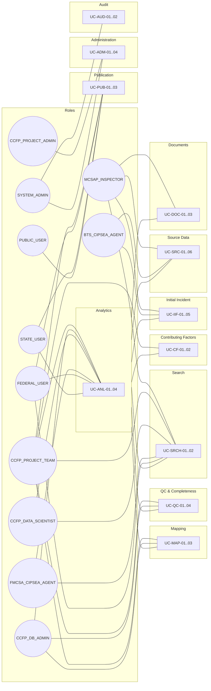
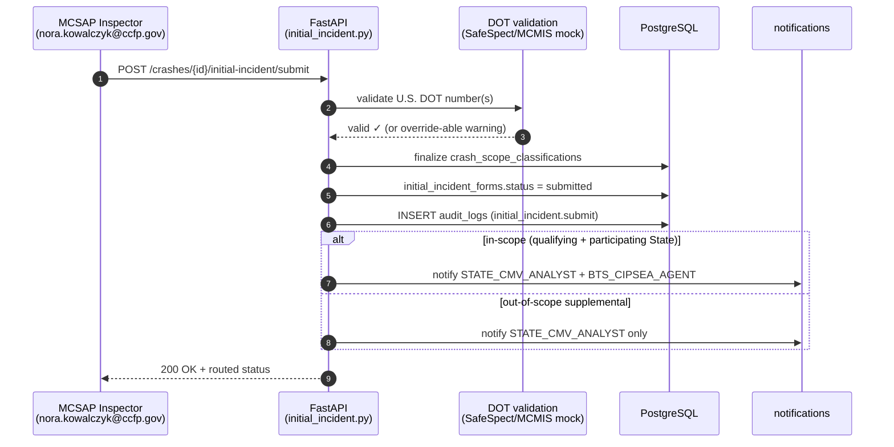
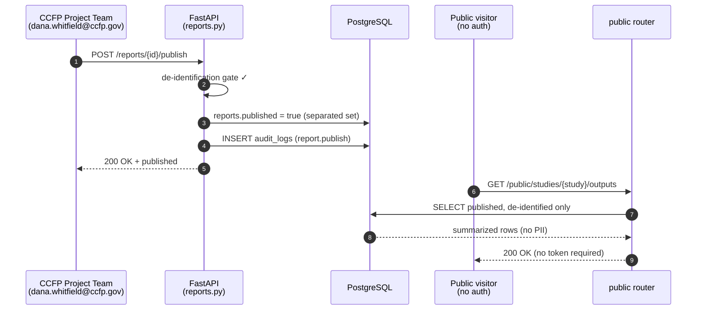

# Use Cases

**Phase:** Discover · **Artifact family:** Use Cases

This document expresses the **Crash Causal Factors Program (CCFP) IT
Solution** (Phase 1 Heavy-Duty Truck Study) as **actor-goal-scenario**
use cases. Every flow below is grounded in the shipping code: primary
actors are the twelve seeded CCFP roles
([Stakeholders & Personas](03-stakeholders-personas.md)), preconditions
are verifiable against the RBAC catalog
([RBAC Matrix](../02-analyze/10-rbac-matrix.md)), and the main /
alternate / exception flows mirror the actual HTTP behavior of the live
FastAPI backend ([API Specification](../02-analyze/09-api-specification.md)).
You can replay nearly every scenario in the live demo at
<https://nexgile-dot-ccfp.nexgiletechnologies.com> using the seeded
sign-in accounts ([Demo Credentials](../reference/demo-credentials.md)).

Naming: `UC-<family>-<n>` where families follow the CCFP lifecycle
taxonomy (IIF, SRC, MAP, QC, CF, ANL, PUB, DOC, ADM, AUD, SRCH). The
Gherkin acceptance criteria for each use case are in
[06 — User Stories](06-user-stories.md).

!!! warning "Synthetic data only"
    Every name, email, motor carrier, U.S. DOT number, ELD file, and
    crash referenced below is **100% synthetic** — seeded for the demo
    on a fictitious `@ccfp.gov` domain. No real PII, CIPSEA interview
    data, or production crash records appear anywhere in these flows.

!!! tip "Where to go next"
    Each flow references concrete routes and tables — click any linked
    route to jump into the
    [API Specification](../02-analyze/09-api-specification.md), and any
    linked table to jump into the
    [Data Model](../02-analyze/08-data-model.md).

!!! info "Use case template"
    Each use case below follows the same nine-line shape:

    1. **Primary actor** — the role that initiates the flow
    2. **Other actors** — who else is involved
    3. **Pre-conditions** — required state before the flow can start
    4. **Trigger** — the event that begins the flow
    5. **Main flow** — the happy-path steps in order
    6. **Alternate flow** — common variant paths
    7. **Exception flow** — what happens when something goes wrong
    8. **Post-condition** — state after the flow completes
    9. **Implementation pointer** — the API domain where the flow lives

---

## Table of contents

- [§0 Use case landscape](#0-use-case-landscape)
- [§1 UC-IIF — Crash creation & Initial Incident Form](#1-uc-iif-crash-creation-initial-incident-form)
- [§2 UC-SRC — Source data collection](#2-uc-src-source-data-collection)
- [§3 UC-MAP — Mapping & aggregation](#3-uc-map-mapping-aggregation)
- [§4 UC-QC — Quality control & completeness](#4-uc-qc-quality-control-completeness)
- [§5 UC-CF — Contributing factors](#5-uc-cf-contributing-factors)
- [§6 UC-ANL — Analytics & reporting](#6-uc-anl-analytics-reporting)
- [§7 UC-PUB — Publication & public access](#7-uc-pub-publication-public-access)
- [§8 UC-DOC — Documents](#8-uc-doc-documents)
- [§9 UC-ADM — Administration](#9-uc-adm-administration)
- [§10 UC-AUD — Audit](#10-uc-aud-audit)
- [§11 UC-SRCH — Search](#11-uc-srch-search)
- [Related documents](#related-documents)

---

## §0 Use case landscape

Every CCFP role's in-scope use-case families at a glance. Each persona
edge below is a real RBAC grant resolved through
`user_role_assignments → roles → role_permissions`, and a row of
synthetic demo data in `Backend/database/seeds/`.

The eight CCFP lifecycle phases map onto the families above: Phase 1
(Crash Identification) → UC-IIF; Phase 2 (Notification & Routing) →
UC-IIF routing; Phase 3 (Source Data Collection) → UC-SRC / UC-DOC;
Phase 4 (Mapping & Aggregation) → UC-MAP; Phase 5 (QC & Completeness) →
UC-QC; Phase 6 (Analysis & Reporting) → UC-CF / UC-ANL; Phase 7
(Publication & Data Sharing) → UC-PUB. UC-ADM (Phase 0 Study Setup),
UC-AUD, and UC-SRCH are cross-cutting. See
[07 — Workflow Process](../02-analyze/07-workflow-process.md) for the
full state view.

---

## §1 UC-IIF — Crash creation & Initial Incident Form

Phases 1–2 of the lifecycle (§5, §8.2 of `project_documentation.md`).
The Initial Incident Form (IIF) is created within **24–48 h** of a
crash; it creates the CCFP crash record, assigns the stable
`ccfp_identifier`, and triggers scope classification, notification, and
routing. The IIF endpoints live in the `initial_incident` router; the
crash shell in `crashes`.

### UC-IIF-01 — Create crash shell & assign CCFP identifier

1. **Primary actor** — `MCSAP_INSPECTOR` (Nora Kowalczyk,
   `nora.kowalczyk@ccfp.gov`, KS-scoped).
2. **Other actors** — `STATE_CMV_ANALYST` (Elliot Fontaine) downstream.
3. **Pre-conditions** — Caller holds `crash:create`; an active study
   (Phase 1 Heavy-Duty Truck Study) with KS as a participating State.
4. **Trigger** — Inspector reports a fatal Class 7/8 crash and starts a
   new record.
5. **Main flow** — `POST /api/v1/crashes` creates a `crashes` row, mints
   a stable `ccfp_identifier`, and seeds a `crash_scope_classifications`
   row. An `audit_logs` entry (`crash.create`) is written.
6. **Alternate flow** — The State CMV Data Analyst can create the shell
   on behalf of a designated officer; same endpoint, same scope guard.
7. **Exception flow** — Missing study/State context → 422; a caller
   without `crash:create` → 403; an out-of-State KS user creating a TX
   crash is blocked by `scope_filter`.
8. **Post-condition** — One `crashes` row exists; the CCFP identifier is
   permanent and reused by every later source record.
9. **Implementation pointer** — `crashes` router (`crashes.py`).

### UC-IIF-02 — File the Initial Incident Form

1. **Primary actor** — `MCSAP_INSPECTOR` (Nora Kowalczyk).
2. **Other actors** — Carriers, drivers, non-motorists, witnesses
   (subjects of the captured records).
3. **Pre-conditions** — Crash shell exists; caller holds
   `initial_incident:write` for the crash's State.
4. **Trigger** — Inspector opens the IIF wizard within 24–48 h.
5. **Main flow** — `PUT /api/v1/crashes/{crashId}/initial-incident`
   autosaves the header (local crash report number, date/time, location,
   counts) plus repeatable `incident_vehicles` and `incident_persons`
   groups (CMV + non-CMV, drivers, occupants, non-motorists, witnesses).
6. **Alternate flow** — Resume from autosave on any device; the latest
   saved draft is always the editing baseline (long-form autosave, §9.2).
7. **Exception flow** — Schema validation (e.g., missing U.S. DOT number
   for a CMV) returns field-level 422 errors; the form stays in draft.
8. **Post-condition** — Draft IIF persisted with vehicles and persons;
   not yet routed.
9. **Implementation pointer** — `initial_incident` router (`initial_incident.py`).

### UC-IIF-03 — Submit IIF with DOT validation & routing

1. **Primary actor** — `MCSAP_INSPECTOR` (Nora Kowalczyk).
2. **Other actors** — `STATE_CMV_ANALYST`, `BTS_CIPSEA_AGENT` (routing
   targets); the SafeSpect/MCMIS mock adapter (U.S. DOT validation).
3. **Pre-conditions** — All required IIF sections complete; the crash is
   classifiable as qualifying (≥1 fatality AND ≥1 heavy-duty Class 7/8
   truck).
4. **Trigger** — Inspector clicks "Submit".
5. **Main flow** —
   `POST /api/v1/crashes/{crashId}/initial-incident/submit` runs DOT-number
   validation, finalizes `crash_scope_classifications` (qualifying /
   in-scope / out-of-scope), creates `notifications`, and routes the
   record. In-scope crashes notify both the State Analyst and the BTS
   CIPSEA Agent; out-of-scope supplemental crashes notify the State
   Analyst only.
6. **Alternate flow** — A flagged-but-overridable validation warning
   (e.g., a DOT number not yet in MCMIS) lets the inspector submit with a
   noted exception.
7. **Exception flow** — Required fields missing → 400 with the blocking
   list; the submit is rejected and the form returns to draft.
8. **Post-condition** — IIF `submitted`; routing notifications dispatched;
   the BTS interview workflow can begin for in-scope crashes.
9. **Implementation pointer** — `initial_incident` router (submit + routing).

### UC-IIF-04 — Receive in-scope routing notification (BTS)

1. **Primary actor** — `BTS_CIPSEA_AGENT` (Helena Brandt,
   `helena.brandt@ccfp.gov`).
2. **Other actors** — `STATE_CMV_ANALYST`; the submitting inspector.
3. **Pre-conditions** — An in-scope IIF was submitted (UC-IIF-03);
   caller holds `notification:read` and `bts:read`.
4. **Trigger** — The routing fan-out from UC-IIF-03 lands.
5. **Main flow** — `GET /api/v1/notifications` lists the new in-scope
   crash; the agent opens it to begin the confidential CIPSEA interview
   workflow (driver / carrier / witness).
6. **Alternate flow** — `POST /api/v1/notifications/{id}/read` marks it
   triaged once the interview is scheduled.
7. **Exception flow** — A non-CIPSEA role attempting to open the
   BTS-tagged record → 403 (CIPSEA requires `bts:read`).
8. **Post-condition** — Notification acknowledged; interview workflow
   queued.
9. **Implementation pointer** — `notifications` router.

### UC-IIF-05 — Delete a draft IIF under business rules

1. **Primary actor** — `MCSAP_INSPECTOR` or `STATE_CMV_ANALYST`.
2. **Other actors** — Audit log.
3. **Pre-conditions** — IIF still in draft (not submitted/locked); caller
   holds `initial_incident:delete`.
4. **Trigger** — A duplicate or erroneous draft must be removed.
5. **Main flow** — `DELETE /api/v1/crashes/{crashId}/initial-incident`
   removes the draft where business rules permit; an audit row records
   the deletion.
6. **Alternate flow** — Instead of deleting, the analyst corrects and
   re-saves (UC-IIF-02) — preferred when any data is salvageable.
7. **Exception flow** — Deleting a submitted/locked IIF → 409; deleting
   another State's draft → 403.
8. **Post-condition** — Draft removed; the crash shell may be retired
   separately by an authorized role.
9. **Implementation pointer** — `initial_incident` router (delete).

---

## §2 UC-SRC — Source data collection

Phase 3 (§5, §8.3–8.7). Source artifacts attach to the crash via the
`source_data` router and are preserved in `source_records` with full
provenance. Each source keeps its own typed table.

### UC-SRC-01 — Link post-crash inspection (SafeSpect)

1. **Primary actor** — `MCSAP_INSPECTOR` (Nora Kowalczyk).
2. **Other actors** — SafeSpect / approved COTS inspection software
   (mock adapter).
3. **Pre-conditions** — Crash record exists; inspection performed; caller
   holds `source_data:ingest`. (BRD: upload within 7 days.)
4. **Trigger** — Inspector links the completed inspection.
5. **Main flow** —
   `POST /api/v1/crashes/{crashId}/post-crash-inspections` creates a
   `post_crash_inspections` row capturing violations/defects and a
   `source_records` provenance entry.
6. **Alternate flow** — Automated ingestion: the SafeSpect adapter pulls
   the record from MCMIS (`integrations` router, feature-flagged
   `CCFP_INTEGRATION_*_LIVE`).
7. **Exception flow** — A duplicate inspection for the same crash is
   de-duplicated by source key; an out-of-State link → 403.
8. **Post-condition** — Inspection linked; violations available to
   mapping and QC.
9. **Implementation pointer** — `source_data` router (inspections).

### UC-SRC-02 — Save the Post-Crash Investigation (PCI) form

1. **Primary actor** — `STATE_CMV_ANALYST` (Elliot Fontaine,
   `elliot.fontaine@ccfp.gov`).
2. **Other actors** — Investigators contributing section data.
3. **Pre-conditions** — Crash record exists; caller holds
   `source_data:ingest` for the State.
4. **Trigger** — Analyst opens the multi-section §19.2 PCI workspace.
5. **Main flow** —
   `POST /api/v1/crashes/{crashId}/post-crash-investigations` saves the
   typed PCI header plus its child sections (carrier/power-unit, driver/
   load, medical certificate, hours-of-service, vehicle condition, brake
   system, per-seating-position seat belt/airbag, axles, tires, trailers,
   hazmat, exemptions).
6. **Alternate flow** — Repeatable groups (trailers, axles, tires,
   additional towed units) are appended incrementally with autosave.
7. **Exception flow** — A required §19.2 field flagged as required-not-
   provided surfaces as a field-level 422 on submit.
8. **Post-condition** — PCI sections persisted with an ELD-summary block;
   ready for mapping.
9. **Implementation pointer** — `source_data` router (investigations).

### UC-SRC-03 — Add PCR & map State fields to CCFP attributes

1. **Primary actor** — `STATE_CMV_ANALYST` (Elliot Fontaine).
2. **Other actors** — `CCFP_DB_ADMIN` (mapping steward); the State crash
   repository (source).
3. **Pre-conditions** — Crash record exists; caller holds `pcr:read` and
   `pcr:map`. (BRD: PCR subset to FMCSA within 45 days.)
4. **Trigger** — PCR data arrives (direct State connection or via MCMIS).
5. **Main flow** — `POST /api/v1/crashes/{crashId}/police-crash-reports`
   stores the PCR, then `pcr_field_mapping` aligns each State field to a
   CCFP canonical attribute across the MMUCC-aligned sections (Crash,
   Vehicle, Person, Roadway, Non-motorist, Fatal, Large-vehicle/Hazmat,
   Dynamic). Coverage is tracked per State and PCR section.
6. **Alternate flow** — The State feedback loop: a State reports
   attributes it already collects, correcting `state_pcr_coverage` /
   `state_attribute_coverage` so the color-coded required/optional status
   reconciles.
7. **Exception flow** — An unmapped required attribute leaves the section
   coverage below 100% and is flagged on the coverage dashboard.
8. **Post-condition** — PCR mapped; per-State coverage percentages
   updated.
9. **Implementation pointer** — `source_data` router (PCR + mapping); see
   [PCR Coverage](../02-analyze/08-data-model.md).

### UC-SRC-04 — Upload & code a reconstruction report

1. **Primary actor** — `STATE_CMV_ANALYST` (Elliot Fontaine).
2. **Other actors** — `STATE_USER` reconstructionist (narrative author).
3. **Pre-conditions** — Crash record exists; caller holds `recon:upload`
   / `recon:code`. (BRD: reconstruction expected 90–120 days post-crash.)
4. **Trigger** — A narrative reconstruction report is received.
5. **Main flow** — `POST /api/v1/crashes/{crashId}/reconstruction-reports`
   stores the artifact, then the analyst manually codes narrative findings
   into CCFP research attributes (`reconstruction_reports`).
6. **Alternate flow** — Re-code on revision; prior coded findings are
   retained for provenance.
7. **Exception flow** — Coding into an attribute outside the study
   catalog is rejected; oversize uploads return the configured limit
   error (see UC-DOC-01).
8. **Post-condition** — Reconstruction findings available as canonical
   inputs.
9. **Implementation pointer** — `source_data` router (reconstruction).

### UC-SRC-05 — Upload an ELD/eRODS file & extract events

1. **Primary actor** — `MCSAP_INSPECTOR` (Nora Kowalczyk).
2. **Other actors** — Motor carrier / driver (file origin); ELD parse
   worker.
3. **Pre-conditions** — Crash record exists; caller holds `eld:upload`;
   the CSV carries the unique CCFP code as an Output File Comment (format
   `CCFP-State-Post-Crash-Inspection-Code`).
4. **Trigger** — Inspector uploads the ELD CSV captured at roadside via
   eRODS.
5. **Main flow** — `POST /api/v1/crashes/{crashId}/eld-files` stores the
   `eld_files` row; a `BackgroundTasks` worker parses CSV rows into
   `eld_events`, applying `eld_field_mappings` and
   `eld_duty_code_mappings`. `GET .../eld-events` returns the extracted
   hours-of-service events.
6. **Alternate flow** — When the CCFP code is missing, the inspector
   links the file to the crash manually; the carrier supplies the file if
   the driver cannot transfer it.
7. **Exception flow** — A malformed CSV is rejected by the parser and
   reported on the ELD upload panel; the file row is retained for retry.
8. **Post-condition** — ELD events extracted and linked; HOS data ready
   for analysis.
9. **Implementation pointer** — `source_data` router (ELD upload +
   events); `workers/` ELD parse.

### UC-SRC-06 — Receive out-of-scope routing (State Analyst)

1. **Primary actor** — `STATE_CMV_ANALYST` (Elliot Fontaine).
2. **Other actors** — The submitting inspector.
3. **Pre-conditions** — A supplemental out-of-scope crash was submitted;
   caller holds `notification:read` and is scoped to the crash's State.
4. **Trigger** — The out-of-scope routing notification arrives.
5. **Main flow** — `GET /api/v1/notifications` surfaces the supplemental
   crash; the analyst coordinates State-level collection without the BTS
   CIPSEA interview path.
6. **Alternate flow** — The analyst promotes the record if later evidence
   makes it qualifying, re-running scope classification.
7. **Exception flow** — A BTS agent is intentionally **not** notified for
   out-of-scope supplemental crashes; an attempt to read them as BTS → no
   such routing exists.
8. **Post-condition** — Out-of-scope crash queued for State handling only.
9. **Implementation pointer** — `notifications` + `crashes` (scope) routers.

---

## §3 UC-MAP — Mapping & aggregation

Phase 4 (§5, §8.8). Source values become **canonical CCFP attributes**
with one current value per `(crash, attribute)` while provenance is
preserved on every source value.

### UC-MAP-01 — Aggregate canonical attributes for a crash

1. **Primary actor** — `CCFP_DB_ADMIN` (Victor De La Cruz,
   `victor.delacruz@ccfp.gov`).
2. **Other actors** — `STATE_CMV_ANALYST`, `CCFP_PROJECT_TEAM`.
3. **Pre-conditions** — One or more sources linked; caller holds
   `data_mgmt:read_raw` and `data_mgmt:edit`.
4. **Trigger** — Sources are ready to consolidate into one crash record.
5. **Main flow** — `GET /api/v1/crashes/{crashId}/attributes` returns the
   aggregated `crash_attribute_values`; the system resolves one current
   canonical value per attribute while linking all source records to the
   stable CCFP identifier.
6. **Alternate flow** — Manual override during QC sets a canonical value
   with the editing role recorded as provenance.
7. **Exception flow** — Two sources conflict on a required attribute →
   the conflict surfaces for analyst resolution; no silent overwrite.
8. **Post-condition** — Aggregated record assembled with traceable
   provenance.
9. **Implementation pointer** — `crashes` (aggregated attrs) +
   `data_management` routers.

### UC-MAP-02 — Trace provenance via the source timeline

1. **Primary actor** — `CCFP_PROJECT_TEAM` (Dana Whitfield,
   `dana.whitfield@ccfp.gov`).
2. **Other actors** — `CCFP_DB_ADMIN`.
3. **Pre-conditions** — Caller holds `crash:read` (and
   `data_mgmt:read_raw` for raw source bodies).
4. **Trigger** — Reviewer needs to know where a value came from.
5. **Main flow** — `GET /api/v1/crashes/{crashId}/sources` and
   `.../timeline` list every linked source record and lifecycle event,
   so any canonical value can be traced back to its origin
   (`source_records` + `crash_attribute_values.source_*`).
6. **Alternate flow** — Filter by source type (inspection, PCI, PCR,
   reconstruction, ELD) to isolate one feed.
7. **Exception flow** — A State user requesting raw PII without
   data-entry permission sees masked values.
8. **Post-condition** — Read-only; full lineage visible.
9. **Implementation pointer** — `crashes` router (sources + timeline).

### UC-MAP-03 — Maintain the data-attribute catalog & PCR coverage

1. **Primary actor** — `CCFP_DB_ADMIN` (Victor De La Cruz).
2. **Other actors** — `CCFP_PROJECT_ADMIN` (sets requirements).
3. **Pre-conditions** — Caller holds mapping permissions; an active
   study.
4. **Trigger** — A new State PCR or attribute needs onboarding.
5. **Main flow** — Studies endpoints expose the `data_attributes`
   catalog and per-State PCR coverage; mappings reconcile new State
   fields without altering the canonical model — keeping the platform
   configurable for future phases.
6. **Alternate flow** — Bulk-import a State PCR template, then refine the
   field-by-field mapping.
7. **Exception flow** — A mapping that breaks the one-canonical-value
   invariant is rejected by the partial unique index.
8. **Post-condition** — Catalog and coverage updated; downstream
   aggregation uses the new mappings.
9. **Implementation pointer** — `studies` router (data-attribute catalog,
   PCR coverage).

---

## §4 UC-QC — Quality control & completeness

Phase 5 (§5, §8.8). Configurable QC rules validate the aggregated
record; completeness rules decide whether a crash is `complete`.

### UC-QC-01 — Run QC rules on a crash

1. **Primary actor** — `STATE_CMV_ANALYST` (Elliot Fontaine).
2. **Other actors** — `CCFP_PROJECT_TEAM`; QC worker.
3. **Pre-conditions** — Crash aggregated; caller holds `data_mgmt:qc`.
4. **Trigger** — Analyst runs QC after mapping.
5. **Main flow** — The QC evaluator applies `data_quality_rules`
   (format, missing-data, cross-field, compliance checks against
   authoritative systems) and writes `data_quality_results`;
   `GET /api/v1/crashes/{crashId}/quality` returns pass/fail per rule.
6. **Alternate flow** — Re-run after edits; results supersede the prior
   pass while history is retained.
7. **Exception flow** — A failed rule blocks completeness and raises a QC
   notification to the analyst (§8.11).
8. **Post-condition** — QC results recorded; failures itemized.
9. **Implementation pointer** — `data_management` router (QC) +
   `workers/` QC evaluation.

### UC-QC-02 — Edit attributes to resolve QC findings

1. **Primary actor** — `STATE_CMV_ANALYST` (Elliot Fontaine).
2. **Other actors** — `CCFP_DB_ADMIN`.
3. **Pre-conditions** — Open QC findings; caller holds `data_mgmt:edit`.
4. **Trigger** — Analyst corrects flagged values.
5. **Main flow** — Edit canonical `crash_attribute_values` (every update
   tracked by user + timestamp); re-run UC-QC-01 to clear the rule.
6. **Alternate flow** — Bulk-correct a class of findings (e.g., a unit
   conversion) across attributes.
7. **Exception flow** — Editing a value sourced as read-only for the
   study is blocked by attribute requirements.
8. **Post-condition** — Findings resolved; QC passes.
9. **Implementation pointer** — `data_management` router (edit).

### UC-QC-03 — Mark a crash record complete

1. **Primary actor** — `STATE_CMV_ANALYST` (Elliot Fontaine).
2. **Other actors** — `CCFP_PROJECT_TEAM` (oversight).
3. **Pre-conditions** — QC passed; caller holds `data_mgmt:complete`; the
   study's `completeness_rules` are satisfied.
4. **Trigger** — Analyst marks the record complete.
5. **Main flow** — Completeness is evaluated against the per-study rules;
   `crash_completeness_status` flips to `complete` (one current status
   per crash via a partial unique index);
   `GET /api/v1/crashes/{crashId}/completeness` confirms.
6. **Alternate flow** — Auto-evaluation: the completeness worker proposes
   `complete` when all required attributes and QC pass.
7. **Exception flow** — Unmet required attributes keep the record
   `incomplete` with the missing list returned.
8. **Post-condition** — Crash record `complete` and locked for routine
   edits.
9. **Implementation pointer** — `crashes` (completeness) +
   `workers/` completeness evaluation.

### UC-QC-04 — Unlock a complete record for authorized edit

1. **Primary actor** — `CCFP_PROJECT_TEAM` (Dana Whitfield).
2. **Other actors** — `STATE_CMV_ANALYST` (re-editor); audit log.
3. **Pre-conditions** — Record is `complete`; caller holds
   `crash:unlock`.
4. **Trigger** — New evidence requires changing a locked record.
5. **Main flow** — `POST /api/v1/crashes/{crashId}/unlock` reopens the
   record for editing; the unlock and subsequent edits are audited.
6. **Alternate flow** — Unlock, edit, re-run QC, and re-complete in one
   working session.
7. **Exception flow** — A caller without `crash:unlock` → 403; the record
   stays locked.
8. **Post-condition** — Record editable; completeness must be re-earned.
9. **Implementation pointer** — `crashes` router (unlock).

---

## §5 UC-CF — Contributing factors

Phase 6 (§5, §8.9). The analyst reviews selected PCR sections and
selects the **top three primary contributing factors** from the
BRD-specified groups.

### UC-CF-01 — Review PCR-section summary for contributing factors

1. **Primary actor** — `STATE_CMV_ANALYST` (Elliot Fontaine).
2. **Other actors** — `CCFP_PROJECT_TEAM`.
3. **Pre-conditions** — PCR mapped; caller holds `data_mgmt:read_aggregated`.
4. **Trigger** — Analyst opens the contributing-factor workspace.
5. **Main flow** — The system generates a summary of the relevant PCR
   sections and presents the BRD groups: contributing circumstances for
   roadways / vehicles / non-motorists; driver actions at the time of
   crash; driver conditions at the time of crash; driver & non-motorists
   distracted by; and non-motorist actions at the time of crash
   (`ref_contributing_factor_groups` / `ref_contributing_factor_values`).
6. **Alternate flow** — Drill into the underlying mapped values to
   justify a selection.
7. **Exception flow** — A crash without mapped PCR sections shows no
   factor prompt until UC-SRC-03 completes.
8. **Post-condition** — Factor groups presented; ready for selection.
9. **Implementation pointer** — `data_management` router
   (contributing-factor groups).

### UC-CF-02 — Select the top three primary contributing factors

1. **Primary actor** — `STATE_CMV_ANALYST` (Elliot Fontaine).
2. **Other actors** — `CCFP_DATA_SCIENTIST` (downstream analysis).
3. **Pre-conditions** — Factor groups reviewed; caller holds
   `contributing_factor:select`.
4. **Trigger** — Analyst commits the causal-factor selection.
5. **Main flow** — The selection writes up to three
   `contributing_factor_selections` rows (ranked primary factors) tied to
   the crash; the action is audited.
6. **Alternate flow** — Revise a selection before the record is published;
   prior selections are versioned.
7. **Exception flow** — Selecting more than three primary factors, or a
   value outside the catalog, is rejected.
8. **Post-condition** — Up to three ranked contributing factors recorded
   for analysis and reporting.
9. **Implementation pointer** — `data_management` router (selection).

---

## §6 UC-ANL — Analytics & reporting

Phase 6 (§5, §8.9, §12.6). Federal analytical roles build dashboards,
run whitelisted parameterized queries, and assemble reports.

### UC-ANL-01 — Open a role-scoped dashboard

1. **Primary actor** — `CCFP_DATA_SCIENTIST` (Priya Ramanathan,
   `priya.ramanathan@ccfp.gov`).
2. **Other actors** — `FEDERAL_USER`, `CCFP_PROJECT_TEAM`.
3. **Pre-conditions** — Caller holds `analytics:dashboard`.
4. **Trigger** — User opens the Analytics workspace.
5. **Main flow** — `GET /api/v1/analytics/dashboards` lists dashboards
   visible to the caller; charts render over Curated/Analytical data
   honoring scope and PII masking.
6. **Alternate flow** — A `FEDERAL_USER` sees role-approved tables;
   PII appears only where the user's group is authorized.
7. **Exception flow** — A `STATE_USER` requesting a PII dashboard sees the
   de-identified variant only.
8. **Post-condition** — Dashboards rendered within the caller's
   permission envelope.
9. **Implementation pointer** — `analytics` router (dashboards).

### UC-ANL-02 — Run a whitelisted parameterized query

1. **Primary actor** — `CCFP_DATA_SCIENTIST` (Priya Ramanathan).
2. **Other actors** — `FMCSA_CIPSEA_AGENT` (where CIPSEA data is in play).
3. **Pre-conditions** — Caller holds `analytics:query`.
4. **Trigger** — User runs an ad-hoc analytical query.
5. **Main flow** — `POST /api/v1/analytics/queries` executes a
   **whitelisted** parameterized query (no free-form SQL); results are
   scope- and PII-filtered before return.
6. **Alternate flow** — Save the query as a dashboard tile or report
   input.
7. **Exception flow** — A non-whitelisted query shape is rejected; CIPSEA
   columns require `bts:read`.
8. **Post-condition** — Query results returned within policy bounds.
9. **Implementation pointer** — `analytics` router (queries).

### UC-ANL-03 — Build & share a report

1. **Primary actor** — `CCFP_PROJECT_TEAM` (Dana Whitfield).
2. **Other actors** — `FEDERAL_USER`, `STATE_USER` (recipients).
3. **Pre-conditions** — Caller holds `report:create` / `report:share`.
4. **Trigger** — User assembles a report or table.
5. **Main flow** — `POST /api/v1/reports` creates a `reports` definition;
   `POST /api/v1/reports/{reportId}/share` grants scoped access via
   `report_shares`.
6. **Alternate flow** — Share to a State-scoped audience that receives the
   non-PII variant only.
7. **Exception flow** — Sharing a PII report to a No-PII group is blocked
   at the permission layer.
8. **Post-condition** — Report created and visible to its share targets.
9. **Implementation pointer** — `reports` router (create + share).

### UC-ANL-04 — Download an approved report

1. **Primary actor** — `FEDERAL_USER` (Omar Haddad,
   `omar.haddad@ccfp.gov`).
2. **Other actors** — Report owner; audit log.
3. **Pre-conditions** — Report shared with the caller; caller holds
   `report:download`.
4. **Trigger** — User clicks "Download".
5. **Main flow** — `GET /api/v1/reports/{reportId}/download` streams the
   approved output; the download is audited.
6. **Alternate flow** — Export to CSV/PDF subject to the same permission.
7. **Exception flow** — A caller without a share → 403; the report's
   existence is not leaked.
8. **Post-condition** — File delivered; access logged.
9. **Implementation pointer** — `reports` router (download).

---

## §7 UC-PUB — Publication & public access

Phase 7 (§5, §8.9, §14). Published outputs are **de-identified** and
separated from operational records; public routes require **no auth**.

### UC-PUB-01 — Publish a de-identified output

1. **Primary actor** — `CCFP_PROJECT_TEAM` (Dana Whitfield).
2. **Other actors** — `CCFP_PROJECT_ADMIN` (approval); the public.
3. **Pre-conditions** — Study released; caller holds `report:publish`;
   the output passes de-identification.
4. **Trigger** — Team publishes a summarized output after study release.
5. **Main flow** — `POST /api/v1/reports/{reportId}/publish` promotes a
   de-identified report into the Published set, separated from
   operational records; an audit row is written.
6. **Alternate flow** — Unpublish/replace with a corrected output; the
   prior public version is retired.
7. **Exception flow** — A report failing the de-identification gate cannot
   be published.
8. **Post-condition** — Output available to all public users with no
   authentication.
9. **Implementation pointer** — `reports` router (publish).

### UC-PUB-02 — Browse public outputs with no sign-in

1. **Primary actor** — `PUBLIC_USER` (or any unauthenticated visitor).
2. **Other actors** — None.
3. **Pre-conditions** — At least one published output exists.
4. **Trigger** — Visitor opens the public outputs page (no login).
5. **Main flow** — `GET /api/v1/public/studies/{studyId}/outputs` and
   `GET /api/v1/public/outputs` return summarized, de-identified data —
   the only data exposed without authentication.
6. **Alternate flow** — `GET /api/v1/public/data.json` provides a
   machine-readable open-data catalog entry.
7. **Exception flow** — Any attempt to reach an operational
   (non-`/public`) route without a token → 401.
8. **Post-condition** — De-identified outputs viewed; no PII exposed.
9. **Implementation pointer** — `public` router (no auth).

### UC-PUB-03 — Download a published report (no auth)

1. **Primary actor** — `PUBLIC_USER`.
2. **Other actors** — None.
3. **Pre-conditions** — A specific published report exists.
4. **Trigger** — Visitor selects a published report.
5. **Main flow** — `GET /api/v1/public/reports/{reportId}` and
   `.../download` return the de-identified report and its file with no
   sign-in required.
6. **Alternate flow** — Deep-link directly to a report id shared in a
   publication.
7. **Exception flow** — An unpublished or retired report id → 404; the
   public surface never reveals operational records.
8. **Post-condition** — Public file delivered; operational data untouched.
9. **Implementation pointer** — `public` router (report + download).

---

## §8 UC-DOC — Documents

§8, §14. Uploads are malware-scanned and served via signed URLs; every
access is recorded.

### UC-DOC-01 — Upload a document with malware scan

1. **Primary actor** — Any participant with `source_data:ingest` /
   document-upload rights (e.g., `STATE_CMV_ANALYST`).
2. **Other actors** — Malware scanner (mocked in dev); object storage
   (local disk in dev).
3. **Pre-conditions** — Caller has crash access; file present.
4. **Trigger** — User drops a file (image, video, PDF, ELD CSV, report).
5. **Main flow** — `POST /api/v1/documents` writes a `documents` metadata
   row, runs the malware scan, stores the bytes, and returns the
   metadata.
6. **Alternate flow** — Crash-tagged upload routes the file into that
   crash's source tree.
7. **Exception flow** — A scan hit quarantines the file (415-class
   rejection); oversize files return the configured limit error.
8. **Post-condition** — Document available to roles with read access for
   its sensitivity class.
9. **Implementation pointer** — `documents` router (upload + scan).

### UC-DOC-02 — Download a document via signed URL

1. **Primary actor** — Any participant with document read access.
2. **Other actors** — `SYSTEM_ADMIN` / auditor (later, via audit log).
3. **Pre-conditions** — Document exists; caller is authorized for its
   sensitivity class.
4. **Trigger** — User clicks the download icon.
5. **Main flow** — The API returns a short-lived **signed URL**; fetching
   it streams the bytes and records the access for audit.
6. **Alternate flow** — Inline preview for supported types without a full
   download.
7. **Exception flow** — Missing permission → 403; a deleted document →
   404; an expired signed URL must be re-requested.
8. **Post-condition** — File delivered; access trail accumulates.
9. **Implementation pointer** — `documents` router (signed-URL download).

### UC-DOC-03 — Enforce PII/CIPSEA sensitivity on a document

1. **Primary actor** — `FMCSA_CIPSEA_AGENT` (Marcus Ellingsworth,
   `marcus.ellingsworth@ccfp.gov`).
2. **Other actors** — `STATE_USER` (No-PII consumer).
3. **Pre-conditions** — Document tagged `PII` / `CIPSEA` / `sensitive`.
4. **Trigger** — Two users with different clearances request the same
   document.
5. **Main flow** — The sensitivity tag (`data_sensitivity`) gates access:
   CIPSEA documents require `bts:read`; PII requires a data-entry/QC
   permission; No-PII users see only de-identified artifacts.
6. **Alternate flow** — A redacted variant is served to a No-PII caller
   where one exists.
7. **Exception flow** — An unauthorized class request → 403; the access
   denial itself is logged.
8. **Post-condition** — Least-privilege access enforced and audited.
9. **Implementation pointer** — `documents` router + `core/permissions.py`.

---

## §9 UC-ADM — Administration

Phase 0 Study Setup (§5, §8.1, §12.2). Administrators define studies,
manage users/roles, and configure attributes and completeness rules.

### UC-ADM-01 — Create a user & assign a role

1. **Primary actor** — `CCFP_PROJECT_ADMIN` (Avery Thornton,
   `avery.thornton@ccfp.gov`).
2. **Other actors** — `SYSTEM_ADMIN`; the new user.
3. **Pre-conditions** — Caller holds `admin:users` / `admin:roles`.
4. **Trigger** — Admin onboards a new participant.
5. **Main flow** — The `admin` router creates the `users` row and writes
   a `user_role_assignments` entry (scoped by organization / State /
   study); effective permissions resolve through `role_permissions`.
6. **Alternate flow** — Assign a State-scoped role so the user sees only
   their State's data.
7. **Exception flow** — A duplicate email → 409; assigning a role the
   admin cannot grant → 403.
8. **Post-condition** — User can sign in (shared demo password
   `Second@123`) and exercise the granted permissions.
9. **Implementation pointer** — `admin` router (users, roles,
   assignments).

### UC-ADM-02 — Configure study parameters & scope rules

1. **Primary actor** — `CCFP_PROJECT_ADMIN` (Avery Thornton).
2. **Other actors** — `CCFP_PROJECT_TEAM`.
3. **Pre-conditions** — Caller holds `study:configure`.
4. **Trigger** — Admin sets up or revises the active study.
5. **Main flow** — The `studies` router edits CMV type, crash type,
   participating States, study dates, and qualifying/in-scope/out-of-scope
   rules (`studies`, `study_states`, `study_parameters`) — no Phase 1
   assumptions are hardcoded.
6. **Alternate flow** — Stand up a future phase (medium-duty, buses,
   serious-injury) by adding parameters, not rebuilding.
7. **Exception flow** — Onboarding a State without a data-sharing
   agreement is blocked by policy.
8. **Post-condition** — Study scope active; crash creation and routing
   honor the new rules.
9. **Implementation pointer** — `studies` router (params + states).

### UC-ADM-03 — Set attribute requirements & completeness rules

1. **Primary actor** — `CCFP_PROJECT_ADMIN` (Avery Thornton).
2. **Other actors** — `CCFP_DB_ADMIN` (mapping consumer).
3. **Pre-conditions** — Caller holds `admin:attributes` /
   `admin:completeness`.
4. **Trigger** — Admin tunes the canonical attribute model.
5. **Main flow** — Set per-study required / optional / read-only /
   editable flags (`attribute_requirements`) and author
   `completeness_rules` that define a complete crash record.
6. **Alternate flow** — Clone a prior study's rule set as a starting
   template.
7. **Exception flow** — A completeness rule referencing a non-existent
   attribute is rejected.
8. **Post-condition** — QC (UC-QC) and completeness (UC-QC-03) use the new
   rules immediately.
9. **Implementation pointer** — `studies` router (attribute-requirements,
   completeness-rules).

### UC-ADM-04 — Manage roles & permissions (system)

1. **Primary actor** — `SYSTEM_ADMIN` (Morgan Castellano,
   `sysadmin@ccfp.gov`).
2. **Other actors** — `CCFP_PROJECT_ADMIN`.
3. **Pre-conditions** — Caller holds `admin:system` / `admin:roles`.
4. **Trigger** — A role's permission set must change.
5. **Main flow** — The `admin` router edits `roles`, `permissions`, and
   `role_permissions`; changes take effect on the next token resolution.
6. **Alternate flow** — Create an access group and bind it to roles via
   `role_access_groups`.
7. **Exception flow** — Removing a permission still required by a critical
   flow surfaces a warning before commit.
8. **Post-condition** — Effective permissions updated across all assigned
   users.
9. **Implementation pointer** — `admin` router (roles, permissions).

---

## §10 UC-AUD — Audit

§10, §14. Every state-changing action writes an **immutable** audit row;
only authorized roles may read the log.

### UC-AUD-01 — Query the audit log

1. **Primary actor** — `SYSTEM_ADMIN` (Morgan Castellano).
2. **Other actors** — `CCFP_PROJECT_TEAM` (compliance).
3. **Pre-conditions** — Caller holds `audit:read`.
4. **Trigger** — A compliance question or incident review.
5. **Main flow** — The `audit` router returns `audit_logs` rows filtered
   by actor, action, resource, resource id, and time window — showing who
   did what, when, and the before/after.
6. **Alternate flow** — Scope to one crash to reconstruct its full change
   history.
7. **Exception flow** — A non-audit role → 403; the audit log is
   append-only and cannot be edited.
8. **Post-condition** — Read-only; no state change.
9. **Implementation pointer** — `audit` router (query).

### UC-AUD-02 — Trace a lifecycle event end-to-end

1. **Primary actor** — `CCFP_PROJECT_TEAM` (Dana Whitfield).
2. **Other actors** — `SYSTEM_ADMIN`.
3. **Pre-conditions** — Caller holds `audit:read` and `crash:read`.
4. **Trigger** — A reviewer reconciles a notification with its source
   action.
5. **Main flow** — Cross-reference `audit_logs` with `notifications` and
   the crash timeline to confirm that IIF submit → routing → QC →
   publication each produced the expected immutable trail.
6. **Alternate flow** — Export a filtered slice for an external compliance
   reviewer.
7. **Exception flow** — Gaps (an action without an audit row) are
   treated as defects — by design every state change is logged.
8. **Post-condition** — End-to-end lineage confirmed.
9. **Implementation pointer** — `audit` + `crashes` (timeline) routers.

---

## §11 UC-SRCH — Search

§8.10. Cross-entity search is **scope- and PII-aware**: results respect
the caller's State scope and mask PII unless authorized.

### UC-SRCH-01 — Scope-filtered cross-entity search

1. **Primary actor** — `STATE_CMV_ANALYST` (Elliot Fontaine, KS).
2. **Other actors** — None.
3. **Pre-conditions** — Caller authenticated; State scope known.
4. **Trigger** — User searches for a crash, person, carrier, or report.
5. **Main flow** — The `search` router runs a SQL `ILIKE` / `pg_trgm`
   query across crashes, people, carriers, reports, and source artifacts;
   results are filtered to the caller's State.
6. **Alternate flow** — A `CCFP_DATA_SCIENTIST` searches across all
   participating States (no State filter).
7. **Exception flow** — A KS analyst's results never include TX or CA
   crashes — scope isolation holds (compare `grant.holloway@ccfp.gov`
   (TX) and `linh.tran@ccfp.gov` (CA)).
8. **Post-condition** — Only in-scope matches returned.
9. **Implementation pointer** — `search` router.

### UC-SRCH-02 — PII-masked result rendering

1. **Primary actor** — `STATE_USER` (Tomasz Bialek,
   `tomasz.bialek@ccfp.gov`, KS).
2. **Other actors** — `CCFP_PROJECT_TEAM` (PII-authorized comparison).
3. **Pre-conditions** — Caller lacks a data-entry/QC permission.
4. **Trigger** — User searches and matches a record containing names /
   addresses / phones.
5. **Main flow** — The search response **masks** PII fields for the
   No-PII caller; an authorized role sees the same record unmasked.
6. **Alternate flow** — CIPSEA-tagged interview hits are omitted entirely
   unless the caller holds `bts:read`.
7. **Exception flow** — Attempting to widen results past the permission
   envelope has no effect; masking is server-side.
8. **Post-condition** — Least-privilege search results delivered.
9. **Implementation pointer** — `search` router + `core/permissions.py`.

---

## Related documents

- [03 — Stakeholders & Personas](03-stakeholders-personas.md) — the
  twelve CCFP roles that drive every flow above.
- [04 — Business Requirements](04-business-requirements.md) — the BRD
  requirements these use cases satisfy.
- [06 — User Stories](06-user-stories.md) — Gherkin acceptance criteria
  per use case.
- [07 — Workflow Process](../02-analyze/07-workflow-process.md) — the
  end-to-end view of the eight lifecycle phases.
- [08 — Data Model](../02-analyze/08-data-model.md) — every table and
  enum referenced in the flows above.
- [09 — API Specification](../02-analyze/09-api-specification.md) —
  endpoint-level reference for every implementation pointer.
- [10 — RBAC Matrix](../02-analyze/10-rbac-matrix.md) — who can execute
  each use case.
- [11 — Architecture & Sequence](../03-design/11-architecture-sequence.md) —
  sequence diagrams for the principal flows.
- [14 — Operations Runbook](../04-release/14-operations-runbook.md) —
  operator-side playbooks triggered by these use cases.
- [Demo Credentials](../reference/demo-credentials.md) — sign-in accounts
  to replay every scenario.

*End of 05 — Use Cases.*
