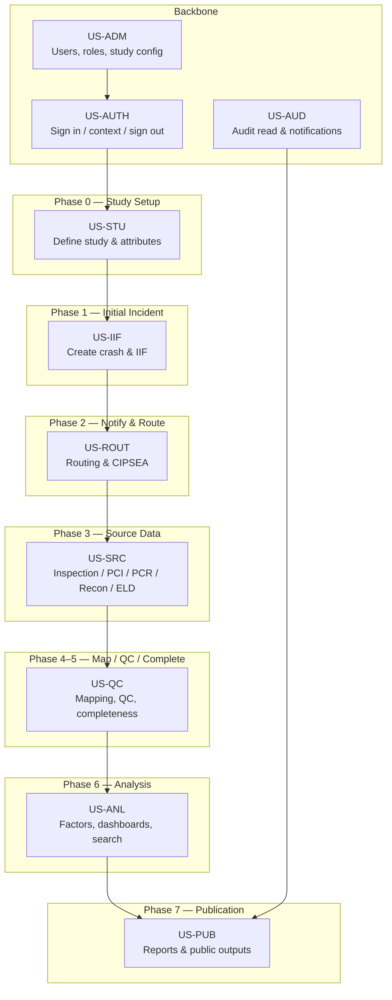
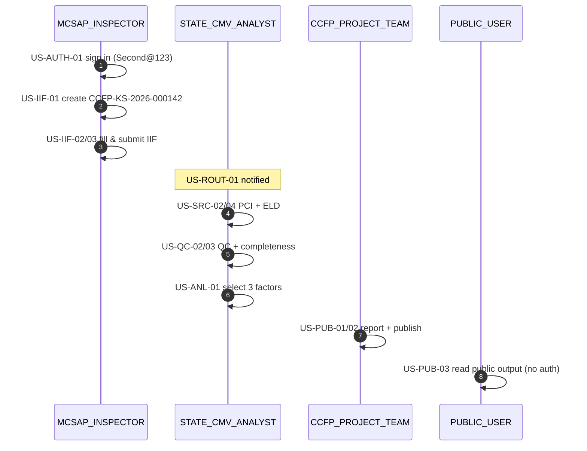

# 06 — User Stories & Acceptance Criteria

**Phase:** Discover · **Artifact family:** User Stories & AC

Every user story below is expressed in the **"As a / I want / So that"** form
with **Gherkin Given / When / Then** acceptance criteria that a QA engineer or
client reviewer can execute against the live demo
(<https://nexgile-dot-ccfp.nexgiletechnologies.com> for the React Frontend; the
FastAPI Backend is reached through the same host under `/api/v1`). Stories are
grounded in `Documentation/project_documentation.md` §8 (functional modules) and
§12 (API design), and seeded by the synthetic crash, carrier, and user fixtures
in `Backend/database/seeds/`.

Naming: `US-<family>-<n>`. The family prefix ties each story to a functional
module in §8 and to a phase of the §5 crash lifecycle, so a reviewer can trace
**story → endpoint → table → test** in three jumps.

!!! warning "Synthetic data only"
    Every crash record, motor carrier, driver, ELD file, and login referenced
    here is **100% synthetic**. The `@ccfp.gov` domain is fictitious and
    non-deliverable, and no real PII, CIPSEA interview content, or production
    crash data appears anywhere in this documentation set. All seeded accounts
    share the demo password `Second@123`.

!!! tip "Where to go next"
    Acceptance criteria reference tables
    ([Data Model](../02-analyze/08-data-model.md)), routes
    ([API Specification](../02-analyze/09-api-specification.md)), and
    permission gates ([RBAC Matrix](../02-analyze/10-rbac-matrix.md)). The
    narrative context for each story lives in the
    [Business Requirements](04-business-requirements.md) families it verifies.

!!! info "Story template"
    Each story below uses:

    - **As** — primary actor (one of the 12 roles in §4/§5 of
      `Documentation/project_documentation.md`); roles are written in
      monospace, e.g. `MCSAP_INSPECTOR`, `STATE_CMV_ANALYST`.
    - **I want** — the desired capability.
    - **So that** — the business value.
    - **Acceptance criteria** — Gherkin Given / When / Then using the synthetic
      demo logins below and a fictitious Kansas qualifying crash with CCFP
      identifier `CCFP-KS-2026-000142`.

## Demo actors (synthetic logins)

Sign in at <https://nexgile-dot-ccfp.nexgiletechnologies.com/login>. **All
seeded accounts share the password `Second@123`.** State-scoped users see only
their State's data.

-   :material-account-hard-hat: __Field & State (KS-scoped)__

    `MCSAP_INSPECTOR` — Nora Kowalczyk · `nora.kowalczyk@ccfp.gov`
    `STATE_CMV_ANALYST` — Elliot Fontaine · `elliot.fontaine@ccfp.gov`
    `STATE_USER` — Tomasz Bialek · `tomasz.bialek@ccfp.gov`

-   :material-account-tie: __CCFP Project (national)__

    `CCFP_PROJECT_TEAM` — Dana Whitfield · `dana.whitfield@ccfp.gov`
    `CCFP_PROJECT_ADMIN` — Avery Thornton · `avery.thornton@ccfp.gov`
    `CCFP_DB_ADMIN` — Victor De La Cruz · `victor.delacruz@ccfp.gov`
    `CCFP_DATA_SCIENTIST` — Priya Ramanathan · `priya.ramanathan@ccfp.gov`

-   :material-shield-lock: __CIPSEA & Federal__

    `BTS_CIPSEA_AGENT` — Helena Brandt · `helena.brandt@ccfp.gov`
    `FMCSA_CIPSEA_AGENT` — Marcus Ellingsworth · `marcus.ellingsworth@ccfp.gov`
    `FEDERAL_USER` — Omar Haddad · `omar.haddad@ccfp.gov`

-   :material-earth: __Public & System__

    `PUBLIC_USER` — Public Demo · `public.demo@ccfp.gov`
    `SYSTEM_ADMIN` — Morgan Castellano · `sysadmin@ccfp.gov`

!!! note "Scope-isolation fixtures"
    Additional State-scoped accounts (same shared password) verify that a Kansas
    user never sees a Texas or California crash: `rosa.menendez@ccfp.gov` (TX
    Inspector), `grant.holloway@ccfp.gov` (TX Analyst), `linh.tran@ccfp.gov` (CA
    Analyst). See [Demo Credentials](../reference/demo-credentials.md).

## Story map

The story map mirrors the §5 eight-phase crash lifecycle (Phase 0 Study Setup →
Phase 7 Publication & Data Sharing) plus the cross-cutting authentication,
administration, and audit backbones. Stories layer onto each phase and reuse the
same synthetic fixtures end-to-end, so a reviewer can walk from sign-in to a
published public output on one continuous crash record.

## Story estimation reference

For post-POC workstream planning, stories carry rough Fibonacci-scale
story-point estimates. POC-delivered stories are not re-estimated.

| Size | Effort |
|---|---|
| 1 | Trivial change; < 2 hours |
| 2 | One-session change; 2–4 hours |
| 3 | Typical ticket; a half-day |
| 5 | A full day with learning |
| 8 | 2–3 days with design |
| 13 | Multi-day; may warrant decomposition |
| 21 | A full week; should be decomposed |

## 1. US-AUTH — Authentication & user context

Implemented by `Backend/app/features/auth.py`. The dev mock-IdP issues a JWT
(bcrypt-verified) for seeded users; production swaps in the DOT-approved OIDC
IdP (MFA/PIV/CAC) when `CCFP_DEV_AUTH_ENABLED=false`.

### US-AUTH-01 — Sign in with credentials

**As** any seeded user (e.g. `nora.kowalczyk@ccfp.gov`, a `MCSAP_INSPECTOR`)
**I want** to authenticate with email and password
**So that** I reach a role-conditioned home screen scoped to my State.

**Acceptance criteria**

- **Given** I am on `/login` and the synthetic Inspector account exists
- **When** I `POST /api/v1/auth/login` with the demo password `Second@123`
- **Then** the response is `200` with a signed JWT carrying my user id and role
- **And** `GET /api/v1/auth/me` returns `role = "MCSAP_INSPECTOR"`,
  `state_scope = "KS"`, and my resolved permission keys
- **And** an `audit_logs` row with `action = "auth.login"` is written

### US-AUTH-02 — Resolve permissions and State scope

**As** `STATE_CMV_ANALYST` Elliot Fontaine (KS)
**I want** my effective permissions resolved on every request
**So that** the UI only shows actions I am allowed to perform.

**Acceptance criteria**

- **Given** I am signed in and my role grants `crash:read` and `data_mgmt:qc`
- **When** I `GET /api/v1/auth/me`
- **Then** the response lists my permission keys resolved via
  `user_role_assignments → roles → role_permissions`
- **And** `state_scope = "KS"`, so every subsequent crash query is filtered to
  Kansas
- **And** a permission I do not hold (e.g. `admin:users`) is absent from the list

### US-AUTH-03 — Sign out

**As** any signed-in user
**I want** to end my session
**So that** I can safely leave a shared roadside workstation.

**Acceptance criteria**

- **Given** I am authenticated
- **When** I `POST /api/v1/auth/logout`
- **Then** the response is `204` and my client token is discarded
- **And** an `audit_logs` row with `action = "auth.logout"` is written
- **And** a subsequent authenticated call with the discarded token returns `401`

## 2. US-STU — Study setup (Phase 0)

Implemented by `Backend/app/features/studies.py` (§8.1, §12.2).

### US-STU-01 — Define a study

**As** `CCFP_PROJECT_ADMIN` Avery Thornton
**I want** to create the Phase 1 Heavy-Duty Truck Study
**So that** vehicle type, severity, dates, and scope criteria are configured.

**Acceptance criteria**

- **Given** I hold `study:create`
- **When** I `POST /api/v1/studies` with `cmv_type = "heavy_duty_truck"`,
  `crash_type = "fatal"`, and start/end dates
- **Then** the response is `201` with a new `studies` row
- **And** the study defines the qualifying rule "≥1 fatality AND ≥1 Class 7/8
  truck (GVWR ≥ 26,001 lbs)"
- **And** an `audit_logs` row with `action = "study.create"` is written

### US-STU-02 — Add a participating State

**As** `CCFP_PROJECT_ADMIN`
**I want** to add Kansas to the study only after its data-sharing agreement
**So that** State onboarding is gated by compliance.

**Acceptance criteria**

- **Given** the study exists and Kansas has an executed data-sharing agreement
- **When** I `POST /api/v1/studies/{studyId}/states` with `state = "KS"`
- **Then** the response is `201` and a `study_states` row links KS to the study
- **And** crashes in a non-participating State are classified `out_of_scope`
- **And** without a recorded agreement the request is rejected `409`

### US-STU-03 — Configure required vs. optional attributes

**As** `CCFP_PROJECT_ADMIN`
**I want** to mark each canonical attribute required, optional, or read-only
**So that** completeness and QC rules can be evaluated per study.

**Acceptance criteria**

- **Given** the study has a data-attribute catalog
- **When** I `PATCH /api/v1/studies/{studyId}/attributes/{attributeId}` with
  `requirement = "required"`
- **Then** the response is `200` and the `attribute_requirements` row updates
- **And** the change is per-study only — it does not mutate other phases'
  catalogs
- **And** a completeness rule referencing that attribute is now enforceable

### US-STU-04 — Author a completeness rule

**As** `CCFP_PROJECT_ADMIN`
**I want** to declare which sections make a crash record complete
**So that** Phase 5 can compute a deterministic complete/incomplete status.

**Acceptance criteria**

- **Given** I hold `admin:completeness`
- **When** I `POST /api/v1/studies/{studyId}/completeness-rules` requiring a
  submitted Initial Incident Form plus a linked PCR
- **Then** the response is `201` with a new `completeness_rules` row
- **And** crashes missing either input evaluate to `incomplete`

## 3. US-IIF — Initial Incident Form (Phase 1)

Implemented by `Backend/app/features/initial_incident.py` (§8.2, §12.4).

### US-IIF-01 — Create the crash record and CCFP identifier

**As** `MCSAP_INSPECTOR` Nora Kowalczyk (KS)
**I want** to open a new crash shell at roadside
**So that** every downstream source value attaches to one stable identifier.

**Acceptance criteria**

- **Given** I responded to a fatal Class 7/8 crash in Kansas
- **When** I `POST /api/v1/crashes` with the crash date/time and location
- **Then** the response is `201` with a stable
  `ccfp_identifier = "CCFP-KS-2026-000142"`
- **And** the record is owned by State `KS` and is not visible to TX/CA users
- **And** an `audit_logs` row with `action = "crash.create"` is written

### US-IIF-02 — Complete the Initial Incident Form within 24–48 h

**As** `MCSAP_INSPECTOR`
**I want** to capture vehicles, drivers, non-motorists, and witnesses
**So that** the §8.2 incident snapshot is recorded promptly.

**Acceptance criteria**

- **Given** crash `CCFP-KS-2026-000142` exists with no IIF yet
- **When** I `PUT /api/v1/crashes/{crashId}/initial-incident` with the local
  crash report number, U.S. DOT number, vehicles, and a short event summary
- **Then** the response is `200` and `incident_vehicles` / `incident_persons`
  rows are written
- **And** PII fields (driver name, address, phone) are stored under a
  `data_sensitivity = "PII"` tag
- **And** the draft can be re-saved repeatedly while in `draft` status

### US-IIF-03 — Submit the form to trigger routing

**As** `MCSAP_INSPECTOR`
**I want** to submit the completed IIF
**So that** the system notifies the analyst and routes in-scope crashes to BTS.

**Acceptance criteria**

- **Given** the IIF passes DOT field validation
- **When** I `POST /api/v1/crashes/{crashId}/initial-incident/submit`
- **Then** the response is `200`, the form status becomes `submitted`
- **And** routing/notification side-effects fire (see US-ROUT-01/02)
- **And** if a required field is missing the response is `422` with the field path

### US-IIF-04 — Delete a form under business rules

**As** `MCSAP_INSPECTOR`
**I want** to delete an erroneous draft IIF
**So that** a mistaken roadside entry does not pollute the record.

**Acceptance criteria**

- **Given** the IIF is still in `draft` and not yet submitted
- **When** I `DELETE /api/v1/crashes/{crashId}/initial-incident`
- **Then** the response is `204` and the draft is removed
- **And** a `submitted` form instead returns `409` (delete not permitted)

## 4. US-ROUT — Notification & routing (Phase 2)

Implemented by `Backend/app/features/initial_incident.py` and
`Backend/app/core/notifications.py` (§5 Phase 2, §8.11).

### US-ROUT-01 — Notify the State analyst on submission

**As** `STATE_CMV_ANALYST` Elliot Fontaine (KS)
**I want** to be notified when an IIF is submitted in my State
**So that** I can begin coordinating source-data collection.

**Acceptance criteria**

- **Given** US-IIF-03 submitted crash `CCFP-KS-2026-000142`
- **When** I `GET /api/v1/notifications`
- **Then** a notification of type `initial_incident.submitted` for that crash
  appears
- **And** TX/CA analysts receive no notification for a Kansas crash

### US-ROUT-02 — Route in-scope crashes to BTS CIPSEA

**As** `BTS_CIPSEA_AGENT` Helena Brandt
**I want** in-scope qualifying crashes routed to me
**So that** the confidential interview workflow can begin under CIPSEA.

**Acceptance criteria**

- **Given** the crash is a qualifying, in-scope crash in a participating State
- **When** the IIF is submitted
- **Then** I receive an `in_scope.routed_to_bts` notification
- **And** access to the protected interview workspace requires the `bts:read`
  permission
- **And** an out-of-scope supplemental crash is routed **only** to the State
  analyst, not to BTS

### US-ROUT-03 — Classify crash scope

**As** `CCFP_PROJECT_TEAM` Dana Whitfield
**I want** the system to classify each crash as in-scope or out-of-scope
**So that** routing and downstream visibility follow §3 scope rules.

**Acceptance criteria**

- **Given** crash `CCFP-KS-2026-000142` has ≥1 fatality and ≥1 Class 7/8 truck
  in participating Kansas
- **When** I `GET /api/v1/crashes/{crashId}` (scope section)
- **Then** `crash_scope_classifications` reports `in_scope`
- **And** a heavy-duty serious-injury crash with advanced investigation data is
  classified `out_of_scope`

## 5. US-SRC — Source data collection (Phase 3)

Implemented by `Backend/app/features/source_data.py` (§8.3–§8.7, §12.5).

### US-SRC-01 — Link post-crash inspection data

**As** `MCSAP_INSPECTOR`
**I want** to attach SafeSpect inspection results to the crash
**So that** violations and defects are linked within 7 days of inspection.

**Acceptance criteria**

- **Given** crash `CCFP-KS-2026-000142` exists
- **When** I `POST /api/v1/crashes/{crashId}/post-crash-inspections` with the
  inspection payload
- **Then** the response is `201` and a `post_crash_inspections` row links to the
  crash
- **And** the linked source record retains provenance in `source_records`

### US-SRC-02 — Save the typed Post-Crash Investigation form

**As** `STATE_CMV_ANALYST`
**I want** to record the §19.2 investigation form sections
**So that** carrier, power unit, brakes, tires, and HOS are captured per field.

**Acceptance criteria**

- **Given** I am collecting investigation data on the Kansas crash
- **When** I `POST /api/v1/crashes/{crashId}/post-crash-investigations` with
  carrier/power-unit, brake-system, and per-seating-position belt/airbag data
- **Then** the response is `201` and the typed `pci_*` child tables are populated
- **And** each field honours its §19.2 required-vs-not-required flag
- **And** an ELD summary (provider, model, download status) is captured

### US-SRC-03 — Upload and code a reconstruction report

**As** `STATE_CMV_ANALYST`
**I want** to upload the 90–120 day reconstruction narrative and code findings
**So that** narrative findings map into structured research attributes.

**Acceptance criteria**

- **Given** the reconstruction report arrives as a document
- **When** I `POST /api/v1/crashes/{crashId}/reconstruction-reports` with the
  file and coded findings
- **Then** the response is `201`, the document is malware-scanned, and a
  `reconstruction_reports` row links to the crash
- **And** coded findings become mappable source values with provenance

### US-SRC-04 — Upload an ELD file linked by CCFP code

**As** `MCSAP_INSPECTOR`
**I want** to upload the ELD CSV captured at roadside
**So that** hours-of-service events attach to the correct crash record.

**Acceptance criteria**

- **Given** the ELD output file carries the Output File Comment
  `CCFP-State-Post-Crash-Inspection-Code`
- **When** I `POST /api/v1/crashes/{crashId}/eld-files` with the CSV
- **Then** the response is `201`, a background worker parses it, and
  `GET /api/v1/crashes/{crashId}/eld-events` lists the extracted HOS events
- **And** the file links to `CCFP-KS-2026-000142` via the embedded CCFP code

### US-SRC-05 — Map State PCR fields to CCFP attributes

**As** `CCFP_DB_ADMIN` Victor De La Cruz
**I want** to map Kansas PCR fields onto the canonical CCFP attribute model
**So that** MMUCC-aligned source data aggregates into one crash record.

**Acceptance criteria**

- **Given** a Kansas PCR is linked to the crash
- **When** I `POST /api/v1/crashes/{crashId}/police-crash-reports` and define
  `pcr_field_mapping` rows
- **Then** the response is `201` and mapped values land in
  `crash_attribute_values` with `source_*` provenance
- **And** per-State coverage in `state_pcr_coverage` updates (collected vs.
  required), correctable via the State feedback loop

## 6. US-QC — Mapping, QC & completeness (Phases 4–5)

Implemented by `Backend/app/features/data_management.py` and the workers in
`Backend/app/workers/` (§8.8, §12.3).

### US-QC-01 — View raw and aggregated data side by side

**As** `CCFP_DB_ADMIN`
**I want** to view raw source values and the aggregated canonical attribute
**So that** I can trace every value back to its origin.

**Acceptance criteria**

- **Given** the crash has values from PCR, inspection, and ELD sources
- **When** I `GET /api/v1/crashes/{crashId}/attributes`
- **Then** the response shows one current canonical value per
  `(crash, attribute)`
- **And** `GET /api/v1/crashes/{crashId}/sources` lists each contributing
  `source_records` row with its origin system

### US-QC-02 — Run quality-control rules

**As** `STATE_CMV_ANALYST`
**I want** configurable QC rules evaluated on the record
**So that** format errors and missing required data are flagged.

**Acceptance criteria**

- **Given** active `data_quality_rules` for the study
- **When** I `GET /api/v1/crashes/{crashId}/quality` (or trigger an evaluate run)
- **Then** the response lists `data_quality_results` with pass/fail per rule
- **And** a failing required attribute raises a `qc.failed` notification

### US-QC-03 — Determine completeness

**As** `STATE_CMV_ANALYST`
**I want** the system to compute complete vs. incomplete status
**So that** only complete records advance to analysis.

**Acceptance criteria**

- **Given** the study's completeness rules require a submitted IIF and a linked
  PCR
- **When** I `GET /api/v1/crashes/{crashId}/completeness`
- **Then** the response reports a single `crash_completeness_status` of
  `complete` or `incomplete`
- **And** a crash missing its IIF is flagged and surfaces in the missing-IIF
  notification

### US-QC-04 — Unlock and edit a completed record

**As** `CCFP_DB_ADMIN`
**I want** to unlock a completed record for an authorized correction
**So that** late-arriving evidence can be incorporated under audit.

**Acceptance criteria**

- **Given** crash `CCFP-KS-2026-000142` is `complete` and locked
- **And** I hold `crash:unlock`
- **When** I `POST /api/v1/crashes/{crashId}/unlock`
- **Then** the response is `200` and the record becomes editable
- **And** every edit records the user and timestamp, and an `audit_logs` row
  with `action = "crash.unlock"` is written
- **And** a user without `crash:unlock` receives `403`

## 7. US-ANL — Analysis & contributing factors (Phase 6)

Implemented by `Backend/app/features/data_management.py`,
`Backend/app/features/analytics.py`, and `Backend/app/features/search.py`
(§8.6, §8.9, §8.10, §12.6).

### US-ANL-01 — Select the top three contributing factors

**As** `STATE_CMV_ANALYST`
**I want** to choose the primary contributing factors from PCR-derived groups
**So that** causal analysis is grounded in the §8.6 BRD prompt.

**Acceptance criteria**

- **Given** the contributing-factor groups (roadway/vehicle/non-motorist
  circumstances; driver actions; driver conditions; distraction; non-motorist
  actions) are loaded from `ref_contributing_factor_groups`
- **When** I `POST` a selection of up to three values for the crash
- **Then** the response is `201` and `contributing_factor_selections` records
  my choices with rank
- **And** attempting a fourth selection is rejected with a validation error

### US-ANL-02 — Build a dashboard and run a whitelisted query

**As** `CCFP_DATA_SCIENTIST` Priya Ramanathan
**I want** to run an approved parameterized analytics query
**So that** I can study causal factors without ad-hoc SQL risk.

**Acceptance criteria**

- **Given** I hold `analytics:query`
- **When** I `POST /api/v1/analytics/queries` with a whitelisted query id and
  parameters
- **Then** the response is `200` with aggregated, de-identified results
- **And** a non-whitelisted query string is rejected `400`

### US-ANL-03 — Search across crashes within scope

**As** `STATE_USER` Tomasz Bialek (KS)
**I want** to search CCFP content
**So that** I can find non-PII records relevant to my State work.

**Acceptance criteria**

- **Given** I search for a carrier name via `GET /api/v1/search`
- **When** the query matches Kansas crashes and crashes in other States
- **Then** only Kansas results are returned (scope-filtered)
- **And** PII fields are masked because I lack a data-entry/QC permission

### US-ANL-04 — CIPSEA-protected interview access

**As** `FMCSA_CIPSEA_AGENT` Marcus Ellingsworth
**I want** to view protected BTS interview data where permitted
**So that** I can incorporate confidential findings under CIPSEA controls.

**Acceptance criteria**

- **Given** I hold `bts:read`
- **When** I request BTS-shared data on the crash
- **Then** the response includes the permitted CIPSEA-protected fields
- **And** an analyst **without** `bts:read` receives `403` for the same request
- **And** the access is recorded in `audit_logs`

## 8. US-PUB — Reporting & publication (Phase 7)

Implemented by `Backend/app/features/reports.py` and
`Backend/app/features/public.py` (§8.9, §12.6, §3/§7/§14).

### US-PUB-01 — Create and share a report

**As** `CCFP_PROJECT_TEAM` Dana Whitfield
**I want** to create a report and share it with a federal user
**So that** approved outputs reach authorized audiences.

**Acceptance criteria**

- **Given** I hold `report:create`
- **When** I `POST /api/v1/reports` then
  `POST /api/v1/reports/{reportId}/share` targeting Omar Haddad
- **Then** both responses are `2xx` and a `report_shares` row links the report
  to the `FEDERAL_USER`
- **And** the recipient receives a `report.shared` notification

### US-PUB-02 — Publish a de-identified public output

**As** `CCFP_PROJECT_TEAM`
**I want** to publish a summarized, de-identified output after study release
**So that** public users can consume it without exposing PII or CIPSEA data.

**Acceptance criteria**

- **Given** the study is released and the report passes de-identification
- **When** I publish it for `PUBLIC` audience
- **Then** the published output is separated from operational records
- **And** it contains no PII, CIPSEA, or stable internal identifiers

### US-PUB-03 — Consume public data without authentication

**As** `PUBLIC_USER` (or any anonymous visitor)
**I want** to read published outputs
**So that** I can use de-identified crash summaries freely.

**Acceptance criteria**

- **Given** an output has been published for the study
- **When** I `GET /api/v1/public/studies/{studyId}/outputs` with **no** auth token
- **Then** the response is `200` with only de-identified summary data
- **And** any attempt to read an operational crash endpoint without auth is `401`

### US-PUB-04 — Federal access to role-appropriate tables

**As** `FEDERAL_USER` Omar Haddad
**I want** access to reports and tables at my approved level
**So that** FMCSA/NHTSA/BTS analysis can proceed.

**Acceptance criteria**

- **Given** a report was shared with me (US-PUB-01)
- **When** I `GET /api/v1/reports` and `GET` the shared report
- **Then** I see the report and may download it where `report:download` allows
- **And** I do not see operational State PII outside my approved access level

## 9. US-ADM — Administration & onboarding

Implemented by `Backend/app/features/admin.py` (§4, §8.1).

### US-ADM-01 — Create a user and assign a role

**As** `CCFP_PROJECT_ADMIN` Avery Thornton
**I want** to create a State analyst account and assign its role
**So that** a new State staffer can begin work scoped to their State.

**Acceptance criteria**

- **Given** I hold `admin:users` and `admin:roles`
- **When** I `POST` a new user and a `user_role_assignments` row for
  `STATE_CMV_ANALYST` scoped to `TX`
- **Then** the responses are `2xx` and the user resolves Texas-only scope at
  sign-in
- **And** an `audit_logs` row with `action = "admin.user.create"` is written

### US-ADM-02 — Manage roles and permission grants

**As** `CCFP_PROJECT_ADMIN`
**I want** to review which permission keys a role grants
**So that** least-privilege is verifiable.

**Acceptance criteria**

- **Given** I `GET` the role-permission mapping
- **When** I inspect the `STATE_USER` role
- **Then** it grants read/search permissions but **not** `crash:unlock`,
  `bts:read`, or `admin:*`
- **And** adding a sensitive permission to a role writes an audit entry

### US-ADM-03 — System configuration & environments

**As** `SYSTEM_ADMIN` Morgan Castellano
**I want** to manage system configuration and environments
**So that** the platform stays operable and auditable.

**Acceptance criteria**

- **Given** I hold `admin:system`
- **When** I read system status and configuration
- **Then** I can view environment health without seeing State PII
- **And** the DB connection is supplied via the `DATABASE_URL` environment
  variable / secrets manager (its value is never exposed in any API response)

## 10. US-AUD — Audit & notifications

Implemented by `Backend/app/features/audit.py` and
`Backend/app/features/notifications.py` (§10, §8.11, §14).

### US-AUD-01 — Query the immutable audit log

**As** `SYSTEM_ADMIN` (or `CCFP_PROJECT_ADMIN`)
**I want** to filter the audit log by user, action, and date range
**So that** I can answer compliance and Privacy Act questions.

**Acceptance criteria**

- **Given** I hold `audit:read`
- **When** I `GET /api/v1/audit?action=crash.unlock&since=2026-01-01`
- **Then** the response is `200` with matching rows (paginated), each carrying
  `actor_id`, `action`, `resource`, and `timestamp`
- **And** denied requests appear with their denial result
- **And** audit rows are immutable — no API mutates or deletes them

### US-AUD-02 — Lifecycle notifications

**As** any role with `notification:read`
**I want** to list and mark my notifications read
**So that** I stay current on crashes and reports I am responsible for.

**Acceptance criteria**

- **Given** lifecycle events (IIF submitted, QC failed, report shared) fired
- **When** I `GET /api/v1/notifications` then mark one read
- **Then** the response reflects the read state
- **And** I never see a notification for a crash outside my State scope

## Role coverage matrix

Every one of the 12 roles is the primary actor of at least one story, and each
of the 8 lifecycle phases has at least one story.

| Role | Representative stories | Lifecycle phases |
|---|---|---|
| `MCSAP_INSPECTOR` | US-IIF-01..04, US-SRC-01, US-SRC-04 | 1, 3 |
| `STATE_CMV_ANALYST` | US-ROUT-01, US-SRC-02/03, US-QC-02/03, US-ANL-01 | 2–6 |
| `STATE_USER` | US-ANL-03, US-AUD-02 | 6 |
| `CCFP_PROJECT_TEAM` | US-ROUT-03, US-PUB-01/02 | 2, 7 |
| `CCFP_PROJECT_ADMIN` | US-STU-01..04, US-ADM-01/02 | 0, admin |
| `CCFP_DB_ADMIN` | US-SRC-05, US-QC-01/04 | 3–5 |
| `CCFP_DATA_SCIENTIST` | US-ANL-02 | 6 |
| `BTS_CIPSEA_AGENT` | US-ROUT-02 | 2 |
| `FMCSA_CIPSEA_AGENT` | US-ANL-04 | 6 |
| `FEDERAL_USER` | US-PUB-01, US-PUB-04 | 7 |
| `PUBLIC_USER` | US-PUB-03 | 7 |
| `SYSTEM_ADMIN` | US-ADM-03, US-AUD-01 | admin |

## Acceptance smoke flow

For demo dress-rehearsal purposes, a concise end-to-end smoke walks the
green-path lifecycle on one synthetic Kansas crash in roughly 12 minutes.

1. **US-AUTH-01** — sign in as `nora.kowalczyk@ccfp.gov`.
2. **US-IIF-01..03** — create crash `CCFP-KS-2026-000142`, fill, and submit IIF.
3. **US-ROUT-01/02** — confirm analyst + (in-scope) BTS routing.
4. **US-SRC-02/04** — save the PCI form and upload an ELD file.
5. **US-SRC-05** — map a Kansas PCR into canonical attributes.
6. **US-QC-02/03** — run QC and confirm `complete`.
7. **US-ANL-01** — select the top three contributing factors.
8. **US-PUB-01/02** — create, share, and publish a de-identified output.
9. **US-PUB-03** — read it as the public, with no authentication.
10. **US-AUD-01** — pull the resulting immutable audit slice.

!!! danger "If a step fails"
    The demo aborts and the team re-applies the last-known-good synthetic seed
    (`Backend/database/seeds/`) before the next rehearsal — never a production
    or real-PII dataset.

## Related documents

- [04 — Business Requirements & Success Metrics](04-business-requirements.md) — the requirement families these stories verify
- [03 — Stakeholders & Personas](03-stakeholders-personas.md) — the "As a" actors behind each story
- [01 — Scope Statement](01-scope-statement.md) — qualifying / in-scope / out-of-scope rules referenced in scenarios
- [07 — Workflow & Process](../02-analyze/07-workflow-process.md) — the lifecycle the story map mirrors
- [08 — Data Model](../02-analyze/08-data-model.md) — tables referenced in acceptance criteria
- [09 — API Specification](../02-analyze/09-api-specification.md) — endpoints referenced in scenarios
- [10 — RBAC Matrix](../02-analyze/10-rbac-matrix.md) — permission gates referenced in scenarios
- [13 — Solution Design](../03-design/13-solution-design.md) — the workflow engine behind these stories
- [Demo Credentials](../reference/demo-credentials.md) — the full synthetic login table
- [Quickstart](../quickstart.md) — sign in and run the smoke flow yourself

*End of 06 — User Stories & Acceptance Criteria.*
