# 07 — Workflow / Process Diagrams

**Phase:** Analyze · **Artifact family:** Data & Process

**Document owner:** CCFP Delivery team ·
**Status:** Final for v1.0 build ·
**Parent spec:** `Documentation/project_documentation.md` ·
**Version:** 1.0

Every core process in the **Crash Causal Factors Program (CCFP)** IT Solution is
captured below as a Mermaid flowchart, swimlane, state, or sequence diagram. Each
diagram is anchored in code and names the models, feature routers, and in-process
workers that implement it. The platform collects, integrates, manages, analyzes,
and shares data about commercial-motor-vehicle crashes; **Phase 1 — the Heavy-Duty
Truck Study** — targets fatal crashes involving Class 7/8 trucks
(GVWR ≥ 26,001 lbs), and the workflows below stay configurable for future phases
(medium-duty, buses, serious-injury, more States) without a rebuild.

Reading tip: diagrams are browser-rendered — you can click, scroll, and zoom them.
The federal navy theme in `docs/assets/extra.css` keeps every diagram inline for
print.

!!! warning "Synthetic data only"
    Every identifier, name, carrier, and crash referenced on this page is **100%
    synthetic** — generated for demo, test, and documentation use. The seed domain
    `@ccfp.gov` is fictitious and non-deliverable. No real PII, CIPSEA interview
    content, or production crash data appears anywhere in these workflows. Sign in
    to the live demo at
    <https://nexgile-dot-ccfp.nexgiletechnologies.com/login> with any seeded
    account (shared password `Second@123`).

!!! tip "Where to go next"
    Each process here has a corresponding **table view** in
    [08 — Data Model](08-data-model.md), a **route view** in
    [09 — API Specification](09-api-specification.md), a **role view** in
    [10 — RBAC Matrix](10-rbac-matrix.md), and a **sequence/component view** in
    [11 — Architecture & Sequence](../03-design/11-architecture-sequence.md) and
    [12 — Component Diagram](../03-design/12-component-diagram.md).

<div class="grid cards" markdown>

-   :material-state-machine: **One lifecycle, eight phases**

    The program lifecycle spans **eight phases (Phase 0 Study Setup → Phase 7
    Publication)**; per-crash records move forward-only through the seven
    `CrashLifecyclePhase` values (Study Setup is study-level config, not a crash
    state), driven by `app/features/crashes.py::advance_phase`.

-   :material-clipboard-check: **One Initial Incident Form per crash**

    Created within 24–48 h, DOT-validated against SafeSpect, then routed by scope
    (`initial_incident.py::submit_iif`).

-   :material-source-branch: **Provenance preserved end-to-end**

    Every source value links to a `source_records` row and a
    `crash_attribute_values` lineage pointer (`DATA-5`, §11.3).

-   :material-shield-lock: **De-identified publication**

    Operational records stay separate from public outputs served by
    `/api/v1/public/...` with no authentication (§8.9, §5 Phase 7).

</div>

## 1. End-to-end crash record lifecycle pipeline

The outermost flow: a qualifying crash travels through the **eight-phase program
lifecycle (Phase 0 Study Setup → Phase 7 Publication)** from the MCSAP CMV
Inspector's first Initial Incident Form through to a de-identified public output.
Each per-crash phase corresponds to a value of the `CrashLifecyclePhase` enum
(seven values — Study Setup is study-level config, not a crash state), and the
declaration order of that enum **is** the lifecycle order — so a future phase
inserted into the enum stays in sync without a second source of truth
(`PHASE_ORDER` in `crashes.py`).

```mermaid
flowchart LR
    subgraph P0["Phase 0 — Study Setup"]
      P0A[Define study parameters]:::p0
      P0B["Participating States,<br/>qualifying rule, attributes"]:::p0
    end

    subgraph P1["Phase 1 — Initial Incident"]
      P1A["INITIAL_INCIDENT<br/>CCFP identifier minted"]:::p1
      P1B[IIF drafted within 24–48 h]:::p1
    end

    subgraph P2["Phase 2 — Notification & Routing"]
      P2A["NOTIFICATION<br/>scope-driven fan-out"]:::p2
    end

    subgraph P3["Phase 3 — Source Data Collection"]
      P3A["DATA_COLLECTION<br/>inspections / PCR / ELD /<br/>investigation / reconstruction"]:::p3
    end

    subgraph P4["Phase 4 — Mapping & Aggregation"]
      P4A["DATA_MAPPING<br/>source → canonical attributes"]:::p4
    end

    subgraph P5["Phase 5 — QC & Completeness"]
      P5A["QUALITY_CONTROL<br/>rules + completeness + lock"]:::p5
    end

    subgraph P6["Phase 6 — Analysis & Reporting"]
      P6A["ANALYSIS<br/>top-3 contributing factors"]:::p6
    end

    subgraph P7["Phase 7 — Publication"]
      P7A["PUBLICATION<br/>de-identified public output"]:::p7
    end

    P0A --> P0B --> P1A --> P1B --> P2A --> P3A --> P4A --> P5A --> P6A --> P7A

    classDef p0 fill:#E8EEF7,stroke:#205493;
    classDef p1 fill:#D8EFDB,stroke:#2E8540;
    classDef p2 fill:#FFF1D2,stroke:#B8860B;
    classDef p3 fill:#F7E1E0,stroke:#B50909;
    classDef p4 fill:#E8E1F7,stroke:#5C2D91;
    classDef p5 fill:#FCE5CD,stroke:#B45F06;
    classDef p6 fill:#D0E0E3,stroke:#0B5394;
    classDef p7 fill:#D9D2E9,stroke:#674EA7;
```

**Anchor references**

- Phase definitions: `Documentation/project_documentation.md` §5.
- Phase ordering: `Backend/app/features/crashes.py::PHASE_ORDER` (derived from `CrashLifecyclePhase`).
- Enum source: `Backend/app/enums.py::CrashLifecyclePhase`.
- Forward-only advance: `crashes.py::advance_phase`.

## 2. Crash record state machine — master diagram

The seven-state per-crash machine (the `CrashLifecyclePhase` enum, which begins at
`INITIAL_INCIDENT` — Phase 0 Study Setup is study-level config, not a crash state)
is the heart of the platform. A crash is **created** in
`INITIAL_INCIDENT`; every later transition is **forward-only** — `advance_phase`
rejects a backward or no-op target so the terminal `PUBLICATION` move (and any
manual correction) is ordering-checked and audited. Transitions fire from explicit
actions (IIF submit) or from automatic side effects (QC / completeness
evaluation), never from a free-form edit.

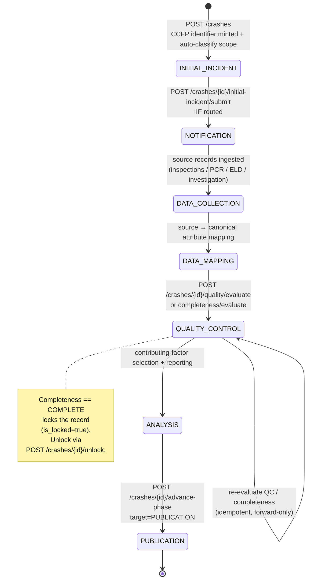

!!! note "Forward-only, not a free graph"
    `advance_phase` compares `PHASE_ORDER[target] <= PHASE_ORDER[current]` and
    returns a no-op (no audit row) when the move would not advance. A manual
    `PATCH /crashes/{id}` that sets `lifecycle_phase` routes through the same guard,
    so the API can never regress or skip a phase out of order (`CRAS-4`).

**Anchor references**

- Transition guard: `Backend/app/features/crashes.py::advance_phase`.
- Create entry state: `crashes.py::create_crash` (sets `INITIAL_INCIDENT`).
- Submit transition to `NOTIFICATION`: `Backend/app/features/initial_incident.py::submit_iif`.
- QC / completeness auto-advance to `QUALITY_CONTROL`: `crashes.py::run_quality`, `crashes.py::run_completeness`.
- Terminal `PUBLICATION` move: `crashes.py::advance_crash_phase`.

## 3. Crash creation → CCFP identifier → auto scope classification

A crash row is created by an MCSAP CMV Inspector or State-designated user. The
system mints a **stable, study-configurable CCFP identifier** from a database
sequence (race-safe `nextval`), then **auto-classifies scope** from the study's
configured `qualifying_rule` and participating-State membership — nothing is
hardcoded to Phase 1.

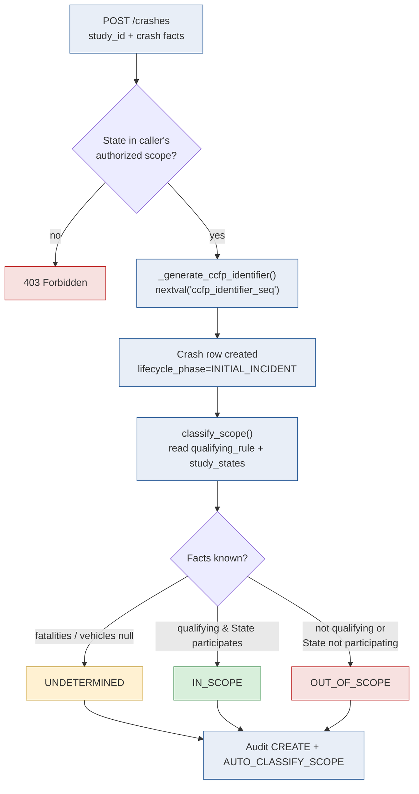

At create time no vehicles exist yet, so a fresh crash usually resolves
`UNDETERMINED` — or `OUT_OF_SCOPE` when the State plainly does not participate.
`POST /crashes/{id}/scope/reclassify` promotes it once fatality counts and incident
vehicles are entered.

**Anchor references**

- Identifier scheme (configurable, default `CCFP-{year}-{state}-{seq:06d}`): `crashes.py::_generate_ccfp_identifier`.
- Scope derivation: `crashes.py::classify_scope` (reads `study_parameters.qualifying_rule`, `study_states`).
- State-scope guard: `crashes.py::create_crash` (`current.can_access_state`).
- Reclassify on new facts: `crashes.py::reclassify_scope`.

## 4. Initial Incident Form — draft, submit, DOT validation (swimlane)

Phase 1 walks the inspector through the Initial Incident Form (IIF): they add
incident vehicles and persons, save a draft, then submit. On submit the system
validates U.S. DOT numbers for CMV vehicles via the **SafeSpect** mock adapter,
routes the form, and advances the crash to `NOTIFICATION`.

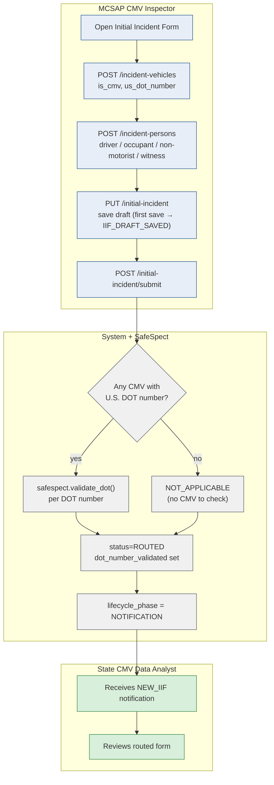

!!! abstract "Tri-state DOT outcome"
    DOT validation is **tri-state**: `VALIDATED`, `FAILED`, or `NOT_APPLICABLE`. A
    non-CMV crash has no U.S. DOT numbers to check, so its outcome is
    `NOT_APPLICABLE` (encoded by the `dot_validation_source` sentinel
    `"N/A — no CMV"`) — distinct from a genuine SafeSpect rejection (`FAILED`). The
    boolean `dot_number_validated` stays `False` for both N/A and FAILED; the API
    derives the tri-state value in `_dot_validation_status`.

**Anchor references**

- Draft save (first-save heads-up): `initial_incident.py::save_iif` (`IIF_DRAFT_SAVED`).
- Submit + DOT validation: `initial_incident.py::submit_iif`.
- SafeSpect adapter: `Backend/app/integrations/safespect.py::validate_dot` (mock).
- Tri-state derivation: `initial_incident.py::_dot_validation_status`.
- Background QC kickoff on submit: `initial_incident.py::submit_iif` (`background.add_task(evaluate_quality, ...)`).

## 5. Notification & routing — scope-driven fan-out (Phase 2)

On submit the IIF is finalized and **routed by scope** (§5 Phase 2). The State CMV
Data Analyst is always notified (`NEW_IIF`). Then one of three branches runs:
in-scope crashes route to BTS CIPSEA Agents for the confidential interview;
out-of-scope or supplemental crashes route to the CCFP Project Team as retained,
non-qualifying records; undetermined crashes receive no CIPSEA-style routing.

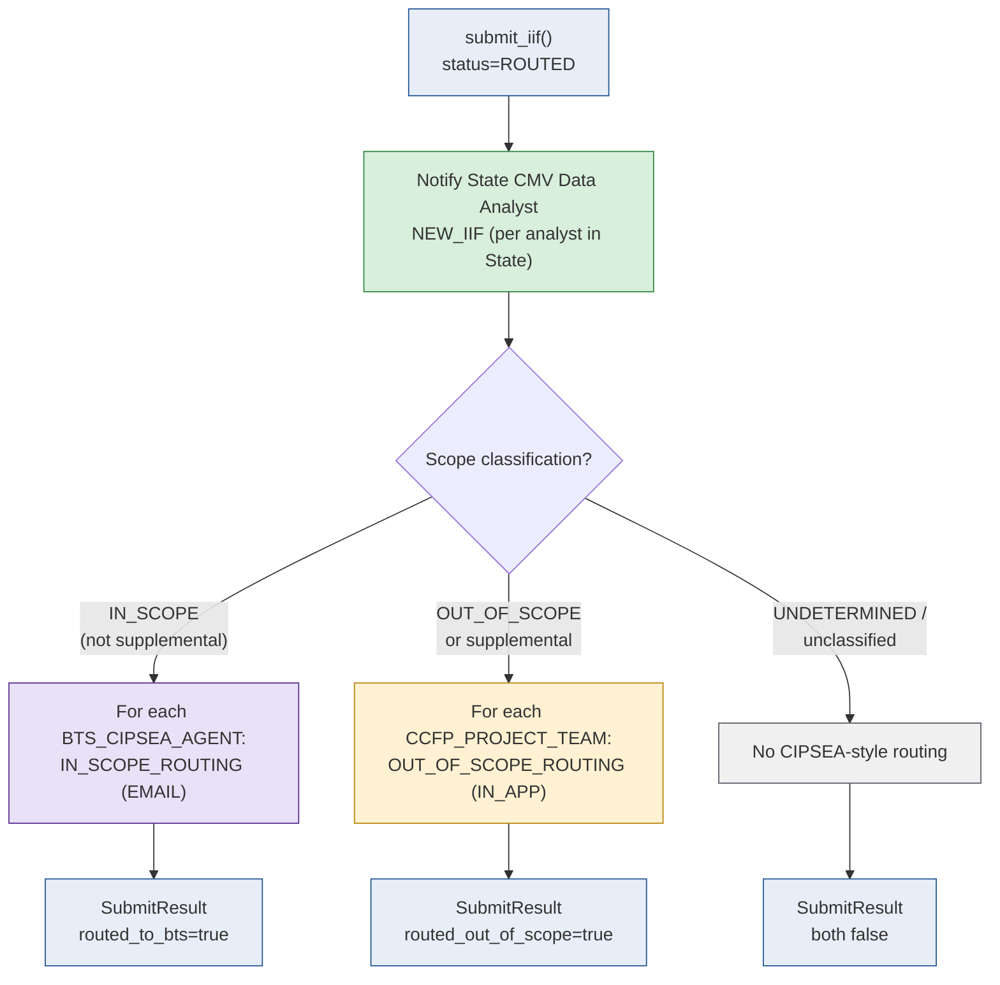

A later scope change re-runs routing: when a crash transitions **into** `IN_SCOPE`
and already has a submitted/routed IIF, `_emit_scope_routing` re-fires BTS routing
(`NOTI-7`); the transition guard keeps repeat `set_scope` calls idempotent.

**Anchor references**

- Submit-time routing branches: `initial_incident.py::submit_iif` (`routed_to_bts`, `routed_out_of_scope`).
- Scope-change re-routing: `crashes.py::_emit_scope_routing` (`NOTI-1`, `NOTI-7`).
- Notification helper: `Backend/app/core/notifications.py::create_notification`, `users_with_role`.
- Notification vocabulary: `Backend/app/enums.py::NotificationType`.

## 6. Notification & routing — sequence view

The same Phase 2 fan-out, viewed as a sequence so each participant and the
in-process side effects are explicit. Notifications are persisted rows
(`notifications` table); the `EMAIL` channel is recorded on the row and dispatched
by the production mail provider (mock in the demo).

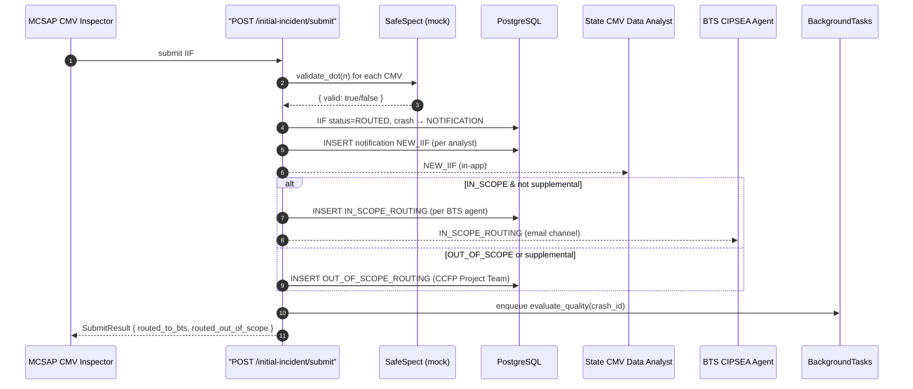

**Anchor references**

- Sequence body: `initial_incident.py::submit_iif`.
- CIPSEA access governed by `bts:read`: `Backend/app/core/permissions.py`.
- Async QC runs in-process via FastAPI `BackgroundTasks` (production: Celery/Redis).

## 7. Source-data collection swimlane (Phase 3)

Phase 3 receives or captures the source artifacts that flesh out a crash record.
Each source writes a `source_records` row carrying provenance, so analysts can
later trace every canonical value back to its origin. Data arrives by automated
integration, file upload, direct State connection, API submission, or manual entry.

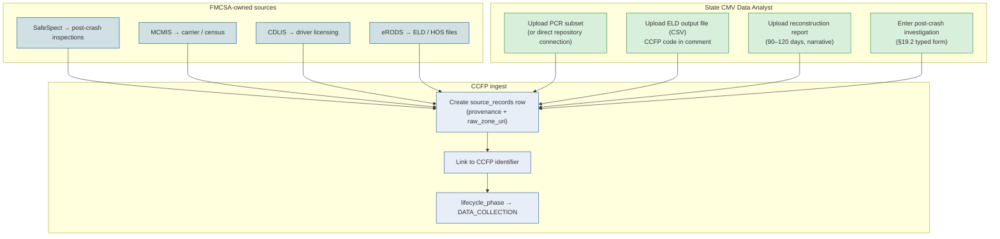

**Anchor references**

- Source-data router (inspections / investigations / PCR / reconstruction / ELD): `Backend/app/features/source_data.py`.
- Source-record provenance: `Backend/app/models.py::SourceRecord`; read via `crashes.py::get_sources`.
- Integration adapters (mock, feature-flagged `CCFP_INTEGRATION_*_LIVE`): `Backend/app/integrations/` (SafeSpect, CDLIS, MCMIS, eRODS).
- Module specs: `Documentation/project_documentation.md` §8.3–§8.7.

## 8. ELD output-file upload & parse

An ELD output file (CSV) is uploaded, scanned, and parsed by the in-process worker
`parse_eld_file`. The file links to its crash via a **CCFP code in the output-file
comment** (`RECO-2`). Header and duty-code mappings are resolved per study/provider
from PostgreSQL config, falling back to seeded global defaults — so a new provider's
differing CSV is handled as **data, not a code change** (`RECO-5`).

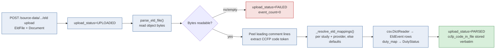

The stored `ccfp_code_in_file` is the value found **in the file** (or `None` when
the file carried none) — so the downstream `DQ_ELD_LINKED` check compares a real
parsed value to the crash identifier rather than asserting a tautology.

**Anchor references**

- Parser: `Backend/app/workers/tasks.py::parse_eld_file`.
- Per-study/provider mapping resolution: `tasks.py::_resolve_eld_mappings` (falls back to `_DEFAULT_FIELD_ALIASES`, `_DUTY_MAP`).
- CCFP-code extraction: `tasks.py::_extract_ccfp_code`, `_CCFP_CODE_RE`.
- Upload statuses: `Backend/app/enums.py::EldUploadStatus`, `DutyStatus`.

## 9. Data mapping & aggregation (Phase 4)

Phase 4 maps State-specific and external source attributes to **canonical CCFP
attributes**, links all source records to the CCFP identifier, and builds the
aggregated crash record while preserving provenance. Canonical values are
**append-only**: setting a value flips the prior current row to `is_current=False`
and inserts a new current row, so the full edit history survives for the
per-attribute timeline.

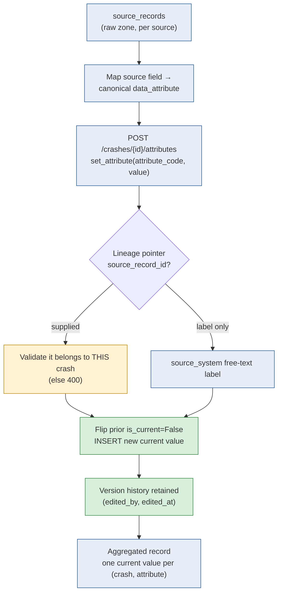

!!! note "One current value, full lineage"
    A partial unique index enforces exactly **one current canonical value per
    `(crash, attribute)`**. Each value can carry a precise `source_record_id`
    lineage pointer (validated to belong to the same crash, `DATA-5`) in addition
    to the human-readable `source_system` label, so a reviewer can always trace a
    value to its origin (§11.3).

**Anchor references**

- Set / supersede attribute: `crashes.py::set_attribute` (append-only).
- Per-attribute version history: `crashes.py::get_attribute_history` (`DATA-6`).
- Aggregated read with PII redaction: `crashes.py::get_attributes` (`can_view_sensitivity`).
- Lineage validation: `crashes.py::set_attribute` (rejects cross-crash `source_record_id`).

## 10. Quality-control rule evaluation (Phase 5)

QC is **definition-driven**: each active `data_quality_rules` row carries a JSON
`definition` the evaluator interprets (a small explicit vocabulary — `pattern`,
`source`, `min_fatalities`, `required_count`, named `check` keys), falling back to a
legacy code-keyed switch for the seeded built-ins. Every rule yields `PASS`,
`FAIL`, `WARNING`, or `NOT_EVALUATED`; a single misconfigured rule cannot abort the
run.

```mermaid
flowchart TD
    TRIG["evaluate_quality(crash_id)<br/>(submit IIF / POST quality/evaluate)"]:::s --> LOAD["Load crash facts:<br/>IIF, vehicles, factors, attrs, ELD link"]:::s
    LOAD --> CLEAR["Delete prior data_quality_results"]:::s
    CLEAR --> LOOP["For each active rule"]:::s
    LOOP --> DISP{dispatch_definition()<br/>recognised key?}
    DISP -- yes --> RUN["Run definition check"]:::s
    DISP -- "null/unknown" --> CODE["Fallback: code-keyed check()"]:::s
    RUN --> RES["INSERT data_quality_result<br/>(status, message)"]:::s
    CODE --> RES
    RES --> SUM["Summary { PASS, FAIL, WARNING, NOT_EVALUATED }"]:::s
    SUM --> NOTI{Any FAIL?}
    NOTI -- yes --> N1["QC_FAILURE → State CMV Data Analyst<br/>(lists failing rule codes)"]:::r
    NOTI -- "missing required attrs" --> N2["MISSING_DATA → State CMV Data Analyst"]:::y
    NOTI -- no --> OK["No failure notification"]:::g

    classDef s fill:#E8EEF7,stroke:#205493;
    classDef g fill:#D8EFDB,stroke:#2E8540;
    classDef y fill:#FFF1D2,stroke:#B8860B;
    classDef r fill:#F7E1E0,stroke:#B50909;
```

The seeded built-in rules:

| Rule code | Check | Typical outcome |
|---|---|---|
| `DQ_MISSING_IIF` | Submitted/routed Initial Incident Form present | `FAIL` if absent |
| `DQ_DOT_FORMAT` | CMV U.S. DOT values match the format regex | `FAIL` on bad format |
| `DQ_DOT_SAFESPECT` | U.S. DOT validated via SafeSpect | `FAIL` if not validated |
| `DQ_CDLIS_CHECK` | Drivers verified via CDLIS adapter | `WARNING` on unverified |
| `DQ_MISSING_REQUIRED_ATTR` | All required canonical attributes present | `FAIL` if any missing |
| `DQ_FATALITY_COUNT` | Fatality count ≥ minimum | `FAIL` below threshold |
| `DQ_ELD_LINKED` | ELD file's parsed CCFP code matches the crash | `WARNING` if unlinked |
| `DQ_TOP_FACTORS` | Three contributing factors selected | `WARNING` until selected |

**Anchor references**

- Evaluator: `Backend/app/workers/tasks.py::evaluate_quality`.
- Definition dispatch: `tasks.py::dispatch_definition` (`DATA-2`); fallback `tasks.py::check`.
- Result read: `crashes.py::get_quality`; trigger: `crashes.py::run_quality`.
- QC-failure / missing-data notifications: `tasks.py::evaluate_quality` (`QC_FAILURE`, `MISSING_DATA`).

## 11. Completeness evaluation & record lock (Phase 5)

Completeness is **data-driven** too: a study's `completeness_rules` carry a
`definition` of the shape `{"requires": ["<token>", ...], "params": {...}}`, and
the evaluator resolves each token against a code-owned registry rather than a
hardcoded switch — so thresholds (e.g. how many contributing factors are required)
live in the rule and differ per study without a code change.

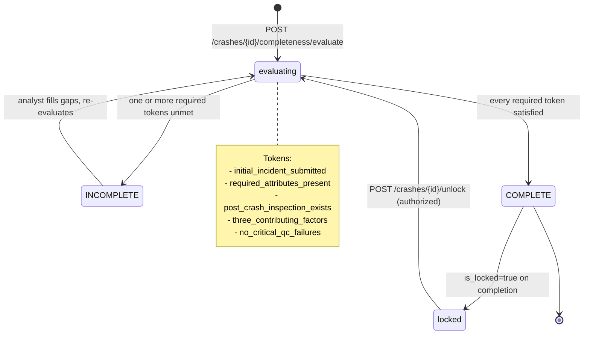

!!! danger "Completion locks the record"
    When a crash evaluates to `COMPLETE`, `run_completeness` flips the current
    completeness row to `is_locked=True` and audits a `LOCK`. While locked, every
    edit path — `update_crash`, `set_attribute`, IIF child edits — returns **409
    Conflict** (`_assert_not_locked`) until an authorized user calls
    `POST /crashes/{id}/unlock` (`crash:unlock`). A later re-evaluation that drops
    to `INCOMPLETE` appends a fresh, unlocked current row.

**Anchor references**

- Token registry + evaluators: `tasks.py::COMPLETENESS_TOKENS`, `COMPLETENESS_TOKEN_PARAMS`.
- Evaluator: `tasks.py::evaluate_completeness`; trigger + lock: `crashes.py::run_completeness`.
- Lock enforcement: `crashes.py::_assert_not_locked`, `_is_crash_locked`.
- Unlock: `crashes.py::unlock_crash`; completeness change notice: `evaluate_completeness` (`COMPLETENESS_CHANGE`).

## 12. Missing-IIF cross-crash detector

The IIF is expected within **24–48 h** of a crash (§12.4). An on-demand,
in-process detector (no scheduler) flags crashes aged past the window with no
submitted IIF and notifies the responsible State CMV Data Analyst(s). It is
idempotent: a crash already carrying an **unread** `MISSING_IIF` notification for
the same analyst is skipped, so re-running does not spam duplicates.

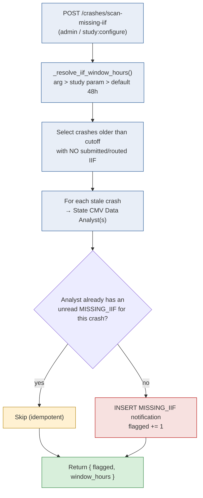

**Anchor references**

- Detector: `tasks.py::scan_crashes_missing_iif` (`NOTI-5`).
- Window resolution: `tasks.py::_resolve_iif_window_hours` (per-study `iif_window_hours` param, else `DEFAULT_IIF_WINDOW_HOURS = 48`).
- Admin trigger: `crashes.py::scan_missing_iif`.

## 13. Contributing-factor selection (Phase 6)

In Phase 6 the State CMV Data Analyst reviews selected PCR sections and selects the
**top three primary contributing factors** from the BRD-specified groups. The
selection feeds both the `DQ_TOP_FACTORS` QC rule and the
`three_contributing_factors` completeness token.

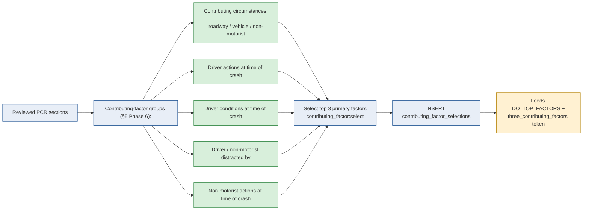

**Anchor references**

- Factor groups & selection: `Backend/app/features/data_management.py` (contributing-factor groups & selection).
- Reference data: `ref_contributing_factor_groups`, `ref_contributing_factor_values` (`Backend/app/models.py`).
- QC rule: `tasks.py::_check_required_count` (`DQ_TOP_FACTORS`, default 3).
- Completeness token: `tasks.py::COMPLETENESS_TOKENS["three_contributing_factors"]`.

## 14. Report build → publish (de-identified) → public output (Phase 7)

Phase 7 separates **operational records** from **public outputs**. An authorized
user builds a report, shares it by role, and publishes a **de-identified** output.
Published outputs are served by the public router with **no authentication** under
`/api/v1/public/...`, kept apart from the PII/CIPSEA-tagged operational store.

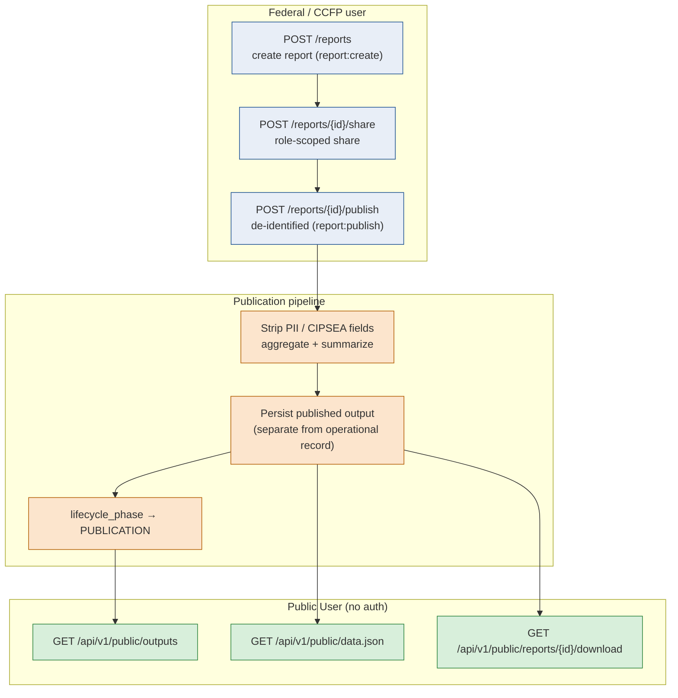

!!! abstract "Two audiences, one separation boundary"
    Federal and State users receive role-approved reports and tables; Public Users
    consume **only** the summarized, de-identified published data. The
    `report:publish` permission and the public router are the boundary — a public
    request never touches the operational crash store.

**Anchor references**

- Reports router (CRUD / share / publish / download): `Backend/app/features/reports.py`.
- Public router (no auth): `Backend/app/features/public.py` (`/outputs`, `/data.json`, `/reports/{id}`).
- Publish terminal transition: `crashes.py::advance_crash_phase` (`target=PUBLICATION`).
- De-identification & separation principles: `Documentation/project_documentation.md` §5 Phase 7, §11.3.

## 15. Notification fan-out

Every meaningful event (new IIF, scope routing, QC failure, missing data,
completeness change, report publication) writes one `notifications` row per
recipient via `create_notification`. Recipients are resolved by role — and, for
State-scoped roles, **filtered to the crash's State** — so the right analysts and
agents are notified without leaking across States.

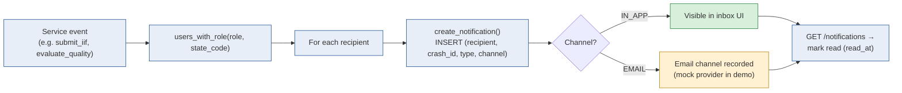

The §8.11 catalogue of notification types:

| Type | Fires when | Recipients |
|---|---|---|
| `NEW_IIF` | IIF submitted & routed | State CMV Data Analyst (State) |
| `IIF_DRAFT_SAVED` | First IIF draft saved | State CMV Data Analyst (State) |
| `IN_SCOPE_ROUTING` | In-scope crash routed | BTS CIPSEA Agent (email) |
| `OUT_OF_SCOPE_ROUTING` | Out-of-scope / supplemental retained | CCFP Project Team |
| `MISSING_DATA` | Required attributes missing | State CMV Data Analyst (State) |
| `MISSING_IIF` | Crash past IIF window with no IIF | State CMV Data Analyst (State) |
| `QC_FAILURE` | One or more QC rules fail | State CMV Data Analyst (State) |
| `COMPLETENESS_CHANGE` | Complete/incomplete status changes | Analyst (State) + CCFP Project Team |

**Anchor references**

- Notification helpers: `Backend/app/core/notifications.py::create_notification`, `users_with_role`.
- Type vocabulary: `Backend/app/enums.py::NotificationType` (§8.11, `NOTI-9`).
- List / mark read: `Backend/app/features/notifications.py`.
- Fire-on-change completeness notice: `tasks.py::evaluate_completeness`.

## 16. Audit write path

Every state-changing service call writes an immutable `audit_logs` row through
`record_audit`. The row captures actor, action, entity type/id, the owning
`crash_id`, an optional `after` state, and the request IP where available. The
crash **timeline** view then reads these rows back and derives lifecycle
milestones from them — no second persistence path.

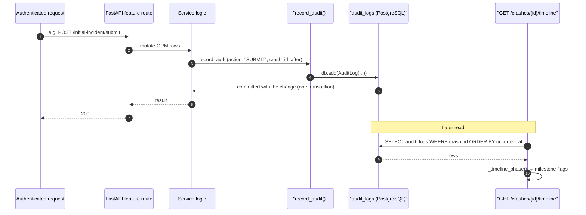

!!! note "The timeline is derived, not duplicated"
    `_timeline_phase` reads existing audit rows: an `ADVANCE_PHASE` row's
    `after.to` value, the IIF `SUBMIT` (→ `NOTIFICATION`), and the crash `CREATE`
    (→ `INITIAL_INCIDENT`) become milestones on the phase rail (`CRAS-6`).
    Everything else is a routine audit row. The rail degrades gracefully: even
    without `ADVANCE_PHASE` rows it still reflects the crash's current
    `lifecycle_phase`.

**Anchor references**

- Audit writer: `Backend/app/core/audit.py::record_audit`.
- Audit model: `Backend/app/models.py::AuditLog` (`actor_user_id`, `action`, `entity_type`, `entity_id`, `crash_id`, `after_state`, `occurred_at`).
- Timeline derivation: `crashes.py::get_timeline`, `crashes.py::_timeline_phase`.
- Audit-log read endpoint: `Backend/app/features/audit.py`.

## 17. Async work & in-process workers

Async work runs **in-process** via FastAPI `BackgroundTasks` in the implemented
stack (production swaps in Celery/Redis). The three worker entry points share one
pattern: own-or-borrow a session, do idempotent work, commit, and close only if
owned — so they run identically whether called inline or as a background task.

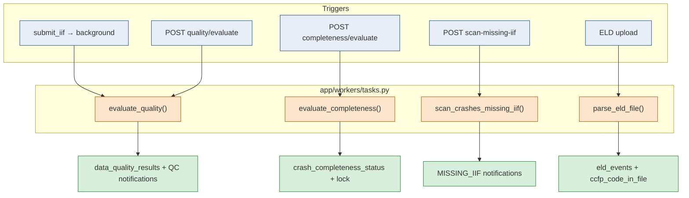

| Worker | Trigger(s) | Effect | Idempotent? |
|---|---|---|---|
| `evaluate_quality` | IIF submit, `quality/evaluate` | Rebuilds `data_quality_results`, emits `QC_FAILURE` / `MISSING_DATA` | Yes — results deleted & re-inserted per run |
| `evaluate_completeness` | `completeness/evaluate` | Appends a current `crash_completeness_status`, locks on `COMPLETE` | Yes — fire-on-change notifications only |
| `scan_crashes_missing_iif` | `scan-missing-iif` | Flags stale crashes, emits `MISSING_IIF` | Yes — skips existing unread notices |
| `parse_eld_file` | ELD upload | Parses CSV → `eld_events`, stores `ccfp_code_in_file` | Yes — clears prior events first |

**Anchor references**

- Worker module: `Backend/app/workers/tasks.py`.
- Own-or-borrow session pattern: each worker's `own = db is None` / `finally: db.close()`.
- Background enqueue example: `initial_incident.py::submit_iif` (`background.add_task`).
- Configurability registries: `tasks.py::COMPLETENESS_TOKENS`, `_resolve_eld_mappings` (no Phase-1 literals).

## 18. Scope reclassification & re-routing

Scope is not a one-time decision. As facts arrive (fatality count, incident
vehicles), `reclassify_scope` re-derives `(is_qualifying, scope, reason)` from the
study criteria and re-fires routing **only on a real transition** — so repeated
calls stay idempotent and a manual `PUT /scope` override path remains intact.

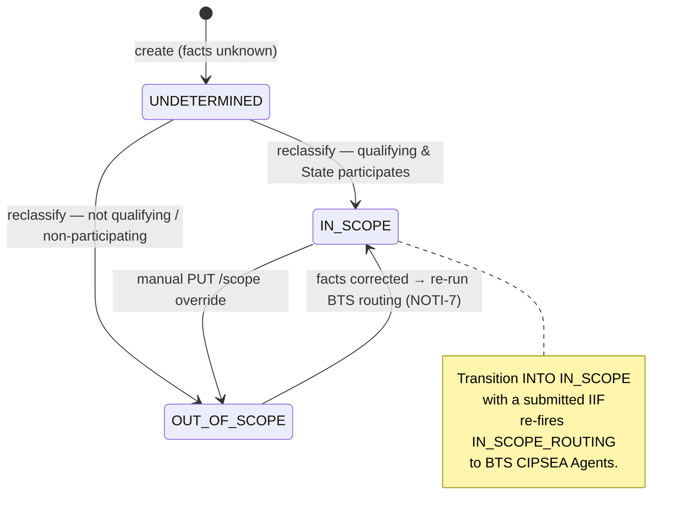

**Anchor references**

- Re-derivation: `crashes.py::reclassify_scope`; manual override: `crashes.py::set_scope`.
- Transition-only routing: `crashes.py::_emit_scope_routing` (`became_in_scope` guard).
- Criteria source: `crashes.py::classify_scope` (`qualifying_rule`, `study_states`).

## 19. Record lock & unlock guard

A complete record is **frozen**. Every mutating route consults the current
completeness row before writing, and an authorized unlock is the only way to
restore editability — distinguishing a permission `Forbidden` (403) from a locked
record (`409 Conflict`).

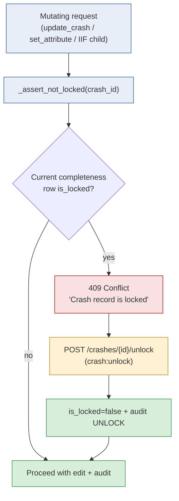

**Anchor references**

- Lock check: `crashes.py::_assert_not_locked`, `_is_crash_locked` (`DATA-1`, §8.8).
- IIF child lock (post-route): `initial_incident.py::_assert_not_routed`.
- Unlock: `crashes.py::unlock_crash`.

## 20. Authorization decision on every request

Every authenticated request resolves effective permissions, then applies
**scope filters** before the handler runs. Authorization is enforced server-side by
role, organization, State, study phase, crash scope, data sensitivity, and
resource-level permission — never trusted from the client.

```mermaid
flowchart TD
    REQ["Request + JWT"]:::s --> AUTH{Authenticated?<br/>(public routes exempt)}
    AUTH -- no --> D1["401 Unauthorized"]:::r
    AUTH -- yes --> PERM["require(permission)<br/>resolve via user_role_assignments → roles → role_permissions"]:::s
    PERM --> P{Has permission?}
    P -- no --> D2["403 Forbidden"]:::r
    P -- yes --> SCOPE["scope_study_query / scope_crash_query<br/>+ assert_crash_access / assert_study_access"]:::s
    SCOPE --> ST{State-scoped user<br/>outside their State?}
    ST -- yes --> D3["403 / filtered out"]:::r
    ST -- no --> SENS["Sensitivity check<br/>can_view_sensitivity (PII / CIPSEA)"]:::s
    SENS --> RUN["Handler runs → audit"]:::g

    classDef s fill:#E8EEF7,stroke:#205493;
    classDef g fill:#D8EFDB,stroke:#2E8540;
    classDef r fill:#F7E1E0,stroke:#B50909;
```

!!! tip "Try it on the demo"
    Sign in as the State CMV Data Analyst `elliot.fontaine@ccfp.gov`
    (password `Second@123`, scope **KS**) and you will see only Kansas crashes; the
    Texas analyst `grant.holloway@ccfp.gov` sees only Texas. PII fields stay masked
    unless your role carries the data-entry/QC sensitivity, and CIPSEA-protected BTS
    data requires `bts:read`. All accounts and data are **100% synthetic**.

**Anchor references**

- Permission resolution & scope helpers: `Backend/app/core/permissions.py` (`require`, `scope_crash_query`, `scope_study_query`, `assert_crash_access`, `assert_study_access`).
- Current-user context: `Backend/app/core/security.py::CurrentUser` (`can_access_state`, `can_view_sensitivity`).
- Public exemption: `Backend/app/features/public.py` (no auth).
- Demo credentials: [Demo Credentials](../reference/demo-credentials.md).

---

## Related documents

- [04 — Business Requirements](../01-discover/04-business-requirements.md) — the rules each workflow enforces
- [05 — Use Cases](../01-discover/05-use-cases.md) — narrative for each process
- [06 — User Stories](../01-discover/06-user-stories.md) — the user intent behind each step
- [08 — Data Model](08-data-model.md) — tables backing each workflow
- [09 — API Specification](09-api-specification.md) — endpoints that drive each workflow
- [10 — RBAC Matrix](10-rbac-matrix.md) — permissions gating each workflow
- [11 — Architecture & Sequence](../03-design/11-architecture-sequence.md) — sequence diagrams with participant detail
- [12 — Component Diagram](../03-design/12-component-diagram.md) — which component owns each step
- [13 — Solution Design](../03-design/13-solution-design.md) — design patterns behind the workflows
- [14 — Operations Runbook](../04-release/14-operations-runbook.md) — operational handling of each workflow
- [03 — Stakeholders & Personas](../01-discover/03-stakeholders-personas.md) — actors driving each workflow

*End of 07 — Workflow / Process Diagrams.*
