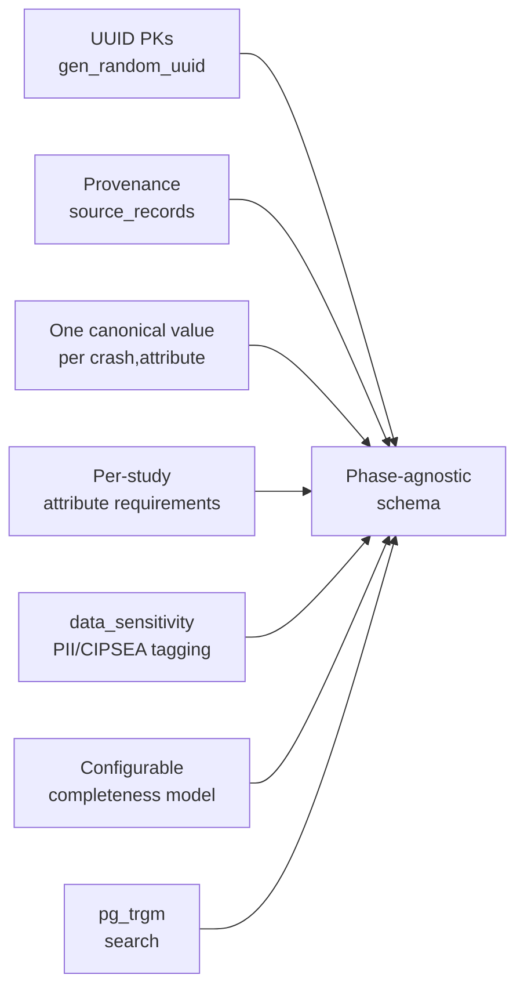

# Data Model

**Phase:** Analyze · **Artifact family:** Data Model

The data model is the deepest artifact in the CCFP delivery set. It is the
single source of truth for **every table, column, key, and enum** that backs the
Crash Causal Factors Program (CCFP) IT Solution. Where the
[Workflow / Process](07-workflow-process.md) page shows the *motion* of data
through the 8-phase lifecycle and the [API Specification](09-api-specification.md)
page shows the *contract* over the wire, this page shows the *shape at rest*: the
PostgreSQL schema that stores one stable identifier per crash, retains provenance
on every source value, and stays configurable for future study phases without a
rebuild.

!!! abstract "What this page covers"
    - An **at-a-glance inventory** — table counts by functional group and the
      native enum-type catalog.
    - A **Mermaid `erDiagram`** of the crash-centric core.
    - **Per-group sections** with column-level tables for the load-bearing
      entities: Reference, Identity &amp; Access, Study config, Crash core,
      Source data (including the typed Post-Crash Investigation §19.2 child
      tables), Mapping / QC / Completeness, and Documents / Reports / Audit.
    - The **design principles** that keep the schema phase-agnostic: UUID PKs,
      provenance, one canonical value per `(crash, attribute)`, per-study
      attribute requirements, `data_sensitivity` tagging, the completeness
      model, and `pg_trgm` search.

!!! warning "Synthetic data only"
    Every row described or implied on this page — users, crashes, carriers,
    USDOT numbers, VINs, plates, names, addresses, ELD events — is **100%
    synthetic**, generated for development, testing, and demonstration. The
    seed domain `@ccfp.gov` is fictitious and non-deliverable. No real PII,
    CIPSEA-protected interview data, or production records exist in this
    schema. Do not load the seed into a production environment.

!!! info "Document conventions"
    - Each table section names its SQLAlchemy declarative model
      (`Backend/app/models.py::<Class>`). The schema DDL lives in
      `Backend/database/migrations/0001_initial_schema.sql` (plus follow-up
      migrations) and is the authoritative source — the ORM maps to it 1:1 and
      emits no DDL of its own.
    - Column types use PostgreSQL spelling (`uuid`, `text`, `jsonb`,
      `timestamptz`, `numeric(9,6)`, `char(2)`, `inet`).
    - Primary keys default to `uuid DEFAULT gen_random_uuid()` unless noted.
    - All `created_at` / `updated_at` columns are `timestamptz` with a
      `now()` server default and an `updated_at` trigger.
    - Enum columns are stored as native PostgreSQL enum types; the matching
      vocabularies live in `Backend/app/enums.py`. Configurability-sensitive
      vocabularies (de-identification, public scope, notification types) are
      stored as plain `text` so admins can extend them per study without a
      migration.

## Table of contents

1. [At-a-glance inventory](#1-at-a-glance-inventory)
2. [Entity-relationship summary](#2-entity-relationship-summary)
3. [Reference data](#3-reference-data)
4. [Identity &amp; Access](#4-identity-access)
5. [Study configuration](#5-study-configuration)
6. [Crash core](#6-crash-core)
7. [Source data](#7-source-data)
8. [Typed Post-Crash Investigation (§19.2)](#8-typed-post-crash-investigation-192)
9. [Mapping, QC &amp; Completeness](#9-mapping-qc-completeness)
10. [Documents, Reports &amp; Audit](#10-documents-reports-audit)
11. [Enum-type catalog](#11-enum-type-catalog)
12. [Design principles](#12-design-principles)
13. [Provenance &amp; canonical-value walkthrough](#13-provenance-canonical-value-walkthrough)
14. [Indexes &amp; constraints](#14-indexes-constraints)
15. [Migrations &amp; reseed](#15-migrations-reseed)

## 1. At-a-glance inventory

The transactional database is **PostgreSQL** — and PostgreSQL is the *sole* data
store. It also backs analytics, full-text search (`ILIKE` + `pg_trgm`
trigram indexes), and document metadata; uploaded files themselves are written to
local disk and referenced by a `storage_uri`. There is no separate search
cluster, analytics warehouse, or object database to keep in sync.

The schema holds roughly **38 core tables**, plus the **14 typed Post-Crash
Investigation (§19.2) child tables** that decompose the legacy investigation
blob into structured rows, organized into the seven functional groups below.
Native **enum types** (24) pin the controlled vocabularies.

<div class="grid cards" markdown>

-   :material-table-large: __~38 core tables__

    Reference, Identity &amp; Access, Study config, Crash core, Source data,
    Mapping/QC/Completeness, and Documents/Reports/Audit.

-   :material-file-tree: __14 typed PCI child tables__

    `pci_*` tables decomposing the §19.2 Post-Crash Investigation into
    single-valued and repeating structured sections.

-   :material-format-list-bulleted-type: __24 native enum types__

    Controlled vocabularies (`crash_scope`, `data_sensitivity`,
    `duty_status`, …) defined in `Backend/app/enums.py`.

-   :material-key-variant: __UUID PKs + provenance__

    `gen_random_uuid()` everywhere; every source value keeps its
    `source_record` lineage.

</div>

| # | Group | Purpose | Representative tables |
|---|---|---|---|
| 1 | Reference | US states, PCR sections, contributing-factor taxonomy | `ref_us_states`, `ref_pcr_sections`, `ref_contributing_factor_groups`, `ref_contributing_factor_values` |
| 2 | Identity &amp; Access | orgs, users, roles, permissions, access groups, scoped assignments | `organizations`, `users`, `roles`, `permissions`, `role_permissions`, `access_groups`, `role_access_groups`, `user_role_assignments` |
| 3 | Study config | studies, participating States, parameters, attribute catalog &amp; requirements | `studies`, `study_states`, `study_parameters`, `data_attributes`, `attribute_requirements` |
| 4 | Crash core | the stable CCFP crash record, scope, Initial Incident Form, vehicles, persons | `crashes`, `crash_scope_classifications`, `initial_incident_forms`, `incident_vehicles`, `incident_persons` |
| 5 | Source data | inspections, investigations, PCRs + mapping, reconstruction, ELD, provenance | `post_crash_inspections`, `post_crash_investigations`, `police_crash_reports`, `pcr_field_mapping`, `reconstruction_reports`, `eld_files`, `eld_events`, `eld_field_mappings`, `eld_duty_code_mappings`, `source_records` |
| 5a | Typed PCI (§19.2) | structured Post-Crash Investigation sections | `pci_carrier_power_unit`, `pci_driver_load`, `pci_medical_certificate`, `pci_hours_of_service`, `pci_exemptions`, `pci_vehicle_condition`, `pci_brake_system`, `pci_seating_positions`, `pci_axles`, `pci_tires`, `pci_trailers`, `pci_hazmat`, `pci_additional_towed_units`, `pci_field_definitions` |
| 6 | Mapping / QC / Completeness | canonical values, quality rules &amp; results, completeness, contributing factors, coverage | `crash_attribute_values`, `data_quality_rules`, `data_quality_results`, `completeness_rules`, `crash_completeness_status`, `contributing_factor_selections`, `state_pcr_coverage`, `state_attribute_coverage` |
| 7 | Documents / Reports / Audit | uploaded files, reports &amp; shares, immutable audit, notifications | `documents`, `reports`, `report_shares`, `audit_logs`, `notifications` |

!!! tip "Phase-1 seed footprint"
    The synthetic seed (`Backend/database/seeds/`) loads 54 US
    states/territories, 8 MMUCC PCR sections, 7 contributing-factor groups,
    12 roles + 42 permissions, 12 organizations, 15 users, 2 studies (Phase 1
    `ACTIVE`, Phase 2 `PLANNING`), 109 CCFP/PCR data attributes, and 4
    end-to-end demo crashes (KS complete, TX in-collection, CA initial-incident,
    MO out-of-scope supplemental). See [Database seeds](#15-migrations-reseed).

## 2. Entity-relationship summary

The crash record is the spine of the model: nearly every operational table either
hangs directly off `crashes` (with `ON DELETE CASCADE`) or one hop away through
a child. Reference and configuration tables sit upstream and are referenced with
`ON DELETE RESTRICT` so a crash can never orphan its study or its attribute
catalog.

```mermaid
erDiagram
    STUDIES ||--o{ CRASHES : "scopes"
    STUDIES ||--o{ STUDY_STATES : "participates"
    STUDIES ||--o{ ATTRIBUTE_REQUIREMENTS : "requires"
    DATA_ATTRIBUTES ||--o{ ATTRIBUTE_REQUIREMENTS : "per-study"
    DATA_ATTRIBUTES ||--o{ CRASH_ATTRIBUTE_VALUES : "typed by"
    CRASHES ||--|| CRASH_SCOPE_CLASSIFICATIONS : "classified"
    CRASHES ||--|| INITIAL_INCIDENT_FORMS : "originates"
    CRASHES ||--o{ INCIDENT_VEHICLES : "involves"
    CRASHES ||--o{ INCIDENT_PERSONS : "involves"
    CRASHES ||--o{ POST_CRASH_INSPECTIONS : "inspected"
    CRASHES ||--o{ POST_CRASH_INVESTIGATIONS : "investigated"
    CRASHES ||--o{ POLICE_CRASH_REPORTS : "reported"
    CRASHES ||--o{ RECONSTRUCTION_REPORTS : "reconstructed"
    CRASHES ||--o{ ELD_FILES : "logs"
    CRASHES ||--o{ SOURCE_RECORDS : "provenance"
    CRASHES ||--o{ CRASH_ATTRIBUTE_VALUES : "canonical values"
    CRASHES ||--o{ DATA_QUALITY_RESULTS : "qc"
    CRASHES ||--|| CRASH_COMPLETENESS_STATUS : "completeness"
    CRASHES ||--o{ CONTRIBUTING_FACTOR_SELECTIONS : "factors"
    CRASHES ||--o{ DOCUMENTS : "attaches"
    POLICE_CRASH_REPORTS ||--o{ PCR_FIELD_MAPPING : "maps"
    POST_CRASH_INVESTIGATIONS ||--o{ PCI_AXLES : "axles"
    POST_CRASH_INVESTIGATIONS ||--o{ PCI_TIRES : "tires"
    POST_CRASH_INVESTIGATIONS ||--o{ PCI_TRAILERS : "trailers"
    POST_CRASH_INVESTIGATIONS ||--|| PCI_DRIVER_LOAD : "driver/load"
    POST_CRASH_INVESTIGATIONS ||--|| PCI_BRAKE_SYSTEM : "brakes"
    ELD_FILES ||--o{ ELD_EVENTS : "duty events"
    SOURCE_RECORDS ||--o{ CRASH_ATTRIBUTE_VALUES : "sourced from"
    ORGANIZATIONS ||--o{ USERS : "employs"
    USERS ||--o{ USER_ROLE_ASSIGNMENTS : "holds"
    ROLES ||--o{ USER_ROLE_ASSIGNMENTS : "granted"
    ROLES ||--o{ ROLE_PERMISSIONS : "grants"
    PERMISSIONS ||--o{ ROLE_PERMISSIONS : "in"
    ROLES ||--o{ ROLE_ACCESS_GROUPS : "joins"
    ACCESS_GROUPS ||--o{ ROLE_ACCESS_GROUPS : "scopes"
    USERS ||--o{ CRASHES : "created"
```



The ERD centres on `CRASHES` and `STUDIES`. The full table catalog follows,
grouped by functional area; only the load-bearing tables get column-level
detail, but every table is named.

## 3. Reference data

Reference tables are admin-curated lookup vocabularies. Crash and config tables
reference them with `ON DELETE RESTRICT` so a reference row can never be deleted
out from under live data.

### 3.1 `ref_us_states` (`models.py::RefUsState`)

The 50 States plus DC and territories. PK is the two-letter code, not a UUID, so
foreign keys read naturally (`KS`, `TX`, `CA`).

| Column | Type | Nullable | Notes |
|---|---|---|---|
| `code` | char(2) | no | PK — e.g. `KS` |
| `name` | text | no | full State name |
| `is_territory` | boolean | no | default `false` |

### 3.2 `ref_pcr_sections` (`models.py::RefPcrSection`)

The MMUCC-aligned sections of a State Police Crash Report (8 seeded). Keyed by a
text `code` and referenced by `data_attributes.pcr_section` and
`state_pcr_coverage`.

| Column | Type | Nullable | Notes |
|---|---|---|---|
| `code` | text | no | PK — section code |
| `name` | text | no | section label |
| `sort_order` | integer | no | default `0` |

### 3.3 `ref_contributing_factor_groups` (`models.py::RefContributingFactorGroup`)

The 7 Behavioral / Roadway / Driver groups (BRD) that scope causal-factor coding
in Phase 6. `applies_to` records the entity a group attaches to.

| Column | Type | Nullable | Notes |
|---|---|---|---|
| `id` | uuid | no | PK |
| `code` | text | no | UNIQUE |
| `name` | text | no | group label |
| `applies_to` | text | no | entity scope (e.g. driver, vehicle, environment) |
| `sort_order` | integer | no | default `0` |

### 3.4 `ref_contributing_factor_values` (`models.py::RefContributingFactorValue`)

Per-group catalog of allowed contributing-factor values (DATA-7). Cascades from
its parent group.

| Column | Type | Nullable | Notes |
|---|---|---|---|
| `id` | uuid | no | PK |
| `factor_group_id` | uuid | no | FK → `ref_contributing_factor_groups.id`, ON DELETE CASCADE |
| `code` | text | yes | machine code |
| `label` | text | no | display label |
| `sort_order` | integer | no | default `0` |

## 4. Identity &amp; Access

Authorization is enforced **server-side on every request** by role, organization,
State, study phase, crash scope, and data sensitivity. The data model that backs
it has three layers: roles carry permission grants, access groups carry a
data-sensitivity ceiling, and role assignments bind a user to a role *with a
scope* (`GLOBAL`, `ORGANIZATION`, `STATE`, or `STUDY`).

### 4.1 `organizations` (`models.py::Organization`)

Every agency or entity in the system — FMCSA, BTS, Volpe, NHTSA, FHWA, NOAA,
AAMVA, and the participating State agencies. `org_type` is the
`organization_type` enum; `state_code` scopes State agencies.

| Column | Type | Nullable | Notes |
|---|---|---|---|
| `id` | uuid | no | PK |
| `name` | text | no | display name |
| `org_type` | organization_type | no | `FMCSA`, `BTS`, `STATE_AGENCY`, `VOLPE`, … |
| `state_code` | char(2) | yes | FK → `ref_us_states.code` (State agencies) |
| `parent_id` | uuid | yes | self-FK, ON DELETE SET NULL |
| `is_active` | boolean | no | default `true` |
| `created_at` / `updated_at` | timestamptz | no | `now()` + trigger |

### 4.2 `users` (`models.py::User`)

Every credentialed account. Authentication is delegated to the DOT-approved OIDC
IdP in production (MFA, PIV/CAC); `password_hash` is the **dev-only** bcrypt
column used by the email + password login screen and is `NULL` under the
production IdP.

| Column | Type | Nullable | Notes |
|---|---|---|---|
| `id` | uuid | no | PK |
| `email` | text | no | UNIQUE |
| `full_name` | text | no | display name |
| `idp_subject` | text | yes | UNIQUE — opaque OIDC `sub` claim |
| `password_hash` | text | yes | dev login only; `NULL` in production |
| `organization_id` | uuid | yes | FK → `organizations.id`, ON DELETE SET NULL |
| `status` | user_status | no | default `ACTIVE` (`ACTIVE`/`INACTIVE`/`SUSPENDED`/`PENDING`) |
| `mfa_enabled` | boolean | no | default `true` |
| `piv_cac_required` | boolean | no | default `false` |
| `last_login_at` | timestamptz | yes | |
| `created_at` / `updated_at` | timestamptz | no | |

!!! note "Demo sign-in (synthetic)"
    The live demo at
    <https://nexgile-dot-ccfp.nexgiletechnologies.com/login> seeds one account
    per role, all sharing the password **`Second@123`** — e.g.
    `sysadmin@ccfp.gov`, `avery.thornton@ccfp.gov`,
    `nora.kowalczyk@ccfp.gov` (Inspector, KS), `elliot.fontaine@ccfp.gov`
    (Analyst, KS). State-scoped users see only their State's crashes. The full
    table lives on the [Demo Credentials](../reference/demo-credentials.md)
    page. These are fictitious accounts on a non-deliverable domain.

### 4.3 `roles`, `permissions`, `role_permissions`

`roles` holds the 12 program roles; `permissions` holds the ~42 `group:action`
keys; `role_permissions` is the many-to-many bridge.

| Table | Key columns | Notes |
|---|---|---|
| `roles` | `id` PK · `code` UNIQUE · `name` · `is_system` | 12 seeded roles (`MCSAP_INSPECTOR`, `STATE_CMV_ANALYST`, `CCFP_PROJECT_TEAM`, …) |
| `permissions` | `id` PK · `code` UNIQUE · `category` · `description` | ~42 keys grouped by `category` (`crash:create`, `report:publish`, `bts:read`, …) |
| `role_permissions` | composite PK `(role_id, permission_id)` | both FKs ON DELETE CASCADE |

### 4.4 `access_groups`, `role_access_groups` (AUTH-3)

A first-class access group layered over roles. `data_sensitivity_max` is the
highest `data_sensitivity` value the group may view, so a role's *reach* into
PII/CIPSEA data is derived from group membership rather than hardcoded.

| Column | Type | Nullable | Notes |
|---|---|---|---|
| `id` | uuid | no | PK |
| `code` | text | no | UNIQUE |
| `name` | text | no | |
| `data_sensitivity_max` | text | no | ceiling drawn from `data_sensitivity` vocabulary |
| `is_active` | boolean | no | default `true` |

`role_access_groups` is a composite-PK bridge `(role_id, group_id)`, both FKs
cascading.

### 4.5 `user_role_assignments` (`models.py::UserRoleAssignment`)

The scoped grant that binds a user to a role. `scope_type` selects which scope
column is meaningful — a State CMV Analyst, for instance, is granted
`STATE`-scoped so their `state_code` filters every query.

| Column | Type | Nullable | Notes |
|---|---|---|---|
| `id` | uuid | no | PK |
| `user_id` | uuid | no | FK → `users.id`, ON DELETE CASCADE |
| `role_id` | uuid | no | FK → `roles.id`, ON DELETE CASCADE |
| `scope_type` | assignment_scope | no | default `GLOBAL` (`GLOBAL`/`ORGANIZATION`/`STATE`/`STUDY`) |
| `organization_id` | uuid | yes | FK — set when `scope_type='ORGANIZATION'` |
| `state_code` | char(2) | yes | FK → `ref_us_states.code` — set when `STATE` |
| `study_id` | uuid | yes | FK → `studies.id` — set when `STUDY` |
| `granted_by` | uuid | yes | FK → `users.id`, ON DELETE SET NULL |

!!! tip "Effective permissions"
    A user's effective permissions resolve `user_role_assignments → roles →
    role_permissions`, intersected with the scope on the assignment. State users
    are scope-filtered to their `state_code`; PII columns are masked unless the
    user holds a data-entry/QC permission; CIPSEA interview data additionally
    requires the `bts:read` permission. See the
    [RBAC Matrix](10-rbac-matrix.md).

## 5. Study configuration

The CCFP must run multiple study phases (Heavy-Duty Truck first, then
medium-duty, buses, serious-injury) **without a rebuild**. The configuration
group makes the schema phase-agnostic: a study owns its participating States, its
parameters, and its attribute requirements, and crashes reference their study
rather than baking Phase-1 assumptions into columns.

### 5.1 `studies` (`models.py::Study`)

One row per study phase. Publication settings (`deidentification_policy`,
`public_scope`, `publication_enabled`) are stored as plain `text` so they remain
admin-configurable per study.

| Column | Type | Nullable | Notes |
|---|---|---|---|
| `id` | uuid | no | PK |
| `code` | text | no | UNIQUE |
| `name` | text | no | |
| `phase_number` | integer | no | 1 = Heavy-Duty Truck Study |
| `vehicle_type` | text | no | e.g. Class 7/8 truck |
| `crash_severity` | text | no | e.g. fatal |
| `status` | study_status | no | default `PLANNING` (`PLANNING`/`ACTIVE`/`CLOSED`/`PUBLISHED`) |
| `deidentification_policy` | text | no | default `STANDARD` (`STANDARD`/`STRICT`/`NONE`) |
| `public_scope` | text | no | default `AGGREGATE_ONLY` (`NONE`/`AGGREGATE_ONLY`/`DEIDENTIFIED_RECORDS`) |
| `publication_enabled` | boolean | no | default `false` |
| `start_date` / `end_date` / `pilot_start_date` | date | yes | |

### 5.2 `study_states` (`models.py::StudyState`)

Per-study State participation, gated on a data-sharing agreement. A crash is
*in-scope* only when its State has a participating row here.

| Column | Type | Nullable | Notes |
|---|---|---|---|
| `id` | uuid | no | PK |
| `study_id` | uuid | no | FK → `studies.id`, ON DELETE CASCADE |
| `state_code` | char(2) | no | FK → `ref_us_states.code` |
| `is_participating` | boolean | no | default `false` |
| `agreement_status` | text | no | default `PENDING` |
| `onboarded_at` | date | yes | |

### 5.3 `study_parameters` (`models.py::StudyParameter`)

Free-form per-study key/value config as `jsonb` — qualifying-crash thresholds,
GVWR cut-offs, routing windows — so program admins tune behavior without code
changes.

| Column | Type | Nullable | Notes |
|---|---|---|---|
| `id` | uuid | no | PK |
| `study_id` | uuid | no | FK → `studies.id`, ON DELETE CASCADE |
| `param_key` | text | no | |
| `param_value` | jsonb | no | typed config payload |

### 5.4 `data_attributes` (`models.py::DataAttribute`)

The canonical CCFP attribute catalog (109 seeded). Every analytic value a crash
can carry is described here once: its category, the PCR section it maps to, its
data type, and its **default sensitivity**.

| Column | Type | Nullable | Notes |
|---|---|---|---|
| `id` | uuid | no | PK |
| `code` | text | no | UNIQUE — stable attribute key |
| `name` | text | no | |
| `category` | text | no | grouping bucket |
| `pcr_section` | text | yes | FK → `ref_pcr_sections.code` |
| `data_type` | attribute_data_type | no | default `TEXT` (`TEXT`/`NUMBER`/`DATE`/`DATETIME`/`BOOLEAN`/`CODE`/`JSON`) |
| `sensitivity` | data_sensitivity | no | default `INTERNAL` (`PUBLIC`/`INTERNAL`/`PII`/`SENSITIVE`/`CIPSEA`) |
| `is_active` | boolean | no | default `true` |

### 5.5 `attribute_requirements` (`models.py::AttributeRequirement`)

The per-study `(study, attribute)` requirement matrix — the heart of
configurability. The same attribute can be *required* in one study and *optional*
or *read-only* in another, driving both the data-entry UI and the completeness
check.

| Column | Type | Nullable | Notes |
|---|---|---|---|
| `id` | uuid | no | PK |
| `study_id` | uuid | no | FK → `studies.id`, ON DELETE CASCADE |
| `attribute_id` | uuid | no | FK → `data_attributes.id`, ON DELETE CASCADE |
| `is_required` | boolean | no | default `false` |
| `is_optional` | boolean | no | default `true` |
| `is_read_only` | boolean | no | default `false` |
| `is_editable` | boolean | no | default `true` |

## 6. Crash core

The crash record is the program's anchor. It receives a stable
`ccfp_identifier` on creation (via the Initial Incident Form) and never loses it,
even as source data accumulates and the record moves through the lifecycle.

### 6.1 `crashes` (`models.py::Crash`)

| Column | Type | Nullable | Notes |
|---|---|---|---|
| `id` | uuid | no | PK |
| `ccfp_identifier` | text | no | **UNIQUE — the stable program identifier** |
| `study_id` | uuid | no | FK → `studies.id`, **ON DELETE RESTRICT** |
| `local_report_number` | text | yes | the State's own report number |
| `crash_date` / `crash_time` | date / time | yes | |
| `city` / `county` / `state_code` | text / text / char(2) | yes | `state_code` FK → `ref_us_states.code` |
| `latitude` / `longitude` | numeric(9,6) | yes | |
| `num_vehicles` / `num_persons` / `num_fatalities` | integer | yes | |
| `lifecycle_phase` | crash_lifecycle_phase | no | default `INITIAL_INCIDENT` |
| `created_by` | uuid | yes | FK → `users.id`, ON DELETE SET NULL |

The `lifecycle_phase` enum drives the 8-phase workflow:
`INITIAL_INCIDENT` → `NOTIFICATION` → `DATA_COLLECTION` → `DATA_MAPPING` →
`QUALITY_CONTROL` → `ANALYSIS` → `PUBLICATION`.

### 6.2 `crash_scope_classifications` (`models.py::CrashScopeClassification`)

A 1:1 record (UNIQUE on `crash_id`) capturing the in-scope / out-of-scope
decision. A *qualifying* Phase-1 crash has ≥1 fatality and ≥1 heavy-duty Class
7/8 truck; it is *in-scope* only when also in a participating State.

| Column | Type | Nullable | Notes |
|---|---|---|---|
| `id` | uuid | no | PK |
| `crash_id` | uuid | no | FK → `crashes.id`, ON DELETE CASCADE, **UNIQUE** |
| `is_qualifying` | boolean | no | default `false` |
| `scope` | crash_scope | no | default `UNDETERMINED` (`IN_SCOPE`/`OUT_OF_SCOPE`/`UNDETERMINED`) |
| `is_supplemental` | boolean | no | out-of-scope record kept for context |
| `classification_reason` | text | yes | |
| `classified_by` | uuid | yes | FK → `users.id` |

### 6.3 `initial_incident_forms` (`models.py::InitialIncidentForm`)

The form an MCSAP inspector files within 24–48 h of a crash; submitting it
validates the carrier USDOT number and triggers routing + notifications. 1:1 with
the crash (UNIQUE on `crash_id`).

| Column | Type | Nullable | Notes |
|---|---|---|---|
| `id` | uuid | no | PK |
| `crash_id` | uuid | no | FK → `crashes.id`, ON DELETE CASCADE, UNIQUE |
| `status` | form_status | no | default `DRAFT` (`DRAFT`/`SUBMITTED`/`ROUTED`/`DELETED`) |
| `event_summary` | text | yes | |
| `dot_number_validated` | boolean | no | default `false` |
| `dot_validation_source` | text | yes | e.g. MCMIS round-trip |
| `submitted_by` / `submitted_at` | uuid / timestamptz | yes | |
| `routed_at` | timestamptz | yes | set when routing fires |

### 6.4 `incident_vehicles` &amp; `incident_persons`

The vehicles and people on the crash. `incident_persons` carries structured name
parts and per-number phone types (INIT-1/INIT-2) and a non-motorist discriminator
(INIT-3); name/contact columns are PII and masked by default.

| Table | Key columns | Notes |
|---|---|---|
| `incident_vehicles` | `crash_id` FK · `vehicle_number` · `is_cmv` · `us_dot_number` · `carrier_name` · `is_supplemental` | one row per involved vehicle |
| `incident_persons` | `crash_id` FK · `person_type` (`DRIVER`/`OCCUPANT`/`NON_MOTORIST`/`WITNESS`) · `name_last/first/middle` · `phone_primary_type` · `non_motorist_kind` · `injury` (`FATAL`/`INJURY`/`NO_INJURY`/`UNKNOWN`) | PII-tagged |

## 7. Source data

Source-data tables hold raw inputs from each contributing system *as received*,
keeping them distinct from the canonical analytic values that mapping later
derives. Every external input also gets a `source_records` row so provenance is
never lost.

### 7.1 `post_crash_inspections` (`models.py::PostCrashInspection`)

Roadside / post-crash inspection summaries, defaulting to the `SafeSpect`
source system, with the raw payload in `details jsonb`.

| Column | Type | Nullable | Notes |
|---|---|---|---|
| `id` | uuid | no | PK |
| `crash_id` | uuid | no | FK → `crashes.id`, ON DELETE CASCADE |
| `source_system` | text | no | default `SafeSpect` |
| `inspection_number` / `inspection_date` | text / date | yes | |
| `violations_count` / `defects_count` | integer | yes | default `0` |
| `details` | jsonb | yes | raw inspection payload |

### 7.2 `post_crash_investigations` (`models.py::PostCrashInvestigation`)

The header for the typed §19.2 investigation. The legacy untyped `sections jsonb`
column is **deprecated** and superseded by the `pci_*` child tables in
[§8](#8-typed-post-crash-investigation-192); presence flags
(`has_hazmat`, `has_additional_towed_units`) gate the optional pages.

| Column | Type | Nullable | Notes |
|---|---|---|---|
| `id` | uuid | no | PK |
| `crash_id` | uuid | no | FK → `crashes.id`, ON DELETE CASCADE |
| `case_number` / `inspection_number` | text | yes | |
| `officer_name` / `officer_id` | text | yes | |
| `post_crash_date` | date | yes | |
| `status` | text | no | default `DRAFT` |
| `sections` | jsonb | yes | **deprecated** legacy blob |
| `has_hazmat` | boolean | no | default `false` |
| `has_additional_towed_units` | boolean | no | default `false` |

### 7.3 `police_crash_reports` &amp; `pcr_field_mapping`

The State Police Crash Report and its field-level mapping to CCFP attributes. The
mapping records that a field on a State's *existing* form corresponds to a
`data_attributes` row **without altering the State form** (PCR-1).

| Table | Key columns | Notes |
|---|---|---|
| `police_crash_reports` | `crash_id` FK · `state_code` · `source_repository` · `ingestion_path` (`MCMIS_ROUNDTRIP`/`DIRECT_STATE`) · `pcr_number` · `mapping_status` (`PENDING`/`MAPPED`/`REVIEWED`) | one per PCR |
| `pcr_field_mapping` | `pcr_id` FK · `state_field_name` · `state_field_position` · `attribute_id` FK (RESTRICT) · `mapped_by` | UNIQUE `(pcr_id, attribute_id)` |

### 7.4 `reconstruction_reports` (`models.py::ReconstructionReport`)

Investigator/reconstruction narratives, optionally linked to an uploaded
`documents` row, with manual `coded_findings jsonb` and a coding-status lifecycle.

| Column | Type | Nullable | Notes |
|---|---|---|---|
| `id` | uuid | no | PK |
| `crash_id` | uuid | no | FK → `crashes.id`, ON DELETE CASCADE |
| `title` / `received_date` | text / date | yes | |
| `document_id` | uuid | yes | FK → `documents.id`, ON DELETE SET NULL |
| `coding_status` | coding_status | no | default `PENDING` (`PENDING`/`IN_PROGRESS`/`CODED`) |
| `coded_findings` | jsonb | yes | analyst-coded results |

### 7.5 ELD: `eld_files`, `eld_events`, `eld_parse_issues`, mapping tables

Electronic Logging Device data flows in as an uploaded CSV (`eld_files`), is
extracted into per-event rows (`eld_events`), and is normalized through two
mapping tables so any provider's headers and duty codes resolve to canonical
fields. Two shapes are understood: the **sectioned ELD output file** defined by
49 CFR 395 Appendix A to Subpart B — the file a driver actually transfers to
eRODS — and a flat single-header hours-of-service CSV.

| Table | Key columns | Notes |
|---|---|---|
| `eld_files` | `crash_id` FK · `file_name` · `document_id` · `provider` · `upload_status` (`UPLOADED`/`PARSING`/`PARSED`/`PARSED_WITH_ERRORS`/`FAILED`) · `event_count` · parse diagnostics (`error_code`, `error_message`, `file_format`, `encoding`, `delimiter`, `line_count`, `row_count`, `error_count`, `warning_count`, `parse_duration_ms`, `parse_attempts`, `content_sha256`) · extracted header segment (`driver_name`, `driver_license_*`, `co_driver_name`, `carrier_name`, `carrier_usdot`, `vin`, `power_unit_number`, `trailer_numbers`, `time_zone_offset`, `eld_registration_id`, `eld_identifier`, `output_file_comment`, `file_data_check_value`) · `sections jsonb` · `header_metadata jsonb` · `hos_summary jsonb` · ELD-summary fields (`eld_downloaded`, `last_duty_status`, …) | one upload per file |
| `eld_events` | `eld_file_id` FK · `event_sequence` · `event_timestamp` · `duty` (`OFF_DUTY`/`SLEEPER_BERTH`/`DRIVING`/`ON_DUTY_NOT_DRIVING`) · `event_type_code`/`event_code` · `record_status` · `record_origin` · `latitude`/`longitude` · `distance_since_last_coords` · `miles_driven` · `engine_hours` · `malfunction_indicator`/`diagnostic_indicator` · `annotation` · `driver_identifier`/`cmv_identifier` · `data_check_value` · `section`/`line_number` · `is_duplicate` · `raw jsonb` | per ELD event. **No** uniqueness on `(eld_file_id, event_sequence)`: the rule lets the counter wrap and the unidentified-driver section restarts numbering, so repeats are kept and flagged rather than rejected |
| `eld_parse_issues` | `eld_file_id` FK · `severity` (`ERROR`/`WARNING`/`INFO`) · `code` · `message` · `section` · `line_number` · `column_name` · `raw_value` · `occurrences` · `details jsonb` | one aggregated row per **distinct** problem — a systematically bad column is one issue with a count and sample lines, not one row per record. Rewritten on every (re)parse |
| `eld_field_mappings` | `study_id?` · `provider?` · `canonical_field` · `source_header` · `priority` | NULL study/provider = global default; higher `priority` wins |
| `eld_duty_code_mappings` | `study_id?` · `provider?` · `source_code` · `canonical_duty` | maps source duty codes → `duty_status`. The standard's **numeric** codes are deliberately absent: `3` means "driving" only under event type 1, so they are resolved structurally with the event type in hand |

### 7.6 `source_records` (`models.py::SourceRecord`)

The **provenance backbone**. One row per distinct external input to a crash —
inspection, investigation, PCR, reconstruction, ELD, integration feed — recording
the source system, the source type, the external id, and a pointer into the raw
zone.

| Column | Type | Nullable | Notes |
|---|---|---|---|
| `id` | uuid | no | PK |
| `crash_id` | uuid | no | FK → `crashes.id`, ON DELETE CASCADE |
| `source_system` | text | no | e.g. `SafeSpect`, `MCMIS`, `eRODS`, State repository |
| `source_type` | text | no | e.g. inspection, PCR, ELD |
| `external_id` | text | yes | id in the source system |
| `raw_zone_uri` | text | yes | pointer to the stored raw payload |
| `received_at` | timestamptz | no | `now()` |

## 8. Typed Post-Crash Investigation (§19.2)

The §19.2 Post-Crash Investigation form is the richest single artifact in the
program. Rather than store it as one opaque JSON blob, the schema decomposes it
into **14 typed child tables** keyed to `post_crash_investigations`. Seven are
single-valued (one-to-one, UNIQUE on `investigation_id`); five are repeating
(one-to-many, keyed by an index/position column so Phase-1 column counts are not
hardcoded); one carries the optional hazmat section; and one
(`pci_field_definitions`) holds per-study field requirements.

```mermaid
erDiagram
    POST_CRASH_INVESTIGATIONS ||--|| PCI_CARRIER_POWER_UNIT : "1:1"
    POST_CRASH_INVESTIGATIONS ||--|| PCI_DRIVER_LOAD : "1:1"
    POST_CRASH_INVESTIGATIONS ||--|| PCI_MEDICAL_CERTIFICATE : "1:1"
    POST_CRASH_INVESTIGATIONS ||--|| PCI_HOURS_OF_SERVICE : "1:1"
    POST_CRASH_INVESTIGATIONS ||--|| PCI_EXEMPTIONS : "1:1"
    POST_CRASH_INVESTIGATIONS ||--|| PCI_VEHICLE_CONDITION : "1:1"
    POST_CRASH_INVESTIGATIONS ||--|| PCI_BRAKE_SYSTEM : "1:1"
    POST_CRASH_INVESTIGATIONS ||--o{ PCI_SEATING_POSITIONS : "1:N"
    POST_CRASH_INVESTIGATIONS ||--o{ PCI_AXLES : "1:N"
    POST_CRASH_INVESTIGATIONS ||--o{ PCI_TIRES : "1:N"
    POST_CRASH_INVESTIGATIONS ||--o{ PCI_TRAILERS : "1:N"
    POST_CRASH_INVESTIGATIONS ||--o{ PCI_HAZMAT : "1:N (optional)"
    POST_CRASH_INVESTIGATIONS ||--o{ PCI_ADDITIONAL_TOWED_UNITS : "1:N (optional)"
```



### 8.1 Single-valued sections (one-to-one)

Each is UNIQUE on `investigation_id`, cascades on delete, and keeps every column
nullable so a partially-completed investigation is always valid.

| Table | Purpose | Representative columns |
|---|---|---|
| `pci_carrier_power_unit` | carrier &amp; power-unit identification | `motor_carrier_name`, `us_dot_displayed`, `vin`, `gvwr`, `registered_gross_weight`, `annual_inspection`, `fire_pre_crash`/`fire_post_crash`, `work_zone` |
| `pci_driver_load` | driver, license &amp; cargo securement | `license_state`, `license_class`, `license_endorsements`, `cargo_loaded`, `load_securement`, `securement_exceeded_wll` |
| `pci_medical_certificate` | medical examiner's certificate | `examination_date`, `expiration_date`, `lenses`, `hearing_aid`, `waiver` |
| `pci_hours_of_service` | HOS &amp; driver history | `driving_hours`, `total_on_duty_hours`, `record_of_duty_status`, `eld_present`, `approved_eld`, `years_experience`, `previous_cmv_crashes` |
| `pci_exemptions` | HOS exemptions claimed | `exemption_11_hour`, `exemption_14_hour`, `exemption_34_hour_restart`, `exemption_agricultural`, `emergency_declaration` |
| `pci_vehicle_condition` | cab, drivetrain &amp; distraction tech | `wipers`, `mirrors`, `odometer`, `ecm_serial`, `adas`, `transmission_type`, `dash_camera`, `bluetooth` |
| `pci_brake_system` | brake configuration &amp; defects | `brake_type`, `abs_type`, `air_leaks`, `low_air_vacuum_warning_psi`, `parking_brake`, `power_assist` |

### 8.2 Repeating structures (one-to-many)

Keyed by an index/position column so the count is data-driven, not a fixed
Phase-1 schema decision.

| Table | Index column | Representative columns |
|---|---|---|
| `pci_seating_positions` | `position` | `seat_belt_equipped`, `seat_belt_used`, `airbag_equipped`, `airbag_deployed` |
| `pci_axles` | `axle_index` | `abs`, `slack_adjuster_type`, `push_rod_stroke_applied`, `chamber_type`, `wheel_end_weight` |
| `pci_tires` | `axle_index` + `side` + `inner_outer` | `size`, `make`, `tin_dot`, `rated_psi`, `inspection_psi`, `tread_depth` |
| `pci_trailers` | `trailer_index` | `trailer_type`, `vin`, `gvwr`, `axles_up`/`axles_down`, `converter_dolly` |

### 8.3 Optional conditional &amp; config sections

| Table | Cardinality | Purpose |
|---|---|---|
| `pci_hazmat` | 1:N (gated by `has_hazmat`) | hazardous-materials presence, placards, spill/leak |
| `pci_additional_towed_units` | 1:N (gated by `has_additional_towed_units`) | extra towed units &amp; their conspicuity / rear-protection measurements |
| `pci_field_definitions` | per-study config | mirrors `attribute_requirements` but keyed to PCI form fields (`study_id` + `section_code` + `field_code`) with `is_required`/`is_optional`/`display_order` |

!!! note "Why typed tables, not one JSON blob"
    Typed columns let the QC engine validate individual fields (e.g. a tire's
    `inspection_psi` against its `rated_psi`), let the completeness model count
    required §19.2 fields, and let analysts query across investigations. The
    deprecated `post_crash_investigations.sections jsonb` survives only for
    back-compat with in-flight legacy data.

## 9. Mapping, QC &amp; Completeness

This group turns raw source data into a single, quality-checked, completeness-
scored canonical view per crash. It is where provenance, the per-study attribute
matrix, and the completeness model converge.

### 9.1 `crash_attribute_values` (`models.py::CrashAttributeValue`)

The **canonical analytic value** for an attribute on a crash. There is exactly
**one current value per `(crash, attribute)`** (a partial unique index on
`is_current`), and each value retains its provenance via `source_record_id` and
`source_system`. Manual edits are flagged and attributed.

| Column | Type | Nullable | Notes |
|---|---|---|---|
| `id` | uuid | no | PK |
| `crash_id` | uuid | no | FK → `crashes.id`, ON DELETE CASCADE |
| `attribute_id` | uuid | no | FK → `data_attributes.id`, **ON DELETE RESTRICT** |
| `value_text` | text | yes | scalar value |
| `value_json` | jsonb | yes | structured value |
| `source_record_id` | uuid | yes | FK → `source_records.id` — **provenance** |
| `source_system` | text | yes | originating system label |
| `confidence` | numeric(5,2) | yes | mapping confidence |
| `is_current` | boolean | no | default `true` — one current row per pair |
| `is_edited` | boolean | no | default `false` |
| `edited_by` / `edited_at` | uuid / timestamptz | yes | manual-override attribution |

### 9.2 `data_quality_rules` &amp; `data_quality_results`

Configurable QC rules and their per-crash evaluation outcomes. A rule's logic
lives in `definition jsonb`; results carry a status and message.

| Table | Key columns | Notes |
|---|---|---|
| `data_quality_rules` | `code` UNIQUE · `rule_type` · `attribute_id?` · `severity` (`INFO`/`WARNING`/`ERROR`/`CRITICAL`) · `definition jsonb` | 8 seeded |
| `data_quality_results` | `crash_id` FK · `rule_id` FK · `attribute_id?` · `status` (`PASS`/`FAIL`/`WARNING`/`NOT_EVALUATED`) · `message` · `evaluated_at` | one per (crash, rule, run) |

### 9.3 `completeness_rules` &amp; `crash_completeness_status`

Completeness is **per-study and configurable**: a study's `completeness_rules`
(logic in `definition jsonb`) decide whether a crash is `COMPLETE` or
`INCOMPLETE`, and exactly **one current status row per crash** records the verdict
plus a `missing_summary jsonb`. A complete record can be locked.

| Table | Key columns | Notes |
|---|---|---|
| `completeness_rules` | `study_id` FK · `name` · `definition jsonb` · `is_active` | 5 seeded |
| `crash_completeness_status` | `crash_id` FK · `status` (`COMPLETE`/`INCOMPLETE`) · `is_current` · `is_locked` · `missing_summary jsonb` · `changed_by` | one current row per crash |

### 9.4 `contributing_factor_selections`

The analyst's ranked causal-factor picks for a crash, drawn from the
`ref_contributing_factor_groups` taxonomy (Phase 6).

| Column | Type | Nullable | Notes |
|---|---|---|---|
| `id` | uuid | no | PK |
| `crash_id` | uuid | no | FK → `crashes.id`, ON DELETE CASCADE |
| `factor_group_id` | uuid | yes | FK → `ref_contributing_factor_groups.id` |
| `factor_value` | text | no | selected value |
| `rank` | integer | no | 1 = primary contributing factor |
| `selected_by` | uuid | yes | FK → `users.id` |

### 9.5 Coverage: `state_pcr_coverage` &amp; `state_attribute_coverage`

Per-State collection coverage, used by the program dashboard. `state_pcr_coverage`
rolls up at the PCR-section grain (with a **generated** `completion_pct` column);
`state_attribute_coverage` records a per-attribute collected flag (PCR-3) driving
the three-way per-attribute status.

| Table | Key columns | Notes |
|---|---|---|
| `state_pcr_coverage` | `study_id` · `state_code` · `pcr_section_code` · `required_collected`/`total_required` · `completion_pct` (generated, persisted) | section-grain rollup |
| `state_attribute_coverage` | `study_id` · `state_code` · `attribute_id` · `is_collected` | attribute-grain flag |

## 10. Documents, Reports &amp; Audit

The output and accountability layer: uploaded files (malware-scanned,
sensitivity-tagged), reports (operational and published-de-identified), the
immutable audit log, and the notification inbox.

### 10.1 `documents` (`models.py::Document`)

Catalog row for an uploaded file. The bytes live on local disk at `storage_uri`;
the row carries metadata, a malware-scan verdict, a sensitivity tag, and an
extracted `content_text` for full-text search (SEAR-2).

| Column | Type | Nullable | Notes |
|---|---|---|---|
| `id` | uuid | no | PK |
| `crash_id` | uuid | yes | FK → `crashes.id`, ON DELETE CASCADE |
| `doc_type` | document_type | no | default `DOCUMENT` (`IMAGE`/`VIDEO`/`PDF`/`ELD_CSV`/…) |
| `file_name` | text | no | |
| `mime_type` | text | yes | |
| `content_text` | text | yes | extracted text for search; `NULL` for binaries |
| `storage_uri` | text | no | local-disk pointer (signed-URL access) |
| `sensitivity` | data_sensitivity | no | default `INTERNAL` |
| `malware_scan` | malware_scan_status | no | default `PENDING` (`CLEAN`/`INFECTED`/`ERROR`) |
| `uploaded_by` / `uploaded_at` | uuid / timestamptz | yes / no | |

### 10.2 `reports` &amp; `report_shares`

`reports` covers dashboards, tables, and visualizations with a `visibility` scope;
published outputs set `is_published` + `is_deidentified` and carry open-data
catalog metadata (`license`, `keywords`, `publisher`, `contact_email`) surfaced on
the public `/api/v1/public/data.json` endpoint. `report_shares` grants a report to
a user, role, or org.

| Table | Key columns | Notes |
|---|---|---|
| `reports` | `name` · `report_type` (`DASHBOARD`/`REPORT`/`TABLE`/`VISUALIZATION`) · `study_id?` · `visibility` (`PRIVATE`/`ORGANIZATION`/`FEDERAL`/`STATE`/`PUBLIC`) · `is_published` · `is_deidentified` · `definition jsonb` · open-data metadata | de-identified when published |
| `report_shares` | `report_id` FK · `shared_with_user_id?`/`shared_with_role_id?`/`shared_with_org_id?` · `can_download` · `shared_by` | one share target per row |

### 10.3 `audit_logs` (`models.py::AuditLog`)

The immutable, append-only record of every state-changing action. Captures the
actor, action verb, target entity, before/after JSON snapshots, and request
metadata.

| Column | Type | Nullable | Notes |
|---|---|---|---|
| `id` | uuid | no | PK |
| `actor_user_id` | uuid | yes | FK → `users.id`, ON DELETE SET NULL (actor identity preserved) |
| `action` | text | no | dotted verb (`crash.transition`, `report.publish`) |
| `entity_type` / `entity_id` | text / uuid | no / yes | target resource |
| `crash_id` | uuid | yes | FK → `crashes.id`, ON DELETE SET NULL |
| `before_state` / `after_state` | jsonb | yes | pre/post snapshots |
| `ip_address` | inet | yes | request origin |
| `occurred_at` | timestamptz | no | `now()` |

### 10.4 `notifications` (`models.py::Notification`)

The per-user inbox for lifecycle events. `notification_type` is a plain `text`
column governed by the `NotificationType` vocabulary in code so new event types
can be added per phase without a migration.

| Column | Type | Nullable | Notes |
|---|---|---|---|
| `id` | uuid | no | PK |
| `recipient_user_id` | uuid | yes | FK → `users.id`, ON DELETE CASCADE |
| `notification_type` | text | no | `NEW_IIF`, `IN_SCOPE_ROUTING`, `QC_FAILURE`, `REPORT_PUBLISHED`, … |
| `crash_id` | uuid | yes | FK → `crashes.id` |
| `title` / `message` | text | no / yes | |
| `channel` | text | no | default `IN_APP` |
| `status` | notification_status | no | default `PENDING` (`SENT`/`DELIVERED`/`READ`/`FAILED`) |

## 11. Enum-type catalog

The schema declares **24 native PostgreSQL enum types** (in
`Backend/app/enums.py`). The table below catalogs them. Configurability-sensitive
vocabularies — `DeidentificationPolicy`, `PublicScope`, `NotificationType`,
`PhoneType`, `NonMotoristKind` — are deliberately stored as plain `text` columns
(not native PG enums) so admins can extend them per study/phase **without a
rebuild**; the Python enum governs the vocabulary in code.

| Enum type | Values | Used by |
|---|---|---|
| `organization_type` | `FMCSA`, `BTS`, `STATE_AGENCY`, `VOLPE`, `NHTSA`, `FHWA`, `NOAA`, `AAMVA`, `EXTERNAL`, `OTHER` | `organizations.org_type` |
| `user_status` | `ACTIVE`, `INACTIVE`, `SUSPENDED`, `PENDING` | `users.status` |
| `assignment_scope` | `GLOBAL`, `ORGANIZATION`, `STATE`, `STUDY` | `user_role_assignments.scope_type` |
| `study_status` | `PLANNING`, `ACTIVE`, `CLOSED`, `PUBLISHED` | `studies.status` |
| `deidentification_policy` *(text)* | `STANDARD`, `STRICT`, `NONE` | `studies.deidentification_policy` |
| `public_scope` *(text)* | `NONE`, `AGGREGATE_ONLY`, `DEIDENTIFIED_RECORDS` | `studies.public_scope` |
| `crash_scope` | `IN_SCOPE`, `OUT_OF_SCOPE`, `UNDETERMINED` | `crash_scope_classifications.scope` |
| `crash_lifecycle_phase` | `INITIAL_INCIDENT`, `NOTIFICATION`, `DATA_COLLECTION`, `DATA_MAPPING`, `QUALITY_CONTROL`, `ANALYSIS`, `PUBLICATION` | `crashes.lifecycle_phase` |
| `form_status` | `DRAFT`, `SUBMITTED`, `ROUTED`, `DELETED` | `initial_incident_forms.status` |
| `person_type` | `DRIVER`, `OCCUPANT`, `NON_MOTORIST`, `WITNESS` | `incident_persons.person_type` |
| `phone_type` *(text)* | `HOME`, `CELL`, `WORK` | `incident_persons.phone_*_type` |
| `non_motorist_kind` *(text)* | `OCCUPANT`, `PEDESTRIAN` | `incident_persons.non_motorist_kind` |
| `injury_status` | `FATAL`, `INJURY`, `NO_INJURY`, `UNKNOWN` | `incident_persons.injury` |
| `ingestion_path` | `MCMIS_ROUNDTRIP`, `DIRECT_STATE` | `police_crash_reports.ingestion_path` |
| `mapping_status` | `PENDING`, `MAPPED`, `REVIEWED` | `police_crash_reports.mapping_status` |
| `coding_status` | `PENDING`, `IN_PROGRESS`, `CODED` | `reconstruction_reports.coding_status` |
| `eld_upload_status` | `UPLOADED`, `PARSING`, `PARSED`, `PARSED_WITH_ERRORS`, `FAILED` | `eld_files.upload_status` |
| `duty_status` | `OFF_DUTY`, `SLEEPER_BERTH`, `DRIVING`, `ON_DUTY_NOT_DRIVING` | `eld_events.duty` |
| `qc_result_status` | `PASS`, `FAIL`, `WARNING`, `NOT_EVALUATED` | `data_quality_results.status` |
| `rule_severity` | `INFO`, `WARNING`, `ERROR`, `CRITICAL` | `data_quality_rules.severity` |
| `completeness_status` | `COMPLETE`, `INCOMPLETE` | `crash_completeness_status.status` |
| `attribute_data_type` | `TEXT`, `NUMBER`, `DATE`, `DATETIME`, `BOOLEAN`, `CODE`, `JSON` | `data_attributes.data_type` |
| `data_sensitivity` | `PUBLIC`, `INTERNAL`, `PII`, `SENSITIVE`, `CIPSEA` | `data_attributes.sensitivity`, `documents.sensitivity`, `access_groups.data_sensitivity_max` |
| `document_type` | `DOCUMENT`, `IMAGE`, `VIDEO`, `PDF`, `ELD_CSV`, `SPREADSHEET`, `REPORT`, `OTHER` | `documents.doc_type` |
| `malware_scan_status` | `PENDING`, `CLEAN`, `INFECTED`, `ERROR` | `documents.malware_scan` |
| `report_type` | `DASHBOARD`, `REPORT`, `TABLE`, `VISUALIZATION` | `reports.report_type` |
| `report_visibility` | `PRIVATE`, `ORGANIZATION`, `FEDERAL`, `STATE`, `PUBLIC` | `reports.visibility` |
| `notification_status` | `PENDING`, `SENT`, `DELIVERED`, `READ`, `FAILED` | `notifications.status` |
| `notification_type` *(text)* | `NEW_IIF`, `IN_SCOPE_ROUTING`, `QC_FAILURE`, `COMPLETENESS_CHANGE`, `REPORT_PUBLISHED`, … (15) | `notifications.notification_type` |

## 12. Design principles

The schema is built around seven principles that keep CCFP phase-agnostic,
auditable, and privacy-safe.



=== "UUID PKs"

    Every operational table uses `uuid DEFAULT gen_random_uuid()` primary keys.
    UUIDs are non-sequential (no enumeration leakage), safe to mint client-side,
    and make the seed restartable — re-running a seed is a no-op because every
    `INSERT` is `ON CONFLICT DO NOTHING`-guarded.

=== "Provenance"

    Every external input gets a `source_records` row, and every canonical value
    in `crash_attribute_values` keeps `source_record_id` + `source_system`. A
    value's lineage — which system, which feed, which raw payload — is never
    lost, satisfying the program's "provenance retained on every source value"
    requirement.

=== "One canonical value"

    A partial unique index enforces exactly **one current value per
    `(crash, attribute)`** (`WHERE is_current`). Superseded values are retained
    (audit), but only one is the analytic truth. Manual overrides set
    `is_edited` + `edited_by` so corrections are attributable.

=== "Per-study requirements"

    `attribute_requirements` makes required/optional/read-only a *per-study*
    property, and `pci_field_definitions` does the same for §19.2 fields. The
    same attribute can be mandatory in the Heavy-Duty Truck Study and optional in
    a future bus study — no schema change, no rebuild.

=== "Data sensitivity"

    `data_sensitivity` (`PUBLIC` → `INTERNAL` → `PII` → `SENSITIVE` → `CIPSEA`)
    tags attributes, documents, and the access-group ceiling. PII columns are
    masked unless the user holds data-entry/QC permission; CIPSEA interview data
    additionally requires `bts:read`. Published reports must be
    `is_deidentified`.

=== "Completeness"

    Per-study `completeness_rules` (`definition jsonb`) compute a single current
    `crash_completeness_status` per crash with a `missing_summary`. A complete
    record can be `is_locked`, freezing it for analysis and publication.

=== "pg_trgm search"

    PostgreSQL is the sole search engine: `ILIKE` queries backed by `pg_trgm`
    trigram indexes power cross-entity, scope- and PII-aware search.
    `documents.content_text` makes uploaded files full-text findable (SEAR-2) —
    no external search cluster.

!!! info "Cascade vs. restrict"
    Crash-owned children (`incident_*`, `post_crash_*`, `eld_*`, `pci_*`,
    `crash_attribute_values`, `data_quality_results`,
    `crash_completeness_status`, …) **cascade** on crash delete. Reference and
    config FKs (`studies`, `data_attributes`) **restrict**, so a crash can never
    orphan its study or attribute catalog. Audit FKs to `users` use SET NULL so
    actor history survives a user's removal.

## 13. Provenance &amp; canonical-value walkthrough

The sequence below shows how a single PCR field becomes a provenance-tracked,
quality-checked, completeness-counted canonical value.

```mermaid
sequenceDiagram
    autonumber
    participant SRC as State PCR repository
    participant SR as source_records
    participant MAP as pcr_field_mapping
    participant CAV as crash_attribute_values
    participant QC as data_quality_results
    participant COMP as crash_completeness_status
    SRC->>SR: ingest PCR → 1 source_records row (system, external_id, raw_zone_uri)
    SR->>MAP: state field name/position → data_attributes.code
    MAP->>CAV: write canonical value (is_current=true, source_record_id, confidence)
    CAV->>QC: evaluate data_quality_rules → PASS / FAIL / WARNING
    QC->>COMP: re-run completeness_rules → COMPLETE / INCOMPLETE + missing_summary
    Note over CAV,COMP: One current value per (crash, attribute);<br/>one current status per crash
```

If an analyst later corrects the value, the row's `is_edited`/`edited_by`/
`edited_at` capture the override while `source_record_id` still records where the
original came from — provenance and correction coexist.

## 14. Indexes &amp; constraints

| Concern | Mechanism |
|---|---|
| Stable identifier | `crashes.ccfp_identifier` UNIQUE |
| One canonical value | partial unique index on `crash_attribute_values (crash_id, attribute_id) WHERE is_current` |
| One completeness status | partial unique index on `crash_completeness_status (crash_id) WHERE is_current` |
| One scope / one IIF per crash | UNIQUE on `crash_scope_classifications.crash_id`, `initial_incident_forms.crash_id` |
| One PCI section per investigation | UNIQUE on `investigation_id` for each single-valued `pci_*` table |
| One PCR mapping per attribute | UNIQUE on `pcr_field_mapping (pcr_id, attribute_id)` |
| Unique vocab keys | UNIQUE on `roles.code`, `permissions.code`, `data_attributes.code`, `studies.code`, `access_groups.code`, `data_quality_rules.code`, `users.email`, `users.idp_subject` |
| Search | `pg_trgm` trigram indexes for `ILIKE` cross-entity search |
| Generated column | `state_pcr_coverage.completion_pct` (`GENERATED … STORED`) |
| Timestamps | `updated_at` maintained by a row trigger across all tables |

CHECK / enum constraints: every status and type column is pinned to its native
enum type (or, for the configurability-sensitive vocabularies, to a `text` column
validated in the application layer against `Backend/app/enums.py`).

## 15. Migrations &amp; reseed

Schema, migrations, and the 100% synthetic seed live in `Backend/database/`. The
dependency-light runner applies migrations then seeds, idempotently:

```bash
cd Backend/database
python migrate.py status    # list applied / pending files
python migrate.py up        # apply migrations then seeds (default)
```

Every `.sql` file is applied exactly once and tracked in
`ccfp_schema_migrations`; each runs in its own transaction. Seeds are
`ON CONFLICT DO NOTHING`-guarded, so re-running is safe.

| Seed file | Loads |
|---|---|
| `0001_reference_data.sql` | 54 US states/territories, 8 MMUCC PCR sections, 7 contributing-factor groups |
| `0002_rbac_orgs_users.sql` | 12 roles, 42 permissions + mappings, 12 organizations, 15 synthetic users + scoped assignments |
| `0003_study_attributes_rules.sql` | 2 studies (Phase 1 `ACTIVE`, Phase 2 `PLANNING`), parameters, 109 data attributes + requirements, KS PCR coverage, 8 QC rules, 5 completeness rules |
| `0004_demo_crashes.sql` | 4 end-to-end demo crashes (KS complete, TX in-collection, CA initial-incident, MO out-of-scope supplemental) with vehicles, persons, inspections, investigation, PCRs, reconstruction, ELD file + events, source records, canonical values, QC results, completeness, contributing factors, documents, notifications, reports, audit logs |

!!! warning "Database credentials"
    The application reads its connection details from the `DATABASE_URL`
    environment variable (seeded from a secrets manager) — never hardcoded in
    the repo and never shown here. The host, port, and password are not part of
    this document.

---

## Related documents

- [07 — Workflow / Process](07-workflow-process.md) — the 8-phase motion of data through these tables
- [09 — API Specification](09-api-specification.md) — the REST endpoints that read and write each table
- [10 — RBAC Matrix](10-rbac-matrix.md) — roles, permissions, and scopes governing access
- [11 — Architecture &amp; Sequence](../03-design/11-architecture-sequence.md) — where PostgreSQL sits in the topology
- [12 — Component Diagram](../03-design/12-component-diagram.md) — services that own each table cluster
- [13 — Solution Design](../03-design/13-solution-design.md) — data and model design rationale
- [14 — Operations Runbook](../04-release/14-operations-runbook.md) — migration and reseed runbook
- [04 — Business Requirements](../01-discover/04-business-requirements.md) — requirements each table implements
- [03 — Stakeholders &amp; Personas](../01-discover/03-stakeholders-personas.md) — the 12 roles stored in identity &amp; access tables
- [Demo Credentials](../reference/demo-credentials.md) — synthetic sign-in accounts
- [Glossary](../glossary.md) — CCFP acronyms and terms

*End of 08 — Data Model.*
