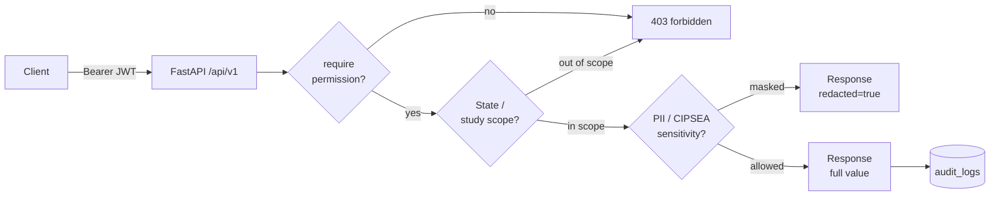
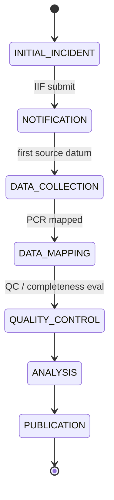
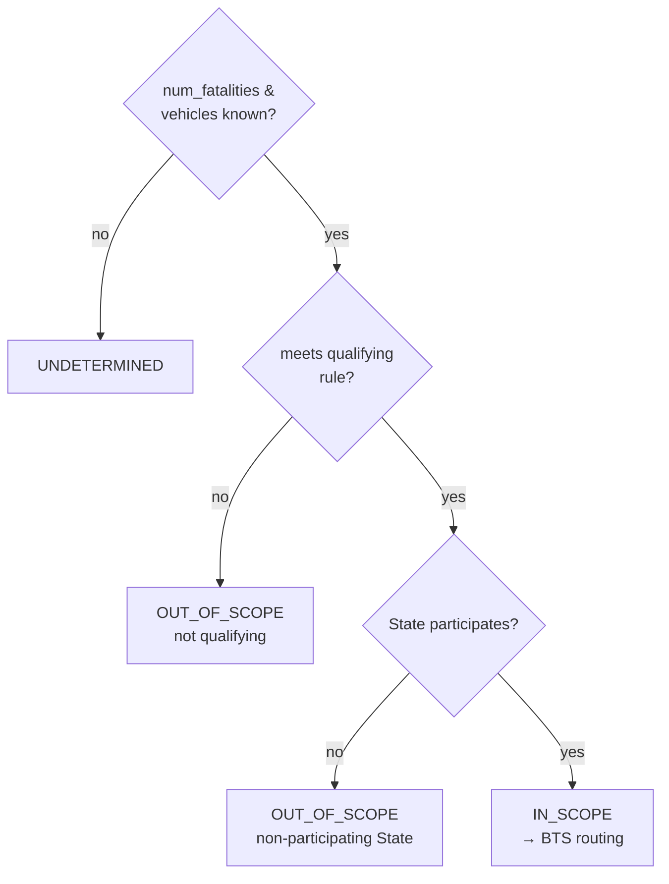
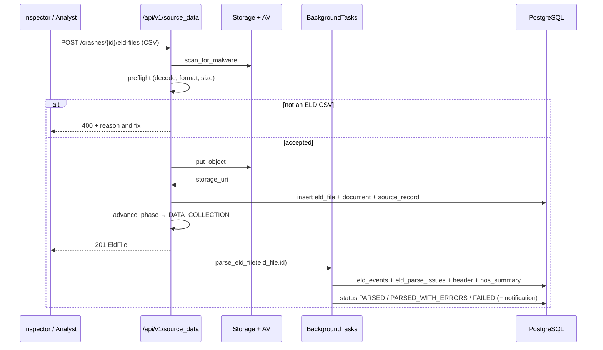
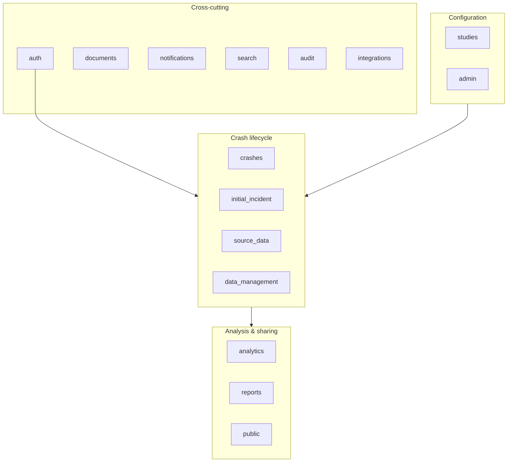

# 09 — API Specification

**Phase:** Analyze · **Artifact family:** Data & Process

!!! tip "Where to go next"
    The API is the integration surface for the **Crash Causal Factors Program
    (CCFP)** platform. For the **table view** of what these endpoints read and
    write, see [08 — Data Model](08-data-model.md). For **who can call what**,
    see [10 — RBAC Matrix](10-rbac-matrix.md). For the **runtime sequence** of
    the principal crash-lifecycle flows, see
    [11 — Architecture & Sequence](../03-design/11-architecture-sequence.md).

!!! info "Live API console"
    - Swagger UI: <https://nexgile-dot-ccfp.nexgiletechnologies.com/docs>
    - ReDoc: <https://nexgile-dot-ccfp.nexgiletechnologies.com/redoc>
    - OpenAPI schema: <https://nexgile-dot-ccfp.nexgiletechnologies.com/openapi.json>
    - Health probes: `/health` and `/health/db`

The CCFP backend (a scalable FMCSA platform for collecting, integrating,
managing, analyzing, and sharing commercial-motor-vehicle crash data) exposes a
**single REST API** at `/api/v1/*`. Every endpoint is authenticated **except**
the health checks and the published-data routes under `/api/v1/public/...`.
Every permission gate is enforced **server-side on every request** by FastAPI
dependencies — `require(...)`, `assert_crash_access(...)`, and
`assert_study_access(...)` — defined in `Backend/app/core/permissions.py` and
`Backend/app/core/security.py`.

The **16 router modules** under `Backend/app/features/` are mounted by
`Backend/app/main.py` onto a single application whose prefix is `/api/v1`,
exposing **88 endpoints** in total. The React + TypeScript frontend consumes the
contract through a thin typed wrapper layer in
`Frontend/src/lib/endpoints.ts` — one function per backend route, grouped by
feature so the surface stays greppable.

!!! warning "Synthetic data only"
    Every identifier, crash record, person, carrier, and credential referenced
    in this document is **100% synthetic** — seeded into a development database
    for demonstration. The `@ccfp.gov` domain is fictitious and non-deliverable.
    No real PII, CIPSEA interview data, or production crash data appears here.

## Table of contents

1. Conventions
2. Authentication & user context (`auth`)
3. Administration (`admin`)
4. Studies & configuration (`studies`)
5. Crashes (`crashes`)
6. Initial Incident Form (`initial_incident`)
7. Source data (`source_data`)
8. Data management & QC (`data_management`)
9. Analytics (`analytics`)
10. Reports (`reports`)
11. Public published outputs (`public`)
12. Documents (`documents`)
13. Notifications (`notifications`)
14. Search (`search`)
15. Audit (`audit`)
16. Integrations (`integrations`)
17. Cross-cutting concerns
18. Representative request / response examples

## §1 — Conventions

### 1.1 Base URL

Every endpoint lives below `/api/v1`. Examples in this document abbreviate the
prefix; in clients, prepend it:

```
https://nexgile-dot-ccfp.nexgiletechnologies.com/api/v1/...
```

In a local development run the same routes are served from `localhost` (the Vite
dev server proxies `/api` to the backend). In production the host becomes the
DOT-approved FedRAMP boundary; the prefix and the route catalog are unchanged.

### 1.2 REST shape

- **REST, JSON, versioned** under `/api/v1`. Resources are nouns; HTTP verbs
  carry intent (`GET` read, `POST` create / action, `PATCH` partial update,
  `PUT` upsert / replace, `DELETE` remove).
- Crash-owned sub-resources nest under the crash:
  `/crashes/{crash_id}/post-crash-inspections`, `/crashes/{crash_id}/eld-files`,
  and so on — every nested route resolves through one `load_crash(...)` helper
  that enforces both **crash access** and **study scope** before any work runs.
- All request bodies, response bodies, and query parameters use
  **snake_case**. Pydantic models in each `features/*.py` module are the
  contract; the FastAPI-emitted OpenAPI document is generated from them.

### 1.3 Authentication header

Bearer tokens are sent on every authenticated call:

```http
Authorization: Bearer <access_token>
```

The development path is **email + bcrypt password → JWT** (a mock identity
provider issuing tokens for the seeded users). The production target is the
**DOT-approved OIDC IdP** with MFA and PIV/CAC for federal users; setting
`CCFP_DEV_AUTH_ENABLED=false` disables the dev login and swaps the issuer. The
token subject (`sub = user_id`) and the `/auth/me` envelope are stable across
the swap, so every downstream gate is unaffected.

### 1.4 Pagination

List endpoints that can return large collections use **limit + offset** page
parameters and return a uniform envelope:

```json
{ "items": [ /* ... */ ], "total": 1284, "limit": 50, "offset": 0 }
```

```
GET /api/v1/crashes?state_code=KS&lifecycle_phase=DATA_COLLECTION&limit=25&offset=0
```

The `Page[T]` envelope (`Backend/app/core/pagination.py`) wraps `crashes`,
`organizations`, `users`, and `audit-logs`. Smaller, bounded collections (a
crash's attributes, a study's states, a user's notifications) return a plain
JSON array.

### 1.5 Authorization model

Authorization is layered and enforced on **every** request. A user's **effective
permissions** resolve through `user_role_assignments → roles → role_permissions`
(~42 permission keys in the `group:action` form). On top of the permission gate:

| Gate | Mechanism | What it checks |
|---|---|---|
| **Permission** | `require("crash:read", ...)` dependency | Caller holds the named permission key(s) via their effective roles. |
| **State scope** | `scope_crash_query`, `scope_study_query`, `can_access_state` | State-scoped users (`MCSAP_INSPECTOR`, `STATE_CMV_ANALYST`, `STATE_USER`) only see and write crashes in **their** State. |
| **Study scope** | `assert_study_access` | The crash's study must be one the caller may access. |
| **Sensitivity / PII** | `can_view_sensitivity` | `PII`-tagged attribute values are masked (`redacted=true`, value nulled) unless the caller holds a data-entry/QC permission. |
| **CIPSEA** | `bts:read` | BTS confidential-interview data is gated behind the CIPSEA permission. |

All **state-changing** actions write an immutable `audit_logs` row via
`record_audit(...)`; lifecycle events emit `notifications`.



### 1.6 Error shape

The error layer in `Backend/app/core/errors.py` raises typed exceptions
(`BadRequest`, `Forbidden`, `NotFound`, `Conflict`) that the handler renders as
a JSON body with the HTTP status carried in both the status line and the body:

```json
{
  "detail": "Crash record is locked; unlock it before editing.",
  "status": 409
}
```

| Status | Cause | Typical trigger |
|---|---|---|
| `400` | Validation or business-rule failure | Unknown attribute code; non-forward lifecycle move; required PCI field empty on submit. |
| `401` | Missing / invalid / expired token | No `Authorization` header on an authenticated route. |
| `403` | Authenticated but lacks permission or scope | State user touching another State's crash; PII masked. |
| `404` | Not found | Unknown crash, study, attribute, or sub-resource. |
| `409` | Conflict (state guard, lock) | Editing a **locked** complete crash before unlock. |
| `422` | Request body failed Pydantic validation | Malformed enum value or wrong field type. |

### 1.7 Lifecycle & the crash aggregate

The **crash** is the central aggregate root. Each carries one stable
**CCFP identifier** (minted from a study-configurable scheme, default
`CCFP-{year}-{state}-{seq:06d}`) and advances **forward-only** through its
**seven per-crash phases** — `INITIAL_INCIDENT` → `NOTIFICATION` →
`DATA_COLLECTION` → `DATA_MAPPING` → `QUALITY_CONTROL` → `ANALYSIS` →
`PUBLICATION`. These map onto the program's 8-phase target lifecycle after the
study-level **Study Setup** phase (which configures the study, not an individual
crash). Phase order is the declaration order of the `CrashLifecyclePhase` enum,
so a future study phase inserted there stays in sync without a second source of
truth.



Endpoints never let a crash regress: `advance_phase(...)` is idempotent and
rejects backward or no-op targets, and a **complete** crash is **locked** until
an authorized `crash:unlock` restores editability.

## §2 — Authentication & user context (`auth`)

Issues JWTs and surfaces the current-user envelope the frontend uses for
client-side gating. Anonymous unless noted.

| Method | Path | Permission | Notes |
|---|---|---|---|
| `POST` | `/auth/login` | none | Email + password → access token. Returns `401` on bad credentials or a disabled user. Disabled in prod via `CCFP_DEV_AUTH_ENABLED=false`. |
| `GET` | `/auth/me` | any authenticated | Current user: `id`, `email`, `full_name`, roles, organizations, State scope, PII/CIPSEA capabilities. |
| `GET` | `/auth/groupings` | any authenticated | Role/access groupings + PII permission codes, served from the backend source of truth (AUTH-8) so the UI stops hardcoding them. |
| `POST` | `/auth/logout` | any authenticated | Idempotent token discard. |

!!! note "Production identity"
    The dev login is replaced by the **DOT-approved OIDC provider** with MFA and
    **PIV/CAC** for federal staff. Token shape, the `/auth/me` payload, and every
    downstream gate stay identical — only the issuer flips.

**Demo sign-in (synthetic):** all seeded accounts share the password
`Second@123`. Sign in at
<https://nexgile-dot-ccfp.nexgiletechnologies.com/login>. A few representative
accounts (full table in [Demo Credentials](../reference/demo-credentials.md)):

| Role | Email | State scope |
|---|---|---|
| System Administrator | `sysadmin@ccfp.gov` | — |
| CCFP Project Team Administrator | `avery.thornton@ccfp.gov` | — |
| MCSAP CMV Inspector | `nora.kowalczyk@ccfp.gov` | KS |
| State CMV Data Analyst | `elliot.fontaine@ccfp.gov` | KS |
| Federal User | `omar.haddad@ccfp.gov` | — |
| Public User | `public.demo@ccfp.gov` | — |

**Implementation:** `Backend/app/features/auth.py`

## §3 — Administration (`admin`)

User, role, permission, organization, and role-assignment management. Gated to
the `CCFP_PROJECT_ADMIN` and `SYSTEM_ADMIN` roles via the `admin:*` permission
keys. The frontend wrappers live in `userApi`, `roleApi`, `permissionApi`, and
`orgApi`.

| Method | Path | Permission | Notes |
|---|---|---|---|
| `GET` | `/users` | `admin:users` | Paginated user directory. Filters: `q`, `organization_id`. |
| `POST` | `/users` | `admin:users` | Create a user (email, full name, org, `piv_cac_required`). |
| `GET` | `/users/{user_id}` | `admin:users` | Detail. |
| `PATCH` | `/users/{user_id}` | `admin:users` | Update profile / status / PIV-CAC flag. |
| `POST` | `/users/{user_id}/deactivate` | `admin:users` | Soft-deactivate. |
| `GET` | `/users/{user_id}/roles` | `admin:roles` | List the user's role assignments. |
| `POST` | `/users/{user_id}/roles` | `admin:roles` | Assign a role, optionally scoped (`scope_type`, `state_code`, `organization_id`, `study_id`). |
| `DELETE` | `/users/{user_id}/roles/{assignment_id}` | `admin:roles` | Revoke a role assignment. |
| `GET` | `/roles` · `/roles/{id}` | `admin:roles` | List / detail (detail includes the role's permission set). |
| `POST` · `PATCH` · `DELETE` | `/roles` … | `admin:roles` | Create / edit / remove a role. |
| `PUT` | `/roles/{id}/permissions` | `admin:roles` | Replace a role's permission keys. |
| `GET` · `POST` | `/permissions` | `admin:roles` | List the catalog / register a permission key. |
| `GET` · `POST` · `GET` · `PATCH` | `/organizations` … | `admin:users` | Org directory CRUD (FMCSA/Volpe, State agencies, BTS). Filter by `org_type`. |

!!! note "Scoped role assignment"
    A role assignment can be **State-scoped** (`state_code`), **org-scoped**, or
    **study-scoped**. This is how a `STATE_CMV_ANALYST` is pinned to Kansas while
    the same role definition serves a Texas analyst — the assignment, not the
    role, carries the scope. See [10 — RBAC Matrix](10-rbac-matrix.md).

**Implementation:** `Backend/app/features/admin.py`

## §4 — Studies & configuration (`studies`)

The **study** is the configuration boundary that keeps Phase 1 (Heavy-Duty Truck
Study) free of hardcoded assumptions. Everything that varies between studies —
participating States, qualifying rule, per-attribute required/optional/read-only
flags, completeness rules, the CCFP-identifier scheme, the PCI form-field
required markers — lives in study config and is read at runtime.

| Method | Path | Permission | Notes |
|---|---|---|---|
| `GET` · `POST` | `/studies` | `study:read` / `study:create` | List / create a study. |
| `GET` · `PATCH` | `/studies/{id}` | `study:read` / `study:update` | Detail / edit. |
| `GET` | `/studies/{id}/states` | `study:read` | Participating-State roster (`study_states`). |
| `POST` · `PATCH` | `/studies/{id}/states[/{state_code}]` | `study:configure` | Add / toggle `is_participating` for a State. |
| `GET` · `POST` · `DELETE` | `/studies/{id}/parameters` | `study:read` / `study:configure` | Key/value study parameters — e.g. `qualifying_rule`, `ccfp_identifier_scheme`, `iif_window_hours`. |
| `GET` · `PATCH` | `/studies/{id}/attributes[/{attribute_id}]` | `study:read` / `admin:attributes` | Per-study attribute requirements (required / optional / read-only / editable). |
| `GET` · `POST` · `PATCH` · `DELETE` | `/studies/{id}/completeness-rules`, `/completeness-rules/{id}` | `study:read` / `admin:completeness` | Per-study complete-record rules. |
| `GET` | `/completeness-rule-tokens` | `study:read` | Catalog of tokens usable in a completeness expression. |
| `GET` · `POST` · `PATCH` | `/studies/{id}/pcr-coverage[/...]` | `study:read` / `study:configure` | Per-State PCR-section coverage tracking. |
| `GET` | `/studies/{id}/attribute-coverage` | `study:read` | Required vs. collected attribute coverage per State. |
| `GET` | `/studies/{id}/pci-field-definitions` | `pcr:read` or `crash:read` | Per-study Post-Crash Investigation form-field required/optional markers (PCI-3). |
| `GET` · `POST` · `PATCH` | `/data-attributes[/{id}]` | `study:read` / `admin:attributes` | The canonical CCFP **data-attribute catalog** (the §19.x research dictionary). Filter by `pcr_section`, `category`. |

!!! abstract "The qualifying rule is data, not code"
    Scope classification reads `study_parameters.qualifying_rule`
    (`{ "min_fatalities": 1, "requires_heavy_duty_truck": true }`) and the
    `study_states` participating set. The Phase-1 rule — **≥1 fatality AND ≥1
    heavy-duty Class 7/8 truck in a participating State** — is therefore a seeded
    configuration value, not a branch in the codebase. A future medium-duty or
    bus study reconfigures the rule without a rebuild.

**Implementation:** `Backend/app/features/studies.py`

## §5 — Crashes (`crashes`)

The crash CRUD, lifecycle, scope classification, aggregated canonical
attributes, QC, completeness, lock/unlock, timeline, and source-record listing —
the documentation §12.3 surface. Every `/{crash_id}/...` route resolves through
`load_crash(...)`, which enforces crash access **and** study scope in one place.

### 5.1 Core CRUD & lifecycle

| Method | Path | Permission | Notes |
|---|---|---|---|
| `GET` | `/crashes` | `crash:read` | Paginated list, State/study-scoped. Filters: `study_id`, `state_code`, `scope`, `lifecycle_phase`, `date_from`, `date_to`, `q` (CCFP id / local report number `ILIKE`). |
| `POST` | `/crashes` | `crash:create` | Create a crash; mints the CCFP identifier (race-safe via the `ccfp_identifier_seq` sequence) and **auto-classifies scope** from study criteria. Rejects creation outside the caller's State scope. |
| `GET` | `/crashes/{crash_id}` | `crash:read` | Detail. |
| `PATCH` | `/crashes/{crash_id}` | `crash:update` | Edit top-level fields. A lifecycle-phase change is routed through the forward-only guard; rejected on a **locked** crash (`409`). |
| `POST` | `/crashes/{crash_id}/advance-phase` | `crash:update` | Advance to a target lifecycle phase; forward-only (`400` on backward / no-op). |
| `POST` | `/crashes/scan-missing-iif` | `admin:system` or `study:configure` | On-demand scan flagging crashes missing an Initial Incident Form; emits `MISSING_IIF` notifications. Idempotent. |

### 5.2 Scope classification

| Method | Path | Permission | Notes |
|---|---|---|---|
| `GET` | `/crashes/{crash_id}/scope` | `crash:read` | Current `is_qualifying` / `scope` / reason. |
| `PUT` | `/crashes/{crash_id}/scope` | `crash:update` | Manual override; fires scope-routing notifications on a value change. |
| `POST` | `/crashes/{crash_id}/scope/reclassify` | `crash:update` | Re-derive scope from study criteria after vehicles / fatality counts are entered. |



### 5.3 Aggregated attributes, QC & completeness

| Method | Path | Permission | Notes |
|---|---|---|---|
| `GET` | `/crashes/{crash_id}/attributes` | `crash:read` + `data_mgmt:read_aggregated` | Current canonical attribute values, **PII-masked** by sensitivity (`redacted=true`). |
| `GET` | `/crashes/{crash_id}/attributes/{code}/history` | `crash:read` + `data_mgmt:read_aggregated` | Full append-only version history of one attribute, newest-first (DATA-6). |
| `POST` | `/crashes/{crash_id}/attributes` | `data_mgmt:edit` | Set/override a canonical value (append-only; previous flips `is_current=false`). Optional `source_record_id` lineage validated to this crash. Rejected on a locked crash. |
| `GET` · `POST` | `/crashes/{crash_id}/quality[/evaluate]` | `data_mgmt:qc` | Read QC results / run rules. Evaluation advances the crash into `QUALITY_CONTROL`. |
| `GET` · `POST` | `/crashes/{crash_id}/completeness[/evaluate]` | `data_mgmt:complete` | Read completeness / evaluate. On `COMPLETE` the record is **locked** (`is_locked=true`). |
| `POST` | `/crashes/{crash_id}/unlock` | `crash:unlock` | Unlock a complete record to restore editability. `400` if not locked. |

### 5.4 Timeline & provenance

| Method | Path | Permission | Notes |
|---|---|---|---|
| `GET` | `/crashes/{crash_id}/timeline` | `crash:read` | Audit-derived lifecycle timeline; `ADVANCE_PHASE`, IIF `SUBMIT`, and crash `CREATE` rows surface as milestones. |
| `GET` | `/crashes/{crash_id}/sources` | `crash:read` + `data_mgmt:read_raw` | Provenance: the `source_records` feeding this crash (SafeSpect inspection, PCR, reconstruction, eRODS/ELD, …). |

!!! danger "Locked records are immutable until unlock"
    A `409 conflict` on a `PATCH /crashes/{id}` or
    `POST /crashes/{id}/attributes` means the record evaluated **complete** and
    was frozen. This is distinct from a `403` (permission): the caller may be
    authorized, but the data is locked. An authorized `crash:unlock` is the only
    path back to editability — and it is audited.

**Implementation:** `Backend/app/features/crashes.py`

## §6 — Initial Incident Form (`initial_incident`)

The **Initial Incident Form (IIF)** is created within 24–48 h of a crash; saving
and submitting it routes notifications and moves the crash into `NOTIFICATION`.
It carries the incident vehicles and persons collected on scene. Submit runs DOT
validation and triggers BTS routing for in-scope crashes. Documentation §12.4,
§8.2, §19.1.

| Method | Path | Permission | Notes |
|---|---|---|---|
| `GET` | `/crashes/{crash_id}/initial-incident` | `initial_incident:read` | The crash's IIF (or `404`). |
| `PUT` | `/crashes/{crash_id}/initial-incident` | `initial_incident:write` | Save / upsert the IIF (`event_summary`, `dot_validation_source`). |
| `POST` | `/crashes/{crash_id}/initial-incident/submit` | `initial_incident:submit` | Submit; runs **DOT validation**, advances to `NOTIFICATION`, routes notifications (and BTS CIPSEA routing when in-scope). |
| `DELETE` | `/crashes/{crash_id}/initial-incident` | `initial_incident:delete` | Remove a draft IIF. |
| `GET` · `POST` · `PATCH` · `DELETE` | `/crashes/{crash_id}/incident-vehicles[/{id}]` | `initial_incident:read` / `:write` | Incident vehicles; the `is_cmv` flag is the in-stack proxy for a heavy-duty Class 7/8 truck. |
| `GET` · `POST` · `PATCH` · `DELETE` | `/crashes/{crash_id}/incident-persons[/{id}]` | `initial_incident:read` / `:write` | Incident persons (PII-tagged; masked for callers without data-entry permission). |

!!! note "Submit is the routing trigger"
    On IIF submit, the responding `MCSAP_INSPECTOR`'s on-scene record becomes the
    seed for downstream routing: State CMV Data Analysts are notified, and an
    in-scope qualifying crash is routed to `BTS_CIPSEA_AGENT` users for the
    confidential interview. Re-running routing is idempotent.

**Implementation:** `Backend/app/features/initial_incident.py`

## §7 — Source data (`source_data`)

The largest router: post-crash inspections, the typed §19.2 Post-Crash
Investigation, police crash reports plus field-mapping, reconstruction reports
with manual coding, and ELD upload + parsed events. Documentation §12.5,
§8.3–8.7. Every write advances the crash into `DATA_COLLECTION` (or
`DATA_MAPPING` once a PCR is mapped) via the forward-only guard.

### 7.1 Post-crash inspections (§8.3)

| Method | Path | Permission | Notes |
|---|---|---|---|
| `GET` | `/crashes/{crash_id}/post-crash-inspections` | `source_data:read` + `crash:read` | List; each row carries a derived `days_to_upload` / `is_overdue` against the 7-day SLA window. |
| `POST` | `/crashes/{crash_id}/post-crash-inspections` | `source_data:ingest` | Add an inspection (default source `SafeSpect`); links a `source_records` provenance row. |
| `GET` · `PATCH` | `…/post-crash-inspections/{rec_id}` | `source_data:read` / `:ingest` | Detail / edit. |

### 7.2 Post-Crash Investigation — typed §19.2 (PCI)

The investigation is the full field-level §19.2 inventory, modeled as typed
child tables: single-valued sections (carrier/power unit, driver/load, medical
certificate, hours of service, exemptions, vehicle condition, brake system),
repeating structures (seating positions, axles, tires, trailers), and two
optional conditional sections (hazmat, additional towed units) gated by presence
flags.

| Method | Path | Permission | Notes |
|---|---|---|---|
| `GET` · `POST` | `/crashes/{crash_id}/post-crash-investigations` | `source_data:read` / `:ingest` | List / create the structured §19.2 payload. |
| `GET` · `PATCH` | `…/post-crash-investigations/{rec_id}` | `source_data:read` / `:ingest` | Detail / edit (replace-on-write for repeating and conditional sections). |
| `POST` | `…/post-crash-investigations/{rec_id}/submit` | `source_data:ingest` | Submit; **every `is_required` PCI field definition for the study must be populated** or the call returns `400` listing the empty fields. |

### 7.3 Police crash reports + field mapping (§8.5 / §19.4)

| Method | Path | Permission | Notes |
|---|---|---|---|
| `GET` · `POST` | `/crashes/{crash_id}/police-crash-reports` | `pcr:read` / `source_data:ingest` | List / add a PCR; `ingestion_path` is the structured §8.5 path (`MCMIS_ROUNDTRIP` default vs. direct State repository). |
| `GET` · `PATCH` | `…/police-crash-reports/{rec_id}` | `pcr:read` / `source_data:ingest` | Detail / edit. |
| `GET` · `POST` · `DELETE` | `…/police-crash-reports/{rec_id}/field-mappings[/{id}]` | `pcr:read` / `pcr:map` | Map a **State PCR field** to a CCFP `data_attributes` code — the State form is never altered, only the mapping is captured. |
| `POST` | `…/police-crash-reports/{rec_id}/map` | `pcr:map` | Mark the PCR `MAPPED` — requires **at least one** recorded field mapping (`400` otherwise); advances to `DATA_MAPPING`. |

### 7.4 Reconstruction reports (§8.6)

| Method | Path | Permission | Notes |
|---|---|---|---|
| `GET` · `POST` | `/crashes/{crash_id}/reconstruction-reports` | `source_data:read` / `recon:upload` | List / upload (multipart, **optional** file — metadata-only stub allowed). Files are malware-scanned, stored, and linked as a `Document`. |
| `GET` | `…/reconstruction-reports/{rec_id}` | `source_data:read` + `crash:read` | Detail. |
| `PATCH` | `…/reconstruction-reports/{rec_id}` | `recon:code` | **Code** findings into CCFP research attributes — each becomes a provenance-tagged `CrashAttributeValue` (`source_system="RECONSTRUCTION"`) feeding aggregation/QC/completeness (RECO-1). |

### 7.5 ELD / eRODS (§8.7, PCI-7)

| Method | Path | Permission | Notes |
|---|---|---|---|
| `POST` | `/crashes/{crash_id}/eld-files` | `eld:upload` | Upload an ELD/eRODS output file (multipart CSV). Malware-scanned, **structurally pre-flighted in the request** (empty / oversize / PDF / .xlsx / non-delimited → `400` naming the problem and the fix, nothing stored), then stored and **extracted in the background**. The CCFP code is parsed from the file's Output File Comment — never fabricated. |
| `POST` | `…/eld-files/validate` | `eld:upload` | **Dry run.** Runs the identical extraction with the same (study, provider) mapping and returns what *would* be extracted — format, event count, header segment, HOS summary and every issue — storing nothing. Returns `200` with `ok=false` for an unusable file, because the caller needs the diagnostics, not just a status code. |
| `GET` · `PATCH` | `…/eld-files[/{file_id}]` | `source_data:read` / `eld:upload` | List / detail / edit the PCI-7 ELD summary. Detail also carries the parse outcome (`error_code`, `error_message`, counts), the extracted header segment (driver, co-driver, carrier, U.S. DOT, VIN, power unit, time-zone offset, ELD identifiers) and the derived `hos_summary`. |
| `GET` | `…/eld-files/{file_id}/issues` | `source_data:read` + `crash:read` | Every problem the extraction recorded, `ERROR` → `WARNING` → `INFO` then by line. One aggregated row per distinct problem with `occurrences` and sample lines, so a 50 000-row file with one bad column yields one issue, not 50 000. Optional `?severity=`. |
| `POST` | `…/eld-files/{file_id}/reparse` | `eld:upload` | Re-run extraction on a stored file — the recovery path after an administrator configures a provider's column names or duty codes. Runs synchronously and returns the new outcome; the previous events and issues are replaced, never merged. |
| `GET` | `…/eld-events` | `source_data:read` + `crash:read` | Extracted events, ordered by sequence — duty status plus the ELD-standard event type/code, record status and origin, coordinates, indicators, annotation and duplicate flag. |



!!! info "An ELD file never ends in an unexplained state (BRD Appendix E)"
    Extraction runs after the `201` has been returned, so a failure has no request
    left to report on. Every file therefore lands in a terminal status with a
    reason attached: `PARSED`, `PARSED_WITH_ERRORS` (events extracted **and** at
    least one `ERROR` — truncation at the event cap, a section that could not be
    read, a time-budget overrun), or `FAILED` with `error_code` + `error_message`.
    The per-problem account is in `eld_parse_issues`, and the uploader is notified
    (`ELD_PARSE_FAILED`) so the outcome reaches a person either way.

!!! warning "Malware scanning on every upload"
    Reconstruction PDFs, ELD CSVs, and documents are scanned on upload; an
    `INFECTED` verdict returns `400` and the file is never persisted. In dev the
    scanner is a deterministic pass-through; production swaps in a real engine
    (e.g. ClamAV) with no route change.

**Implementation:** `Backend/app/features/source_data.py`

## §8 — Data management & QC (`data_management`)

Raw and aggregated views, the QC-rule catalog, the contributing-factor
dictionary, and contributing-factor selection — the §8.8 / §5 surface that turns
collected source data into a coded, analyzable record.

| Method | Path | Permission | Notes |
|---|---|---|---|
| `GET` · `POST` · `PATCH` | `/data-quality-rules[/{id}]` | `data_mgmt:qc` | The QC-rule catalog (per-study configurable). |
| `GET` | `/crashes/{crash_id}/raw-data` | `data_mgmt:read_raw` | Raw source-record counts + payloads (provenance view). |
| `GET` | `/crashes/{crash_id}/aggregated` | `data_mgmt:read_aggregated` | Aggregated rollup: current vs. required attribute counts, present/missing. |
| `GET` | `/contributing-factor-groups` | `data_mgmt:read_aggregated` | Contributing-factor groups (`ref_contributing_factor_groups`). |
| `GET` | `/contributing-factor-values` | `data_mgmt:read_aggregated` | Factor values; filter by `group_code`. |
| `GET` | `/crashes/{crash_id}/contributing-factors` | `data_mgmt:read_aggregated` | The crash's selected contributing factors, ranked. |
| `PUT` | `/crashes/{crash_id}/contributing-factors` | `contributing_factor:select` | Replace the ranked contributing-factor selection (the analyst's primary-cause coding). |

!!! abstract "Provenance is never lost"
    Aggregation does not flatten away where a value came from. Each canonical
    `crash_attribute_values` row keeps `source_system` and an optional
    `source_record_id` pointer, and every override is append-only — so the
    aggregated view and the per-attribute history can always trace a value back
    to the inspection, PCR, reconstruction, or ELD it derived from.

**Implementation:** `Backend/app/features/data_management.py`

## §9 — Analytics (`analytics`)

Saved dashboards and **whitelisted, parameterized** queries — the §12.6 / §8.9
analytical surface for the `CCFP_DATA_SCIENTIST` and federal roles. Free-form
SQL is never accepted; only named queries and a constrained query-builder run.

| Method | Path | Permission | Notes |
|---|---|---|---|
| `GET` | `/analytics/dashboards` | `analytics:dashboard` | Saved dashboards. |
| `GET` | `/analytics/dashboards/{report_id}` | `analytics:dashboard` | One dashboard's computed result. |
| `GET` · `POST` | `/analytics/queries` | `analytics:query` | List whitelisted query names / run one by `query_name` (+ optional `study_id`). |
| `GET` | `/analytics/query-builder/fields` | `analytics:query` | Allowed `group_by`, aggregations, filter columns, and operators. |
| `POST` | `/analytics/query-builder` | `analytics:query` | Run a constrained query-builder request (group-by + aggregation + typed filters). |

!!! warning "No arbitrary SQL"
    The analytics layer exposes only a **catalog of named queries** plus a
    builder restricted to a server-supplied field/operator whitelist. There is
    no endpoint that executes caller-supplied SQL, and every result is
    State/study-scope-filtered for the calling user.

**Implementation:** `Backend/app/features/analytics.py`

## §10 — Reports (`reports`)

Report CRUD, sharing, **de-identified** publication, and download — the §12.6 /
§8.9 reporting surface. Publishing is the bridge from operational records to the
public outputs in §11; a published report is de-identified and separated from
the operational data.

| Method | Path | Permission | Notes |
|---|---|---|---|
| `GET` · `POST` | `/reports` | `report:read` / `report:create` | List (filter by `report_type`) / create. |
| `GET` · `PATCH` · `DELETE` | `/reports/{id}` | `report:read` / `report:create` | Detail / edit / remove. |
| `POST` | `/reports/{id}/share` | `report:share` | Share with a user, role, or org; optional `can_download`. |
| `POST` | `/reports/{id}/publish` | `report:publish` | Publish a **de-identified** output to the public surface. |
| `GET` | `/reports/{id}/download` | `report:download` | Download (CSV). |

**Implementation:** `Backend/app/features/reports.py`

## §11 — Public published outputs (`public`)

The **only unauthenticated** routes. They expose role-appropriate, **de-identified**
published outputs for the `PUBLIC_USER` audience — summarized data, separated
from operational records, with no PII/CIPSEA exposure. Documentation §3, §7, §14.

| Method | Path | Auth | Notes |
|---|---|---|---|
| `GET` | `/public/outputs` | **none** | All published de-identified outputs. |
| `GET` | `/public/studies/{study_id}/outputs` | **none** | Published outputs for one study. |
| `GET` | `/public/reports/{report_id}` | **none** | A single published report. |
| `GET` | `/public/reports/{report_id}/download` | **none** | CSV download of a published report. |
| `GET` | `/public/data.json` | **none** | **Project Open Data** machine-readable catalog of published outputs (ANAL-9). |

!!! tip "Open-data catalog"
    `/public/data.json` follows the **Project Open Data** schema so
    `data.gov`-style harvesters can index CCFP's published outputs without
    bespoke integration — the federal open-data and `.gov` website standards in
    one endpoint.

**Implementation:** `Backend/app/features/public.py`

## §12 — Documents (`documents`)

Upload (with malware scan), metadata, and **signed-URL** download. Documents are
crash-scoped; uploads are written to local disk in dev and to encrypted cloud
storage in production. Documentation §8, §14.

| Method | Path | Permission | Notes |
|---|---|---|---|
| `POST` | `/documents` | crash-scoped write | Upload (multipart `crash_id` + `file` + optional `doc_type`/`sensitivity`). Malware-scanned; `INFECTED` rejects with `400`. |
| `GET` | `/crashes/{crash_id}/documents` | `crash:read` | List documents on a crash. |
| `GET` | `/documents/{id}` | crash-scoped read | Document metadata. |
| `GET` | `/documents/{id}/download` | crash-scoped read | Returns `{ signed_url, expires_in_minutes }` — a short-TTL signed link, never the raw bytes inline. |

!!! note "Signed-URL object access"
    Download never streams bytes through a long-lived authenticated body. The
    endpoint returns a **time-limited signed URL** so object access is auditable
    and the storage layer stays swappable (local disk → encrypted bucket) with
    no route change.

**Implementation:** `Backend/app/features/documents.py`

## §13 — Notifications (`notifications`)

The in-app inbox for the current user. Notifications are emitted by lifecycle
events — out-of-scope routing, in-scope CIPSEA routing, missing-IIF flags — and,
in production, mirrored to email. Documentation §8.11.

| Method | Path | Permission | Notes |
|---|---|---|---|
| `GET` | `/notifications` | `notification:read` | Inbox; `unread_only` filter. |
| `PATCH` | `/notifications/{id}/read` | `notification:read` | Mark one read. |
| `POST` | `/notifications/read-all` | `notification:read` | Bulk mark all read; returns the count. |

**Implementation:** `Backend/app/features/notifications.py`

## §14 — Search (`search`)

A single cross-entity search that is **scope- and PII-aware**: results are
filtered to the caller's State/study scope and sensitive fields are masked.
Backed by PostgreSQL `ILIKE` / `pg_trgm`. Documentation §8.10.

| Method | Path | Permission | Notes |
|---|---|---|---|
| `GET` | `/search?q=…&types=…&limit=…` | authenticated | Cross-entity search (crashes, organizations, …). `types` narrows the entity set; results are scope-filtered and PII-masked. |

**Implementation:** `Backend/app/features/search.py`

## §15 — Audit (`audit`)

Read access to the immutable `audit_logs` table. The log is **append-only at the
database layer** and **read-only via the API** — there is no mutate endpoint.
Documentation §10, §14.

| Method | Path | Permission | Notes |
|---|---|---|---|
| `GET` | `/audit-logs` | `audit:read` | Paginated, filterable: `crash_id`, `entity_type`, `actor_user_id`, `action`, `date_from`, `date_to`. |

Every state-changing call writes an entry via `record_audit(...)` carrying the
actor (`actor_user_id` = JWT subject), `action` (e.g. `CREATE`, `UPDATE`,
`ADVANCE_PHASE`, `SET_ATTRIBUTE`, `MAP_PCR`, `LOCK`, `UNLOCK`), `entity_type` +
`entity_id`, optional `crash_id`, an `after_state` snapshot, and `occurred_at`.

**Implementation:** `Backend/app/features/audit.py`

## §16 — Integrations (`integrations`)

External-system adapters behind **stable interfaces**. Every adapter is a
deterministic **mock** in this build, feature-flagged by
`CCFP_INTEGRATION_*_LIVE`; dropping in a real client leaves callers unchanged.
Documentation §13.

| Method | Path | Permission | Notes |
|---|---|---|---|
| `GET` | `/integrations` | authenticated | Adapter registry + live/mock status for each target. |
| `POST` | `/integrations/safespect/validate-dot` | authenticated | Validate a USDOT number via the SafeSpect (inspection) adapter. |
| `POST` | `/integrations/cdlis/verify` | authenticated | Verify a driver license via CDLIS (AAMVA licensing). |
| `POST` | `/integrations/mcmis/lookup` | authenticated | Carrier/census lookup by local report number via MCMIS. |

| Target | Owner | Domain | Adapter |
|---|---|---|---|
| **SafeSpect** | FMCSA | Post-crash inspections | mock → live client |
| **CDLIS** | FMCSA (AAMVA) | Driver licensing | mock → live client |
| **MCMIS** | FMCSA | Carrier / census | mock → live client |
| **eRODS** | FMCSA | ELD / HOS | ELD upload + parse |

!!! note "Non-FMCSA sources"
    Beyond the FMCSA-owned adapters above, the platform is designed to ingest
    from State PCR/crash repositories, NHTSA, FHWA (HPMS/MIRE), NOAA (HRRR
    weather), and BTS confidential interviews (CIPSEA). Each lands behind the
    same adapter contract so the route surface never changes when a source
    goes live.

**Implementation:** `Backend/app/features/integrations.py`

## §17 — Cross-cutting concerns

### 17.1 Endpoint census



The 16 router modules expose **88 endpoints**. `GET`s are dominated by
crash-scoped reads; `POST`s by lifecycle actions (IIF submit, scope reclassify,
phase advance, QC/completeness evaluate, PCR map, recon code, ELD upload);
`PATCH`/`PUT` by attribute and config updates; `DELETE` is reserved for
removable artifacts (role assignments, incident vehicles/persons, PCR field
mappings, study parameters, completeness rules).

### 17.2 Authentication, CORS & versioning

`Backend/app/main.py` mounts every router under `/api/v1`, configures CORS for
the frontend origin, and serves `/health`, `/health/db`, `/docs`, and
`/openapi.json`. Backward-compatible changes do not bump the version; a breaking
change would require a `/api/v2/...` namespace.

### 17.3 Audit-log invariants

Every state-changing API call records an `audit_logs` entry. The log is
read-only via the API and append-only at the database layer — there is no path
that edits or deletes an audit row.

### 17.4 Background processing

ELD CSV parsing, QC evaluation, and completeness evaluation run via FastAPI
`BackgroundTasks` (also callable synchronously through the `.../evaluate`
endpoints). The worker functions are structured to be Celery-swappable for
production.

## §18 — Representative request / response examples

### Login

```http
POST /api/v1/auth/login HTTP/1.1
Content-Type: application/json

{ "email": "elliot.fontaine@ccfp.gov", "password": "Second@123" }
```

```json
{
  "access_token": "eyJhbGciOiJIUzI1Ni...",
  "token_type": "bearer",
  "user": {
    "id": "9f1c…",
    "email": "elliot.fontaine@ccfp.gov",
    "full_name": "Elliot Fontaine",
    "roles": ["STATE_CMV_ANALYST"],
    "state_scope": ["KS"]
  }
}
```

### Create a crash

```http
POST /api/v1/crashes HTTP/1.1
Authorization: Bearer <state_cmv_analyst_token>
Content-Type: application/json

{
  "study_id": "…",
  "local_report_number": "KS-2026-004821",
  "crash_date": "2026-03-14",
  "state_code": "KS",
  "num_fatalities": 1
}
```

```json
{
  "id": "3a17…",
  "ccfp_identifier": "CCFP-2026-KS-004821",
  "lifecycle_phase": "INITIAL_INCIDENT",
  "state_code": "KS",
  "num_fatalities": 1
}
```

### Map a State PCR field to a CCFP attribute

```http
POST /api/v1/crashes/3a17…/police-crash-reports/pcr-9/field-mappings HTTP/1.1
Authorization: Bearer <state_cmv_analyst_token>
Content-Type: application/json

{
  "state_field_name": "MANNER_OF_COLLISION",
  "state_field_position": "Box 24",
  "attribute_code": "CRASH_MANNER_OF_COLLISION",
  "notes": "KS PCR box 24 → CCFP manner-of-collision attribute."
}
```

```json
{
  "id": "map-1",
  "pcr_id": "pcr-9",
  "state_field_name": "MANNER_OF_COLLISION",
  "attribute_code": "CRASH_MANNER_OF_COLLISION",
  "attribute_name": "Manner of Collision",
  "mapped_by": "user-…"
}
```

### Submit a Post-Crash Investigation (required-field guard)

```http
POST /api/v1/crashes/3a17…/post-crash-investigations/inv-5/submit HTTP/1.1
Authorization: Bearer <mcsap_inspector_token>
```

```json
{
  "detail": "Required PCI fields are empty: BRAKE_SYSTEM.brake_type, DRIVER_LOAD.license_state",
  "status": 400
}
```

### Read the audit log

```http
GET /api/v1/audit-logs?action=ADVANCE_PHASE&date_from=2026-03-01 HTTP/1.1
Authorization: Bearer <project_team_token>
```

```json
{
  "items": [
    {
      "id": "…",
      "actor_user_id": "9f1c…",
      "action": "ADVANCE_PHASE",
      "entity_type": "crash",
      "entity_id": "3a17…",
      "after_state": { "from": "DATA_COLLECTION", "to": "DATA_MAPPING" },
      "occurred_at": "2026-03-20T18:00:00Z"
    }
  ],
  "total": 1, "limit": 50, "offset": 0
}
```

## Related documents

- [04 — Business Requirements](../01-discover/04-business-requirements.md) — the requirements each endpoint group implements.
- [05 — Use Cases](../01-discover/05-use-cases.md) — actor-goal narratives that compose these endpoints into flows.
- [06 — User Stories](../01-discover/06-user-stories.md) — story-level scenarios referencing these endpoints.
- [07 — Workflow](07-workflow-process.md) — the end-to-end crash-lifecycle flows these endpoints drive.
- [08 — Data Model](08-data-model.md) — the tables each route reads or writes.
- [10 — RBAC Matrix](10-rbac-matrix.md) — the full permission matrix gating each route.
- [11 — Architecture & Sequence](../03-design/11-architecture-sequence.md) — sequence diagrams for the principal flows.
- [13 — Solution Design](../03-design/13-solution-design.md) — auth, JWT, and adapter-swap design behind every request.
- [Quickstart](../quickstart.md) — sign in and exercise the API locally.
- [Demo Credentials](../reference/demo-credentials.md) — the full synthetic login table.

*End of 09 — API Specification.*
