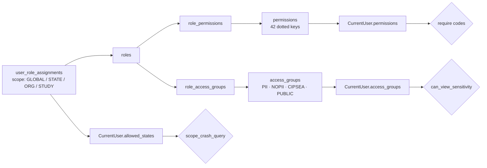
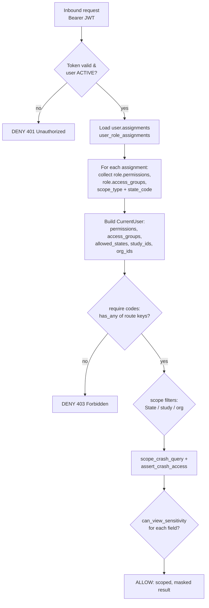
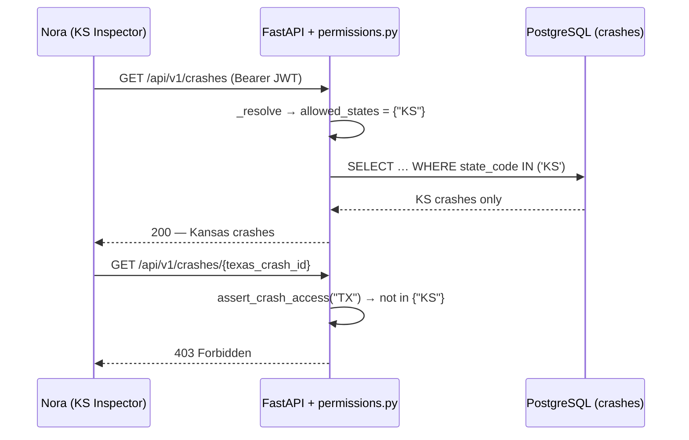
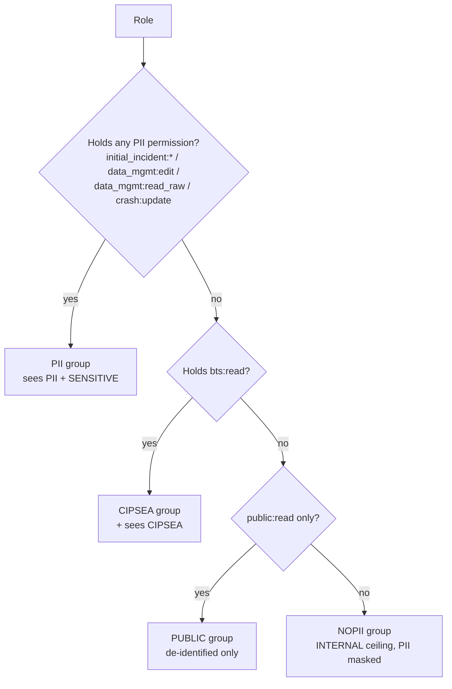
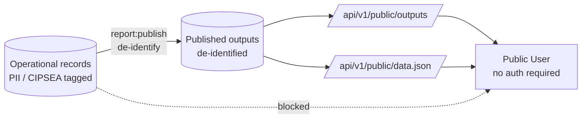

# RBAC / Roles & Permissions Matrix

**Phase:** Analyze · **Artifact family:** Security & Access Control

This page is authoritative for **who can do what** in the Crash Causal Factors
Program (CCFP) IT Solution. Where the [Workflow / Process](07-workflow-process.md)
page shows the *motion* of a crash record through the 8-phase lifecycle and the
[API Specification](09-api-specification.md) page shows the *contract* over the
wire, this page shows the **access boundary**: the twelve roles, the ~42-key
permission catalog, the scope filters that narrow each role to its State, study,
and data-sensitivity reach, and the server-side enforcement model that turns a
JWT into a 200 or a 403 on every request.

!!! abstract "What this page covers"
    - The **twelve roles** (`MCSAP_INSPECTOR` … `SYSTEM_ADMIN`), their purpose,
      State scope, and synthetic demo seed users.
    - The **~42-key permission catalog** grouped into eleven domains
      (`study:*`, `crash:*`, `initial_incident:*`, `source_data:*`,
      `data_mgmt:*`, `analytics:*`, `report:*`, `bts:*`, `public:*`,
      `admin:*`, plus `audit:*` / `notification:*`).
    - The **full role × permission-group grid** — twelve roles down, eleven
      permission groups across — with the exact grant set per cell.
    - **Scope semantics:** State-scope filtering, PII masking unless a role
      holds a data-entry / QC permission, the CIPSEA `bts:read` gate, and the
      public no-auth surface.
    - The **server-side enforcement model**:
      `user_role_assignments → roles → role_permissions` resolved into a
      `CurrentUser`, the `require(*codes)` dependency, and audit on every
      state-changing action.

!!! warning "Synthetic data only"
    Every role assignment, user, email, and credential on this page is **100%
    synthetic**, generated for development, testing, and demonstration. The seed
    domain `@ccfp.gov` is fictitious and non-deliverable; no real PII or
    CIPSEA-protected interview data exists in this environment. The demo
    sign-in password `Second@123` is a shared development credential, **not** a
    secret — production swaps the dev login for the DOT-approved OIDC provider
    (MFA / PIV / CAC).

!!! info "Where authorization is enforced"
    Authorization is enforced **server-side on every request** by FastAPI
    dependencies in `Backend/app/core/permissions.py`. The frontend
    (`Frontend/src/app/RequireAuth.tsx` and route guards) hides affordances the
    user lacks, but **never** gates security. The effective permission set is
    resolved once per request in `Backend/app/core/security.py::_resolve()` from
    the chain `user_role_assignments → roles → role_permissions`, and the
    sign-in credentials are listed in
    [Demo Credentials](../reference/demo-credentials.md).

---

## Table of contents

1. [Roles](#1-roles)
2. [Permission catalog](#2-permission-catalog)
3. [Full role × permission-group matrix](#3-full-role-permission-group-matrix)
    1. [Study configuration](#31-study-configuration)
    2. [Crash records](#32-crash-records)
    3. [Initial Incident Form](#33-initial-incident-form)
    4. [Source data](#34-source-data)
    5. [Data management, QC & completeness](#35-data-management-qc-completeness)
    6. [Analytics & reports](#36-analytics-reports)
    7. [CIPSEA, public, audit & admin](#37-cipsea-public-audit-admin)
4. [Permission resolution order](#4-permission-resolution-order)
5. [State scope isolation](#5-state-scope-isolation)
6. [PII masking & data-sensitivity reach](#6-pii-masking-data-sensitivity-reach)
7. [The CIPSEA gate](#7-the-cipsea-gate)
8. [The public no-auth surface](#8-the-public-no-auth-surface)
9. [Audit of state-changing actions](#9-audit-of-state-changing-actions)
10. [Anti-patterns](#10-anti-patterns)
11. [Related documents](#related-documents)

---

## 1. Roles

CCFP defines **twelve roles** (documentation §4), seeded verbatim into the
`roles` table by `Backend/database/seeds/0002_rbac_orgs_users.sql`. A role is a
named bundle of permission codes; a user receives one or more roles through a
row in `user_role_assignments` that also carries a **scope** (`GLOBAL`,
`STATE`, `ORGANIZATION`, or `STUDY`). The same seed file attaches every demo
user to exactly one role and scope, so the table below doubles as the demo
sign-in roster.

<div class="grid cards" markdown>

-   :material-shield-account: __State-scoped roles__

    Bound to a single participating State via a `STATE` assignment — they see
    only their State's crashes.

    `MCSAP_INSPECTOR` · `STATE_CMV_ANALYST` · `STATE_USER`

-   :material-account-tie: __Federal / program roles__

    `GLOBAL`-scoped FMCSA / Volpe program operators, analysts, and database
    administrators.

    `CCFP_PROJECT_TEAM` · `CCFP_PROJECT_ADMIN` · `CCFP_DB_ADMIN` ·
    `CCFP_DATA_SCIENTIST` · `FEDERAL_USER`

-   :material-lock-check: __CIPSEA roles__

    The only roles holding `bts:read` — the gate to confidential BTS interview
    data.

    `BTS_CIPSEA_AGENT` · `FMCSA_CIPSEA_AGENT`

-   :material-earth: __Public & system__

    The de-identified public surface and the technical break-glass operator.

    `PUBLIC_USER` · `SYSTEM_ADMIN`

</div>

| Code | Display name | Primary purpose | State scope | Demo seed user |
|---|---|---|:-:|---|
| `MCSAP_INSPECTOR` | MCSAP CMV Inspector | Responding inspector; owns the Initial Incident Form and inspection inputs | KS (demo) | `nora.kowalczyk@ccfp.gov` |
| `STATE_CMV_ANALYST` | State CMV Data Analyst | Coordinates State data collection, QC, coding, analysis; selects contributing factors | KS (demo) | `elliot.fontaine@ccfp.gov` |
| `STATE_USER` | State User | State enforcement / reconstruction / investigator participant; non-PII reports | KS (demo) | `tomasz.bialek@ccfp.gov` |
| `CCFP_PROJECT_TEAM` | CCFP Project Team | FMCSA / Volpe team for program ops, analysis, QC, reporting | — | `dana.whitfield@ccfp.gov` |
| `CCFP_PROJECT_ADMIN` | CCFP Project Team Administrator | Administers users, roles, study parameters, attributes, completeness rules | — | `avery.thornton@ccfp.gov` |
| `CCFP_DB_ADMIN` | CCFP Database Administrator | Manages data mappings & analytical datasets; views raw & aggregated data | — | `victor.delacruz@ccfp.gov` |
| `CCFP_DATA_SCIENTIST` | CCFP Data Scientist | Federal analytical role for crash causal-factor research | — | `priya.ramanathan@ccfp.gov` |
| `BTS_CIPSEA_AGENT` | BTS CIPSEA Agent | Conducts confidential interviews; access governed by CIPSEA | — | `helena.brandt@ccfp.gov` |
| `FMCSA_CIPSEA_AGENT` | FMCSA CIPSEA Agent | FMCSA role authorized to view protected BTS data where permitted | — | `marcus.ellingsworth@ccfp.gov` |
| `FEDERAL_USER` | Federal User | FMCSA / NHTSA / BTS & approved federal users; role-approved reports | — | `omar.haddad@ccfp.gov` |
| `PUBLIC_USER` | Public User | Consumes summarized, de-identified published data only | — | `public.demo@ccfp.gov` |
| `SYSTEM_ADMIN` | System Administrator | Technical ops: system configuration, environments, audit, support | — | `sysadmin@ccfp.gov` |

!!! tip "Scope-isolation test accounts"
    Three extra State-scoped accounts let you prove cross-State isolation:
    `rosa.menendez@ccfp.gov` (`MCSAP_INSPECTOR`, **TX**),
    `grant.holloway@ccfp.gov` (`STATE_CMV_ANALYST`, **TX**), and
    `linh.tran@ccfp.gov` (`STATE_CMV_ANALYST`, **CA**). All seeded accounts share
    the password `Second@123`. Sign in at
    <https://nexgile-dot-ccfp.nexgiletechnologies.com/login>.

The audience groupings used by the backend live in
`Backend/app/core/security.py::ROLE_GROUPS` — a single source of truth that the
frontend reads rather than hardcoding role lists:

```python
ROLE_GROUPS = {
    "STATE":   ["MCSAP_INSPECTOR", "STATE_CMV_ANALYST", "STATE_USER"],
    "FEDERAL": ["CCFP_PROJECT_TEAM", "CCFP_PROJECT_ADMIN", "CCFP_DB_ADMIN",
                "CCFP_DATA_SCIENTIST", "FMCSA_CIPSEA_AGENT", "FEDERAL_USER"],
    "CIPSEA":  ["BTS_CIPSEA_AGENT", "FMCSA_CIPSEA_AGENT"],
    "ADMIN":   ["CCFP_PROJECT_ADMIN", "SYSTEM_ADMIN"],
    "PUBLIC":  ["PUBLIC_USER"],
}
```

---

## 2. Permission catalog

CCFP uses a **seeded, dotted-form permission catalog** (group `:` action), not
ad-hoc role-string checks. The `permissions` table is populated by
`Backend/database/seeds/0002_rbac_orgs_users.sql` with **42 keys** across eleven
groups; `Backend/app/core/permissions.py` documents this exact count in its
module docstring. A role is granted a subset of these keys through
`role_permissions`; `SYSTEM_ADMIN` is granted **all** of them by a
`CROSS JOIN` in the same seed.

| Group | Permission keys | Count |
|---|---|:-:|
| `study` | `study:read`, `study:create`, `study:update`, `study:configure` | 4 |
| `crash` | `crash:read`, `crash:create`, `crash:update`, `crash:delete`, `crash:unlock` | 5 |
| `initial_incident` | `initial_incident:read`, `initial_incident:write`, `initial_incident:submit`, `initial_incident:delete` | 4 |
| `source_data` | `source_data:read`, `source_data:ingest`, `eld:upload`, `recon:upload`, `recon:code`, `pcr:read`, `pcr:map` | 7 |
| `data_management` | `data_mgmt:read_raw`, `data_mgmt:read_aggregated`, `data_mgmt:edit`, `data_mgmt:qc`, `data_mgmt:complete`, `contributing_factor:select` | 6 |
| `analytics` | `analytics:query`, `analytics:dashboard` | 2 |
| `reports` | `report:read`, `report:create`, `report:share`, `report:download`, `report:publish` | 5 |
| `bts` (CIPSEA) | `bts:read` | 1 |
| `public` | `public:read` | 1 |
| `admin` | `admin:users`, `admin:roles`, `admin:attributes`, `admin:completeness`, `admin:system` | 5 |
| `audit` / `notifications` | `audit:read`, `notification:read` | 2 |
| **Total** | | **42** |

!!! note "How keys map to enforcement"
    A FastAPI route declares the keys it accepts with
    `Depends(require("crash:update", "crash:create"))`. The `require(*codes)`
    factory yields the `CurrentUser` only when it `has_any(*codes)`; otherwise it
    raises `Forbidden` → HTTP 403. The companion `require_all(*codes)` demands
    **every** listed key. Query-level reads are additionally narrowed by the
    scope filters in §5 (`scope_crash_query`, `scope_org_query`,
    `scope_study_query`).



---

## 3. Full role × permission-group matrix

The grid below is the role view of `role_permissions`. Because the full
42-column matrix is impractically wide, the tables are split into the eleven
permission groups; within each group every individual key is listed so no grant
is hidden.

**Legend:**

| Mark | Meaning |
|:-:|---|
| ● | Granted to the role for all crashes it can see (subject to scope filters) |
| △ | Granted but **State-scoped** — the role holds the key only within its State assignment |
| — | Not granted (the route returns 403 for this role) |

The twelve role columns are abbreviated to keep the tables narrow:

| Abbrev | Role | Abbrev | Role |
|:-:|---|:-:|---|
| `IN` | `MCSAP_INSPECTOR` | `PA` | `CCFP_PROJECT_ADMIN` |
| `AN` | `STATE_CMV_ANALYST` | `DB` | `CCFP_DB_ADMIN` |
| `SU` | `STATE_USER` | `DS` | `CCFP_DATA_SCIENTIST` |
| `PT` | `CCFP_PROJECT_TEAM` | `BA` | `BTS_CIPSEA_AGENT` |
| `FA` | `FMCSA_CIPSEA_AGENT` | `FU` | `FEDERAL_USER` |
| `PU` | `PUBLIC_USER` | `SA` | `SYSTEM_ADMIN` |

!!! note "`SYSTEM_ADMIN` holds every key"
    The `SA` column is `●` for **every** permission in every group — the seed
    grants it the whole catalog by `CROSS JOIN`. For readability the per-key
    rows below still show `●` for `SA`, but treat it as universal.

### 3.1 Study configuration

| Permission | IN | AN | SU | PT | PA | DB | DS | BA | FA | FU | PU | SA |
|---|:-:|:-:|:-:|:-:|:-:|:-:|:-:|:-:|:-:|:-:|:-:|:-:|
| `study:read` | — | — | — | ● | ● | ● | ● | — | — | — | — | ● |
| `study:create` | — | — | — | — | ● | — | — | — | — | — | — | ● |
| `study:update` | — | — | — | — | ● | — | — | — | — | — | — | ● |
| `study:configure` | — | — | — | — | ● | — | — | — | — | — | — | ● |

Study lifecycle ownership belongs to `CCFP_PROJECT_ADMIN`: it is the only
non-system role that can **create, update, or configure** a study (set study
parameters, the canonical data-attribute catalog, attribute requirements, and
completeness rules). Program, database-admin, and data-scientist roles get
read-only visibility so they can interpret per-study required / optional /
read-only attributes during collection and analysis.

### 3.2 Crash records

| Permission | IN | AN | SU | PT | PA | DB | DS | BA | FA | FU | PU | SA |
|---|:-:|:-:|:-:|:-:|:-:|:-:|:-:|:-:|:-:|:-:|:-:|:-:|
| `crash:read` | △ | △ | △ | ● | ● | ● | ● | ● | ● | — | — | ● |
| `crash:create` | △ | △ | — | — | — | — | — | — | — | — | — | ● |
| `crash:update` | — | △ | — | ● | — | — | — | — | — | — | — | ● |
| `crash:delete` | — | — | — | — | — | — | — | — | — | — | — | ● |
| `crash:unlock` | — | — | — | — | — | — | — | — | — | — | — | ● |

The stable **CCFP identifier** is minted when a `MCSAP_INSPECTOR` or
`STATE_CMV_ANALYST` creates the crash record (via the Initial Incident Form, §3.3).
State roles' `crash:read` and `crash:create` are marked `△` because they are
**State-scoped** — `scope_crash_query` filters their SELECTs to
`Crash.state_code IN (allowed_states)`, and `assert_crash_access()` raises 403
if a State user reaches for a crash outside their State. `crash:delete` and
`crash:unlock` (reopening a completed record) are reserved to `SYSTEM_ADMIN`
break-glass, keeping completed records immutable for everyone else.

### 3.3 Initial Incident Form

| Permission | IN | AN | SU | PT | PA | DB | DS | BA | FA | FU | PU | SA |
|---|:-:|:-:|:-:|:-:|:-:|:-:|:-:|:-:|:-:|:-:|:-:|:-:|
| `initial_incident:read` | △ | △ | — | — | — | — | — | — | — | — | — | ● |
| `initial_incident:write` | △ | △ | — | — | — | — | — | — | — | — | — | ● |
| `initial_incident:submit` | △ | △ | — | — | — | — | — | — | — | — | — | ● |
| `initial_incident:delete` | △ | — | — | — | — | — | — | — | — | — | — | ● |

The Initial Incident Form (IIF) — created within 24–48 h of a crash — is the
exclusive province of the two State data-entry roles. Both `MCSAP_INSPECTOR`
and `STATE_CMV_ANALYST` can read, write, and submit the IIF (which triggers
routing and notifications); only the inspector who owns the form holds
`initial_incident:delete`. No federal, CIPSEA, public, or read-only State role
holds **any** IIF permission — these forms carry operational PII and are
withheld from report-only audiences (§6).

### 3.4 Source data

| Permission | IN | AN | SU | PT | PA | DB | DS | BA | FA | FU | PU | SA |
|---|:-:|:-:|:-:|:-:|:-:|:-:|:-:|:-:|:-:|:-:|:-:|:-:|
| `source_data:read` | △ | △ | — | ● | — | ● | — | — | — | — | — | ● |
| `source_data:ingest` | △ | △ | — | — | — | ● | — | — | — | — | — | ● |
| `eld:upload` | △ | △ | — | ● | — | — | — | — | — | — | — | ● |
| `recon:upload` | — | △ | — | — | — | — | — | — | — | — | — | ● |
| `recon:code` | — | △ | — | — | — | — | — | — | — | — | — | ● |
| `pcr:read` | — | △ | — | ● | — | ● | — | — | — | — | — | ● |
| `pcr:map` | — | △ | — | — | — | ● | — | — | — | — | — | ● |

Source-data collection is shared between the State analyst (the State-side
coordinator) and the `CCFP_DB_ADMIN` (the federal mapping role). Inspectors can
ingest and upload ELD / eRODS files alongside their inspection inputs.
**Reconstruction coding** (`recon:code`) and **PCR attribute mapping**
(`pcr:map`) are analyst / DB-admin specialties. `pcr:read` and
`source_data:read` are additionally available to `CCFP_PROJECT_TEAM` for QC
review. Every State grant here is `△` (State-scoped).

`eld:upload` covers upload, dry-run validation and re-running extraction on a
stored file. The BRD Jan-2026 **Appendix E** names its holders explicitly —
*"the MCSAP CMV Inspector and analysts on the CCFP Project Team"* — so
`CCFP_PROJECT_TEAM` holds it unscoped (`●`) alongside the two State roles;
`STATE_CMV_ANALYST` keeps it because the State analyst owns the crash's source
intake. `SYSTEM_ADMIN` holds it through the blanket administrative grant.

### 3.5 Data management, QC & completeness

| Permission | IN | AN | SU | PT | PA | DB | DS | BA | FA | FU | PU | SA |
|---|:-:|:-:|:-:|:-:|:-:|:-:|:-:|:-:|:-:|:-:|:-:|:-:|
| `data_mgmt:read_raw` | — | △ | — | ● | — | ● | — | — | — | — | — | ● |
| `data_mgmt:read_aggregated` | — | △ | — | ● | — | ● | ● | — | ● | — | — | ● |
| `data_mgmt:edit` | — | △ | — | ● | — | ● | — | — | — | — | — | ● |
| `data_mgmt:qc` | — | △ | — | ● | — | — | — | — | — | — | — | ● |
| `data_mgmt:complete` | — | △ | — | ● | — | — | — | — | — | — | — | ● |
| `contributing_factor:select` | — | △ | — | — | — | — | — | — | — | — | — | ● |

This is the quality-control heartbeat of the platform. The State analyst and the
`CCFP_PROJECT_TEAM` run QC (`data_mgmt:qc`), edit attributes during QC
(`data_mgmt:edit`), and flip the per-crash complete / incomplete status
(`data_mgmt:complete`). **Selecting the top-three contributing factors**
(`contributing_factor:select`) is reserved to the `STATE_CMV_ANALYST` — the role
the documentation designates as the selector of primary contributing factors.
Note the split between **raw** and **aggregated** reads: `data_mgmt:read_raw`
(which can expose PII) is narrow, while `data_mgmt:read_aggregated` reaches the
data scientist and FMCSA CIPSEA agent for analysis on de-identified roll-ups.

### 3.6 Analytics & reports

| Permission | IN | AN | SU | PT | PA | DB | DS | BA | FA | FU | PU | SA |
|---|:-:|:-:|:-:|:-:|:-:|:-:|:-:|:-:|:-:|:-:|:-:|:-:|
| `analytics:query` | — | — | — | ● | — | — | ● | — | — | — | — | ● |
| `analytics:dashboard` | — | — | — | ● | — | — | ● | — | — | — | — | ● |
| `report:read` | — | △ | △ | ● | ● | — | ● | — | ● | ● | — | ● |
| `report:create` | — | — | — | ● | — | — | ● | — | — | — | — | ● |
| `report:share` | — | — | — | ● | — | — | — | — | — | — | — | ● |
| `report:download` | — | — | △ | ● | — | — | ● | — | — | ● | — | ● |
| `report:publish` | — | — | — | — | — | — | — | — | — | — | — | ● |

Analytical querying and dashboards belong to the two federal analytical roles —
`CCFP_PROJECT_TEAM` and `CCFP_DATA_SCIENTIST` — running **whitelisted,
parameterized** queries (the analytics router never executes free-form SQL).
Report *reading* fans out widely (analyst, State user, project team, project
admin, data scientist, FMCSA CIPSEA agent, federal user), while **publishing
de-identified public outputs** (`report:publish`) is reserved to
`SYSTEM_ADMIN` — publication is the single most consequential one-way action in
the lifecycle and is deliberately the narrowest report grant.

### 3.7 CIPSEA, public, audit & admin

| Permission | IN | AN | SU | PT | PA | DB | DS | BA | FA | FU | PU | SA |
|---|:-:|:-:|:-:|:-:|:-:|:-:|:-:|:-:|:-:|:-:|:-:|:-:|
| `bts:read` | — | — | — | — | — | — | — | ● | ● | — | — | ● |
| `public:read` | — | — | — | — | — | — | — | — | — | ● | ● | ● |
| `notification:read` | △ | △ | △ | ● | ● | ● | ● | ● | ● | ● | — | ● |
| `audit:read` | — | — | — | — | — | — | — | — | — | — | — | ● |
| `admin:users` | — | — | — | — | ● | — | — | — | — | — | — | ● |
| `admin:roles` | — | — | — | — | ● | — | — | — | — | — | — | ● |
| `admin:attributes` | — | — | — | — | ● | — | — | — | — | — | — | ● |
| `admin:completeness` | — | — | — | — | ● | — | — | — | — | — | — | ● |
| `admin:system` | — | — | — | — | — | — | — | — | — | — | — | ● |

The CIPSEA gate (`bts:read`) is held **only** by the two CIPSEA agent roles plus
`SYSTEM_ADMIN`. The public read surface (`public:read`) is held by
`PUBLIC_USER` and `FEDERAL_USER` (and `SYSTEM_ADMIN`). **Administrative
delegation** splits cleanly: `CCFP_PROJECT_ADMIN` owns the *program*
administration keys (`admin:users`, `admin:roles`, `admin:attributes`,
`admin:completeness`) while `admin:system` (system configuration, environments)
and `audit:read` are reserved to `SYSTEM_ADMIN`. Notification reads reach every
authenticated role except the public user.

!!! tip "Reading the grid as a whole"
    Across all eleven groups, exactly **three** roles can mutate crash data
    (`MCSAP_INSPECTOR`, `STATE_CMV_ANALYST`, `CCFP_PROJECT_TEAM`), **two** can
    administer (`CCFP_PROJECT_ADMIN` for program config, `SYSTEM_ADMIN` for
    system + audit + break-glass), **two** carry the CIPSEA gate, and **two**
    are read-only consumers (`FEDERAL_USER`, `PUBLIC_USER`). This is
    least-privilege by construction: no role holds a key it does not need for
    its lifecycle phase.

---

## 4. Permission resolution order

Authorization for a given request resolves in a deterministic order inside
`Backend/app/core/security.py::_resolve()` (called once per request by
`get_current_user`) and the dependency factories in
`Backend/app/core/permissions.py`. There is **no** front-end trust: the JWT
carries only identity (`sub`, `email`), and the server re-reads the user's
assignments from PostgreSQL on every call.



The concrete passes:

1. **Authentication.** `get_current_user` decodes the Bearer JWT
   (`decode_token`), loads the `User`, and rejects (401) a missing token, an
   unknown subject, or a non-`ACTIVE` account.
2. **Resolution.** `_resolve()` walks `user.assignments`, unioning every
   role's permission codes into `CurrentUser.permissions`, every role's access
   groups into `access_groups`, and every `STATE` assignment's `state_code`
   into `allowed_states`. A single broadening `GLOBAL` (or non-`STATE`)
   assignment sets `allowed_states = None` → unrestricted by State.
3. **Permission gate.** The route's `require(*codes)` dependency calls
   `has_any(*codes)`; a miss raises `Forbidden` (403) **before** any query runs.
4. **Scope filter.** Read queries pass through `scope_crash_query`,
   `scope_org_query`, and `scope_study_query`, which add `WHERE … IN (…)`
   clauses only when the principal is explicitly restricted (default-permissive
   for `GLOBAL` users). Direct fetches call `assert_crash_access` /
   `assert_study_access`.
5. **Sensitivity mask.** Field-level visibility is decided by
   `can_view_sensitivity(level)` against the user's `access_groups` (§6).

!!! info "Default-permissive scope, by design"
    `scope_org_query` and `scope_study_query` only filter when the user holds an
    `ORGANIZATION`- or `STUDY`-scoped assignment **and** no broadening `GLOBAL`
    one. A `GLOBAL` assignment always wins and leaves the principal unrestricted
    — the same pattern as `allowed_states`. This keeps Phase 1 single-study
    behaviour correct while remaining ready for multi-study future phases.

---

## 5. State scope isolation

> **Guarantee:** a `STATE`-scoped user in Kansas has **no visibility** into a
> Texas crash, even though both are qualifying Class 7/8 fatal crashes in the
> same study.

State isolation is enforced by `scope_crash_query` in
`Backend/app/core/permissions.py`:

```python
def scope_crash_query(stmt, current):
    if current.allowed_states is None:   # GLOBAL / federal user
        return stmt
    return stmt.where(Crash.state_code.in_(current.allowed_states))
```

`allowed_states` is `None` for any user holding a `GLOBAL` assignment (all
federal / program / CIPSEA / public roles) and is the **set of assigned State
codes** for State roles. A direct fetch additionally calls:

```python
def assert_crash_access(crash, current):
    if not current.can_access_state(crash.state_code):
        raise Forbidden("Crash is outside your authorized State scope")
```

Concretely, in the synthetic seed
(`Backend/database/seeds/0002_rbac_orgs_users.sql`):

- `nora.kowalczyk@ccfp.gov` (`MCSAP_INSPECTOR`, **KS**) and
  `elliot.fontaine@ccfp.gov` (`STATE_CMV_ANALYST`, **KS**) see only Kansas
  crashes; a Texas crash returns 403 on direct fetch and is absent from list
  results.
- `rosa.menendez@ccfp.gov` (`MCSAP_INSPECTOR`, **TX**) and
  `grant.holloway@ccfp.gov` (**TX**) see only Texas; `linh.tran@ccfp.gov` sees
  only California.
- `omar.haddad@ccfp.gov` (`FEDERAL_USER`, `GLOBAL`) and every
  `CCFP_*` role have `allowed_states = None` → no State filter.



!!! warning "Onboarding gate"
    A State's crashes only become visible once a **data-sharing agreement** is in
    place and the State is added to the study's participating-State set. State
    scope is the access mechanism; the data-sharing agreement is the legal
    precondition. See [Solution Design](../03-design/13-solution-design.md).

---

## 6. PII masking & data-sensitivity reach

CCFP tags every stored value with a `data_sensitivity` level
(`PUBLIC` / `INTERNAL` / `PII` / `SENSITIVE` / `CIPSEA`). A role's reach across
these levels is **not** a hardcoded permission list — it is derived from
**access-group** membership in `access_groups` / `role_access_groups`, seeded by
`Backend/database/seeds/0008_access_groups.sql`. The decision lives in
`CurrentUser.can_view_sensitivity()`:

```python
def can_view_sensitivity(self, level):
    if level in ("PUBLIC", "INTERNAL"):
        return True
    if level == "CIPSEA":
        return "CIPSEA" in self.access_groups
    return "PII" in self.access_groups   # PII / SENSITIVE
```

The four access groups and the rule that assigns roles to them:

| Group | Sensitivity ceiling | Membership rule (by **permission**, not name) |
|---|---|---|
| `PII` | `PII` / `SENSITIVE` | Any role holding one of `initial_incident:read`, `initial_incident:write`, `data_mgmt:edit`, `data_mgmt:read_raw`, `crash:update` |
| `CIPSEA` | `CIPSEA` | Any role holding `bts:read` |
| `PUBLIC` | `PUBLIC` | `PUBLIC_USER` (the only role limited to `public:read`) |
| `NOPII` | `INTERNAL` | Every other role (the operational ceiling for read-only / CIPSEA roles) |

The membership rule is the key design choice: a role lands in the `PII` group
**because it holds a data-entry / QC permission**, mirroring
`Backend/app/core/security.py::_PII_PERMISSIONS`. This means PII visibility can
never drift away from the operational need that justifies it.



**Who sees PII:** `MCSAP_INSPECTOR`, `STATE_CMV_ANALYST`, `CCFP_PROJECT_TEAM`,
and `CCFP_DB_ADMIN` (they hold a qualifying data-entry / raw-read / edit key).
**Who has PII masked:** report-only roles — `STATE_USER`, `CCFP_DATA_SCIENTIST`,
`FEDERAL_USER`, the CIPSEA agents (for *operational* PII), and `PUBLIC_USER`.
For these, PII / SENSITIVE fields are withheld or masked while `PUBLIC` and
`INTERNAL` aggregates still flow through.

!!! note "Two independent ceilings"
    A CIPSEA agent illustrates the orthogonality: it lands in **NOPII** for
    operational crash data (no PII permission) *and* in **CIPSEA** for interview
    data (`bts:read`). The two ceilings stack independently — holding the CIPSEA
    gate never grants operational PII, and holding operational PII never grants
    CIPSEA.

---

## 7. The CIPSEA gate

Confidential BTS interview data is the most tightly held data class in CCFP,
protected by the **Confidential Information Protection and Statistical
Efficiency Act (CIPSEA)**. Access is a single, unambiguous gate: the permission
key `bts:read`.

| Role | Holds `bts:read`? | In `CIPSEA` access group? |
|---|:-:|:-:|
| `BTS_CIPSEA_AGENT` | ● | ● |
| `FMCSA_CIPSEA_AGENT` | ● | ● |
| `SYSTEM_ADMIN` | ● (full catalog) | ● |
| *all other nine roles* | — | — |

The gate is enforced **twice**, defence-in-depth:

1. **Route gate.** BTS endpoints declare `Depends(require("bts:read"))`. A role
   without the key never reaches the handler — 403.
2. **Field gate.** `can_view_sensitivity("CIPSEA")` returns `True` only when
   `"CIPSEA" in access_groups`, so even a value tagged `CIPSEA` that leaks into
   a shared payload is masked for non-CIPSEA principals.

!!! danger "CIPSEA is not transitive"
    No combination of other permissions — not `admin:users`, not
    `data_mgmt:read_raw`, not `report:read` — confers `bts:read`. The only way
    to view CIPSEA-protected interview data is an explicit assignment to a CIPSEA
    agent role (or `SYSTEM_ADMIN` break-glass, which is audited). Published
    outputs are de-identified before they ever reach a non-CIPSEA surface.

---

## 8. The public no-auth surface

CCFP exposes a deliberately small **unauthenticated** surface for de-identified
published outputs. Every other endpoint requires a valid Bearer token; the
public routes under `/api/v1/public/...` (and the health checks) are the **only**
exceptions.

| Public route | Purpose | Auth |
|---|---|:-:|
| `GET /api/v1/public/outputs` | List published, de-identified outputs | none |
| `GET /api/v1/public/studies/{study_id}/outputs` | Per-study published outputs | none |
| `GET /api/v1/public/data.json` | Open-data catalog feed | none |
| `GET /api/v1/public/reports/{report_id}` | A single published report | none |
| `GET /api/v1/public/reports/{report_id}/download` | Download a published report | none |

The matching authenticated permission, `public:read`, is held by `PUBLIC_USER`,
`FEDERAL_USER`, and `SYSTEM_ADMIN` — but it is **not required** to read the
public routes, which serve already-de-identified content. The separation is
structural: published outputs are produced by `report:publish` (system-admin
only), are de-identified at publication, and live separately from operational
records, so the public surface can never expose a PII or CIPSEA value.



!!! tip "Verify it yourself"
    Browse <https://nexgile-dot-ccfp.nexgiletechnologies.com/public> without
    signing in to see exactly what an unauthenticated visitor can reach, then
    sign in as `public.demo@ccfp.gov` / `Second@123` to confirm an authenticated
    Public User sees the same de-identified content and nothing more.

---

## 9. Audit of state-changing actions

Every **state-changing** action writes an immutable `audit_logs` row; lifecycle
events additionally create `notifications`. The platform follows the project
convention: *state-changing actions write `audit_logs`; lifecycle events create
`notifications`.* Read evaluations are **not** audited — that would flood the
log with one row per request — but every `POST` / `PATCH` / `PUT` / `DELETE`,
every IIF submission, every QC completion, every contributing-factor selection,
and every publication is recorded.

A representative (synthetic) audit row:

```json
{
  "actor_id": "<user-uuid>",
  "action": "crash.update",
  "resource": "crashes",
  "resource_id": "<crash-uuid>",
  "state_code": "KS",
  "before": {"completeness_status": "PARTIAL"},
  "after":  {"completeness_status": "COMPLETE"},
  "metadata": {"endpoint": "PATCH /api/v1/crashes/{id}/completeness",
               "role": "STATE_CMV_ANALYST"}
}
```

!!! note "What is and isn't audited"
    - **Audited (`audit_logs`):** create / update / delete of crashes, IIF
      submit & delete, source-data ingest, QC edits, completeness flips,
      contributing-factor selection, role / user / attribute admin changes,
      report publish, and `crash:unlock` break-glass.
    - **Not in `audit_logs`:** routine reads, and 401 / 403 denials — denials are
      emitted as structured WARN-level log lines so the audit trail is not filled
      with denial spam from misconfigured clients.

Audit-log **reads** require `audit:read`, held only by `SYSTEM_ADMIN`. Combined
with immutability (append-only, no update / delete path), this satisfies the
compliance requirement for an immutable, least-privilege audit trail.

---

## 10. Anti-patterns

The patterns below are prohibited and should be caught in code review. They are
listed here so reviewers and future contributors have a single reference.

1. **Never gate security on the frontend.** Route guards in
   `Frontend/src/app/` hide affordances the user lacks, but they are cosmetic.
   Every request must pass a `require(*codes)` dependency from
   `Backend/app/core/permissions.py`. A button the UI forgot to hide must still
   return 403 server-side.

2. **Never compare role strings outside the resolver.** Permission decisions use
   the seeded **permission codes** via `has_any()` / `has_permission()`, never
   `if role == "STATE_CMV_ANALYST"`. Role strings exist only in
   `user_role_assignments` and the `ROLE_GROUPS` map; routes ask *"do you hold
   this permission?"*, not *"are you this role?"*.

3. **Never skip the scope filter on a crash query.** Any SELECT over `crashes`
   that can reach a State user must pass through `scope_crash_query`, and any
   direct fetch must call `assert_crash_access`. A raw `SELECT * FROM crashes`
   in a route would leak cross-State data.

4. **Never derive PII reach from a role name.** Data-sensitivity visibility comes
   from `access_groups` membership (`can_view_sensitivity`), which is seeded from
   *permission codes*, not role names. Adding a role to the PII group by name
   would let it drift away from the operational need that justifies PII access.

5. **Never treat `bts:read` as implied.** CIPSEA access is explicit and
   non-transitive — no admin, raw-read, or report permission confers it. A new
   BTS endpoint must declare `Depends(require("bts:read"))`.

6. **Never publish operational records directly.** Public output must be produced
   through `report:publish` (system-admin) and de-identified; the
   `/api/v1/public/...` routes must only ever read from the published,
   de-identified store, never from operational tables.

7. **Never use `SYSTEM_ADMIN` as a routine working role.** It holds the entire
   catalog (including `crash:unlock`, `crash:delete`, `admin:system`,
   `audit:read`) and is reserved for break-glass operations — each of which
   carries an `audit_logs` row reviewed by the `CCFP_PROJECT_ADMIN`.

---

## Related documents

- [03 — Stakeholders & Personas](../01-discover/03-stakeholders-personas.md) — the twelve roles with narrative context and demo seed users
- [04 — Business Requirements](../01-discover/04-business-requirements.md) — the security, audit, and RBAC requirements this matrix implements
- [07 — Workflow / Process](07-workflow-process.md) — the 8-phase lifecycle and the role-gated transitions this matrix enforces
- [08 — Data Model](08-data-model.md) — the `users`, `roles`, `permissions`, `role_permissions`, `user_role_assignments`, and `access_groups` tables behind this page
- [09 — API Specification](09-api-specification.md) — every endpoint's permission gate, pivoted by URL
- [11 — Architecture & Sequence](../03-design/11-architecture-sequence.md) — login, token decode, and dependency-resolution sequence
- [13 — Solution Design](../03-design/13-solution-design.md) — OIDC / MFA / PIV-CAC posture, data-sharing agreements, and the production authorization rollout
- [14 — Operations Runbook](../04-release/14-operations-runbook.md) — break-glass procedure, role-rotation playbook, and audit-log review cadence
- [Demo Credentials](../reference/demo-credentials.md) — the full synthetic sign-in roster used throughout this page
- [Glossary](../glossary.md) — CIPSEA, PII, RBAC, scope, and other terms used here

*End of 10 — RBAC / Roles & Permissions Matrix.*
