# 11 — Architecture & Sequence Diagrams

**Phase:** Design · **Artifact family:** Architecture

This page captures the **high-level architecture** of the FMCSA **Crash Causal
Factors Program (CCFP) IT Solution** — Phase 1 Heavy-Duty Truck Study — using a
C4-inspired progression: a **Level 1 system context**, a **Level 2 container
view**, then a series of **principal sequence diagrams** for the flows the build
actually implements. Everything here is grounded in
`Documentation/project_documentation.md` §6 (System Architecture), §10 (Backend
Architecture), §12 (API Design), §13 (External Integrations), and §14 (Security,
Privacy, Compliance), plus `CLAUDE.md`.

The companion [Component Diagram](12-component-diagram.md) zooms inside each
container; the [Solution Design](13-solution-design.md) covers the rationale
behind the choices, and the
[Operations Runbook](../04-release/14-operations-runbook.md) describes how to
bring the system up and migrate it toward the production target.

!!! warning "100% synthetic data"
    Every record, name, email, and CCFP identifier shown on this page is
    **synthetic** — seeded for the demo only. The `@ccfp.gov` domain is
    fictitious and non-deliverable. No real PII, CIPSEA interview data, or
    production crash records appear anywhere in this documentation.

!!! tip "Where the pieces come from"
    The sequence diagrams here use the endpoints from
    [09 — API Specification](../02-analyze/09-api-specification.md), the tables
    from [08 — Data Model](../02-analyze/08-data-model.md), the role gates from
    [10 — RBAC Matrix](../02-analyze/10-rbac-matrix.md), and the lifecycle
    phases from [07 — Workflow / Process](../02-analyze/07-workflow-process.md).
    The 12 personas the L1 context serves are catalogued in
    [03 — Stakeholders & Personas](../01-discover/03-stakeholders-personas.md).

-   :material-sitemap: **Three-tier topology**

    React SPA → FastAPI API & workflow services → PostgreSQL. HTTPS/JSON,
    REST, versioned under `/api/v1/...`. PostgreSQL is the **sole** data store.

-   :material-shield-key: **Auth that swaps cleanly**

    Dev path issues a bcrypt-verified JWT from a mock IdP; the production
    target swaps in a DOT-approved OIDC provider (MFA / PIV / CAC) behind the
    same token contract.

-   :material-source-branch: **Adapter seams everywhere**

    SafeSpect, CDLIS, MCMIS, and eRODS are **mock adapters** behind stable
    interfaces, feature-flagged `CCFP_INTEGRATION_*_LIVE`. Callers never see
    the seam move.

-   :material-cog-sync: **In-process workers**

    ELD parsing, QC evaluation, and completeness evaluation run via FastAPI
    `BackgroundTasks` today; the functions are structured to be
    Celery/Redis-swappable in production.

## 1. System context (C4 L1)

The CCFP IT Solution is one user-facing system that serves the **12 CCFP
roles** across three persona clusters — State responders, federal/program
staff, and public consumers — with explicit adapter seams where the external
integrations (FMCSA-owned and non-FMCSA sources) plug in. The current build
ships **mock adapters** for every external surface so the flows below run
end-to-end without the production integrations being live.

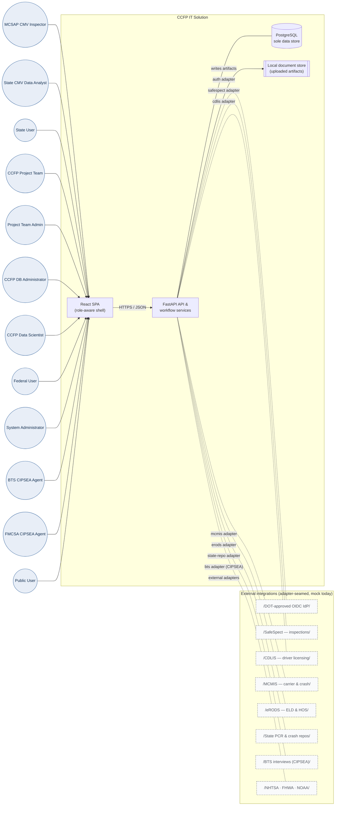

**Anchor references**

- 12 roles: `Documentation/project_documentation.md` §4; `CLAUDE.md` "User Roles".
- Mock integration adapters: `Backend/app/integrations/` (SafeSpect, CDLIS, MCMIS, eRODS).
- External source catalog: `Documentation/project_documentation.md` §13.1–§13.2.

## 2. Container view (C4 L2)

One browser SPA, one FastAPI process, one PostgreSQL instance. PostgreSQL is the
**sole data store** — it backs the transactional workflow, analytics, SQL
`ILIKE` search, and document metadata; the uploaded binaries themselves land on
local disk. Background work runs **in-process** via FastAPI `BackgroundTasks`;
the build chooses single-process simplicity over Celery + Redis, with the
worker functions written to be swap-in-ready. The DB connection is supplied via
the `DATABASE_URL` / `CCFP_DATABASE_URL` environment variable (value never shown
in code or docs).

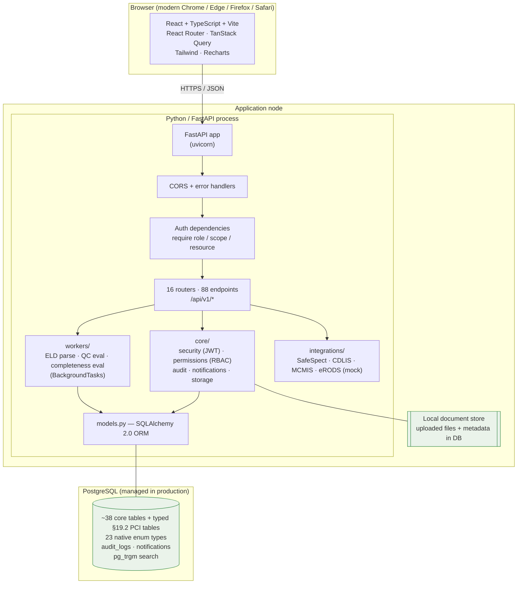

!!! abstract "Deployment facts (current build)"
    - **Backend:** `uvicorn app.main:app` (dev with `--reload`); docs at `/docs`,
      health at `/health` and `/health/db`.
    - **Frontend:** Vite dev server proxies `/api` → the backend; production
      serves the static build behind the public site.
    - **Database:** PostgreSQL, the sole data store. Connection comes from the
      `DATABASE_URL` env var / secrets manager — **never** hardcoded; the value
      is not shown anywhere in code or documentation.
    - **Document store:** uploaded files written to local disk; metadata rows in
      the `documents` table.
    - **Live demo:** <https://nexgile-dot-ccfp.nexgiletechnologies.com> ·
      docs at <https://nexgile-dot-ccfp.nexgiletechnologies.com/docs>.

## 3. Authentication sequence (dev JWT)

The current build ships a **bcrypt + JWT** auth path so the demo runs without an
external IdP. `POST /api/v1/auth/login` looks up the seeded user, verifies the
password against `users.password_hash` with bcrypt, resolves the caller's
effective permissions (`user_role_assignments → roles → role_permissions`) and
State scope, then issues a signed JWT. Every subsequent call carries
`Authorization: Bearer <token>`; server-side authorization runs on **every**
request except health checks and `/api/v1/public/...`.

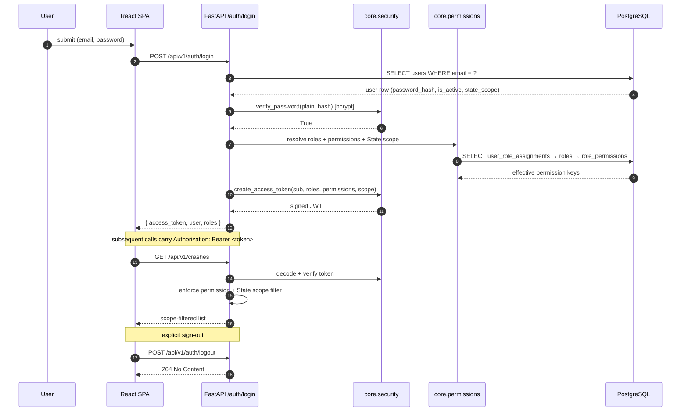

!!! note "Demo sign-in (synthetic)"
    Sign in at <https://nexgile-dot-ccfp.nexgiletechnologies.com/login>. **All
    seeded accounts share the password `Second@123`.** A few representative
    accounts (full table on the
    [Demo Credentials](../reference/demo-credentials.md) page):

    | Role | Email | Password | State |
    |---|---|---|---|
    | System Administrator | `sysadmin@ccfp.gov` | `Second@123` | — |
    | CCFP Project Team Admin | `avery.thornton@ccfp.gov` | `Second@123` | — |
    | Federal User | `omar.haddad@ccfp.gov` | `Second@123` | — |
    | MCSAP CMV Inspector | `nora.kowalczyk@ccfp.gov` | `Second@123` | KS |
    | State CMV Data Analyst | `elliot.fontaine@ccfp.gov` | `Second@123` | KS |
    | Public User | `public.demo@ccfp.gov` | `Second@123` | — |

**Anchor references**

- Login + token issuance: `Backend/app/features/auth.py`, `Backend/app/core/security.py`.
- Effective-permission resolution + scope: `Backend/app/core/permissions.py`.
- Dev-auth flag: `CCFP_DEV_AUTH_ENABLED` (set `false` in production).

## 4. Authentication sequence (production target — OIDC + MFA + PIV/CAC)

In production, `CCFP_DEV_AUTH_ENABLED=false` swaps the password check for a
redirect to the **DOT-approved OIDC IdP**. MFA is required for all users; PIV/CAC
is layered on as a step-up for federal staff via the OIDC ACR claim. The **token
shape and every downstream authorization dependency stay identical** — only the
issuer changes, so the sequences in §3 and §5–§12 are unaffected.

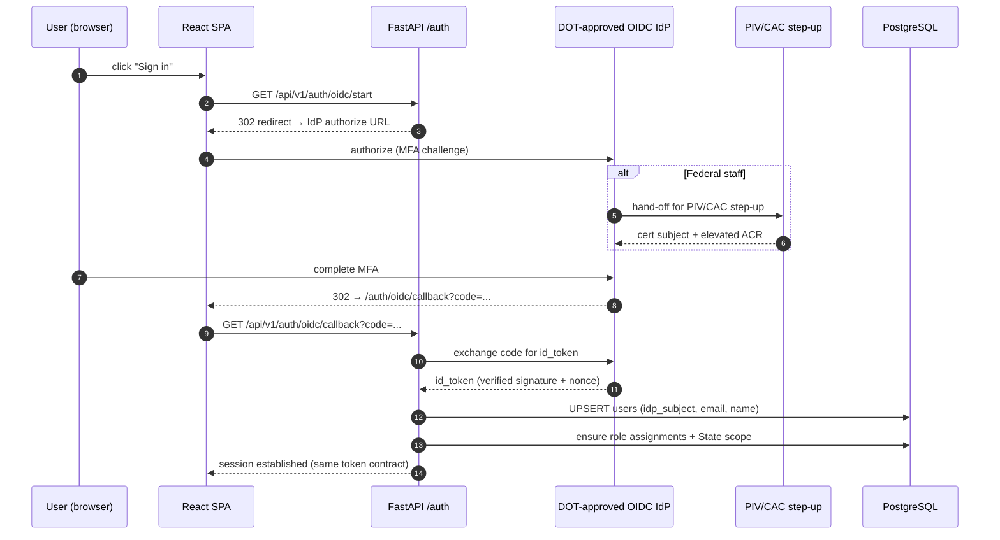

!!! info "Status"
    OIDC / MFA / PIV-CAC is the **production target**, not the demo path. The
    `auth` adapter seam is reserved so the swap touches only the issuer, never
    the route handlers or the RBAC dependencies in
    [10 — RBAC Matrix](../02-analyze/10-rbac-matrix.md).

## 5. Crash create + CCFP identifier

A crash record is the spine of the whole platform. `POST /api/v1/crashes`
creates the crash shell, assigns the **one stable `ccfp_identifier`**, and runs
the qualifying / in-scope classification (Phase 1: ≥1 fatality AND ≥1 heavy-duty
Class 7/8 truck, in a participating State). Every state-changing call writes an
`audit_logs` row.

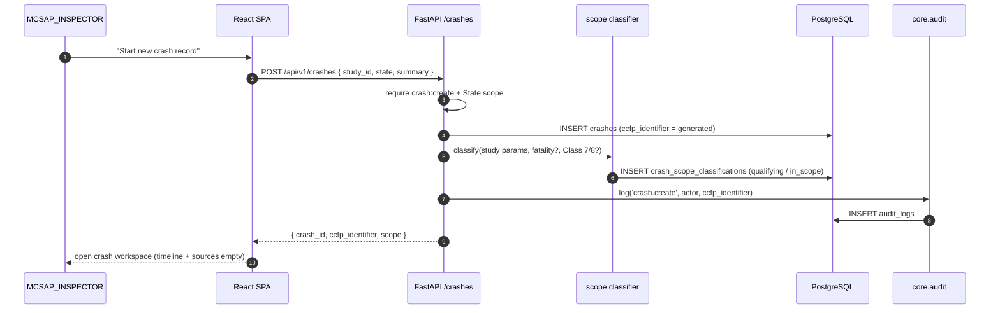

**Anchor references**

- Crash CRUD + CCFP id + scope: `Backend/app/features/crashes.py` (§12.3).
- Stable identifier + scope tables: `crashes`, `crash_scope_classifications` (§11.1).
- Qualifying / in-scope rules: `Documentation/project_documentation.md` §3.3, `CLAUDE.md` "Key Domain Concepts".

## 6. Initial Incident Form submit + DOT validation + routing

The **Initial Incident Form (IIF)** is created within 24–48 h of a crash by the
responding `MCSAP_INSPECTOR`. On submit, the backend validates required fields,
validates the U.S. DOT number against the SafeSpect adapter, persists vehicles
and persons, and **routes** the crash — the `STATE_CMV_ANALYST` is always
notified, and an in-scope crash **additionally** notifies the
`BTS_CIPSEA_AGENT`(s) so the confidential interview workflow can begin — fanning
out notifications.

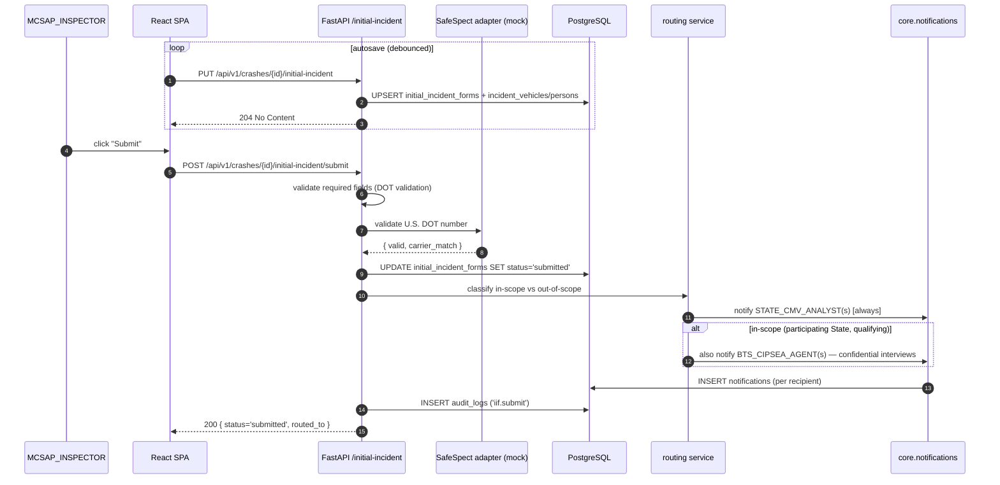

**Anchor references**

- IIF save/submit/delete + DOT validation + routing: `Backend/app/features/initial_incident.py` (§12.4).
- Vehicles & persons: `incident_vehicles`, `incident_persons` (§11.1, §19.1).
- Routing & notification triggers: `Documentation/project_documentation.md` §5 (Phase 2), §8.11.

## 7. Source-data ingest (provenance preserved)

Source data arrives by upload, manual entry, or integration adapter:
post-crash inspections (SafeSpect), the typed §19.2 Post-Crash Investigation
form, Police Crash Reports (with State-specific PCR mapping), reconstruction
reports (coded into research attributes), and ELD/eRODS CSV files (parsed into
events). **Every source value retains provenance** via `source_records` and the
`source_*` columns on `crash_attribute_values`, and ELD parsing runs as a
background worker.

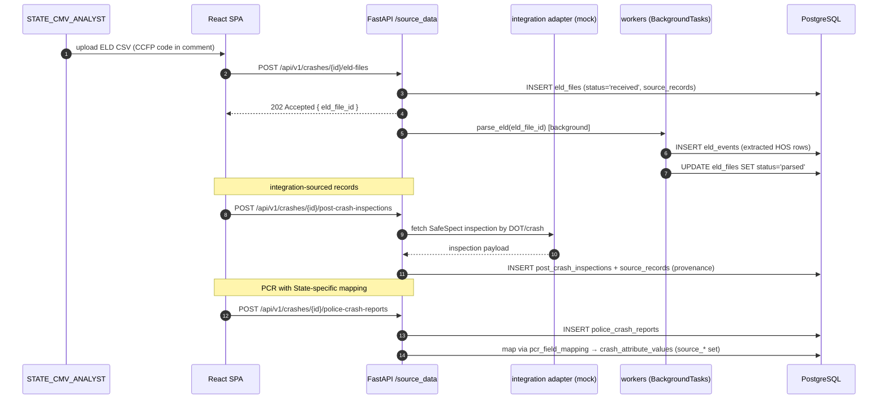

**Anchor references**

- Source-data router (inspections, investigations, PCR + mapping, reconstruction, ELD): `Backend/app/features/source_data.py` (§12.5, §8.3–§8.7).
- ELD parsing worker: `Backend/app/workers/` (Celery-swappable).
- Provenance model: `source_records` + `crash_attribute_values.source_*` (§11.3).

## 8. QC evaluation + completeness evaluation

Quality control and completeness are **configurable per study**. The QC worker
evaluates `data_quality_rules` against a crash's canonical attributes, writing
`data_quality_results`; the completeness worker evaluates `completeness_rules`
and sets a single current `crash_completeness_status`. QC failures and status
changes fan out notifications. Both workers are callable synchronously via
`.../evaluate` endpoints or in the background.

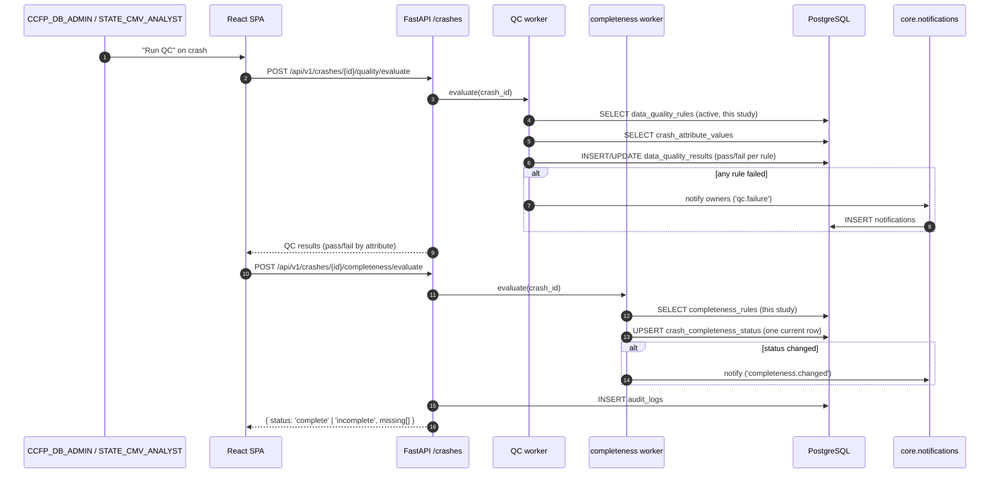

!!! tip "Unlock to edit a complete record"
    A completed record can be unlocked for authorized edit via
    `POST /api/v1/crashes/{id}/unlock` (requires `crash:unlock`). The unlock,
    every subsequent edit, and the re-evaluation are all captured in
    `audit_logs` so the change history stays intact.

**Anchor references**

- QC + completeness workers: `Backend/app/workers/` (QC eval, completeness eval).
- Rules & results: `data_quality_rules`, `data_quality_results`, `completeness_rules`, `crash_completeness_status` (§11.1).
- Per-study configurability: `Documentation/project_documentation.md` §8.8, §11.3.

## 9. Report publish (de-identified) + public access

A `CCFP_DATA_SCIENTIST` or `CCFP_PROJECT_TEAM` member builds a report from the
analytical data, shares it for review, then **publishes** a summarized,
**de-identified** output. Published outputs are **separated from operational
records** and exposed under `/api/v1/public/...` with **no authentication** —
the only routes the platform serves anonymously.

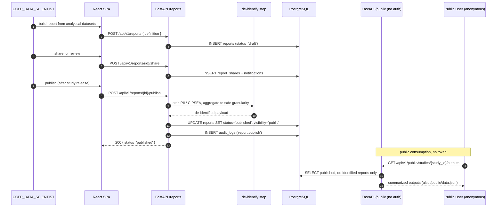

**Anchor references**

- Reports CRUD / share / publish / download: `Backend/app/features/reports.py` (§12.6).
- Public, no-auth outputs: `Backend/app/features/public.py` — `/public/outputs`, `/public/studies/{id}/outputs`, `/public/data.json`, `/public/reports/{id}`.
- De-identification + separation: `Documentation/project_documentation.md` §11.3, §14; `CLAUDE.md` data-model bullet.

## 10. Document upload + malware scan + signed-URL download

Uploaded artifacts (reconstruction PDFs, images, videos, ELD CSVs, generated
reports) are written to the local document store, recorded as `documents`
metadata rows, and **malware-scanned** before they become visible. Downloads go
through a **signed URL** so object access is time-limited and access-controlled.

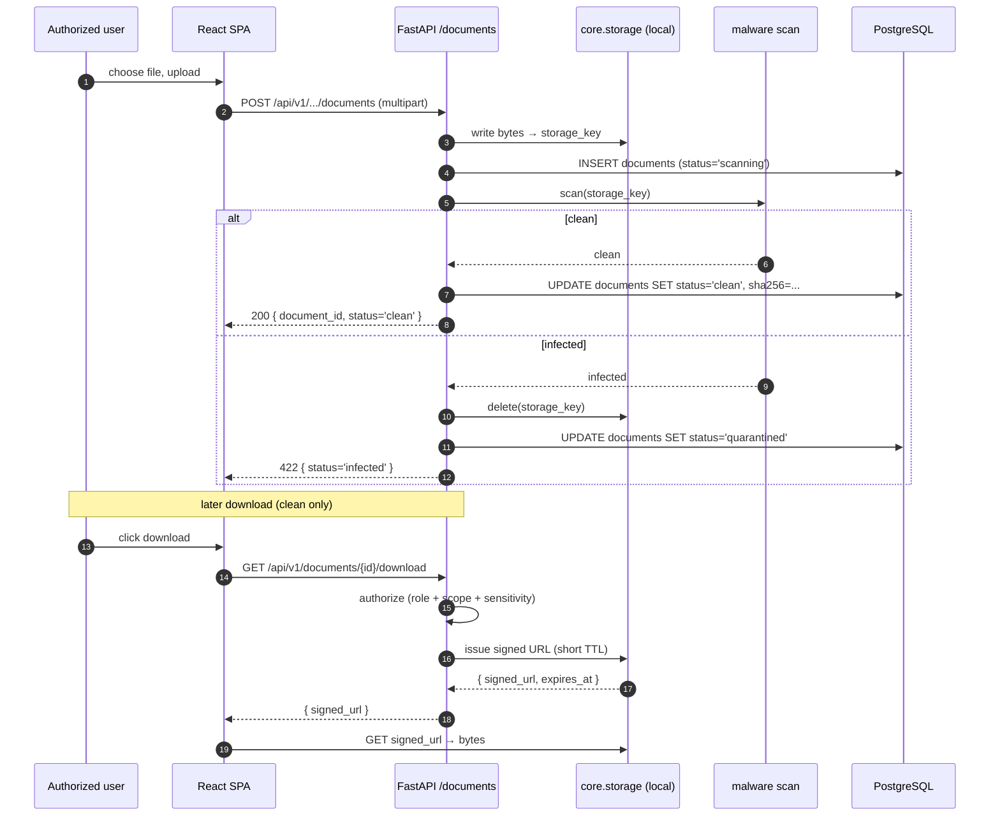

!!! warning "Production swap"
    In production, local object storage is replaced by **encrypted cloud
    storage** with versioning, and the malware-scan step calls a **real**
    scanner. Signed-URL access and the `documents` metadata contract stay the
    same; only the storage adapter changes. See
    [13 — Solution Design](13-solution-design.md).

**Anchor references**

- Documents router (upload + scan + signed-URL download): `Backend/app/features/documents.py` (§8, §14.2).
- Storage abstraction: `Backend/app/core/storage.py`.
- Controls: encryption at rest, signed-URL access, upload malware scanning (§14.2).

## 11. Audit write path

Every state-changing action writes one immutable row to `audit_logs` — actor,
action, resource, before/after, and timestamp. The audit write happens **inside
the same request** as the mutation, after the business write and before
notifications, so the record of "who changed what, when" is never lost. PII and
CIPSEA-tagged fields are masked at read time per the caller's permissions.

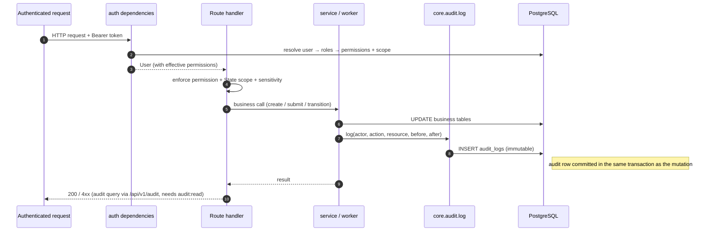

**Anchor references**

- Audit service: `Backend/app/core/audit.py`; query API `Backend/app/features/audit.py` (`audit:read`).
- Immutable audit requirement: `Documentation/project_documentation.md` §14.2; `CLAUDE.md` "Architecture & Conventions".
- PII / CIPSEA masking at read: `Backend/app/core/permissions.py`.

## 12. Notification fan-out

A single business event (new IIF, in-scope routing, missing data, QC failure,
completeness change, report publish/share) fans out to **N notification rows** —
one per resolved recipient, deduplicated by user and **filtered by State scope
and data sensitivity** so a recipient never sees an event outside their reach.
The same rows drive the in-app inbox (`GET /api/v1/notifications`).

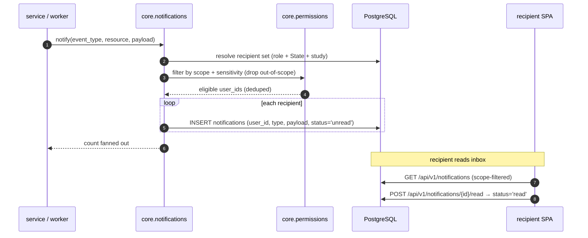

**Anchor references**

- Notification service + list/mark-read: `Backend/app/core/notifications.py`, `Backend/app/features/notifications.py` (§8.11, §12).
- Notification triggers (8 event types): `Documentation/project_documentation.md` §8.11.
- Scope/sensitivity filtering: `Backend/app/core/permissions.py`.

## Non-functional concerns summarized

| Concern | Approach in the current build | Production target |
|---|---|---|
| Throughput | Single FastAPI process + asyncio; in-process `BackgroundTasks` | Horizontal scale; ≥1,000 concurrent users (§15) |
| Async work | FastAPI `BackgroundTasks` (ELD parse, QC, completeness) | Celery / Redis workers |
| Availability | Single node (dev / pilot) | 24/7 except scheduled maintenance (§15) |
| Auth | Mock IdP → bcrypt + JWT | DOT-approved OIDC (MFA / PIV-CAC) |
| Data store | PostgreSQL only (analytics, search, doc metadata) | DOT-approved managed PostgreSQL |
| Search | SQL `ILIKE` + `pg_trgm`, scope/PII-aware | Approved enterprise search where required |
| Object storage | Local disk + malware-scan + signed URL | Encrypted cloud storage + real AV scan |
| Security | Server-side authz every request; encryption in transit/at rest | Same controls, hardened (§14.2) |
| Auditability | Synchronous `audit_logs` write per mutation | Immutable audit, NARA records mgmt |
| Privacy | PII/CIPSEA tagging + masking; de-identified public outputs | Privacy Act PTA/PIA/SORN; CIPSEA |
| Accessibility | Section 508 / WCAG 2.1 AA targets | DOT-approved design system |

---

## Related documents

- [07 — Workflow / Process Diagrams](../02-analyze/07-workflow-process.md) — lifecycle flowcharts behind every sequence above
- [08 — Data Model](../02-analyze/08-data-model.md) — tables persisted by each sequence
- [09 — API Specification](../02-analyze/09-api-specification.md) — endpoints invoked by each sequence
- [10 — RBAC Matrix](../02-analyze/10-rbac-matrix.md) — role and permission gates enforced inside each flow
- [12 — Component Diagram](12-component-diagram.md) — module-level breakdown of every container
- [13 — Solution Design](13-solution-design.md) — rationale and patterns behind the architecture
- [14 — Operations Runbook](../04-release/14-operations-runbook.md) — how to start, stop, and migrate the system
- [04 — Business Requirements](../01-discover/04-business-requirements.md) — non-functional requirements driving the topology
- [03 — Stakeholders & Personas](../01-discover/03-stakeholders-personas.md) — the 12 roles the L1 context serves
- [Demo Credentials](../reference/demo-credentials.md) — full synthetic sign-in table
- [Quickstart](../quickstart.md) — run the platform locally and sign in

*End of 11 — Architecture & Sequence Diagrams.*
