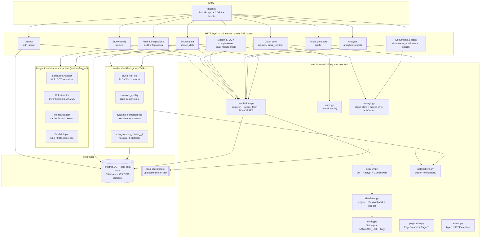
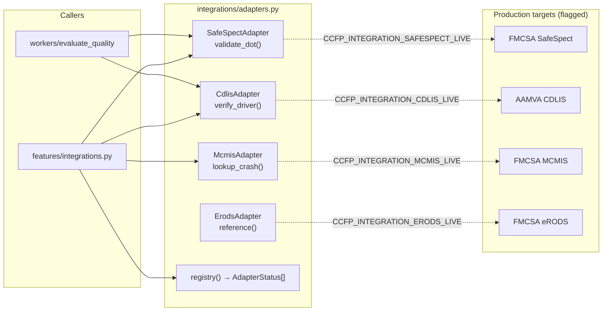
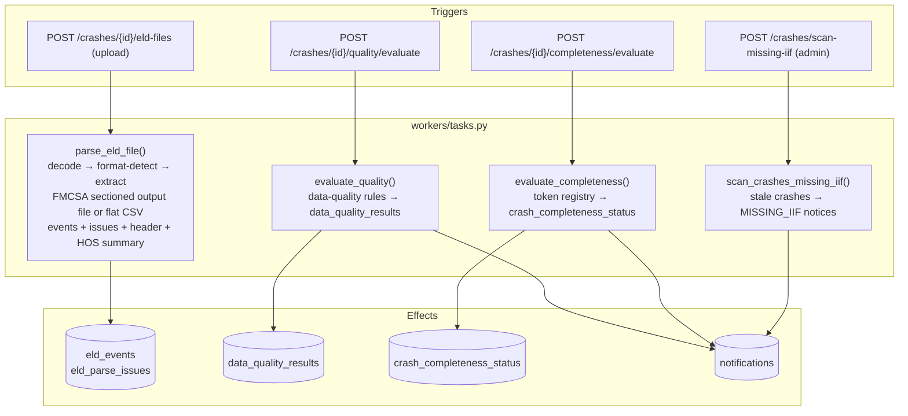
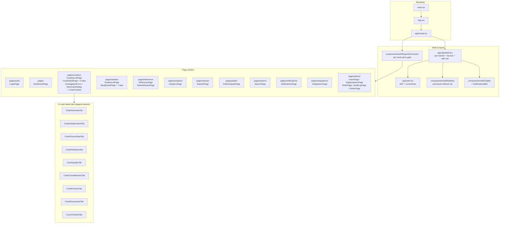
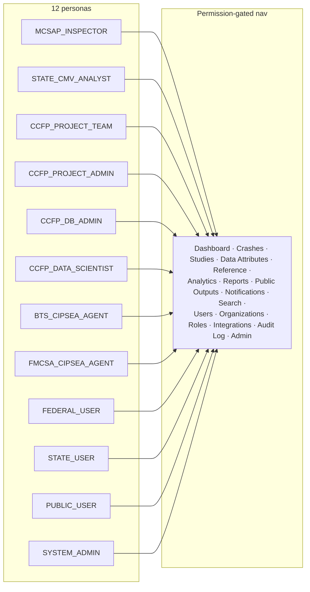

# 12 — Component Diagram

**Phase:** Design · **Artifact family:** Components & Modules

The [High-Level Architecture](11-architecture-sequence.md) showed the
**Crash Causal Factors Program (CCFP) IT Solution** as three tiers — a
React SPA, a FastAPI API + workflow services, and a single PostgreSQL
store. This document zooms *inside* each tier and enumerates every
**component** (core module, feature router, integration adapter,
background worker, UI cluster, shared primitive) with its responsibility
and primary interfaces.

!!! tip "Where to go next"
    Each feature router exposes endpoints in
    [API Specification](../02-analyze/09-api-specification.md), persists
    to tables in [Data Model](../02-analyze/08-data-model.md), and is
    gated by permission keys in
    [RBAC Matrix](../02-analyze/10-rbac-matrix.md). The frontend page
    clusters map to the personas in
    [Stakeholders & Personas](../01-discover/03-stakeholders-personas.md).
    Design rationale and stack choices are in
    [Solution Design](13-solution-design.md), and per-component
    operational playbooks live in the
    [Operations Runbook](../04-release/14-operations-runbook.md).

!!! warning "100% synthetic"
    Every identifier, crash record, and login below is **synthetic**,
    served from seeded `@ccfp.gov` demo accounts. No real PII, CIPSEA
    interview data, or production crash data appears anywhere in this
    documentation. The live demo at
    <https://nexgile-dot-ccfp.nexgiletechnologies.com> carries demo data only.

<div class="grid cards" markdown>

-   :material-server: **Backend — `Backend/app/`**

    One FastAPI package: 9 `core/` modules, 15 `features/` routers
    (88 routes under `/api/v1`), 4 mock integration adapters, and
    3 background workers — all over a single PostgreSQL store.

-   :material-react: **Frontend — `Frontend/src/`**

    A Vite + React 18 + TypeScript SPA: the `app/` shell, 8 `lib/`
    modules, ~50 shared `components/`, and page clusters grouped by
    domain (crashes, studies, analytics, admin, public).

</div>

## 1. Backend package layout

The backend lives at `Backend/app/` as a single Python 3.12 FastAPI
package. The tree is intentionally flat — the CCFP domain has a small set
of cohesive sub-domains (crashes, studies, source data, analytics,
reporting) rather than dozens of micro-services, so a one-package layout
with a thin `core/` is preferable to a contrived split. The PostgreSQL
schema is the **source of truth**; `models.py` is the ORM projection of
its ~38 tables (plus the typed §19.2 Post-Crash Investigation children),
and `enums.py` mirrors its 23 native enum types.

```
Backend/app/
├── __init__.py
├── main.py                 # FastAPI assembly: mounts 15 routers under /api/v1, health, CORS
├── enums.py                # string enums mirroring the native PG enum types
├── models.py               # SQLAlchemy 2.0 ORM for all ~38 tables + §19.2 PCI children
├── common.py               # shared Pydantic base config
├── core/                   # cross-cutting infrastructure (no domain logic)
│   ├── __init__.py
│   ├── config.py           # Pydantic Settings — env vars, DATABASE_URL resolution, feature flags
│   ├── database.py         # SQLAlchemy engine + SessionLocal + get_db dependency
│   ├── security.py         # JWT issue/decode, bcrypt verify, CurrentUser context
│   ├── permissions.py      # RBAC: require(), scope_filter, PII masking, CIPSEA gate
│   ├── audit.py            # record_audit() — immutable audit_logs writer
│   ├── notifications.py    # create_notification() + users_with_role() fan-out
│   ├── storage.py          # object storage stand-in + signed-URL + mock malware scan
│   ├── pagination.py       # PageParams + Page[T] envelope + paginate()
│   └── errors.py           # typed HTTPException subclasses (NotFound/Forbidden/…)
├── features/               # one router module per API domain (88 routes)
│   ├── __init__.py
│   ├── auth.py             # login / me / groupings / logout
│   ├── admin.py            # users, roles, permissions, organizations, assignments
│   ├── studies.py          # studies, states, params, attributes, completeness rules, PCR coverage
│   ├── crashes.py          # CRUD, CCFP id, scope, attributes, QC, completeness, unlock, timeline
│   ├── initial_incident.py # IIF save/submit/delete + DOT validation + routing; vehicles & persons
│   ├── source_data.py      # inspections, investigations, PCR + mapping, reconstruction, ELD upload
│   ├── data_management.py  # raw/aggregated views, QC rules, contributing-factor selection
│   ├── analytics.py        # dashboards + whitelisted parameterized queries + query builder
│   ├── reports.py          # CRUD, share, publish (de-identified), download
│   ├── public.py           # published de-identified outputs + Project Open Data catalog (NO AUTH)
│   ├── documents.py        # upload (malware scan) + metadata + signed-URL download
│   ├── notifications.py    # list, mark read, mark-all-read
│   ├── search.py           # cross-entity, scope/PII-aware search
│   ├── audit.py            # audit-log query
│   └── integrations.py     # SafeSpect / CDLIS / MCMIS / eRODS adapters + status
├── integrations/           # mock external adapters behind stable interfaces
│   ├── __init__.py
│   └── adapters.py         # SafeSpectAdapter, CdlisAdapter, McmisAdapter, ErodsAdapter
└── workers/                # background processing (FastAPI BackgroundTasks)
    ├── __init__.py
    ├── eld_format.py       # pure ELD decode/format-detect/extract (no DB) — BRD Appendix E
    └── tasks.py            # parse_eld_file, evaluate_quality, evaluate_completeness, scan_crashes_missing_iif
```

The package contract is consistent: feature routers depend on `core/`
infrastructure and `models.py`; `core/` modules depend on each other and
the ORM but never on a feature router; integration adapters and workers
depend on `core/` + `models.py` but expose no router themselves (routers
call into them). The database URL is **never** hardcoded — `config.py`
resolves it from the `DATABASE_URL` / `CCFP_DATABASE_URL` environment
variable (or, in dev, the nearest `CLAUDE.md`), so no connection string,
host, port, or password lives in code.

## 2. Backend component map



`core/permissions.py` is the **single chokepoint** where the ~42
permission keys and the State / PII / CIPSEA scope rules are enforced.
`require("crash:read")` (and `require_all(...)`) returns a FastAPI
dependency that yields the validated `CurrentUser` or raises `403`;
`scope_crash_query()` narrows every list query to the caller's State;
PII columns are masked unless the caller holds a data-entry/QC
permission; and BTS-protected data requires `bts:read`. Everything below
the chokepoint — workers, adapters, storage — operates on validated
principals only.

## 3. Backend `core/` module responsibilities

The nine modules under `Backend/app/core/` carry every cross-cutting
concern. Each has a narrow public surface; none contains crash-domain
business logic (that lives in the feature routers and workers).

| Module | Responsibility | Key surface | Notes |
|---|---|---|---|
| `config.py` | Resolve all runtime settings. Loads `CCFP_`-prefixed env vars; resolves the PostgreSQL URL from `DATABASE_URL` / `CCFP_DATABASE_URL` (or the nearest `CLAUDE.md` in dev). Holds feature flags: `dev_auth_enabled`, `integration_*_live`, `storage_dir`. | `settings` singleton, `resolved_database_url()` | The credential is **never** literal in code — only the env var name appears. |
| `database.py` | SQLAlchemy 2.0 engine + `SessionLocal` factory + the `get_db()` request-scoped session dependency. `pool_pre_ping=True`. | `engine`, `SessionLocal`, `get_db()`, `Base` | The one place an engine is constructed. |
| `security.py` | Authentication. Issues JWTs for the dev mock-IdP login (bcrypt-verified against `users.password_hash`), decodes/validates the bearer token, and builds the `CurrentUser` context (id, roles, permissions, allowed States, access groups). | `CurrentUser`, `get_current_user`, `hash_password`, `verify_password` | OIDC-swap-ready: production replaces token validation with the DOT-approved IdP's JWKS verification and sets `dev_auth_enabled=false`. |
| `permissions.py` | The RBAC + scoping engine. `require(*codes)` / `require_all(*codes)` dependency factories; `scope_crash_query` / `scope_study_query` / `scope_org_query` State filters; `assert_crash_access` / `assert_study_access` resource guards. | `require()`, `scope_*_query()`, `assert_*_access()` | Effective permissions resolve via `user_role_assignments → roles → role_permissions`. |
| `audit.py` | Append a row to `audit_logs` for every state-changing action (actor, action, entity, before/after, IP). Caller commits within its own transaction. | `record_audit()` | Immutable audit trail (§10, §14). Validates the IP before storing. |
| `notifications.py` | Insert `notifications` rows and resolve recipients. `users_with_role()` finds active holders of a role, optionally State-scoped, for fan-out. | `create_notification()`, `users_with_role()` | Lifecycle events (QC failure, missing data, completeness change, missing-IIF) emit here. |
| `storage.py` | Object-storage stand-in for encrypted cloud storage. `put_object()` writes bytes to `settings.storage_dir`; `signed_url()` mints a short-lived token; `scan_for_malware()` is a mock AV (flags the EICAR signature). | `put_object()`, `read_object()`, `signed_url()`, `scan_for_malware()` | Files go to **local disk**; metadata lives in PostgreSQL. Production swaps in S3/GCS + KMS + real AV. |
| `pagination.py` | Uniform list pagination. `PageParams` (limit ≤ 500, offset) + the generic `Page[T]` envelope (`items`, `total`, `limit`, `offset`) + `paginate()`. | `PageParams`, `Page[T]`, `paginate()` | Every list endpoint returns a `Page[T]`. |
| `errors.py` | Typed `HTTPException` subclasses with consistent messages and status codes. | `NotFound`, `Forbidden`, `Unauthorized`, `BadRequest`, `Conflict` | Routers raise these instead of bare `HTTPException`. |

## 4. Backend feature routers

Fifteen routers under `Backend/app/features/` expose all 88 routes,
mounted by `main.py` under the `/api/v1` prefix. Each owns one API domain
and a small set of tables. All routes require authentication **except**
the `public` router and the `/health` checks.

| Router | Domain | Representative routes | Permission keys | Doc § |
|---|---|---|---|---|
| `auth.py` | Identity | `POST /auth/login`, `GET /auth/me`, `GET /auth/groupings`, `POST /auth/logout` | — (login is unauthenticated; `/me` needs a token) | §12.1 |
| `admin.py` | Administration | users, roles, permissions, organizations, role assignments | `admin:users`, `admin:roles`, `admin:system` | §4, §8.1 |
| `studies.py` | Study config | studies, states, parameters, attribute requirements, completeness rules, data-attribute catalog, PCR coverage | `study:read`, `study:configure`, `admin:attributes`, `admin:completeness` | §8.1, §8.5 |
| `crashes.py` | Crash core | CRUD, CCFP identifier, scope (re)classify, advance-phase, aggregated attributes, QC, completeness, unlock, timeline, sources | `crash:read/create/update/unlock`, `data_mgmt:qc/complete` | §5, §12.3 |
| `initial_incident.py` | IIF | save/submit/delete IIF + DOT validation + routing, incident vehicles, incident persons | `initial_incident:read/write/submit/delete` | §8.2, §12.4, §19.1 |
| `source_data.py` | Source intake | post-crash inspections, §19.2 investigations, PCR + field mapping, reconstruction, ELD upload + events | `source_data:read/ingest`, `eld:upload`, `recon:upload/code`, `pcr:read/map` | §8.3–§8.7 |
| `data_management.py` | Mapping / QC | raw + aggregated views, QC rules, contributing-factor groups & selection | `data_mgmt:read_raw/read_aggregated/edit/qc/complete`, `contributing_factor:select` | §5, §8.8 |
| `analytics.py` | Analysis | dashboards, whitelisted parameterized queries, query builder fields/run | `analytics:dashboard`, `analytics:query` | §8.9, §12.6 |
| `reports.py` | Reporting | CRUD, share, publish (de-identified), download | `report:create/read/share/publish/download` | §8.9, §12.6 |
| `public.py` | Public | `/public/outputs`, `/public/studies/{id}/outputs`, `/public/reports/{id}`, `/public/data.json` | **none — no auth** | §3, §7, §14 |
| `documents.py` | Documents | upload (malware scan), metadata, signed-URL download | `source_data:read/ingest` + sensitivity | §8, §14 |
| `notifications.py` | Inbox | list, mark read, mark-all-read | `notification:read` | §8.11 |
| `search.py` | Search | cross-entity, scope/PII-aware | `crash:read`, `report:read` | §8.10 |
| `audit.py` | Audit | audit-log query | `audit:read` | §10, §14 |
| `integrations.py` | Integrations | adapter status list, SafeSpect validate-DOT, CDLIS verify, MCMIS lookup | `source_data:ingest`, `admin:system` | §13 |

## 5. External integration adapters

`Backend/app/integrations/adapters.py` provides four **deterministic mock
adapters** behind stable interfaces, exposed as module-level singletons
(`safespect`, `cdlis`, `mcmis`, `erods`) plus a `registry()` status list.
Each is feature-flagged by `CCFP_INTEGRATION_*_LIVE` (all default
`False`). Replacing a mock with a real client and flipping its flag is
the *only* change needed to go live — callers (routers, the QC worker)
depend on the interface, never the implementation.



| Adapter | Purpose | Mock interface | Live target | Flag |
|---|---|---|---|---|
| `SafeSpectAdapter` (`SafeSpect`) | Validate a U.S. DOT number; carrier inspection data. | `validate_dot(dot_number) -> {valid, carrier_name, status, source}` | FMCSA SafeSpect | `CCFP_INTEGRATION_SAFESPECT_LIVE` |
| `CdlisAdapter` (`CDLIS`) | Verify a driver's licensing via AAMVA. The QC `DQ_CDLIS_CHECK` rule routes each driver through this adapter. | `verify_driver(license_number, jurisdiction) -> {valid, source, ...}` | AAMVA CDLIS | `CCFP_INTEGRATION_CDLIS_LIVE` |
| `McmisAdapter` (`MCMIS`) | Look up a carrier / crash census record by local report number. | `lookup_crash(local_report_number) -> {...}` | FMCSA MCMIS | `CCFP_INTEGRATION_MCMIS_LIVE` |
| `ErodsAdapter` (`eRODS`) | Reference ELD / Hours-of-Service data by CCFP code. | `reference(ccfp_code) -> {...}` | FMCSA eRODS | `CCFP_INTEGRATION_ERODS_LIVE` |

!!! note "Non-FMCSA sources"
    Beyond the four FMCSA-owned adapters above, the spec (§13) names
    additional non-FMCSA sources to be added behind the same interface
    pattern: State PCR/crash repositories, NHTSA, FHWA (HPMS/MIRE), NOAA
    weather (HRRR), and BTS interviews (CIPSEA-protected). The adapter
    boundary keeps each one a data-and-config change, not a rebuild.

## 6. Background workers

`Backend/app/workers/tasks.py` holds the asynchronous processing that
the spec assigns to the data-collection and QC phases. In the
implemented stack these run via FastAPI `BackgroundTasks` (also callable
synchronously by the `.../evaluate` endpoints); each function takes an
optional `Session` so it composes inside a request transaction or owns
its own. Functions are structured to be **Celery-swappable** — production
moves the same callables onto Celery/Redis without touching their bodies.



| Worker | Trigger | What it does | Writes | Notifies |
|---|---|---|---|---|
| `parse_eld_file` | ELD file upload · `eld-files/{id}/reparse` | Reads the stored object, then hands it to the pure extractor in `workers/eld_format.py`: decode (BOM / UTF-8 / UTF-16 / CP1252, reported when it falls back), delimiter sniff, and format detection between the **sectioned 49 CFR 395 Appendix A output file** (header segment, User/CMV lists, event list, annotations, certifications, malfunction & diagnostic events, login/logout, engine power activity, unidentified-driver records, end-of-file check value) and a **flat CSV** mapped through the per-(study, provider) `eld_field_mappings` / `eld_duty_code_mappings` rows. Persists events, the extracted header segment, the derived hours-of-service summary, and one aggregated row per distinct problem. Ends `PARSED`, `PARSED_WITH_ERRORS` or `FAILED` with `error_code` + `error_message` — never `PARSING`, never a silent pass. Safe to re-run: the previous extraction is cleared first. | `eld_files.*`, `eld_events`, `eld_parse_issues` | `ELD_PARSE_FAILED` to the uploader on a failed or partial extraction |
| `evaluate_quality` | `quality/evaluate` | Runs every active `data_quality_rules` row over the crash. Rules are **definition-driven** first (a small explicit JSON vocabulary — pattern / source / `min_fatalities` / `required_count` / named checks), falling back to a code-keyed switch for seeded built-ins, so admins add rules as data. Routes drivers through CDLIS and DOT numbers through SafeSpect. | `data_quality_results` | `QC_FAILURE`, `MISSING_DATA` to State CMV Data Analysts |
| `evaluate_completeness` | `completeness/evaluate` | Resolves each study's `completeness_rules` against a **token registry** (`initial_incident_submitted`, `required_attributes_present`, `post_crash_inspection_exists`, `three_contributing_factors`, `no_critical_qc_failures`), with per-rule numeric thresholds. Appends a new current `crash_completeness_status` row. | `crash_completeness_status` (append-only history) | `COMPLETENESS_CHANGE` (on transition) to analysts + CCFP Project Team |
| `scan_crashes_missing_iif` | `crashes/scan-missing-iif` | On-demand detector: flags crashes older than the IIF window (default 48 h, overridable by a `iif_window_hours` study parameter) with no submitted/routed IIF. Idempotent — skips a crash already carrying an unread notice for the same analyst. | — | `MISSING_IIF` to State CMV Data Analysts |

!!! abstract "Configurability over hardcoding"
    Both the QC and completeness workers are **data-driven by design**
    (§3.4). Rule logic, ELD header/duty mappings, and SLA windows live
    in PostgreSQL config rows and study parameters — so a future phase
    (medium-duty, buses, new States, new ELD providers) is configured as
    data, never as a code change. See
    [Workflow & Process](../02-analyze/07-workflow-process.md) for where
    each worker sits in the 8-phase lifecycle.

## 7. Frontend folder layout

The frontend is a Vite + React 18 + TypeScript SPA at `Frontend/src/`
with a flat top-level layout. Tailwind supplies the utility CSS against
the federal USWDS-aligned token set in `styles/tokens.css`; Recharts
draws the dashboards.

```
Frontend/src/
├── main.tsx                         # React bootstrap + provider tree
├── App.tsx                          # RouterProvider wrapper
├── index.css                        # Tailwind base + global font stack
├── vite-env.d.ts
├── styles/
│   ├── tokens.css                   # USWDS-aligned CSS variables
│   └── charts.css                   # Recharts theming
├── app/
│   ├── AppShell.tsx                 # Authenticated layout (gov banner + top bar + side nav)
│   ├── auth.tsx                     # AuthContext + token persistence + currentUser
│   └── router.tsx                   # createBrowserRouter route tree (lazy chunks)
├── lib/
│   ├── api.ts                       # fetch wrapper, JSON/FormData, error mapping
│   ├── endpoints.ts                 # typed endpoint wrappers — one fn per route (mirrors features/*)
│   ├── permissions.ts               # 12 roles + 42 perms + scope/PII/CIPSEA helpers
│   ├── types.ts                     # shared TS types for every API payload
│   ├── useApi.ts                    # TanStack Query hook factory
│   ├── useDocumentTitle.ts          # per-route document title
│   ├── constants.ts                 # enums, status palettes, lifecycle phases
│   ├── format.ts                    # date / number / label formatters
│   └── utils.ts                     # cn(), small helpers
├── components/
│   ├── auth/RequirePermission.tsx   # per-route permission/role guard
│   ├── shell/                       # GovBanner, TopBar, SideNav, PageHeader, …, StatusBadge, OmbControlNumber
│   ├── ui/                          # primitives: button, input, dialog, table, tabs, badge, …
│   ├── crash/DefList.tsx            # definition-list primitive
│   ├── charts/index.tsx            # Recharts wrappers (bar / line / pie)
│   └── dashboards/                  # DashboardRenderer + shared dashboard widgets
└── pages/
    ├── DashboardPage.tsx            # persona-aware home
    ├── NoAccessPage.tsx
    ├── NotFoundPage.tsx
    ├── auth/LoginPage.tsx
    ├── crashes/                     # list + detail + 9 tabs + investigation form + new-crash dialog
    ├── studies/                     # list + detail + 7 config tabs
    ├── reference/                   # ReferencePage, DataAttributesPage
    ├── analytics/AnalyticsPage.tsx
    ├── reports/ReportsPage.tsx
    ├── public/PublicOutputsPage.tsx
    ├── search/SearchPage.tsx
    ├── notifications/NotificationsPage.tsx
    ├── integrations/IntegrationsPage.tsx
    └── admin/                       # Users, Organizations, Roles, AuditLog, AdminPage
```

## 8. Frontend page cluster map



The route tree is in `app/router.tsx` and built with
`createBrowserRouter`. `/` redirects to `/dashboard`; `/crashes/:id` is a
child route with nine named tab paths (`overview`, `initial-incident`,
`source-data`, `attributes`, `quality`, `completeness`,
`contributing-factors`, `documents`, `timeline`), and `/studies/:id` has
seven (`overview`, `states`, `parameters`, `attributes`,
`completeness-rules`, `coverage`, `publication`). Every protected route
is wrapped by `RequirePermission` with the same permission keys the
backend enforces, so the UI never offers an action the API will `403`.

## 9. Frontend shared components

| Folder | Component | Purpose |
|---|---|---|
| `app/` | `AppShell` | Authenticated chrome — gov banner + top bar + permission-filtered side nav; wraps every authenticated route via the router outlet. |
| `components/shell/` | `SideNav` | Permission-filtered left rail. Items declare `perms`/`roles`; sections with no visible items collapse (see §11). |
| `components/shell/` | `TopBar` | Persona chip, sign-out, links to the `NotificationsBell`. |
| `components/shell/` | `NotificationsBell` | Unread-count badge + dropdown drawn from `GET /api/v1/notifications`. |
| `components/shell/` | `GovBanner` | The federal `.gov` "official website" banner (compliance). |
| `components/shell/` | `OmbControlNumber` | Renders the OMB/PRA control-number notice where a federal form requires it. |
| `components/shell/` | `PageHeader`, `SectionHeader`, `CardHeading` | Type-scale primitives matching the USWDS heading hierarchy. |
| `components/shell/` | `StatTile` | Numeric tiles on the persona dashboards. |
| `components/shell/` | `StatusBadge` | Stable color palette for lifecycle / completeness / QC statuses. |
| `components/auth/` | `RequirePermission` | Route-level guard. Compares `currentUser.permissions` (or `roles`) against an `allowed` set; renders `<NoAccessPage />` on a miss. |
| `components/crash/` | `DefList` | Definition-list primitive used across the crash-detail tabs. |
| `components/charts/` | chart wrappers | Recharts bar / line / pie wrappers themed by `styles/charts.css`, used by analytics + dashboards. |
| `components/dashboards/` | `DashboardRenderer` + shared | Renders a saved dashboard spec into stat tiles + charts. |
| `components/ui/` | `Button`, `Input`, `Label`, `Select`, `Textarea`, `Checkbox` | Form primitives, USWDS-aligned, Tailwind-styled. |
| `components/ui/` | `Card`, `Separator`, `Skeleton`, `Spinner`, `EmptyState`, `Alert`, `Badge`, `Progress` | Presentational primitives. |
| `components/ui/` | `Dialog` | Modal foundation for `NewCrashDialog` and other flows. |
| `components/ui/` | `Table` | List primitive — crash lists, attribute tables, audit log, reports all use it. |
| `components/ui/` | `Tabs` | Composes the crash-detail (9-tab) and study-detail (7-tab) pages. |

Every primitive lives in `components/ui/` and resolves Tailwind classes
against the USWDS-aligned tokens in `styles/tokens.css`. There is no
Material UI / Chakra dependency — accessibility (Section 508 / WCAG 2.1
AA) comes from ARIA-correct wrappers around the primitives.

## 10. State, data, and the `lib/` modules

The eight `lib/` modules are the seam between the React tree and the API.
They keep components declarative: a page calls a typed endpoint wrapper
through a query hook and renders the result.

| Concern | Module / library | How it's used |
|---|---|---|
| HTTP transport | `lib/api.ts` | A single `api()` `fetch` wrapper: injects the bearer token, serializes JSON or `FormData` (uploads), and maps non-2xx responses to typed errors. |
| Endpoint surface | `lib/endpoints.ts` | One thin typed function per backend route, grouped (`authApi`, `crashApi`, `iifApi`, `sourceApi`, `studyApi`, `analyticsApi`, `reportApi`, `publicApi`, …) — a single greppable file mirroring `features/*`. |
| Server cache | TanStack Query via `lib/useApi.ts` | Hook factory producing typed `useQuery` / `useMutation`; query keys are `[resource, scope, params]` so per-crash invalidations are surgical. |
| Auth state | `lib/permissions.ts` + `app/auth.tsx` | `auth.tsx` stores the JWT, loads `GET /auth/me` and `GET /auth/groupings`; `permissions.ts` exposes `hasPermission`, `hasRole`, `canViewState`, `canViewPii`, `isPublicOnly` and the data-driven role groups. |
| Types | `lib/types.ts` | Shared TS interfaces for every payload (`Crash`, `Study`, `AttributeValue`, `QcResult`, `Completeness`, `PublicReport`, `CurrentUser`, …). |
| Formatting | `lib/format.ts`, `lib/constants.ts` | Date / number formatters; status palettes; lifecycle-phase + enum constants kept in step with `enums.py`. |

The pattern is "TanStack Query for server data, AuthContext for the
session, typed `endpoints.ts` wrappers for every call." There is no Redux
store and no global mutable state.

## 11. Permission-driven nav rails

`SideNav` filters items by the **current user's permissions** (not raw
roles), so the rail an inspector sees differs from a data scientist's or a
public user's. Each `NavItem` declares the permission keys (`perms`) — or,
for the Administration group, the `roles` — that make it visible;
a section with no visible items collapses entirely.



The exact filter: `+` = visible, `–` = hidden. Public-only users see the
unauthenticated published-outputs surface rather than the authenticated
rail.

| Nav item | `perms` / `roles` gate | Inspector | State Analyst | Project Team | Data Scientist | Federal | DB Admin | Project Admin | System Admin |
|---|---|---|---|---|---|---|---|---|---|
| Dashboard | (always) | + | + | + | + | + | + | + | + |
| Crashes | `crash:read` | + | + | + | + | + | + | + | + |
| Studies | `study:read`/`crash:read` | + | + | + | + | + | + | + | + |
| Data Attributes | `study:read`/`crash:read` | + | + | + | + | + | + | + | + |
| Reference Data | (always) | + | + | + | + | + | + | + | + |
| Analytics | `analytics:query`/`:dashboard` | – | + | + | + | + | + | + | + |
| Reports | `report:read` | – | + | + | + | + | + | + | + |
| Public Outputs | `public:read` | + | + | + | + | + | + | + | + |
| Notifications | (always) | + | + | + | + | + | + | + | + |
| Search | `crash:read`/`report:read` | + | + | + | + | + | + | + | + |
| Users | `admin:users` | – | – | – | – | – | – | + | + |
| Organizations | `admin:users`/`admin:system` | – | – | – | – | – | – | + | + |
| Roles & Permissions | `admin:roles` | – | – | – | – | – | – | + | + |
| Integrations | `source_data:ingest`/`admin:system` | + | + | + | – | – | + | + | + |
| Audit Log | `audit:read` | – | – | – | – | – | – | + | + |
| Administration | `ADMIN_ROLES` | – | – | – | – | – | – | + | + |

!!! note "Server-provided groupings"
    The role groups (`STATE`, `FEDERAL`, `CIPSEA`, `ADMIN`, `PUBLIC`) and
    the PII / CIPSEA permission codes are served by
    `GET /api/v1/auth/groupings` — the single backend source of truth.
    `permissions.ts` carries only a safe fallback used until that call
    responds, so the rail stays in step with the backend without a code
    change.

## 12. Code splitting

`app/router.tsx` lazy-loads every page via `React.lazy`, so Vite emits
one chunk per page cluster. A first-login render pulls only the shell +
`LoginPage`; an analyst landing on a crash pulls the shell + the
`crashes` chunk and nothing else.

| Chunk | Source | Entry route(s) | Weight |
|---|---|---|---|
| `shell` | `main.tsx`, `App.tsx`, `app/`, `lib/`, `components/shell/`, `components/ui/` | all routes (shared) | Medium |
| `crashes` | `pages/crashes/*` | `/crashes`, `/crashes/:id/*` (9 tabs) | Heavy — list + detail + 9 tabs + investigation form |
| `studies` | `pages/studies/*` | `/studies`, `/studies/:id/*` (7 tabs) | Medium |
| `analytics` | `pages/analytics/*` + `components/charts`, `components/dashboards` | `/analytics` | Medium (Recharts) |
| `reports` | `pages/reports/*` | `/reports` | Light |
| `public` | `pages/public/*` | `/public-outputs` | Light |
| `reference` | `pages/reference/*` | `/reference`, `/data-attributes` | Light |
| `search` | `pages/search/*` | `/search` | Light |
| `integrations` | `pages/integrations/*` | `/integrations` | Light |
| `admin` | `pages/admin/*` | `/admin`, `/admin/users`, `/admin/organizations`, `/admin/roles`, `/admin/audit` | Medium |
| `top-level` | `DashboardPage`, `NotificationsPage`, `auth/LoginPage`, `NoAccessPage`, `NotFoundPage` | `/dashboard`, `/notifications`, `/login` | Light |

A public user never downloads the `admin` chunk; an MCSAP inspector never
downloads `analytics`; a data scientist on a dashboard never downloads
the study-config `studies` chunk unless they open a study. The chunk
graph mirrors the folder structure one-to-one, which keeps the lazy
boundary easy to reason about.

!!! tip "Verify it yourself"
    Sign in to the live demo at
    <https://nexgile-dot-ccfp.nexgiletechnologies.com/login> with any
    seeded account (all share the password `Second@123`) — e.g.
    `elliot.fontaine@ccfp.gov` (KS State CMV Data Analyst),
    `priya.ramanathan@ccfp.gov` (CCFP Data Scientist),
    `nora.kowalczyk@ccfp.gov` (KS MCSAP Inspector), or
    `public.demo@ccfp.gov` (Public) — and watch the side-nav rail and the
    loaded chunks change per persona. Full table in
    [Demo Credentials](../reference/demo-credentials.md). Synthetic data only.

---

## Related documents

- [03 — Stakeholders & Personas](../01-discover/03-stakeholders-personas.md) — the personas each frontend cluster serves
- [04 — Business Requirements](../01-discover/04-business-requirements.md) — requirements each component fulfills
- [07 — Workflow & Process](../02-analyze/07-workflow-process.md) — the 8-phase lifecycle each worker participates in
- [08 — Data Model](../02-analyze/08-data-model.md) — the tables each router and worker writes
- [09 — API Specification](../02-analyze/09-api-specification.md) — the 88 endpoints exposed per router
- [10 — RBAC Matrix](../02-analyze/10-rbac-matrix.md) — the permission keys `core/permissions.py` enforces
- [11 — Architecture & Sequence](11-architecture-sequence.md) — the container + sequence view of these components
- [13 — Solution Design](13-solution-design.md) — stack, patterns, security, and performance rationale
- [14 — Operations Runbook](../04-release/14-operations-runbook.md) — per-component restart / reseed playbooks
- [Demo Credentials](../reference/demo-credentials.md) — the full synthetic login table

*End of 12 — Component Diagram.*
