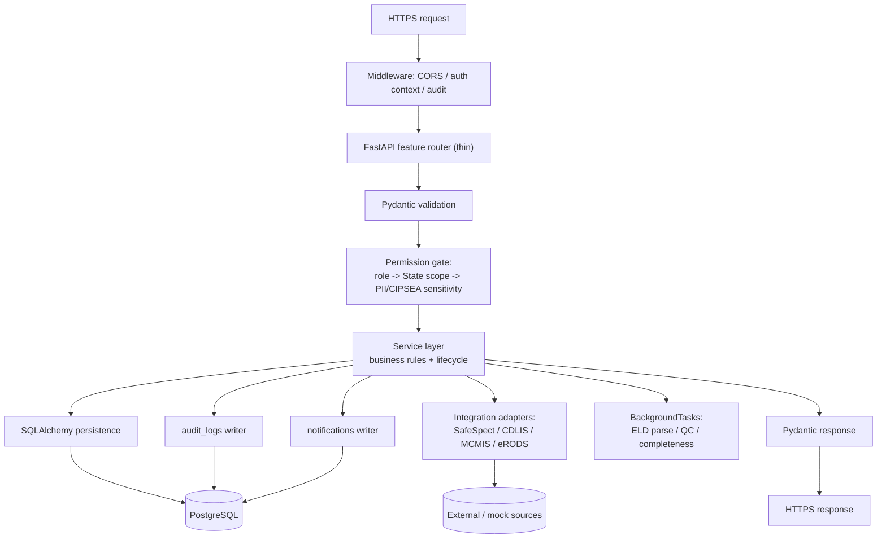
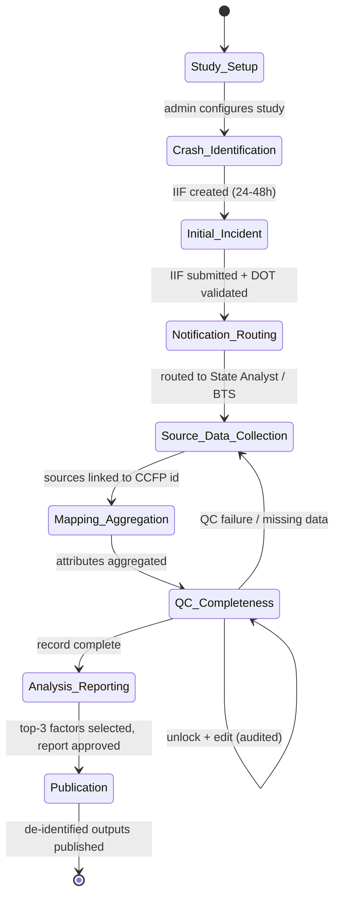
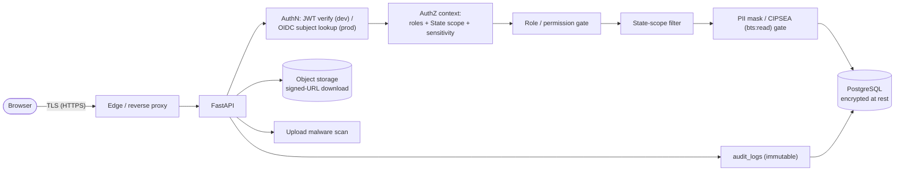
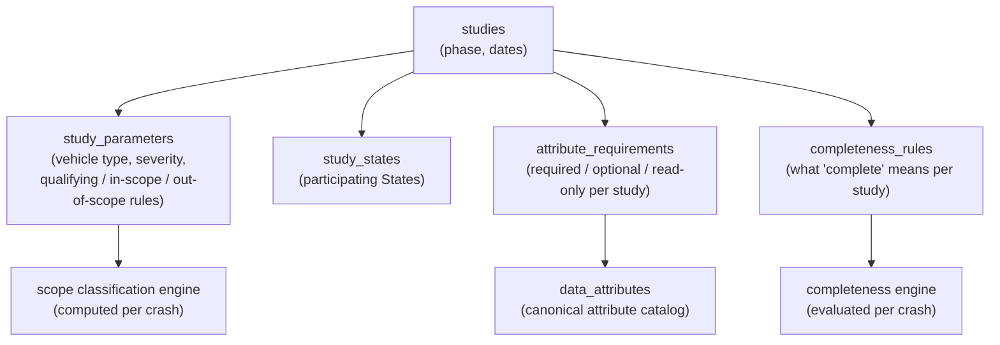

# 13 — Solution Design (HLD / LLD Lite)

**Phase:** Design · **Artifact family:** HLD / LLD

This document describes **how** the FMCSA **Crash Causal Factors Program (CCFP)
IT Solution** — Phase 1 Heavy-Duty Truck Study — is built. It extends
[11 — Architecture & Sequence](11-architecture-sequence.md) and
[12 — Component Diagram](12-component-diagram.md) into design-level detail: stack
choices with rationale, backend and frontend layering, domain patterns, security
design, data-model principles, configurability for future study phases, and the
non-functional posture. The production-readiness path (DOT-approved OIDC,
managed PostgreSQL, Celery/Redis, cloud object storage) is covered in
[§14](#14-production-swap-path). Authoritative business rules live in
`Documentation/project_documentation.md`; specification anchors (§6, §7, §10,
§11.3, §14, §15) are cited inline.

!!! warning "100% synthetic data"
    Every record, name, email, CCFP identifier, and crash referenced in this
    documentation is **synthetic** — seeded for the demo only. The `@ccfp.gov`
    domain is fictitious and non-deliverable. No real PII, CIPSEA interview data,
    or production crash records appear anywhere. Live demo:
    <https://nexgile-dot-ccfp.nexgiletechnologies.com>.

!!! info "RFC 2119 vocabulary"
    The keywords **MUST**, **MUST NOT**, **SHALL**, **SHALL NOT**, **SHOULD**,
    **SHOULD NOT**, **REQUIRED**, **RECOMMENDED**, and **MAY** in this document
    are interpreted per RFC 2119. The vocabulary is consistent across the design
    family and is reflected in the FastAPI-generated OpenAPI specification.

<div class="grid cards" markdown>

-   :material-layers-triple: **Three-tier, single data store**

    React SPA → FastAPI API & workflow services → **PostgreSQL only**.
    HTTPS/JSON, REST, versioned under `/api/v1/...`. PostgreSQL also backs
    analytics, `ILIKE`/`pg_trgm` search, and document metadata.

-   :material-shield-account: **Server-side authZ on every request**

    Effective permissions resolve via `user_role_assignments → roles →
    role_permissions`, then State scope, PII masking, and CIPSEA gates compose.
    The frontend hides affordances; it never gates security.

-   :material-source-branch: **Adapter seams for every integration**

    SafeSpect, CDLIS, MCMIS, and eRODS are **mock adapters** behind stable
    interfaces, feature-flagged `CCFP_INTEGRATION_*_LIVE`. Production swaps the
    implementation, not the caller.

-   :material-tune-variant: **Configurable, not hardcoded**

    Per-study attributes, requirements, completeness rules, and scope criteria
    are **data**, not code. Phase 1 assumptions never leak into the schema, the
    rules engine, or the UI.

</div>

---

## 1. Design principles

The solution's design is an expression of seven principles. Every later section
ties back to one of them. They encode the federal operating context (CCFP is a
congressionally authorized FMCSA program; crash data carries PII and
CIPSEA-protected interview content; Section 508 and the federal website
standards are the floor), the **crash-centric** domain shape, and the
auditability and provenance obligations of a research data platform.

1. **Federal-grade controls from day one.** Server-side authorization,
   encryption in transit and at rest, signed-URL object access, immutable audit
   logging, PII/CIPSEA tagging, and least privilege are active in the
   implementation even where the production peer (real OIDC IdP, managed
   PostgreSQL, cloud storage with real malware scanning) is stubbed
   (`project_documentation.md` §14). The implementation's threat model is the
   same as production's.

2. **Authorization is enforced server-side on every request.** The frontend MAY
   hide affordances; it MUST NOT gate security. The API refuses the same call
   regardless of which buttons are visible. Enforcement composes role,
   organization, State, study phase, crash scope, data sensitivity, and
   resource-level permission on each request.

3. **One stable CCFP identifier per crash; provenance retained on every value.**
   The `crashes.ccfp_identifier` is the spine. Every source value flowing in
   from SafeSpect, MCMIS, a State PCR, an ELD file, a reconstruction report, or
   manual entry is linked to that identifier and keeps a pointer back to its
   `source_records` origin (`project_documentation.md` §11.3). Analysts can
   trace any aggregated attribute to where it came from.

4. **Configurable for future phases — no hardcoded Phase 1 assumptions.** The
   canonical attribute catalog (`data_attributes`), per-study
   required/optional/read-only flags (`attribute_requirements`), completeness
   logic (`completeness_rules`), and qualifying/in-scope/out-of-scope criteria
   (`study_parameters`) are **rows**, not constants. Medium-duty, bus,
   serious-injury, and additional-State phases ship as configuration, not a
   rebuild (`project_documentation.md` §3.4, §11.3, §15).

5. **Adapter surface = single seam for production swaps.** External integrations
   (SafeSpect, CDLIS, MCMIS, eRODS, and the broader State/NHTSA/FHWA/NOAA/BTS
   sources) sit behind stable interfaces in `Backend/app/integrations/`,
   feature-flagged `CCFP_INTEGRATION_*_LIVE`. No business logic references a
   swappable integration directly.

6. **PII and CIPSEA data are tagged and access-controlled; published outputs are
   de-identified and separated.** Each canonical value carries a
   `data_sensitivity` tag (`PII` / `CIPSEA` / `sensitive`). PII is masked unless
   the caller holds a data-entry/QC permission; CIPSEA data requires `bts:read`.
   Published outputs are de-identified, summarized, and served from a separate
   public surface (`/api/v1/public/...`) (`project_documentation.md` §14, §11.3).

7. **Structured-form-first capture; typed schemas end to end.** The Initial
   Incident Form, the §19.2 Post-Crash Investigation Form, PCR mappings, and ELD
   extractions are typed Pydantic models on the backend and Zod schemas on the
   frontend. The OpenAPI spec is auto-generated by FastAPI; there is no
   hand-rolled contract that can drift.

## 2. Stack choices and rationale

### 2.1 Backend

| Choice | Rationale |
|---|---|
| **Python 3.12 + FastAPI** | Native asyncio; Pydantic v2 validation; auto-generated OpenAPI; mature federal Python ecosystem. |
| **Uvicorn (ASGI)** | ASGI server for FastAPI; `uvicorn[standard]` brings httptools for production-grade serving. |
| **Pydantic v2** | Request/response validation, typed config, and the schema source the OpenAPI client is generated from. |
| **SQLAlchemy 2.0** | Declarative `Mapped` ORM over all ~38 core tables; predictable SQL; one model layer for transactional and analytical reads. |
| **PyJWT** | JWT issue/verify for the development mock-IdP path; the same token contract bridges to OIDC in production. |
| **passlib[bcrypt]** | bcrypt verification of `users.password_hash` for seeded dev accounts; production delegates auth to the DOT-approved OIDC IdP. |
| **FastAPI `BackgroundTasks`** | In-process async for ELD parsing, QC evaluation, and completeness evaluation; structured to be **Celery-swappable**. |
| **`psycopg` / PostgreSQL driver** | Connection sourced from the `DATABASE_URL` environment variable (value supplied by config/secrets, never committed). |
| **pytest + httpx** | API tests run inside a transaction that is rolled back, so the dev database is never mutated. |

The Backend `requirements.txt` is the canonical pin set; this table is the
**rationale** layer. Pinning policy: minor-version floors; major upgrades are
migration-grade events (migration plan + the targeted test gate must pass).

### 2.2 Frontend

| Choice | Rationale |
|---|---|
| **React 18 + TypeScript** | Stable SPA with strict typing; aligns with federal accessibility tooling support. |
| **Vite** | Fast dev server, HMR, route-level code splitting via dynamic `import()`. |
| **React Router** | Nested routes for the study/crash workspace shell and per-feature surfaces. |
| **TanStack Query** | Server-state caching, retries, and invalidation; the read path's single conduit to the API. |
| **React Hook Form + Zod** | The forms are large and multi-section (Initial Incident, §19.2 PCI, PCR mapping); RHF for state, Zod for schema validation, shared field components for repeating groups. |
| **Tailwind (USWDS-aligned palette)** | Federal navy/blue design tokens aligned to the U.S. Web Design System without taking a USWDS runtime dependency. |
| **Recharts** | Dashboards, visualizations, and PCR-coverage charts for the analytics and data-management surfaces. |

Frontend `package.json` is the canonical set; this table is the **rationale**
layer. The production target swaps the design system for DOT-approved components
without changing the component contracts.

### 2.3 Data store & runtime

| Choice | Rationale |
|---|---|
| **PostgreSQL (sole data store)** | Backs transactional state, analytics, search (`ILIKE` + `pg_trgm`), and document metadata. One store to secure, back up, and audit (`project_documentation.md` §6, §7). |
| **Native enum types (23)** | Status, scope, sensitivity, role, and form-section vocabularies are enforced at the column level. |
| **`gen_random_uuid()` PKs** | UUID primary keys across core tables; `created_at`/`updated_at` with update triggers. |
| **Local disk for uploaded files** | Documents, images, videos, and ELD CSVs land on local disk in the demo; **metadata** lives in PostgreSQL with signed-URL download. |
| **Native + manual entry ingestion** | Mock SafeSpect/CDLIS/MCMIS/eRODS adapters plus manual capture; no integration is a hard runtime dependency for the demo. |
| **`localhost` dev, public URL for demo** | Vite proxies `/api` to the local API in dev; the hosted demo is served at the public CCFP URL. DB host/port/credentials are supplied via `DATABASE_URL` and are never shown. |

!!! danger "No infrastructure secrets in the docs"
    Connection details (DB host, port, user, password) are **never** written in
    this documentation or hardcoded in code. They are read from the
    `DATABASE_URL` environment variable, seeded from a single config source.
    Reference the variable name — never the value.

## 3. Layering

### 3.1 Backend layers

A request enters Uvicorn, is parsed and validated by Pydantic in a thin feature
router, gated by the permission dependency (role → State scope → sensitivity),
dispatched to a service function that owns the business rules, which calls the
SQLAlchemy persistence layer and/or an integration adapter, and returns a typed
Pydantic response. State-changing actions write `audit_logs`; lifecycle events
create `notifications`. Long-running work (ELD parse, QC, completeness) runs via
`BackgroundTasks`.



- **Routers** are thin: parse the request, invoke a service, return a Pydantic
  model. They MUST NOT touch the database directly.
- **Services** own business logic, the crash lifecycle, scope classification,
  and the routing/notification side effects. They are the only layer that calls
  adapters.
- **Models** (`Backend/app/models.py`) are SQLAlchemy declaratives — data only.
- **Integrations** (`Backend/app/integrations/`) isolate every external source
  behind a stable interface so the mock and a future real client share a shape.
- **Workers** (`Backend/app/workers/`) hold the parse/QC/completeness routines,
  callable synchronously by `.../evaluate` endpoints or via `BackgroundTasks`.

### 3.2 Frontend layers

```text
Route (lazy-loaded)
  ↓
Page (pages/<feature>/*)
  ↓
Workspace shell + study/crash context
  ↓
Feature components (components/<feature>/*)
  ↓
Hooks (TanStack Query backed)
  ↓
Typed API client (lib/endpoints.ts)
  ↓
HTTPS / JSON  →  /api/v1/...
```

The shell fetches the caller's effective permissions and State scope once on
sign-in and exposes them via context, so feature components do not refetch on
every render. The same permission keys the backend enforces drive
affordance-gating hooks in the UI — but, per principle 2, the UI never gates
security.

## 4. Domain patterns

### 4.1 The crash aggregate

A **crash** is the system's aggregate root, identified by a stable
`ccfp_identifier`. Every other operational entity is either:

- a **crash-owned child** — `initial_incident_forms`, `incident_vehicles`,
  `incident_persons`, `post_crash_inspections`, `post_crash_investigations` (plus
  the typed §19.2 `pci_*` child tables), `police_crash_reports`,
  `reconstruction_reports`, `eld_files`/`eld_events`, `source_records`,
  `crash_attribute_values`, `data_quality_results`, `crash_completeness_status`,
  `contributing_factor_selections`, `documents` — all carrying a foreign key to
  the crash and cascading on delete; or
- a **shared reference / configuration** — `studies`, `study_states`,
  `study_parameters`, `data_attributes`, `attribute_requirements`,
  `completeness_rules`, `organizations`, `users`, `roles`, `permissions`, and the
  `ref_*` lookups (US states, PCR sections, contributing-factor groups/values).

Because every operational row is reachable from a crash, **State scoping** is one
join away: a State user sees only crashes whose State is in their scope, and the
filter is applied server-side on every list and read.

### 4.2 Crash lifecycle as an explicit progression

The platform implements the eight-phase target lifecycle from
`project_documentation.md` §5 as an explicit, audited progression. Each
transition is permission-gated, writes an `audit_logs` row, and fans out
`notifications` to the right roles.



- **Scope classification** is computed, not hardcoded: on Initial Incident Form
  submit the service evaluates the study's qualifying / in-scope / out-of-scope
  rules against the crash (fatality present? Class 7/8 heavy-duty truck?
  participating State?) and writes `crash_scope_classifications`. Routing then
  diverges — in-scope crashes notify both the State CMV Data Analyst and BTS
  CIPSEA Agents; out-of-scope supplemental crashes notify only the State Analyst
  (`project_documentation.md` §5, Phase 2).
- **U.S. DOT number validation** against SafeSpect happens on submit; **CDLIS**
  checks support driver information where integrated.
- **Unlock** of a completed record is a privileged, audited action
  (`crash:unlock`) so corrections after completeness never silently rewrite the
  record.

### 4.3 Provenance and aggregation

Source data arrives by automated ingestion, secure file transfer, direct State
connection, API submission, or manual entry. Each inbound payload is registered
as a `source_records` row; mapping projects its fields onto canonical
`data_attributes` and writes `crash_attribute_values` carrying the
`source_*` provenance pointers and an edit-state. A **partial unique index**
keeps exactly one *current canonical* value per `(crash, attribute)` and one
completeness status per crash, so the aggregated record is unambiguous while the
full provenance chain remains queryable.

### 4.4 State PCR coverage model

States are not forced to standardize their PCR before participating. The PCR
module starts from what a State already collects and tracks only the additional
Phase 1 attributes. `state_pcr_coverage` and `state_attribute_coverage` record,
per State and per MMUCC-aligned PCR section, the collected count, total-required
count, completion percentage, and optional coverage — and the model includes a
**State feedback loop**: coverage status MUST be correctable when a State reports
attributes it already collects (`project_documentation.md` §8.5).

### 4.5 Typed §19.2 Post-Crash Investigation

The Post-Crash Investigation Form is modeled as typed child tables
(`pci_carrier_power_unit`, `pci_driver_load`, `pci_medical_certificate`,
`pci_hours_of_service`, `pci_exemptions`, `pci_vehicle_condition`,
`pci_brake_system`, `pci_seating_positions`, `pci_axles`, `pci_tires`,
`pci_trailers`, `pci_hazmat`, `pci_additional_towed_units`) plus a
`pci_field_definitions` catalog. The form's per-field **required vs. not-required**
flags (the source marks optional fields in orange; the last towed-unit and
hazmat pages are optional) are data-driven, so the configurable form honors
per-field optionality without code changes.

### 4.6 ELD/eRODS linkage

ELD CSV uploads are parsed into `eld_events` and linked to the correct crash via
the unique CCFP code carried in the file's Output File Comment (example format
`CCFP-State-Post-Crash-Inspection-Code`). `eld_field_mappings` and
`eld_duty_code_mappings` translate provider-specific columns and duty codes into
the canonical hours-of-service model, so device heterogeneity stays out of the
analytical layer.

## 5. Forms architecture

The Initial Incident Form, the §19.2 PCI form, and PCR mapping are the system's
largest client-facing surfaces. They are **structured-form-first**:

- Field schemas live as **Pydantic** models on the backend (request validation)
  and **Zod** schemas on the frontend (live UI validation), kept in sync through
  the OpenAPI generation pipeline.
- **Repeatable field groups** — vehicles, trailers, non-motorists, witnesses,
  axles, tires, hazardous materials, and per-seating-position seat-belt/airbag
  capture — are first-class, matching the source forms (§19.1, §19.2).
- **Autosave** persists long forms as the user works; **submit** is a separate
  explicit action that triggers DOT validation, scope classification, and
  routing.
- **Per-field required/optional flags** are configuration (`attribute_requirements`,
  `pci_field_definitions`), so a study can tighten or relax a field without a
  release.
- **Plain-language labels** and Section 508 accessibility are baked into the
  shared field components, not bolted on per form.

## 6. Security design

Defense-in-depth per principle 1. The diagram below uses logical roles; no IP
addresses, ports, or connection strings appear anywhere in this design.



### 6.1 Authentication

The development build uses a **mock identity provider** that issues a PyJWT
token after bcrypt-verifying the seeded user's `users.password_hash`. All seeded
accounts share the synthetic password `Second@123`.

Production delegates to the **DOT-approved OIDC IdP** with MFA, and PIV/CAC for
federal users. The cutover is a config flip: `CCFP_DEV_AUTH_ENABLED=false`
disables the dev path and swaps in OIDC behind the same token contract. The
application stores **no production passwords**.

### 6.2 Authorization

Authorization is enforced **server-side on every request**. A caller's effective
permissions resolve through `user_role_assignments → roles → role_permissions`,
then the following layers compose:

1. **Role / permission gate** — the route requires a specific permission key
   (e.g. `crash:update`, `report:publish`, `admin:attributes`).
2. **State-scope filter** — State-scoped users (`MCSAP_INSPECTOR`,
   `STATE_CMV_ANALYST`, `STATE_USER`) see only crashes in their State.
3. **Data-sensitivity gate** — PII (names, addresses, phones) is masked unless
   the caller holds a data-entry/QC permission; CIPSEA-protected BTS interview
   data requires `bts:read`.

The frontend mirrors these with affordance-gating hooks, but **the frontend
never gates security** — the API refuses the same call regardless of which
buttons render. The ~42 permission keys span `study`, `crash`,
`initial_incident`, `source_data`, `data_mgmt`, `analytics`, `reports`,
`public`, `bts`, `notifications`, `audit`, and `admin` groups; see
[10 — RBAC Matrix](../02-analyze/10-rbac-matrix.md).

### 6.3 PII and CIPSEA handling

| Sensitivity tag | Who may read unmasked | Where it appears |
|---|---|---|
| `PII` | Holders of data-entry / QC permission | Names, addresses, phones on incident persons, drivers, witnesses |
| `CIPSEA` | Holders of `bts:read` (BTS / FMCSA CIPSEA Agents) | Summarized BTS interview data, subject to CIPSEA and any MOU |
| `sensitive` | Role-dependent | Other restricted operational values |
| *(de-identified)* | Public, no auth | `/api/v1/public/...` published outputs only |

Published outputs are de-identified, summarized, and served from a **separate
public surface** with no authentication — operationally and physically distinct
from the records that carry PII/CIPSEA tags.

### 6.4 Encryption

- **In transit:** TLS/HTTPS for all frontend↔backend and adapter traffic
  (`project_documentation.md` §14.2).
- **At rest:** database storage encryption and encrypted object storage in the
  production target; the demo stores uploaded files on local disk with metadata
  in PostgreSQL.
- **Object access:** downloads are issued as **signed URLs** by the documents
  service, never by the frontend.
- **Hashing:** bcrypt for the seeded dev `password_hash`; production has no
  local passwords (OIDC).

### 6.5 Audit and notifications

Every **state-changing action** — crash create/update, IIF submit, source-data
ingest, mapping edit, QC override, completeness change, contributing-factor
selection, report publish/share, configuration change, and sensitive reads such
as audit access — writes an immutable `audit_logs` row capturing actor, action,
resource, and before/after context. Lifecycle events create `notifications`
fanned out to the relevant roles (new IIF, in-scope routing to BTS, out-of-scope
routing to the State Analyst, missing data, QC failure, completeness change,
publication/share).

### 6.6 Upload safety & least privilege

- **Malware scanning** runs on every uploaded document before it becomes
  visible (a no-op accepting scanner in the demo; containerized scanning in
  production).
- **Least privilege** is the default: permissions are additive and
  role-granted; State scope and sensitivity narrow further. Data-sharing
  agreements MUST be in place before a State is onboarded
  (`project_documentation.md` §14.2).

### 6.7 Compliance cross-walk

| Control area | Implementation in the CCFP build |
|---|---|
| **Access enforcement** | Server-side permission gate on every route; resolved via `user_role_assignments → roles → role_permissions` |
| **Least privilege** | Role groupings per [10 — RBAC Matrix](../02-analyze/10-rbac-matrix.md); State scope + sensitivity narrow access |
| **Audit events + content** | Immutable `audit_logs` on every state-changing action; actor / action / resource / before / after |
| **Identification + auth** | Mock-IdP JWT (dev); DOT-approved OIDC + MFA/PIV/CAC (prod) |
| **Transmission confidentiality** | TLS/HTTPS for all API and adapter traffic |
| **Data at rest** | DB + object storage encryption (prod target); signed-URL object access |
| **PII / privacy** | `data_sensitivity` tags + masking; Privacy Act PTA/PIA/SORN; NARA records management |
| **CIPSEA** | `bts:read` gate on BTS interview data; MOU-governed exchange |
| **Section 508 / WCAG 2.1 AA** | Accessible shared components; plain-language labels; mobile-responsive |
| **Federal web standards** | `.gov`/`.mil` posture, government banner, OMB/PRA control numbers |

The full System Security Plan is maintained alongside this document in
production; it expands each row into the prescribed control statement,
parameters, and implementation evidence.

## 7. Data design

PostgreSQL is the **sole** data store (`project_documentation.md` §6, §7).
Notable design choices:

- **~38 core tables** plus the typed §19.2 PCI child tables, organized into
  reference, identity/access, study config, crash core, source data, mapping/QC/
  completeness, and documents/reports/audit groups.
- **23 native enum types** enforce status, scope, sensitivity, role, and
  form-section vocabularies at the column level.
- **UUID primary keys** (`gen_random_uuid()`), with `created_at`/`updated_at`
  and update triggers across core tables.
- **Crash-owned children cascade** on delete; **reference foreign keys restrict**
  so lookups cannot be orphaned.
- **Partial unique indexes** guarantee one current canonical value per
  `(crash, attribute)` and one completeness status per crash.
- **Provenance** flows through `source_records` plus the `source_*` columns on
  `crash_attribute_values`.
- **`data_sensitivity`** tagging (`PII` / `CIPSEA` / `sensitive`) drives masking
  and CIPSEA gating.
- **`pg_trgm`** powers fuzzy, scope- and PII-aware cross-entity search directly
  in PostgreSQL (`ILIKE`), so no separate search engine is a runtime dependency.

The schema, migrations, and **100% synthetic** seeds live in
`Backend/database/`. See [08 — Data Model](../02-analyze/08-data-model.md) for
the table-by-table walk.

## 8. Configurability for future phases

This is the design's load-bearing requirement: the platform MUST adapt to
medium-duty, bus, serious-injury, additional States, additional attributes, and
additional sources **without a rebuild** (`project_documentation.md` §3.4, §15).
Configuration lives in data, not code:



| What changes between phases | Where it lives | Code change? |
|---|---|---|
| Vehicle class / crash severity | `study_parameters` | No |
| Qualifying / in-scope / out-of-scope criteria | `study_parameters` | No |
| Participating States | `study_states` | No |
| Which attributes are required / optional / read-only | `attribute_requirements` | No |
| New canonical attributes | `data_attributes` | No |
| What "complete" means | `completeness_rules` | No |
| New external source | New adapter behind the integration interface | Adapter only |

!!! tip "No Phase 1 assumptions in the schema, rules, or UI"
    "Class 7/8", "≥ 26,001 lbs GVWR", "fatal", and the Phase 1 participating
    States are **values in rows**, not constants in code, columns, or
    components. A new phase is created by an administrator with
    `admin:attributes` / `admin:completeness` / `study:configure` — not by an
    engineer.

## 9. Background processing

The implementation uses FastAPI **`BackgroundTasks`** in-process. Three families
of jobs run asynchronously (and are also callable synchronously via
`.../evaluate` endpoints for deterministic testing):

| Job | Trigger | Purpose | Production swap |
|---|---|---|---|
| `eld_parse` | ELD CSV upload | Parse rows into `eld_events`; link to the crash via the CCFP code in the Output File Comment | Celery task |
| `qc_evaluate` | Source-data change / on demand | Run configurable `data_quality_rules`; write `data_quality_results` | Celery task |
| `completeness_evaluate` | Attribute aggregation / on demand | Apply per-study `completeness_rules`; set `crash_completeness_status` | Celery task |

Job functions are **idempotent** — re-running them never causes drift. The
production swap replaces `BackgroundTasks` with **Celery + Redis**; the job
bodies move unchanged, only the executor changes (see §14).

## 10. Frontend design

The frontend is a **single-page React 18 application** built with Vite. Visual
language aligns to the U.S. Web Design System (DOT navy / federal blue) without a
USWDS runtime dependency; the production target swaps in DOT-approved components.

- **Accessibility.** Section 508 is the source requirement; WCAG 2.1 AA is the
  technical conformance target (`project_documentation.md` §9.2, §15). Status is
  never color-only — indicators combine icon + label + color. Shared accessible
  field components carry keyboard nav and ARIA out of the box.
- **Responsiveness.** Mobile-responsive and device-agnostic, so an MCSAP
  Inspector can start an Initial Incident Form in the field.
- **Role-aware navigation.** The shell renders only the surfaces the caller's
  permissions allow; the same permission keys back the affordance-gating hooks.
- **Surfaces.** Studies, crashes (list / detail / lifecycle / timeline), Initial
  Incident, PCI workspace, PCR mapping + coverage dashboard, inspections,
  reconstruction coding, ELD upload, data management (raw / aggregated / QC /
  completeness), analytics (Recharts dashboards), admin, public outputs, and
  notifications.

Long forms autosave and validate inline via React Hook Form + Zod; submit is an
explicit, confirmed action.

## 11. Observability

Per principle 1, operational visibility is active in the build:

- **Audit log** — the universal action log; the `audit` module exposes a
  queryable, scope-aware surface, and audit access is itself audited.
- **Notifications** — lifecycle events fan out to roles and are listable /
  markable-read, giving a user-facing activity trail.
- **Health endpoints** — `/health` (liveness) and `/health/db` (database
  reachability) back uptime checks.
- **Crash timeline** — `/api/v1/crashes/{id}/timeline` reconstructs the
  lifecycle + audit history per crash for operators and analysts.
- **Structured logging** — request-scoped logging carrying actor and route
  context, ready for a FedRAMP-authorized APM in production.

## 12. Performance & scale

Scale targets per `project_documentation.md` §15:

| Dimension | Target |
|---|---|
| Concurrent users | **≥ 1,000** without negative response-time impact |
| Availability | **24/7** except scheduled maintenance and updates |
| Scalability | Add users, States, attributes, source systems, and future studies |
| Responsiveness | Mobile-responsive, device-agnostic |
| Data flexibility | Structured, semi-structured, and unstructured data |

The stateless FastAPI tier **scales horizontally** behind a load balancer — no
in-memory state exists that cannot be regenerated from PostgreSQL. Search and
analytics run inside PostgreSQL (`ILIKE` + `pg_trgm`), so there is no separate
search cluster to scale in the demo. In production, the API tier auto-scales,
the managed PostgreSQL adds a read replica for analytics, and Celery workers
scale independently of the request path.

## 13. Non-functional posture

| Dimension | Target |
|---|---|
| Availability | 24/7 except scheduled maintenance |
| Concurrency | ≥ 1,000 concurrent users |
| Horizontal scale | Stateless API tier behind a load balancer |
| Accessibility | Section 508 / WCAG 2.1 AA |
| Responsiveness | Mobile-responsive, device-agnostic |
| Encryption in transit | TLS / HTTPS |
| Encryption at rest | DB + object storage encryption (prod target) |
| Object access | Signed URLs, issued server-side |
| AuthN | Mock-IdP JWT (dev) → DOT-approved OIDC + MFA/PIV/CAC (prod) |
| AuthZ | Server-side, per request, role + State + sensitivity |
| Audit | Immutable `audit_logs` on every state-changing action |
| Provenance | Source-linked canonical values; full lineage retained |
| Records / privacy | Privacy Act (PTA/PIA/SORN); NARA records management; OMB/PRA control numbers |
| CIPSEA | `bts:read` gate; MOU-governed BTS exchange |
| Data-sharing agreements | Required before State onboarding |

These are the build's stated posture. The production-readiness path in §14 makes
them auditable and attestation-ready.

## 14. Production-swap path

The implementation is deliberately shaped so the production swap is an
integration/hardening exercise, not a redesign. Each swap is a discrete
workstream against an architecture already built for it.

| Layer | Implemented (demo) | Production target |
|---|---|---|
| **Identity** | Mock-IdP JWT (bcrypt-verified seeded users) | DOT-approved **OIDC** IdP; MFA; PIV/CAC for federal users; `CCFP_DEV_AUTH_ENABLED=false` |
| **Async work** | FastAPI `BackgroundTasks` | **Celery + Redis** — job bodies unchanged, executor swapped |
| **Data store** | PostgreSQL (single instance) | DOT-approved **managed PostgreSQL** (multi-AZ, backups, read replica) |
| **Object storage** | Local disk + metadata in PostgreSQL | Encrypted **cloud object storage** with versioning + signed URLs |
| **Malware scanning** | No-op accepting scanner | Containerized scanner blocking visibility on a positive result |
| **Integrations** | Mock SafeSpect / CDLIS / MCMIS / eRODS (feature-flagged) | Real clients behind the same interfaces (`CCFP_INTEGRATION_*_LIVE`) |
| **Search** | PostgreSQL `ILIKE` + `pg_trgm` | Same, or DOT-approved enterprise search if mandated |
| **Frontend kit** | Tailwind (USWDS-aligned palette) | DOT-approved design system components |

!!! abstract "Why the swaps are safe"
    No business logic references a swappable component directly. Auth is behind a
    token contract; async work is behind a callable interface; integrations are
    behind feature-flagged adapters; object access is behind the documents
    service. Each row above changes an implementation, not a caller.

## 15. Open questions

Carried forward from `project_documentation.md` §17:

1. **DOT-approved stack & hosting.** The implemented stack maps to DOT-approved
   equivalents (OIDC, managed PostgreSQL, Celery/Redis, cloud storage); final
   selection is a DOT decision.
2. **Identity provider for State / non-federal users.** Which IdP backs State
   and non-federal participants under MFA.
3. **Per-State data-sharing agreements.** The exact agreement required before
   each State is onboarded.
4. **BTS / CIPSEA exchange model.** Read-only, summary export, Data-Lake
   integration, or another secure mechanism — governed by an MOU. The `bts:read`
   gate and `data_sensitivity` tags accommodate any of these.
5. **State crash-repository integration.** Which repositories support direct API
   or file-based connection versus the MCMIS round-trip.
6. **CDLIS integration approach.** The authoritative path for driver-data checks.
7. **Public de-identification standard.** The standard applied before study
   publication.
8. **Approved BI / dashboard platform.** Whether the embedded Recharts
   dashboards stand or a DOT-approved BI platform is mandated.
9. **OMB/PRA control number.** Final approval language and control number to
   display before public information collection.

---

## Related documents

- [01 — Scope Statement](../01-discover/01-scope-statement.md) — assumptions and boundaries that frame this design
- [03 — Stakeholders & Personas](../01-discover/03-stakeholders-personas.md) — the 12 roles whose flows this design realizes
- [04 — Business Requirements](../01-discover/04-business-requirements.md) — requirements this design satisfies
- [07 — Workflow / Process](../02-analyze/07-workflow-process.md) — the eight-phase lifecycle this design implements
- [08 — Data Model](../02-analyze/08-data-model.md) — the schema this design rests on
- [09 — API Specification](../02-analyze/09-api-specification.md) — the interface this design serves
- [10 — RBAC Matrix](../02-analyze/10-rbac-matrix.md) — the authorization model enforced by §6
- [11 — Architecture & Sequence](11-architecture-sequence.md) — the container / sequence view this design refines
- [12 — Component Diagram](12-component-diagram.md) — the modules this design wires
- [14 — Operations Runbook](../04-release/14-operations-runbook.md) — operator-facing consequences of these choices
- [Demo Credentials](../reference/demo-credentials.md) — synthetic sign-in accounts for the live demo

*End of 13 — Solution Design (HLD / LLD Lite).*
