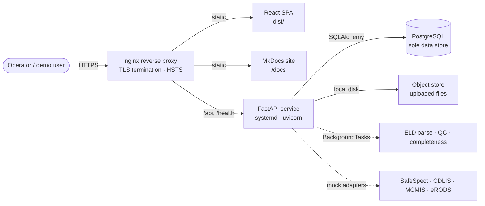
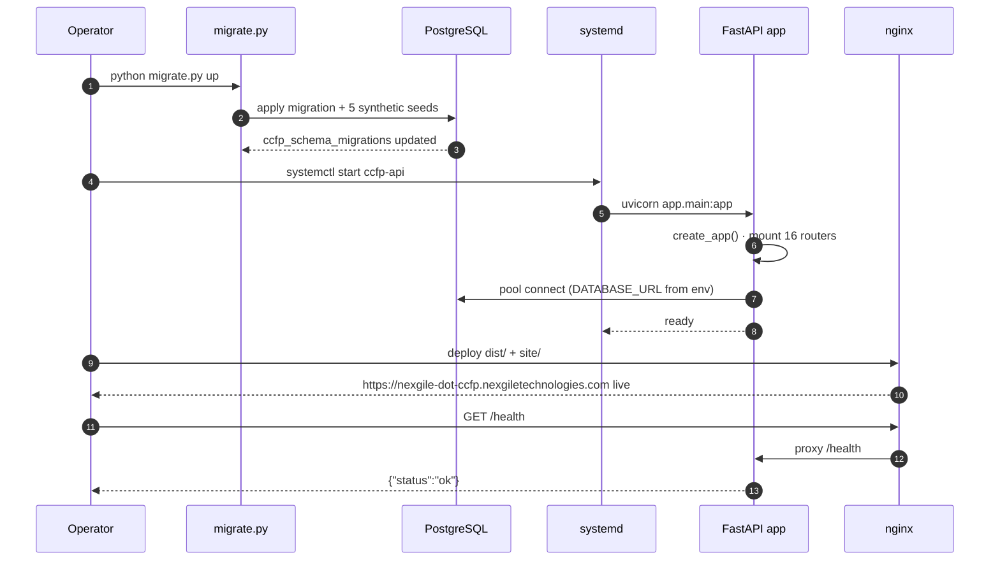
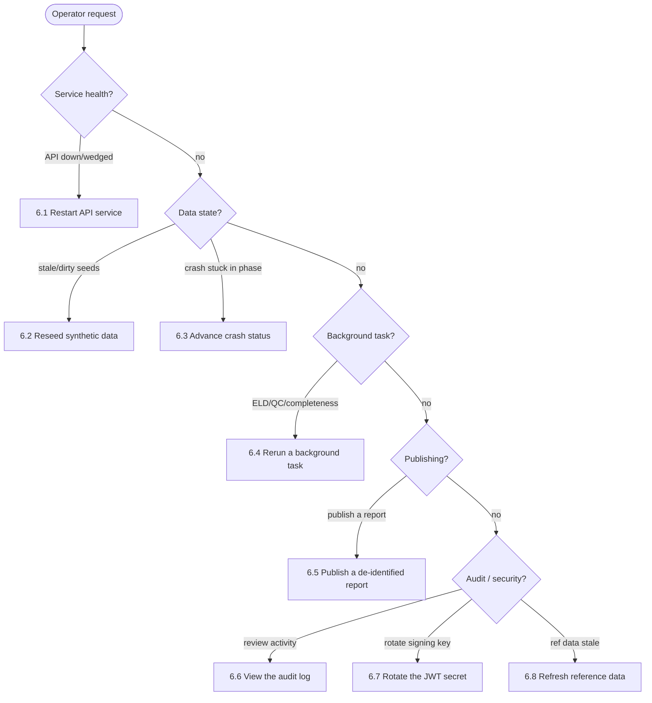

# 14 — Operations Runbook / Support Guide

**Phase:** Release · **Artifact family:** Operations

This is the practical, hand-to-operator guide for running the **Crash Causal
Factors Program (CCFP) IT Solution** — the FMCSA Phase 1 Heavy-Duty Truck Study
platform — in the demo / pilot environment that ships with this proposal. It
assumes the reader has shell access to the host, basic familiarity with Python +
Node + PostgreSQL, and a local clone of the repository. Everything below works
against **100% synthetic data**: every seeded user, carrier, crash, USDOT
number, VIN, and report is fictitious and exists only for development, testing,
and demonstration.

!!! info "Scope of this runbook"
    This covers the **demo / pilot** environment used to walk the lifecycle and
    exercise the API. Production hardening — DOT-approved OIDC IdP (MFA / PIV /
    CAC), Celery/Redis for async work, encrypted managed PostgreSQL, real
    malware scanning, signed-URL object storage backed by encrypted cloud
    storage, FedRAMP posture, and ATO — is a separate workstream. See the
    cut-over pointer in [13 — Solution Design](../03-design/13-solution-design.md).

!!! tip "Where to go next"
    The environment brought up here realizes the architecture in
    [11 — Architecture & Sequence](../03-design/11-architecture-sequence.md) and
    the components in [12 — Component Diagram](../03-design/12-component-diagram.md).
    Operator playbooks reference endpoints from
    [09 — API Specification](../02-analyze/09-api-specification.md), permissions
    from [10 — RBAC Matrix](../02-analyze/10-rbac-matrix.md), and the crash
    lifecycle in [07 — Workflow & Process](../02-analyze/07-workflow-process.md).

---

## 1. Environment overview

The deployed topology is a conventional three-tier stack. Operators reason about
it in terms of **roles**, not addresses: a reverse proxy terminates TLS and
fronts everything; a Python application service handles the API and workflow
logic; a single PostgreSQL instance is the sole data store; and a static
single-page app plus the docs site are served as files. No internal IP
addresses, database hosts, or infrastructure ports appear in this document —
configuration secrets (including the database URL) are supplied through
environment variables / a secrets manager and are never printed here.

<div class="grid cards" markdown>

-   :material-shield-lock-outline: __nginx reverse proxy__

    Terminates HTTPS (TLS 1.2+, HSTS), serves the built SPA and the MkDocs site,
    and proxies `/api` and `/health` to the application service. Public entry
    point: <https://nexgile-dot-ccfp.nexgiletechnologies.com>.

-   :material-language-python: __FastAPI service (systemd)__

    The CCFP API & workflow engine — 16 router modules, 88 endpoints under
    `/api/v1`. Runs under `uvicorn`, managed as a `systemd` unit so it restarts
    on failure and on boot. Async work (ELD parse, QC, completeness) runs
    in-process via FastAPI `BackgroundTasks`.

-   :material-database: __PostgreSQL (sole data store)__

    Backs transactional records, analytics, SQL `ILIKE` / `pg_trgm` search, and
    document metadata. Uploaded files land on local disk; the DB holds their
    metadata + sensitivity tags. Connection string comes from `DATABASE_URL` —
    value never shown.

-   :material-book-open-page-variant: __Static SPA + docs__

    The React build (`dist/`) and this MkDocs Material site are static assets
    served by nginx. The docs are published at
    <https://nexgile-dot-ccfp.nexgiletechnologies.com/docs>.

</div>



!!! warning "Synthetic environment"
    Every record in this environment is synthetic. The `@ccfp.gov` email domain
    is fictitious and non-deliverable. Do not load these seeds into any
    production system, and never treat demo output as real crash data.

---

## 2. Who owns what — support chart

| Surface | Primary owner (demo / pilot) | Production target |
|---|---|---|
| Reverse proxy / TLS | NexGile DevOps | DOT-approved hosting + WAF operator |
| FastAPI service (`systemd`) | Backend lead | Backend lead → FMCSA platform ops |
| PostgreSQL instance | NexGile DevOps | DOT-approved managed PostgreSQL DBA |
| SPA + docs build | Frontend / technical lead | Frontend lead → FMCSA platform ops |
| RBAC, scope & CIPSEA enforcement | Security lead | FMCSA ISSO + security lead |
| External integration adapters | Integrations lead | FMCSA system owners (SafeSpect/CDLIS/MCMIS/eRODS) |
| Demo / stakeholder support | Project sponsor | FMCSA program office |

Escalation for any pilot incident:

1. On-call backend or frontend lead — first triage within 15 minutes.
2. Technical lead — owns the merge of any hot-fix.
3. Project sponsor — informs the FMCSA program office if a scheduled review is
   affected.
4. Security lead — paged immediately for any suspected data exposure, auth
   bypass, or CIPSEA/PII concern.

---

## 3. First-boot bring-up

Bring-up is three ordered moves: apply the schema and seeds, start the API
service, and confirm health. The DB URL is read from the environment /
secrets — operators never paste a connection string into a shell.

### 3.1 Apply migrations + seeds

The dependency-light runner (`Backend/database/migrate.py`, `psycopg2` only)
applies the schema migration and the synthetic seeds. Each `.sql` file is
applied exactly once and tracked in `ccfp_schema_migrations`; seeds are
idempotent (`ON CONFLICT DO NOTHING`), so re-running is safe.

```bash
cd Backend/database
python migrate.py status     # list applied / pending files
python migrate.py up         # apply migrations then seeds (idempotent)
```

What lands after a clean `up`:

| Seed file | Contents (synthetic) |
|---|---|
| `0001_reference_data.sql` | 54 US states/territories, 8 MMUCC PCR sections, 7 BRD contributing-factor groups |
| `0002_rbac_orgs_users.sql` | 12 roles, 42 permissions + role→permission mappings, 12 orgs, 15 users |
| `0003_study_attributes_rules.sql` | 2 studies (Phase 1 active, Phase 2 planning), 109 data attributes, 8 QC rules, 5 completeness rules, Kansas PCR coverage |
| `0004_demo_crashes.sql` | 4 end-to-end demo crashes (KS complete, TX in-collection, CA initial-incident, MO out-of-scope) with vehicles, persons, inspections, investigation, PCRs, reconstruction, ELD file + events, attribute values, QC results, completeness status, contributing factors, documents, notifications, reports, audit logs |
| `0005_dev_passwords.sql` | Sets `users.password_hash` for every demo user to the shared dev password (bcrypt) |

### 3.2 Start the API service

```bash
# Demo / pilot — managed unit (auto-restarts on failure and on boot)
sudo systemctl start ccfp-api
sudo systemctl status ccfp-api      # active (running)

# Local dev equivalent (from Backend/)
python -m uvicorn app.main:app --reload
```

What happens on startup (`app/main.py`):

1. `create_app()` assembles the FastAPI app, installs CORS and error handlers,
   and mounts all **16 routers under `/api/v1`**.
2. Health routes (`/health`, `/health/db`) and the public router
   (`/api/v1/public/...`) are registered as the only no-auth surfaces.
3. The mock-IdP login (`POST /api/v1/auth/login`) is enabled because
   `CCFP_DEV_AUTH_ENABLED=true`; production sets it `false` and swaps in the
   DOT-approved OIDC provider.
4. External integration adapters initialize in **mock** mode unless their
   `CCFP_INTEGRATION_*_LIVE` flag is set.

### 3.3 Serve the SPA + docs

```bash
# Build the SPA for static serving
cd Frontend
npm install
npm run build        # produces dist/ — nginx serves it as static files

# Local dev server (Vite proxies /api to the API service)
npm run dev          # http://localhost:5173
```

In the deployed environment nginx serves the prebuilt `dist/` and the MkDocs
`site/` directory; the SPA reaches the API through the proxied `/api` prefix on
the same public origin.

### 3.4 Boot sequence



---

## 4. Demo credentials

The demo data ships with **15 synthetic users across all 12 roles**. All seeded
accounts share the password `Second@123`, applied by `0005_dev_passwords.sql`.
Sign in at <https://nexgile-dot-ccfp.nexgiletechnologies.com/login>.
State-scoped users (Inspector, State CMV Analyst, State User) see only their
State's crashes; everyone else is program-wide.

!!! warning "Synthetic / demo only — rotate before any external review"
    `@ccfp.gov` is a fictitious, non-deliverable domain. No real PII. These
    shared-password accounts are for the delivery team and demos only; in
    production, login is handled by the DOT-approved OIDC IdP (no shared
    passwords). Rotate or disable these accounts before opening the environment
    to anyone outside the delivery team.

| Role | Name | Email | Password | State scope |
|---|---|---|---|---|
| System Administrator | Morgan Castellano | `sysadmin@ccfp.gov` | `Second@123` | — |
| CCFP Project Team Administrator | Avery Thornton | `avery.thornton@ccfp.gov` | `Second@123` | — |
| CCFP Project Team | Dana Whitfield | `dana.whitfield@ccfp.gov` | `Second@123` | — |
| CCFP Data Scientist | Priya Ramanathan | `priya.ramanathan@ccfp.gov` | `Second@123` | — |
| CCFP Database Administrator | Victor De La Cruz | `victor.delacruz@ccfp.gov` | `Second@123` | — |
| BTS CIPSEA Agent | Helena Brandt | `helena.brandt@ccfp.gov` | `Second@123` | — |
| FMCSA CIPSEA Agent | Marcus Ellingsworth | `marcus.ellingsworth@ccfp.gov` | `Second@123` | — |
| Federal User | Omar Haddad | `omar.haddad@ccfp.gov` | `Second@123` | — |
| MCSAP CMV Inspector | Nora Kowalczyk | `nora.kowalczyk@ccfp.gov` | `Second@123` | KS |
| State CMV Data Analyst | Elliot Fontaine | `elliot.fontaine@ccfp.gov` | `Second@123` | KS |
| State User | Tomasz Bialek | `tomasz.bialek@ccfp.gov` | `Second@123` | KS |
| Public User | Public Demo Account | `public.demo@ccfp.gov` | `Second@123` | — |

Extra State-scoped accounts for scope-isolation testing (same password
`Second@123`):

| Role | Email | State scope |
|---|---|---|
| MCSAP CMV Inspector | `rosa.menendez@ccfp.gov` | TX |
| State CMV Data Analyst | `grant.holloway@ccfp.gov` | TX |
| State CMV Data Analyst | `linh.tran@ccfp.gov` | CA |

The full table with persona notes also lives in
[Demo Credentials](../reference/demo-credentials.md).

---

## 5. Health checks

### 5.1 HTTP

```bash
# Liveness — fronted by nginx on the public origin
curl -fsS https://nexgile-dot-ccfp.nexgiletechnologies.com/health
# {"status":"ok"}

# Database connectivity (the only health route that touches Postgres)
curl -fsS https://nexgile-dot-ccfp.nexgiletechnologies.com/health/db
# {"status":"ok","db":"ok"}
```

A `200` from `/health` proves nginx and the FastAPI service are up; a `200` from
`/health/db` additionally proves the database pool is connected. Both are
unauthenticated by design — they are the only no-auth routes besides
`/api/v1/public/...`.

### 5.2 Service + data sanity

```bash
# Is the unit running?
sudo systemctl is-active ccfp-api      # active

# Log in as a synthetic user (all share Second@123) and list crashes
curl -s -X POST https://nexgile-dot-ccfp.nexgiletechnologies.com/api/v1/auth/login \
  -H 'content-type: application/json' \
  -d '{"email":"elliot.fontaine@ccfp.gov","password":"Second@123"}'
# -> {"access_token":"...","user":{...}}

curl -s https://nexgile-dot-ccfp.nexgiletechnologies.com/api/v1/crashes \
  -H "Authorization: Bearer <token>"
# Elliot is KS-scoped -> sees only Kansas crashes (scope isolation proof)
```

After a clean reseed you should see **4 demo crashes**, **15 users**, **12
roles**, **2 studies**, and the **109-attribute** Phase 1 catalog. The public
surface needs no token:

```bash
curl -fsS https://nexgile-dot-ccfp.nexgiletechnologies.com/api/v1/public/outputs
```

---

## 6. Operator playbooks

The eight playbooks below cover the operations most likely to come up during
pilot weeks. Each lists trigger, prerequisites, steps, verification, and
rollback. Where an API path is shown, the caller needs a bearer token for a role
holding the cited permission per the
[RBAC matrix](../02-analyze/10-rbac-matrix.md).



### 6.1 Restart the API service

**Trigger:** The API is unresponsive, wedged, or a config / environment change
must take effect.

**Prerequisites:** Shell access to the host with permission to manage the
`systemd` unit.

**Steps:**

```bash
sudo systemctl restart ccfp-api
sudo systemctl status ccfp-api      # active (running)
journalctl -u ccfp-api -n 50 --no-pager
```

A restart re-runs `create_app()`, re-mounts all 16 routers, and re-establishes
the database pool from `DATABASE_URL`. Background tasks are in-process, so any
task that was mid-flight when the process died is not resumed — re-trigger it via
§6.4.

**Verification:** `curl .../health` returns `{"status":"ok"}` and `.../health/db`
returns `{"db":"ok"}`.

**Rollback:** None — restart is itself the corrective action. If startup fails,
read `journalctl -u ccfp-api` for the traceback (commonly a missing
`DATABASE_URL` or a pending migration).

### 6.2 Reseed synthetic data

**Trigger:** Demo data has drifted (edited mid-walkthrough) and you want a clean,
known starting state before a review.

**Prerequisites:** Shell access; agreement from the team that the environment can
be reset (the demo DB may be shared).

**Steps:**

```bash
cd Backend/database
python migrate.py status     # confirm what's applied
python migrate.py seed       # re-apply seeds only (idempotent)
```

Because every seed insert is guarded by `ON CONFLICT DO NOTHING`, re-running
restores any rows that were deleted and leaves existing rows untouched. To reset
the demo passwords specifically, re-running the seed step re-applies
`0005_dev_passwords.sql`, setting every account back to `Second@123`.

**Verification:** Re-run the §5.2 sanity checks — 4 crashes, 15 users. Sign in as
`elliot.fontaine@ccfp.gov` and confirm the KS demo crash is visible.

**Rollback:** Seeds are additive and idempotent; there is nothing to roll back.
For a full rebuild, coordinate with the DBA to recreate the database, then
`python migrate.py up`.

### 6.3 Manually advance a crash status

**Trigger:** A demo crash needs to be moved forward through the lifecycle for a
walkthrough (e.g. to show the `PUBLICATION` phase), or a crash is parked one
phase behind where the demo script expects it.

**Prerequisites:** Bearer token for a role holding `crash:update` (e.g.
`STATE_CMV_ANALYST` for its State, or `CCFP_PROJECT_TEAM`). Advancement is
**forward-only** — backward or no-op targets are rejected with `400`.

**Steps:**

```bash
curl -s -X POST \
  https://nexgile-dot-ccfp.nexgiletechnologies.com/api/v1/crashes/<crash-id>/advance-phase \
  -H "Authorization: Bearer <token>" \
  -H 'content-type: application/json' \
  -d '{"target_phase":"QUALITY_CONTROL"}'
```

The lifecycle phases, in order, are:
`INITIAL_INCIDENT` → `NOTIFICATION` → `DATA_COLLECTION` → `DATA_MAPPING` →
`QUALITY_CONTROL` → `ANALYSIS` → `PUBLICATION`. The endpoint writes an
`audit_logs` row and emits lifecycle `notifications`, so the move is fully
traceable — never patch the phase column directly in SQL.

**Verification:** `GET /api/v1/crashes/<crash-id>` shows the new phase;
`GET /api/v1/crashes/<crash-id>/timeline` lists the transition.

**Rollback:** None via the API (the move is forward-only by design). To restore a
clean demo state, reseed (§6.2).

### 6.4 Rerun a background task (ELD / QC / completeness)

**Trigger:** An ELD upload did not finish parsing, or QC / completeness results
look stale after source data changed.

**Prerequisites:** Bearer token holding the relevant permission — `data_mgmt:qc`
for QC, `data_mgmt:complete` for completeness, `eld:upload` for ELD. These map to
the in-process workers in `Backend/app/workers/tasks.py`, which are also callable
synchronously through the `.../evaluate` endpoints.

**Steps:**

```bash
# Re-run quality control for a crash (writes data_quality_results,
# notifies State CMV Analysts on failure)
curl -s -X POST \
  https://nexgile-dot-ccfp.nexgiletechnologies.com/api/v1/crashes/<crash-id>/quality/evaluate \
  -H "Authorization: Bearer <token>"

# Re-run completeness (writes crash_completeness_status, notifies on change)
curl -s -X POST \
  https://nexgile-dot-ccfp.nexgiletechnologies.com/api/v1/crashes/<crash-id>/completeness/evaluate \
  -H "Authorization: Bearer <token>"
```

ELD parsing is triggered by re-uploading or re-submitting the ELD file via the
`source_data` router; the parser sets the file's `upload_status` to `PARSING`
then `PARSED` (or `FAILED` on a read/decode error) and records the CCFP code it
found in the file. QC and completeness are idempotent — each run deletes the
prior result rows for that crash and rewrites them, so re-running is always safe.

**Verification:** `GET /api/v1/crashes/<crash-id>/quality` and
`.../completeness` show fresh results; failing QC rules generate `QC_FAILURE`
notifications for the State's analysts.

**Rollback:** None needed — evaluators are deterministic and idempotent; a second
run reproduces the same verdict.

### 6.5 Publish a de-identified report

**Trigger:** A report should be promoted from internal to the public,
de-identified surface for a stakeholder or public-data demo.

**Prerequisites:** Bearer token holding `report:publish` (e.g.
`CCFP_PROJECT_TEAM` / `CCFP_PROJECT_ADMIN`). The report must be
`PUBLIC`-classified and contain no PII/CIPSEA-tagged fields — publication
de-identifies and separates the output from operational records.

**Steps:**

```bash
curl -s -X POST \
  https://nexgile-dot-ccfp.nexgiletechnologies.com/api/v1/reports/<report-id>/publish \
  -H "Authorization: Bearer <token>"
```

Once published, the report (and its download) become reachable with **no auth**
on the public surface:

```bash
curl -fsS https://nexgile-dot-ccfp.nexgiletechnologies.com/api/v1/public/reports/<report-id>
curl -fsS https://nexgile-dot-ccfp.nexgiletechnologies.com/api/v1/public/outputs
```

**Verification:** The report appears under `/api/v1/public/outputs`; an
unauthenticated `GET` of the public report succeeds; an `audit_logs` row records
the publish action.

**Rollback:** Re-`PATCH` the report to an unpublished/internal state via the
`reports` router; the public surface drops it on the next read.

### 6.6 View the audit log

**Trigger:** Reconstruct who did what — verify a publish, a phase advance, a
scope reclassification, or investigate a support ticket.

**Prerequisites:** Bearer token holding `audit:read` (e.g. `SYSTEM_ADMIN`,
`CCFP_PROJECT_TEAM`). Every state-changing action writes an immutable
`audit_logs` row.

**Steps:**

```bash
curl -s "https://nexgile-dot-ccfp.nexgiletechnologies.com/api/v1/audit-logs?limit=50" \
  -H "Authorization: Bearer <token>"
```

The endpoint is paginated and filterable; entries carry actor, action, target
entity, and timestamp. Audit rows are append-only — there is no edit or delete
path, by design.

**Verification:** A `403` here from a non-privileged token (e.g. a
`PUBLIC_USER` or `STATE_USER` bearer) confirms the permission gate is working;
a privileged token returns the page of entries.

**Rollback:** Not applicable — this is a read-only playbook.

### 6.7 Rotate the JWT secret

**Trigger:** Suspected token compromise, or a routine pre-review key rotation —
the demo build ships with a non-secret default
(`dev-only-ccfp-secret-change-in-production`) that **must** be replaced before
any external review.

**Prerequisites:** Shell access to set the service environment. The secret is
read as `CCFP_JWT_SECRET` (Pydantic settings, `CCFP_` prefix); the signing
algorithm is `HS256` and the dev token TTL is 480 minutes.

**Steps:**

```bash
# Generate a fresh high-entropy value (do not echo it into shared logs)
python -c "import secrets; print(secrets.token_urlsafe(48))"

# Set CCFP_JWT_SECRET in the service environment / secrets manager
#   (e.g. the unit's EnvironmentFile or your secrets backend — value not shown)

sudo systemctl restart ccfp-api
```

Rotating the secret and restarting immediately invalidates **every** JWT issued
under the old secret — all users must sign in again. This is the system-wide
"sign everyone out" lever for an emergency.

**Verification:** A previously issued token now fails: `GET /api/v1/auth/me`
returns `401`. A fresh login succeeds and its token validates.

**Rollback:** Restoring the prior secret value re-validates old tokens, but the
correct path forward is simply to re-login under the new secret.

### 6.8 Refresh reference / study configuration

**Trigger:** Study parameters, attribute requirements, completeness rules, or PCR
coverage need an update for a demo (e.g. to show Phase-configurability without a
rebuild).

**Prerequisites:** Bearer token holding the relevant `admin:*` or
`study:configure` permission (e.g. `CCFP_PROJECT_ADMIN`). These are **data**, not
code — the platform is deliberately configurable per study.

**Steps:**

- Edit study parameters, attribute requirements, or completeness rules through
  the `studies` router (`/api/v1/studies/...`) — for example adjusting the
  per-study `iif_window_hours` parameter or toggling an attribute's
  required/optional flag.
- Or re-apply `0003_study_attributes_rules.sql` via `python migrate.py seed` to
  restore the seeded baseline (idempotent).

**Verification:** `GET /api/v1/studies/...` reflects the change; a subsequent
completeness/QC re-run (§6.4) honors the new rule thresholds.

**Rollback:** Re-seed the study-config file (§6.2) to return to the baseline.

---

## 7. Troubleshooting — common failures + remedies

| Symptom | Likely cause | Remedy |
|---|---|---|
| `502 Bad Gateway` from the public URL | FastAPI service down; nginx has no upstream | `sudo systemctl restart ccfp-api` (§6.1); check `journalctl -u ccfp-api` |
| `/health` ok but `/health/db` fails | DB unreachable or `DATABASE_URL` not set in the service env | Confirm the secret is present; verify the database is reachable; restart the service |
| Service won't start — "No database URL" at boot | `CCFP_DATABASE_URL` / `DATABASE_URL` missing from the environment | Set it via the secrets manager / `EnvironmentFile`; restart |
| `python migrate.py up` says everything pending after a deploy | Runner pointed at a fresh/empty DB | Expected — `up` will apply the migration then seeds; re-run if interrupted |
| `401 unauthorized` on `GET /api/v1/auth/me` | JWT expired (480-min dev TTL) or the secret was rotated (§6.7) | Re-login to mint a fresh token |
| `403 forbidden` on an endpoint | Caller's role lacks the required permission per the [RBAC matrix](../02-analyze/10-rbac-matrix.md) | Switch to a role that holds the permission |
| State user sees no crashes | Working as designed — State scope filters to the user's State | Use a program-wide role or a user scoped to the right State |
| PII fields show as masked | Caller lacks a data-entry / QC permission | Use a role with `data_mgmt:edit` / `data_mgmt:qc`; CIPSEA data additionally needs `bts:read` |
| ELD upload stuck at `PARSING` / shows `FAILED` | Unreadable or malformed CSV, or empty object | Re-upload a valid CSV; the parser marks unreadable files `FAILED` rather than faking a clean parse — re-trigger via §6.4 |
| QC / completeness look stale | Source data changed but evaluators weren't re-run | Re-run the `.../evaluate` endpoints (§6.4) — they're idempotent |
| Login fails for a demo account | Passwords drifted or never seeded | Re-run `0005_dev_passwords.sql` via `python migrate.py seed` (resets to `Second@123`) |
| Public report 404s | Report not published, or not `PUBLIC`-classified | Publish it (§6.5); confirm it carries no PII/CIPSEA fields |
| Integration adapter returns canned data | `CCFP_INTEGRATION_*_LIVE` flag is off (mock mode) | Expected in demo — set the flag only when a real client is wired |

---

## 8. Security checklist before a review

Walk this list, in order, on the morning of any stakeholder-facing demo. Every
box must be checked before the review opens.

- [ ] **Synthetic data only** — confirm the environment holds only the seeded
      synthetic orgs, users, and crashes (`@ccfp.gov` domain); no real PII /
      CIPSEA / production data anywhere.
- [ ] **Demo passwords scoped** — the shared `Second@123` accounts exist only
      for the delivery team; rotate or disable before opening to outside parties.
- [ ] **JWT secret rotated** — `CCFP_JWT_SECRET` is a fresh high-entropy value,
      **not** the `dev-only-ccfp-secret-change-in-production` default (§6.7).
- [ ] **Dev auth disabled for any quasi-prod cut** — `CCFP_DEV_AUTH_ENABLED=false`
      and the DOT-approved OIDC IdP wired when not in pure-demo mode.
- [ ] **TLS at the proxy** — HTTPS terminates at nginx with TLS 1.2+ and HSTS;
      no plaintext origin is exposed.
- [ ] **CORS restricted** — the API allows only the demo origin, never `*`.
- [ ] **Audit log gated** — verify `GET /api/v1/audit-logs` returns `403` for a
      `PUBLIC_USER` / `STATE_USER` token and `200` for an `audit:read` holder.
- [ ] **Public surface is de-identified** — spot-check `/api/v1/public/outputs`
      and a published report carry no names, addresses, USDOT-linked PII, or
      CIPSEA fields.
- [ ] **State scope holds** — sign in as a KS-scoped user and confirm no TX/CA
      crashes are visible (scope isolation).
- [ ] **Integration flags off** — `CCFP_INTEGRATION_*_LIVE` are unset unless a
      real, accredited client is intended to be exercised.
- [ ] **Health green** — `/health` and `/health/db` both return `ok`.
- [ ] **No secrets in git** — `.env`, any private keys, and the resolved
      `DATABASE_URL` are not committed.

---

## 9. Logs & observability

The backend uses Python's stdlib `logging`. In the deployed environment the
FastAPI service runs under `systemd`, so its stdout/stderr land in the journal:

```bash
journalctl -u ccfp-api -f                 # live tail
journalctl -u ccfp-api --since "1 hour ago"
```

| What to look for | Where it surfaces |
|---|---|
| Startup — routers mounted, pool connected | `ccfp-api` journal at boot |
| Auth — login success / failure | journal + an `audit_logs` row per state-changing auth event |
| ELD parse outcome (`PARSED` / `FAILED`, event count, CCFP code) | journal + the `eld_files` row |
| QC / completeness runs and the notifications they emit | journal + `data_quality_results` / `crash_completeness_status` + `notifications` |
| Any state-changing action (publish, advance-phase, scope change) | immutable `audit_logs` (query via §6.6) |

Recommended levels: `DEBUG` for local dev, `INFO` for demo / pilot, `INFO`
(with `WARN` for known-noisy modules) for production, and a temporary `DEBUG`
bump during incident triage. In production, ship the journal to the
DOT-approved SIEM for retention that matches the audit-log retention policy.

---

## 10. Production cut-over (pointer)

Cut-over from demo to production is a **separate workstream**; this pointer tells
operators what changes, not how to execute it. Major elements:

1. **OIDC identity** — set `CCFP_DEV_AUTH_ENABLED=false` and wire the
   DOT-approved OIDC IdP (MFA, PIV/CAC for federal). The shared-password demo
   accounts are retired.
2. **Async work** — replace FastAPI `BackgroundTasks` with Celery/Redis; the
   worker functions in `app/workers/tasks.py` are structured to be
   Celery-swappable.
3. **Managed PostgreSQL** — move to DOT-approved encrypted managed PostgreSQL
   with automated backups and PITR; the app still reads only `DATABASE_URL`.
4. **Object storage + malware scanning** — replace local-disk storage with
   encrypted cloud storage behind signed URLs, and the no-op scan with real
   upload malware scanning.
5. **Live integrations** — flip `CCFP_INTEGRATION_*_LIVE` for SafeSpect, CDLIS,
   MCMIS, and eRODS once each real client and data-sharing agreement is in place.
6. **Edge hardening** — WAF in front of nginx, tightened CORS, full audit-log
   shipping to the SIEM, and the federal compliance posture (Section 508 / WCAG
   2.1 AA, Privacy Act PTA/PIA/SORN, NARA records management, CIPSEA controls).

---

## Related documents

- [11 — Architecture & Sequence](../03-design/11-architecture-sequence.md) — the container + sequence view this environment realizes
- [12 — Component Diagram](../03-design/12-component-diagram.md) — the components §6 playbooks restart and interact with
- [13 — Solution Design](../03-design/13-solution-design.md) — rationale behind the workers, adapters, and configurability model
- [09 — API Specification](../02-analyze/09-api-specification.md) — endpoint contracts behind every CLI playbook in §6
- [10 — RBAC Matrix](../02-analyze/10-rbac-matrix.md) — the role/permission grid the playbook prerequisites cite
- [08 — Data Model](../02-analyze/08-data-model.md) — the schema applied in §3 and queried by §6
- [07 — Workflow & Process](../02-analyze/07-workflow-process.md) — the lifecycle §6.3 advances and §6.4 evaluates
- [Demo Credentials](../reference/demo-credentials.md) — the full synthetic credentials table with persona notes
- [Quickstart](../quickstart.md) — the fastest path to a running local environment
- [Glossary](../glossary.md) — CCFP domain terms (CCFP identifier, CIPSEA, MMUCC, ELD, BRD)
