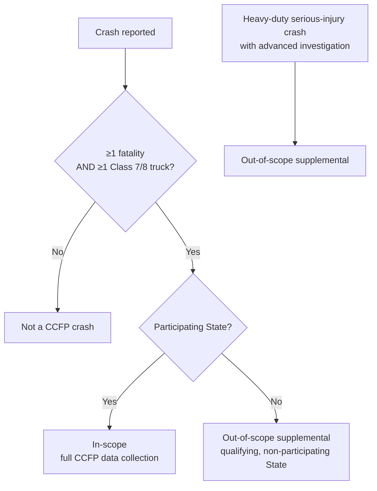
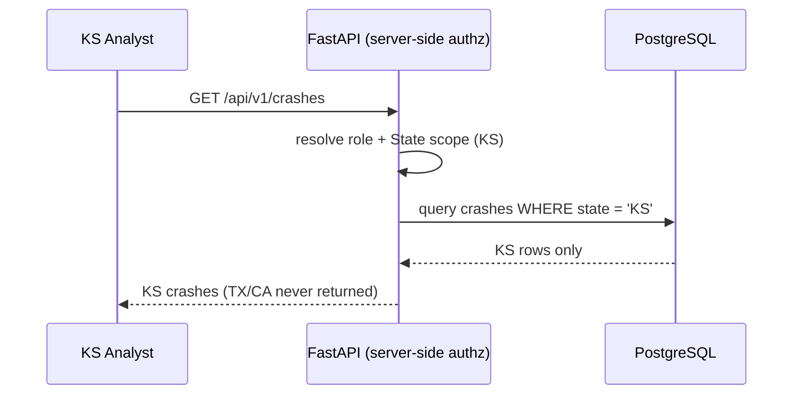

# Frequently Asked Questions

**Phase:** Release · **Artifact family:** Reference

Common questions about the **Crash Causal Factors Program (CCFP) IT Solution** —
the FMCSA platform for collecting, integrating, managing, analyzing, and
sharing commercial-motor-vehicle crash data, demonstrated here on the
**Phase 1 Heavy-Duty Truck Study**. Answers are grouped by theme and
deep-linkable.

!!! tip "Search first"
    Use {++Ctrl+K++} to search the corpus before browsing — most answers live
    deeper in [01 — Scope Statement](01-discover/01-scope-statement.md),
    [13 — Solution Design](03-design/13-solution-design.md), or the
    [14 — Operations Runbook](04-release/14-operations-runbook.md). The live
    demo runs at
    [nexgile-dot-ccfp.nexgiletechnologies.com](https://nexgile-dot-ccfp.nexgiletechnologies.com).

!!! warning "Everything here is 100% synthetic"
    The demo carries **no real PII, no real CIPSEA interview data, and no
    production records.** Seeded identities use the fictitious, non-deliverable
    `@ccfp.gov` domain. Treat every crash, name, U.S. DOT number, and ELD file
    as fabricated for demonstration.

---

## 1. Program & data philosophy

### Why synthetic data?

Because CCFP's real inputs are among the most sensitive a federal program
handles: fatal-crash PII, motor-carrier records, and **CIPSEA-protected** BTS
interviews. No production or personal data may touch a demo environment. Every
crash, person, vehicle, ELD file, and report in this build is fabricated so the
full eight-phase lifecycle can be exercised end-to-end without privacy, Privacy
Act, or CIPSEA exposure. See
[Scope Statement](01-discover/01-scope-statement.md).

### What is a qualifying crash (Phase 1)?

A **Phase 1 qualifying crash** has **≥1 fatality** *and* **≥1 heavy-duty
Class 7/8 truck** (GVWR ≥ 26,001 lbs). Scope then layers on top:



**In-scope** crashes collect the full CCFP attribute set; **out-of-scope
supplemental** records (qualifying crashes in non-participating States, or
heavy-duty serious-injury crashes with advanced investigation data) provide a
comparison baseline and do not require every CCFP attribute. The qualifying and
scope criteria themselves are study parameters, so a future phase can redefine
"qualifying" (for example, medium-duty trucks or buses) without code changes.
See [Scope Statement](01-discover/01-scope-statement.md).

### What kicks off a crash record?

The **Initial Incident Form (IIF)**, created within **24–48 hours** of a
qualifying crash by an `MCSAP_INSPECTOR` or State-designated user. Saving the
IIF mints the stable **CCFP identifier**, classifies scope, and triggers
notification & routing. See
[Workflow & Process](02-analyze/07-workflow-process.md).

### Is this a finished system or a demonstration?

A **demonstration** of the complete thesis on a single deployment. Production
hardening — DOT-approved OIDC IdP (MFA/PIV/CAC), managed PostgreSQL, Celery/Redis
workers, live FMCSA integrations, and the formal authorization to operate — is a
separate priced workstream. See [Solution Design](03-design/13-solution-design.md).

---

## 2. Access & credentials

### Where do I sign in?

At [the demo login](https://nexgile-dot-ccfp.nexgiletechnologies.com/login).
**All seeded accounts share the password `Second@123`** (synthetic, demo-only).

<div class="grid cards" markdown>

-   :material-shield-account: **Federal / program roles**

    `sysadmin@ccfp.gov` · `avery.thornton@ccfp.gov` ·
    `dana.whitfield@ccfp.gov` · `priya.ramanathan@ccfp.gov` ·
    `victor.delacruz@ccfp.gov` · `omar.haddad@ccfp.gov`

-   :material-map-marker-radius: **State-scoped roles (KS)**

    `nora.kowalczyk@ccfp.gov` (Inspector) ·
    `elliot.fontaine@ccfp.gov` (Analyst) ·
    `tomasz.bialek@ccfp.gov` (State User)

-   :material-account-voice: **CIPSEA roles**

    `helena.brandt@ccfp.gov` (BTS) ·
    `marcus.ellingsworth@ccfp.gov` (FMCSA) — only these see `bts:read` data.

-   :material-earth: **Public role**

    `public.demo@ccfp.gov` — de-identified published outputs only.

</div>

The full table (including extra State-scoped accounts for TX and CA) lives on
the [Demo Credentials](reference/demo-credentials.md) page.

### Which login should I use to test a specific feature?

| Goal | Sign in as | Role |
|------|-----------|------|
| Create an Initial Incident Form | `nora.kowalczyk@ccfp.gov` | `MCSAP_INSPECTOR` |
| QC, coding, select contributing factors | `elliot.fontaine@ccfp.gov` | `STATE_CMV_ANALYST` |
| Configure studies, attributes, completeness rules | `avery.thornton@ccfp.gov` | `CCFP_PROJECT_ADMIN` |
| View protected BTS interview data | `helena.brandt@ccfp.gov` | `BTS_CIPSEA_AGENT` |
| Browse only published, de-identified outputs | `public.demo@ccfp.gov` | `PUBLIC_USER` |

See the [RBAC Matrix](02-analyze/10-rbac-matrix.md).

### How do I reset or reseed a password?

Every demo account shares one seeded password; rotating individual passwords is
not a demo feature. Re-running the seeds restores the known password — see
[How do I reseed demo data?](#how-do-i-reseed-demo-data) below and the
[Operations Runbook](04-release/14-operations-runbook.md).

---

## 3. State scope isolation

### How does State scope isolation work?

Authorization is enforced **server-side on every request**, filtered by role,
organization, **State**, study phase, crash scope, data sensitivity, and
resource-level permission. State-scoped roles (`MCSAP_INSPECTOR`,
`STATE_CMV_ANALYST`, `STATE_USER`) resolve effective permissions through
`user_role_assignments → roles → role_permissions`, and a State filter is
applied on top so a Kansas user sees only Kansas crashes.



### How can I see scope isolation in action?

Sign in as `elliot.fontaine@ccfp.gov` (KS) and `grant.holloway@ccfp.gov` (TX) in
two sessions: each Analyst sees a disjoint crash list. PII is additionally
masked unless the user holds a data-entry/QC permission. See
[RBAC Matrix](02-analyze/10-rbac-matrix.md).

---

## 4. CIPSEA & BTS data protection

### What is CIPSEA and how is BTS data protected?

**CIPSEA** is the *Confidential Information Protection and Statistical
Efficiency Act*. BTS CIPSEA Agents conduct confidential driver, carrier, and
witness interviews for **in-scope** crashes, and that data may be used for
statistical purposes only. In the platform:

- BTS interview data is tagged with a `data_sensitivity` value (PII / CIPSEA /
  sensitive) and stored separately from public outputs.
- Access requires the dedicated **`bts:read`** permission — only
  `BTS_CIPSEA_AGENT` and (where the BTS agreement permits) `FMCSA_CIPSEA_AGENT`
  hold it.
- The Initial Incident Form for an in-scope crash **routes a notification** to
  BTS CIPSEA Agents to begin the interview workflow under the approved BTS
  access model.

!!! danger "CIPSEA is statutory"
    No public, State, or general federal user can reach CIPSEA-protected
    interview content. The published de-identified outputs never carry
    respondent-identifiable data. See
    [Solution Design](03-design/13-solution-design.md).

### Who never sees CIPSEA data?

| Can hold `bts:read`? | Roles |
|---|---|
| Yes (conditional on BTS agreement) | `BTS_CIPSEA_AGENT`, `FMCSA_CIPSEA_AGENT` |
| No | every other role, including `STATE_CMV_ANALYST`, `FEDERAL_USER`, `PUBLIC_USER` |

---

## 5. Authentication: dev vs. production

### How does dev auth differ from production (OIDC MFA/PIV/CAC)?

The demo uses a **mock IdP**: `POST /api/v1/auth/login` verifies a seeded email
+ password (bcrypt against `users.password_hash`) and issues a short-lived JWT.
The **same permission middleware** runs on every request in both dev and
production — only the front door changes.

```mermaid
flowchart LR
    subgraph Dev["Demo (CCFP_DEV_AUTH_ENABLED=true)"]
      A[Email + Second@123] --> B[bcrypt verify] --> C[JWT issued]
    end
    subgraph Prod["Production (CCFP_DEV_AUTH_ENABLED=false)"]
      D[DOT-approved OIDC IdP<br/>MFA · PIV/CAC] --> E[Federated identity]
    end
    C --> F[Server-side RBAC middleware]
    E --> F
    F --> G[/api/v1/...]
```

Setting `CCFP_DEV_AUTH_ENABLED=false` swaps the mock IdP for the DOT-approved
OIDC provider with **MFA and PIV/CAC** for federal users. Because authorization
is decided server-side after authentication, no privilege depends on which front
door issued the identity — the demo and production enforce the same role, State,
study-phase, scope, and data-sensitivity checks. See
[Architecture & Sequence](03-design/11-architecture-sequence.md).

### Why JWT in the demo and not PIV/CAC?

The demo has no access to federal PIV/CAC infrastructure. The OIDC adapter slot
exists but is not wired in dev; JWTs are short-lived and carry the same role and
State claims the RBAC layer enforces. All endpoints require auth **except**
health checks and `/api/v1/public/...`.

---

## 6. Published outputs & de-identification

### How are published outputs de-identified?

Operational records and published outputs are **separated**. Publication
(Phase 7) emits summarized, **de-identified** datasets to the public surface;
they live apart from the operational store and never include PII or
CIPSEA-protected content.

```mermaid
flowchart LR
    OPS[(Operational records<br/>PII / CIPSEA tagged)] -->|aggregate + de-identify| PUB[(Published Zone<br/>summarized, de-identified)]
    PUB --> P1[/api/v1/public/outputs]
    PUB --> P2[/api/v1/public/data.json]
    PUB --> P3[/api/v1/public/reports/&#123;id&#125;]
    style OPS fill:#1a2b4a,color:#fff
    style PUB fill:#0b6b53,color:#fff
```

The `/api/v1/public/...` routes are the **only** unauthenticated endpoints, and
they expose the Published Zone exclusively. Federal and State users receive
role-approved reports and tables per their access level; only `PUBLIC_USER`-grade
data is open. Reports are explicitly **published as de-identified** before they
reach the public surface, and the public outputs are designed to be discoverable,
reusable, and metadata-tagged in line with open-government data requirements. The
exact de-identification standard applied before publication is an open program
decision recorded in the source documentation. See
[API Specification](02-analyze/09-api-specification.md).

---

## 7. Configurability for future phases

### How is the platform kept configurable for future phases?

Phase 1 assumptions are **not** hardcoded into schemas, rules, or UI. Study
parameters, the canonical attribute catalog (required/optional/read-only),
completeness rules, participating States, and PCR field mappings are all
**data-driven configuration** managed by `CCFP_PROJECT_ADMIN`. Adding a
medium-duty, bus, serious-injury, or multi-State phase is a configuration
exercise, not a rebuild.

| Concern | How it stays configurable |
|---|---|
| Qualifying / in-scope criteria | `studies` + `study_parameters` (per study) |
| Required vs. optional attributes | `data_attributes` + `attribute_requirements` |
| Complete-record logic | `completeness_rules` (per study) |
| State PCR forms | `pcr_field_mapping` — States keep their own forms |
| Participating States | `study_states` |

!!! abstract "Design intent"
    One stable CCFP identifier per crash, provenance retained on every source
    value, and per-study attribute/completeness rules mean new phases extend the
    catalog rather than fork the model. See
    [Data Model](02-analyze/08-data-model.md).

---

## 8. Compliance, accessibility & responsiveness

### What are the compliance obligations (508/WCAG, Privacy Act, NARA, OMB/PRA)?

| Obligation | What it covers in CCFP |
|---|---|
| **Section 508 / WCAG 2.1 AA** | Accessible UI; 508 is the source requirement, WCAG 2.1 AA the technical conformance target |
| **Privacy Act (PTA/PIA/SORN)** | Privacy documentation for crash PII; data-sharing agreements before State onboarding |
| **NARA** | Federal records-management and retention guidance |
| **OMB / PRA** | OMB approval and display of the OMB control number before public information collection |
| **CIPSEA** | Statutory protection of BTS interview data |
| **Federal web / DOTGOV** | `.gov`/`.mil` domain, government banner, descriptive titles, Plain Writing Act |

Security controls underpinning these: MFA (PIV/CAC for federal), server-side
authorization on every request, encryption in transit and at rest, signed-URL
object access, immutable audit logs, least privilege, and malware scanning on
uploads. See [Solution Design](03-design/13-solution-design.md).

### Is it mobile-responsive and accessible?

Yes — the frontend is built **mobile-responsive and device-agnostic**, targeting
Section 508 with WCAG 2.1 AA as the conformance goal. State-changing actions
write to `audit_logs` and lifecycle events raise `notifications`, supporting the
auditability requirement. Non-functional targets include **24/7 availability**,
**≥1,000 concurrent users**, and horizontal scalability. See
[Non-Functional Requirements in Solution Design](03-design/13-solution-design.md).

---

## 9. Operations

### How do I reseed demo data?

From `Backend/database/`, the dependency-light runner applies migrations and
seeds idempotently:

```bash
python migrate.py up        # apply migrations then seeds (idempotent)
python migrate.py status    # list applied / pending
```

Seeds (roles, permissions, organizations, users, study config, demo crashes, and
`0005_dev_passwords.sql`) are **100% synthetic** and safe to re-run; conflicts
are ignored so reseeding restores the known password `Second@123`. See the
[Operations Runbook](04-release/14-operations-runbook.md).

### How is configuration like `DATABASE_URL` supplied?

The transactional store is **PostgreSQL only** (it also backs analytics, SQL
`ILIKE` search, and document metadata; uploaded files go to local disk). The
connection is supplied via the **`DATABASE_URL`** environment variable from a
single config source / secrets manager — the value is never committed or
displayed. Health checks live at `localhost` `/health` and `/health/db`.

### Can multiple reviewers demo at once?

Yes — the deployment is multi-user safe. Coordinate **destructive** operations
(reseed, drop) since reviewers share one synthetic dataset. State-scoped logins
keep each reviewer's view isolated to their State. See the
[Operations Runbook](04-release/14-operations-runbook.md).

### Where can I see the integrations?

External adapters (SafeSpect, CDLIS, MCMIS, eRODS, plus State PCR/NHTSA/FHWA/NOAA
and BTS) are **mock adapters behind stable interfaces**, feature-flagged via
`CCFP_INTEGRATION_*_LIVE`. Production swaps in the live FMCSA-owned and external
sources. See [Solution Design](03-design/13-solution-design.md).

---

## Related documents

- [Home](index.md)
- [Getting Started](quickstart.md)
- [Glossary](glossary.md)
- [Scope Statement](01-discover/01-scope-statement.md)
- [Workflow & Process](02-analyze/07-workflow-process.md)
- [Data Model](02-analyze/08-data-model.md)
- [RBAC Matrix](02-analyze/10-rbac-matrix.md)
- [Architecture & Sequence](03-design/11-architecture-sequence.md)
- [Solution Design](03-design/13-solution-design.md)
- [Operations Runbook](04-release/14-operations-runbook.md)
- [Demo Credentials](reference/demo-credentials.md)

*End of FAQ.*
