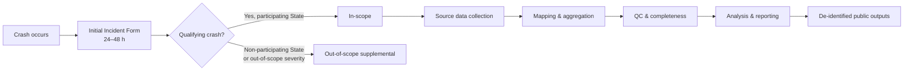
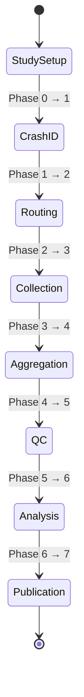
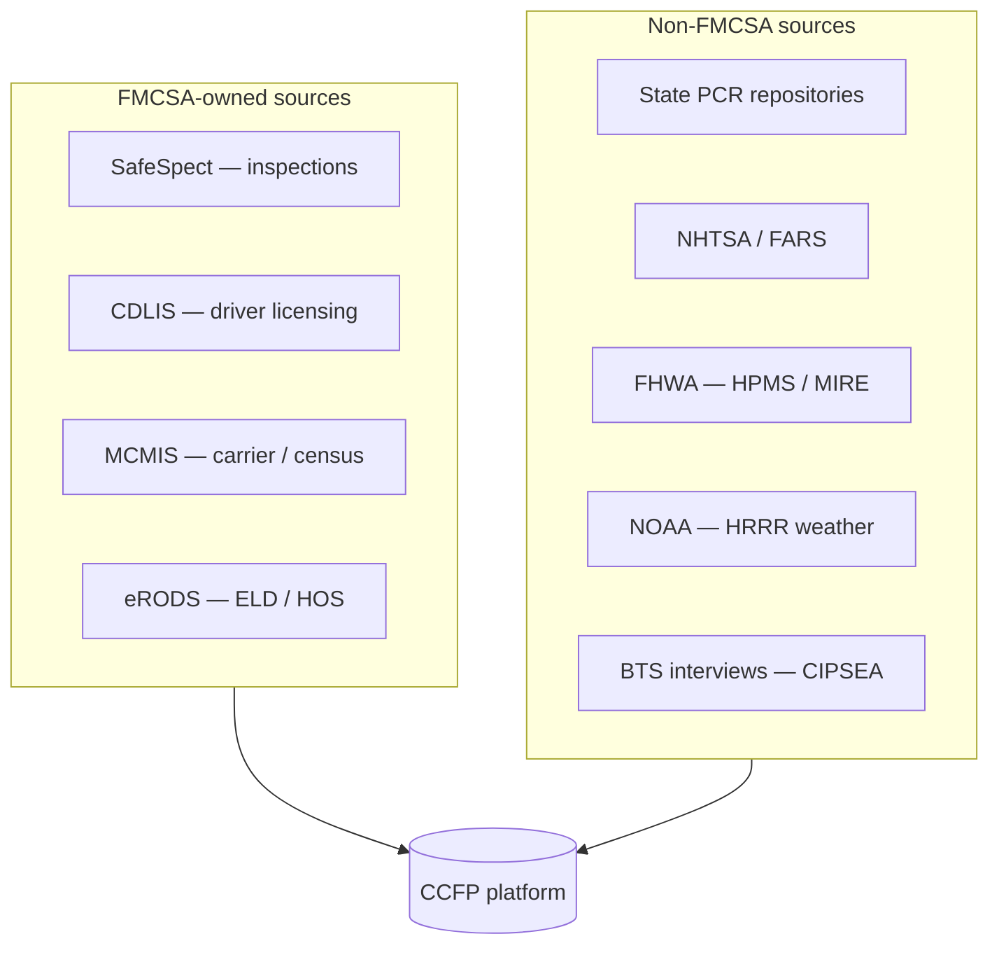
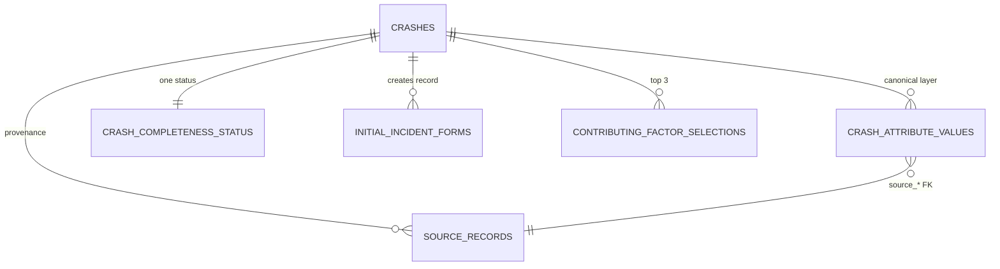

# Glossary

**Phase:** Release · **Artifact family:** Reference

Canonical definitions for every acronym, domain term, agency, role, platform
technology, and data-model concept used throughout the **Crash Causal Factors
Program (CCFP)** documentation set. Cross-reference this page from anywhere; the
documentation search indexes it in full. Entries are grounded in
`Documentation/project_documentation.md` §20 (Acronyms & Glossary) and the
surrounding scope, lifecycle, and architecture sections.

!!! tip "How to use this page"
    Each section groups terms by audience. If you arrived from a search, jump to
    the section that matches your role: **§1** agencies & programs · **§2**
    vehicles & crashes · **§3** domain & data terms · **§4** lifecycle &
    process · **§5** roles & people · **§6** platform & technology · **§7**
    integrations & external sources · **§8** compliance & records · **§9**
    data-model concepts · **§10** alphabetical index.

!!! warning "100% synthetic data"
    Every name, email, crash record, and identifier in this documentation set is
    **synthetic** and exists only for demonstration. The `@ccfp.gov` domain is
    fictitious and non-deliverable. No real PII, CIPSEA-protected interview
    content, or production data appears anywhere.

The CCFP IT Solution is a scalable FMCSA platform for collecting, integrating,
managing, analyzing, and sharing data about commercial-motor-vehicle crashes.
**Phase 1 — the Heavy-Duty Truck Study** — covers fatal crashes involving Class
7/8 trucks (GVWR ≥ 26,001 lbs). The platform is built to stay configurable for
future phases (medium-duty, buses, serious-injury, more States, attributes, and
sources) without a rebuild.

---

## 1. Agencies & programs

| Term | Expanded | Definition |
|---|---|---|
| **CCFP** | Crash Causal Factors Program | The FMCSA program — and the IT Solution that supports it — for collecting, integrating, analyzing, and sharing commercial-motor-vehicle crash data. See [Scope Statement](01-discover/01-scope-statement.md). |
| **FMCSA** | Federal Motor Carrier Safety Administration | The U.S. DOT operating administration that owns CCFP. Owns the SafeSpect, MCMIS, CDLIS, and eRODS source systems referenced throughout. |
| **U.S. DOT** | United States Department of Transportation | The parent department; sets the federal website, accessibility, privacy, and records standards CCFP must meet. |
| **Volpe** | U.S. DOT Volpe National Transportation Systems Center | Federal R&D center that supplies CCFP Project Team support staff as designated by the FMCSA Project Lead. |
| **BTS** | Bureau of Transportation Statistics | Statistical agency that conducts CIPSEA-protected confidential interviews with drivers, carriers, and witnesses for in-scope crashes. |
| **NHTSA** | National Highway Traffic Safety Administration | Federal road-safety agency; an approved federal consumer of CCFP reports and the owner of the FARS dataset. |
| **NCSA** | National Center for Statistics and Analysis | NHTSA office that operates FARS and defines the standard State-submission format. |
| **FHWA** | Federal Highway Administration | Federal agency supplying roadway-element context (HPMS, MIRE) used to enrich crash records. |
| **NOAA** | National Oceanic and Atmospheric Administration | Weather-data agency; supplies HRRR weather context for crash-time conditions. |
| **AAMVA** | American Association of Motor Vehicle Administrators | Operator of CDLIS, the driver-licensing exchange used for CDL/driver checks. |
| **MCSAP** | Motor Carrier Safety Assistance Program | FMCSA federal-State safety assistance program; the inspector role (`MCSAP_INSPECTOR`) responds to crashes and owns the Initial Incident Form. |
| **CVSA** | Commercial Vehicle Safety Alliance | Body that certifies MCSAP CMV Inspectors. |

## 2. Vehicles & crashes

| Term | Expanded | Definition |
|---|---|---|
| **CMV** | Commercial Motor Vehicle | The vehicle class CCFP studies. Phase 1 narrows to heavy-duty Class 7/8 trucks. |
| **HDT** | Heavy-Duty Truck | A Class 7/8 truck with **GVWR ≥ 26,001 lbs** — e.g. truck-tractor semi-trailers, furniture trucks, garbage trucks, cement trucks. The Phase 1 vehicle of interest. |
| **GVWR** | Gross Vehicle Weight Rating | Maximum rated loaded weight of a vehicle; the threshold (26,001 lbs) that defines a heavy-duty truck. |
| **Medium-Duty Truck** | Class 3–6, GVWR 10,001–26,000 lbs | Bucket trucks, box trucks, delivery vans, full-size pickups. **Out of Phase 1 scope**, but a planned future study. |
| **PU** | Power Unit | The motorized tractor/truck portion of a combination vehicle; a typed field on the Post-Crash Investigation. |
| **Qualifying crash** | Phase-1 eligibility test | A crash with **≥1 fatality AND ≥1 heavy-duty Class 7/8 truck**. The gate every record is classified against. See [Scope Statement](01-discover/01-scope-statement.md). |
| **In-scope crash** | Qualifying crash, participating State | A qualifying crash within a participating State jurisdiction. Triggers the full collection + BTS interview workflow. |
| **Out-of-scope crash** | Non-participating or out-of-severity | A qualifying crash in a non-participating State, **or** a heavy-duty serious-injury crash with advanced investigation data. Captured as a supplemental record, routed only to the State CMV Data Analyst. |
| **VMT** | Vehicle Miles Traveled | Exposure denominator used in safety-rate analysis. |
| **FY** | Fiscal Year | Federal accounting/reporting year used in study scheduling and outputs. |

## 3. Domain & data terms

| Term | Definition |
|---|---|
| **CCFP identifier** | The single stable, system-assigned identifier for one crash, created when the Initial Incident Form is saved. Every source record and canonical value ties back to it. |
| **IIF** (Initial Incident Form) | Electronic form completed within **24–48 hours** of a crash; creates the initial CCFP crash record and triggers routing/notifications. Captures date/time/location, local report number, vehicles, drivers, carriers, non-motorists, witnesses, and injury/fatality indicators. See [Workflow & Process](02-analyze/07-workflow-process.md). |
| **Source record** | A raw inbound artifact (inspection, investigation, PCR, reconstruction, ELD file, etc.) linked to a crash. Provenance is preserved so every value traces to its origin. |
| **Provenance** | The retained lineage on every aggregated value — which source record, system, and field it came from — so analysts can trace any canonical attribute back to its source. |
| **Canonical attribute** | A per-study CCFP data attribute (required / optional / read-only) onto which State-specific and external source fields are mapped. One current canonical value exists per `(crash, attribute)`. |
| **Contributing factor** | A coded circumstance that contributed to a crash. The State CMV Data Analyst selects the **top three primary contributing factors** from PCR-derived groups. See [Data Model](02-analyze/08-data-model.md). |
| **Completeness rule** | A configurable per-study rule that determines whether a crash record is **complete** or **incomplete** based on required attributes and source coverage. One completeness status exists per crash. |
| **De-identified output** | A summarized, published artifact stripped of PII/CIPSEA content, separated from operational records and released to public users only after a study is published. |
| **Study** | The unit of configuration: vehicle type, severity, participating States, dates, qualifying/in-scope/out-of-scope criteria, required/optional attributes, and completeness rules. Phase 1 = the Heavy-Duty Truck Study. |
| **Participating State** | A State with an executed data-sharing agreement that contributes crashes; in-scope status requires the crash to fall within one. |
| **CCFP Data Lake** | The conceptual central repository for ingesting, storing, processing, and securing structured, semi-structured, and unstructured CCFP data. In the implemented build, **PostgreSQL is the sole data store** backing this concept (uploaded files go to disk). |
| **PCR** | Police Crash Report | A crash report completed by law enforcement and uploaded to a State crash repository; mapped per-State into CCFP attributes. |
| **PCI** | Post-Crash Investigation | A more thorough review than a standard PCR but less expansive than a reconstruction; modeled as typed §19.2 child tables. |
| **BRD** | Business Requirements Document | The originating requirements source whose access groups, contributing-factor groups, and traceability drive CCFP design. See [Business Requirements](01-discover/04-business-requirements.md). |
| **QC** | Quality Control | Configurable rules for missing data, invalid formats, compliance checks, and data-entry issues, applied before a record is marked complete. |
| **MMUCC** | Model Minimum Uniform Crash Criteria | Voluntary minimum standardized crash-data variable set; a mapping reference for State PCR alignment. |

## 4. Lifecycle & process

The CCFP target lifecycle is an **eight-phase pipeline** (Phase 0 → Phase 7).
Each phase below maps to a stage in the implemented workflow.

| Phase | Name | Definition |
|---|---|---|
| **0** | Study Setup | Administrators define study parameters: vehicle type, severity, participating States, dates, scope criteria, attributes, and completeness rules. |
| **1** | Crash Identification & Initial Incident | An inspector or State user creates the IIF within 24–48 h; the system assigns the CCFP identifier and captures core crash facts. |
| **2** | Notification & Routing | The State CMV Data Analyst is notified; in-scope crashes also notify BTS CIPSEA Agents to start the confidential-interview workflow. |
| **3** | Source Data Collection | Inspection, investigation, reconstruction, PCR, ELD, and other artifacts arrive via integration, upload, direct connection, API, or manual entry. |
| **4** | Data Mapping & Aggregation | Source attributes are mapped to canonical CCFP attributes; all source records link to the CCFP identifier with provenance retained. |
| **5** | Quality Control & Completeness | Configurable QC rules run; formats validated; missing data flagged; the record is marked complete or incomplete. |
| **6** | Analysis & Reporting | Authorized users run queries, dashboards, tables, and causal-factor analysis; the analyst selects the top three contributing factors. |
| **7** | Publication & Data Sharing | Summarized, de-identified outputs are released to public users; federal/State users receive role-approved reports and data. |

!!! abstract "Routing rule at a glance"
    **In-scope** → State CMV Data Analyst **and** BTS CIPSEA Agent (interview
    workflow). **Out-of-scope supplemental** → State CMV Data Analyst only.

## 5. Roles & people

CCFP defines **12 application roles**. Role codes appear in monospace; effective
permissions resolve through `user_role_assignments → roles → role_permissions`,
with State users scope-filtered to their State and CIPSEA data gated behind
`bts:read`. See the [RBAC Matrix](02-analyze/10-rbac-matrix.md).

| Role code | Name | Definition |
|---|---|---|
| `MCSAP_INSPECTOR` | MCSAP CMV Inspector | CVSA-certified responding inspector; owns the Initial Incident Form and inspection inputs. State-scoped. |
| `STATE_CMV_ANALYST` | State CMV Data Analyst | Coordinates State data collection, QC, coding, and analysis; selects the primary contributing factors. State-scoped. |
| `CCFP_PROJECT_TEAM` | CCFP Project Team | FMCSA + Volpe team for program operations, analysis, QC, and reporting. |
| `CCFP_PROJECT_ADMIN` | CCFP Project Team Administrator | Administers users, roles, study parameters, attributes, and completeness rules. |
| `CCFP_DB_ADMIN` | CCFP Database Administrator | Manages data mappings and analytical datasets; views raw and aggregated data. |
| `CCFP_DATA_SCIENTIST` | CCFP Data Scientist | Federal analytical role for crash causal-factor research. |
| `BTS_CIPSEA_AGENT` | BTS CIPSEA Agent | Conducts confidential interviews; access governed by CIPSEA. |
| `FMCSA_CIPSEA_AGENT` | FMCSA CIPSEA Agent | FMCSA role authorized to view protected BTS data where permitted. |
| `FEDERAL_USER` | Federal User | FMCSA/NHTSA/BTS and approved federal users; role-approved reports and tables. |
| `STATE_USER` | State User | State enforcement/reconstruction/investigator participant; non-PII reports. State-scoped. |
| `PUBLIC_USER` | Public User | Consumes summarized, de-identified published outputs only. |
| `SYSTEM_ADMIN` | System Administrator | Technical operations: configuration, environments, audit, and support. |

| Supporting role | Definition |
|---|---|
| **Crash Reconstructionist** | Trained law-enforcement officer or contracted party who completes a crash reconstruction using physical, electronic, video, audio, and testimonial evidence. |
| **Post-Crash Investigator** | Law-enforcement officer who performs a post-crash investigation (more than a PCR, less than a reconstruction). |
| **FARS Analyst** | State role that translates and uploads State data to NCSA's standard format and into FARS within 90 days of a crash. |

!!! note "Access groups vs. roles"
    The BRD layers **access groups** over the operational roles: *Federal Users
    (PII)*, *State Users (No PII)*, and *Public Users (No PII, de-identified)*.
    These categories govern view/download rights independent of the role a user
    holds.

## 6. Platform & technology

| Term | Definition |
|---|---|
| **React** | Frontend framework (React 18 + TypeScript) for the CCFP UI. Production target: a DOT-approved design system. |
| **Vite** | Frontend dev server and bundler; proxies `/api` to the backend in development. |
| **Tailwind** | Utility-first CSS framework for the UI. |
| **Recharts** | Charting library backing analytics dashboards and visualizations. |
| **FastAPI** | Python async web framework hosting the backend API and workflow services. See [Solution Design](03-design/13-solution-design.md). |
| **Pydantic** | Request/response validation (v2) for the FastAPI layer. |
| **SQLAlchemy** | ORM (2.0) defining the PostgreSQL data model (~38 core tables + typed PCI tables). |
| **PyJWT** | Library that signs/verifies the JWTs issued by the dev mock-IdP. |
| **BackgroundTasks** | FastAPI in-process async mechanism for routing, notifications, and scans. Production target: Celery/Redis. |
| **PostgreSQL** | The **sole data store** — also backs analytics, `ILIKE`/`pg_trgm` search, and document metadata. Connection is supplied via the `DATABASE_URL` environment variable (value held in a secrets manager, never in docs). |
| **RBAC** | Role-Based Access Control | The server-side authorization model enforced on every request by role, organization, State, study phase, crash scope, data sensitivity, and resource-level permission. |
| **JWT** | JSON Web Token | The bearer token issued at login (dev) and verified per request. |
| **OIDC** | OpenID Connect | Federation protocol for the production DOT-approved IdP (MFA/PIV/CAC); dev uses a mock-IdP gated by `CCFP_DEV_AUTH_ENABLED`. |

## 7. Integrations & external sources

External adapters are **mock implementations behind stable interfaces**,
feature-flagged by `CCFP_INTEGRATION_*_LIVE`. See [Component
Diagram](03-design/12-component-diagram.md).

| Term | Expanded | Definition |
|---|---|---|
| **SafeSpect** | FMCSA inspection system | Source of post-crash inspection data; also validates U.S. DOT numbers from the IIF. |
| **CDLIS** | Commercial Driver's License Information System | AAMVA-operated driver-licensing exchange used for CDL/driver checks. |
| **MCMIS** | Motor Carrier Management Information System | FMCSA carrier/census system and a PCR-data source. |
| **eRODS** | Electronic Record of Duty Status | The federal ELD/HOS repository; CCFP parses exported records against the crash. |
| **ELD** | Electronic Logging Device | Device recording driver hours; its CSV output is uploaded and parsed against a crash record. |
| **HOS** | Hours of Service | Driver duty-time rules; ELD/eRODS events are summarized against HOS for the crash. |
| **FARS** | Fatality Analysis Reporting System | NHTSA/NCSA fatal-crash census; a downstream/cross-reference dataset. |
| **HPMS / MIRE** | Highway Performance Monitoring System / Model Inventory of Roadway Elements | FHWA roadway-context datasets. |
| **HRRR** | High-Resolution Rapid Refresh | NOAA weather model supplying crash-time conditions. |

## 8. Compliance & records

| Term | Expanded | Definition |
|---|---|---|
| **CIPSEA** | Confidential Information Protection and Statistical Efficiency Act | Governs BTS confidential interview data; access gated behind `bts:read`. Protected content never appears in de-identified outputs. |
| **PII** | Personally Identifiable Information | Tagged with a `data_sensitivity` marker and masked unless the user holds data-entry/QC permission. |
| **PIA / PTA** | Privacy Impact Assessment / Privacy Threshold Analysis | Privacy Act artifacts required for handling personal data. |
| **SORN** | System of Records Notice | Privacy Act notice describing the records system. |
| **NARA** | National Archives and Records Administration | Sets the records-management and retention requirements CCFP follows. |
| **OMB** | Office of Management and Budget | Issues PRA control numbers shown on federal collection forms. |
| **PRA** | Paperwork Reduction Act | Requires OMB control numbers on public information collections. |
| **PIV / CAC** | Personal Identity Verification / Common Access Card | Federal smart-card auth — the production MFA target via the DOT-approved IdP. |
| **MFA** | Multi-Factor Authentication | Required for production sign-in; PIV/CAC for federal staff. |
| **FOIA** | Freedom of Information Act | Determines public disclosability of stored artifacts. |
| **Section 508 / WCAG 2.1 AA** | Federal accessibility standard / Web Content Accessibility Guidelines | The accessibility bar for the CCFP UI. |

!!! danger "CIPSEA boundary"
    BTS interview content is **never** exposed to operational records or public
    outputs. Only roles holding `bts:read` (`BTS_CIPSEA_AGENT`, and
    `FMCSA_CIPSEA_AGENT` where permitted) may view it, and access is logged in
    the immutable audit trail.

## 9. Data-model concepts

| Term | Definition |
|---|---|
| **UUID PK** | Every business entity uses a `gen_random_uuid()` primary key. |
| **`ccfp_identifier`** | The stable per-crash business key on the `crashes` table; the anchor for all source records and canonical values. |
| **`crash_attribute_values`** | The aggregated canonical layer; `source_*` columns carry provenance back to a `source_records` row. |
| **Partial unique index** | Enforces **one current canonical value** per `(crash, attribute)` and **one completeness status** per crash. |
| **`data_sensitivity`** | A column-level tag (`PII` / `CIPSEA` / `sensitive`) driving masking and access control. |
| **Cascade vs. restrict** | Crash-owned child tables cascade on delete; reference FKs restrict to protect shared lookups. |
| **`pg_trgm`** | PostgreSQL trigram extension powering case-insensitive `ILIKE` search. |
| **Native enum types** | 23 PostgreSQL enum types encode role, status, scope, and sensitivity domains. |
| **`audit_logs`** | Append-only trail; one row per state change, with immutable retention. |
| **§19.2 PCI tables** | Typed Post-Crash Investigation child tables (e.g. `pci_carrier_power_unit`, `pci_hours_of_service`, `pci_brake_system`, `pci_tires`) modeling the investigation form. |

---

## 10. Alphabetical index

**A–B**
:   AAMVA · BRD · BTS · `BTS_CIPSEA_AGENT`

**C**
:   CAC · canonical attribute · `CCFP_DATA_SCIENTIST` · `CCFP_DB_ADMIN` · CCFP · CCFP Data Lake · `ccfp_identifier` · CDL · CDLIS · CIPSEA · CMV · completeness rule · contributing factor · `CCFP_PROJECT_ADMIN` · `CCFP_PROJECT_TEAM` · CVSA

**D–F**
:   `data_sensitivity` · de-identified output · ELD · eRODS · FARS · FastAPI · `FEDERAL_USER` · FHWA · FMCSA · `FMCSA_CIPSEA_AGENT` · FOIA · FY

**G–I**
:   GVWR · HDT · HOS · HPMS · HRRR · IIF · in-scope crash

**J–N**
:   JWT · MCMIS · MCSAP · `MCSAP_INSPECTOR` · medium-duty truck · MFA · MIRE · MMUCC · NARA · NCSA · NHTSA · NOAA

**O–P**
:   OIDC · OMB · out-of-scope crash · participating State · PCI · PCR · `pg_trgm` · PIA · PII · PIV · PostgreSQL · PRA · provenance · PTA · PU · `PUBLIC_USER` · §19.2 PCI tables

**Q–S**
:   QC · qualifying crash · RBAC · React · Recharts · Section 508 · SafeSpect · SORN · source record · `STATE_CMV_ANALYST` · `STATE_USER` · study · `SYSTEM_ADMIN`

**T–Z**
:   Tailwind · U.S. DOT · UUID PK · Vite · VMT · Volpe · WCAG 2.1 AA

---

## Related documents

- [Home](index.md) — CCFP documentation landing page
- [Getting Started](quickstart.md) — five-minute tour of the synthetic demo
- [Scope Statement](01-discover/01-scope-statement.md) — formal qualifying / in-scope / out-of-scope definitions
- [Stakeholders & Personas](01-discover/03-stakeholders-personas.md) — extended cards for the 12 roles in §5
- [Workflow & Process](02-analyze/07-workflow-process.md) — diagrams of every lifecycle phase in §4
- [Data Model](02-analyze/08-data-model.md) — the schema underpinning §9
- [API Specification](02-analyze/09-api-specification.md) — the endpoints behind these terms
- [RBAC Matrix](02-analyze/10-rbac-matrix.md) — roles, permissions, and scope enforcement
- [Demo Credentials](reference/demo-credentials.md) — synthetic sign-in accounts (shared password `Second@123`)

*End of Glossary.*
