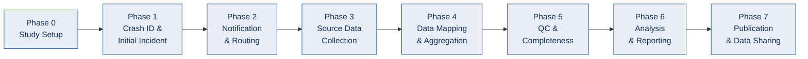

FMCSA · Crash Causal Factors Program · Phase 1

# CCFP Documentation Portal { .flow-hero__title }

The complete delivery package — discovery, analysis, design, and operations — for the FMCSA Crash Causal Factors Program (CCFP) IT Solution. Phase 1 is the Heavy-Duty Truck Study: fatal crashes involving Class 7/8 trucks (GVWR ≥ 26,001 lbs). Fourteen primary artifacts plus quickstart, glossary, FAQ, and release notes. Every page cross-linked and search-indexed.

Version 1.1
June 2026
Delivered for review
Synthetic crash data only

[Get started in 10 minutes](quickstart.md){ .md-button .md-button--primary }
[Open the architecture](03-design/11-architecture-sequence.md){ .md-button }
[See the API spec](02-analyze/09-api-specification.md){ .md-button }

14

Primary delivery artifacts

88

API endpoints documented

~38

ORM tables

23

Native enum types

8

Lifecycle phases

12

User roles

16

API router modules

4

Demo crashes seeded

!!! abstract "What this portal is"
    A complete, self-contained documentation set for the FMCSA **Crash Causal
    Factors Program (CCFP) IT Solution**. **Fourteen primary delivery
    artifacts** across Discover / Analyze / Design / Release, plus
    supplementary quickstart, glossary, FAQ, and release-notes resources.
    Every page is cross-linked and search-indexed. The platform digitizes how
    CCFP collects, integrates, manages, analyzes, and shares data about
    commercial-motor-vehicle crashes — consolidating MCSAP inspections, State
    Police Crash Reports, post-crash investigations, reconstruction reports,
    ELD/eRODS files, and BTS CIPSEA interview summaries against one stable
    **CCFP identifier** per crash. The architecture stays **configurable for
    future phases** (medium-duty, buses, serious-injury, more States and
    attributes) without a rebuild.

!!! warning "Synthetic-data POC"
    The CCFP portal runs on **100% internally generated synthetic crash data** —
    no real applicant, carrier, driver, PII, or CIPSEA-protected feeds are
    connected. The seeded `@ccfp.gov` accounts use a fictitious, non-deliverable
    domain. See [Scope Statement](01-discover/01-scope-statement.md) for the
    boundary and [Solution Design](03-design/13-solution-design.md) for the
    operating ground rules. CCFP is a **research and data-sharing** program; the
    system supplies data, analysis tooling, and workflow support — it does not
    determine legal causation.

## Quick paths — start here

Pick the entry point that matches your role:

-   :material-flag:{ .lg .middle } **Executive reviewer**

    ---

    You want a 10-minute overview of what was built and why it matters.

    **Start with:**

    - [Quickstart](quickstart.md) (5 min)
    - [Scope Statement](01-discover/01-scope-statement.md) (15 min)
    - [POC Charter](01-discover/02-poc-charter.md) (10 min)
    - [Architecture at a glance](03-design/11-architecture-sequence.md) (5 min)

-   :material-server-network:{ .lg .middle } **Operator / SRE**

    ---

    You will run, monitor, and troubleshoot the live demo.

    **Start with:**

    - [Operations Runbook](04-release/14-operations-runbook.md)
    - [Quickstart bring-up](quickstart.md)
    - [Demo credentials](reference/demo-credentials.md)
    - [Solution Design](03-design/13-solution-design.md)

-   :material-code-tags:{ .lg .middle } **Developer / integrator**

    ---

    You will read / extend the codebase or integrate with the API.

    **Start with:**

    - [Quickstart](quickstart.md)
    - [Architecture & Sequence](03-design/11-architecture-sequence.md)
    - [API Specification](02-analyze/09-api-specification.md)
    - [Data Model](02-analyze/08-data-model.md)
    - [Component Diagram](03-design/12-component-diagram.md)

-   :material-shield-lock:{ .lg .middle } **Security / auditor**

    ---

    You will evaluate the security posture, RBAC, CIPSEA controls, and audit trail.

    **Start with:**

    - [RBAC Matrix](02-analyze/10-rbac-matrix.md)
    - [Solution Design](03-design/13-solution-design.md)
    - [Architecture & Sequence](03-design/11-architecture-sequence.md)
    - [Operations Runbook](04-release/14-operations-runbook.md)

-   :material-account-group:{ .lg .middle } **Product / analyst**

    ---

    You will assess features, personas, and business fit.

    **Start with:**

    - [Stakeholders & Personas](01-discover/03-stakeholders-personas.md)
    - [Business Requirements](01-discover/04-business-requirements.md)
    - [Use Cases](01-discover/05-use-cases.md)
    - [User Stories](01-discover/06-user-stories.md)

-   :material-clipboard-check:{ .lg .middle } **State inspector / analyst**

    ---

    You file Initial Incident Forms, collect source data, and select contributing factors.

    **Start with:**

    - [Workflow / Process](02-analyze/07-workflow-process.md)
    - [Use Cases](01-discover/05-use-cases.md)
    - [Demo credentials](reference/demo-credentials.md)
    - [RBAC Matrix](02-analyze/10-rbac-matrix.md)

---

## The 14 primary artifacts

The delivery package follows a four-phase lifecycle. Each artifact is
self-contained and extensively cross-linked.

### :material-magnify: Discover — strategy, stakeholders, requirements

| # | Artifact | Purpose | Primary audience |
|---|---|---|---|
| 01 | [Scope Statement](01-discover/01-scope-statement.md) | Define the boundary: in/out of scope, qualifying crashes, assumptions, constraints | Exec, product, sponsor |
| 02 | [POC Charter](01-discover/02-poc-charter.md) | Authorize resources; governance; objectives; risks; exit criteria | Sponsor, PM, exec |
| 03 | [Stakeholders & Personas](01-discover/03-stakeholders-personas.md) | Catalog every stakeholder and the 12 in-app roles | Product, UX, security |
| 04 | [Business Requirements](01-discover/04-business-requirements.md) | Enumerate every BR traced to code + KPI | Product, QA, exec |
| 05 | [Use Cases](01-discover/05-use-cases.md) | Actor-goal-scenario walkthroughs across all 12 roles | Product, QA |
| 06 | [User Stories](01-discover/06-user-stories.md) | "As a / I want / So that" + Gherkin acceptance criteria | QA, developer |

### :material-chart-scatter-plot: Analyze — workflow, data, API, security

| # | Artifact | Purpose | Primary audience |
|---|---|---|---|
| 07 | [Workflow / Process Diagrams](02-analyze/07-workflow-process.md) | Mermaid flows for the 8-phase crash lifecycle | Developer, PM, architect |
| 08 | [Data Model](02-analyze/08-data-model.md) | Tables, ERD, provenance, completeness, PII/CIPSEA tagging | Developer, DBA, architect |
| 09 | [API Specification](02-analyze/09-api-specification.md) | Every route, method, permission, schema | Developer, integrator |
| 10 | [RBAC Matrix](02-analyze/10-rbac-matrix.md) | Role × permission grid + State scope + CIPSEA semantics | Security, auditor, developer |

### :material-pencil-ruler: Design — architecture, components, solution

| # | Artifact | Purpose | Primary audience |
|---|---|---|---|
| 11 | [Architecture & Sequence Diagrams](03-design/11-architecture-sequence.md) | C4 context + container + principal sequences | Architect, developer |
| 12 | [Component Diagram](03-design/12-component-diagram.md) | Module-level breakdown front + back | Developer, architect |
| 13 | [Solution Design (HLD/LLD Lite)](03-design/13-solution-design.md) | Stack, layering, patterns, security, NFRs | Architect, developer, security |

### :material-rocket-launch: Release & Handoff — operations

| # | Artifact | Purpose | Primary audience |
|---|---|---|---|
| 14 | [Operations Runbook / Support Guide](04-release/14-operations-runbook.md) | Bring-up, demo creds, playbooks, incident response | Operator, SRE, support |

---

## Supplementary references

Enterprise doc sets carry a handful of small-but-essential companion pieces.
The CCFP portal ships these alongside the 14:

| Reference | Use when |
|---|---|
| [Getting Started / Quickstart](quickstart.md) | You want a 10-minute orientation or a developer-setup path. |
| [Demo Credentials](reference/demo-credentials.md) | You need the full seeded-account table and the State scope-isolation walk-through. |
| [Glossary](glossary.md) | You see an acronym (CCFP, MCSAP, PCR, ELD, eRODS, CIPSEA, GVWR…) and need its meaning. |
| [FAQ](faq.md) | You have a common question — why synthetic data, what is a qualifying crash, how to reseed. |
| [Release Notes](release-notes.md) | You need the chronological changelog and known issues. |

---

## How the 14 documents fit together

```mermaid
flowchart LR
    subgraph D["Discover"]
      D1[01 · Scope]
      D2[02 · Charter]
      D3[03 · Stakeholders]
      D4[04 · Requirements]
      D5[05 · Use Cases]
      D6[06 · User Stories]
    end
    subgraph A["Analyze"]
      A7[07 · Workflow]
      A8[08 · Data Model]
      A9[09 · API]
      A10[10 · RBAC]
    end
    subgraph DES["Design"]
      DS11[11 · Architecture]
      DS12[12 · Components]
      DS13[13 · Solution Design]
    end
    subgraph R["Release"]
      R14[14 · Ops Runbook]
    end
    D1-->D2-->D3-->D4-->D5-->D6-->A7-->A8-->A9-->A10-->DS11-->DS12-->DS13-->R14
    classDef phase fill:#E8EEF7,stroke:#205493,color:#112E51;
    class D,A,DES,R phase;
```

Deep links into specific topics appear throughout the package wherever a
concept is first introduced. Every artifact ends with a **Related documents**
block listing 6–10 links into other artifacts.

---

## The 8-phase crash lifecycle

CCFP processes each crash record through a configurable, study-driven
lifecycle. The same eight phases recur across the [Workflow](02-analyze/07-workflow-process.md),
[API](02-analyze/09-api-specification.md), and [Data Model](02-analyze/08-data-model.md).

!!! note "A qualifying crash, in brief"
    A **Phase 1 qualifying crash** has ≥ 1 fatality **and** ≥ 1 heavy-duty
    Class 7/8 truck (GVWR ≥ 26,001 lbs). An **in-scope** crash is a qualifying
    crash in a **participating State**. The **Initial Incident Form** is created
    within **24–48 hours** of the crash; it mints the stable **CCFP identifier**
    and triggers routing and notifications. See
    [Scope Statement](01-discover/01-scope-statement.md).

---

## Browse by topic

If you know the topic but not the document, start here.

### :material-file-document-edit: Initial Incident & Crash Identification

| Where | Link |
|---|---|
| Workflow | [Crash lifecycle](02-analyze/07-workflow-process.md) |
| API | [`initial_incident` routes](02-analyze/09-api-specification.md) |
| Use case | [Initial Incident Form](01-discover/05-use-cases.md) |
| Data | [Crash core tables](02-analyze/08-data-model.md) |

### :material-database-import: Source Data — Inspections, PCR, ELD, Investigation

| Where | Link |
|---|---|
| Workflow | [Source Data Collection](02-analyze/07-workflow-process.md) |
| API | [`source_data` routes](02-analyze/09-api-specification.md) |
| Use case | [Ingest source records](01-discover/05-use-cases.md) |
| Data | [Source-data tables](02-analyze/08-data-model.md) |

### :material-check-decagram: QC, Completeness & Contributing Factors

| Where | Link |
|---|---|
| Workflow | [QC & Completeness](02-analyze/07-workflow-process.md) |
| API | [`data_management` routes](02-analyze/09-api-specification.md) |
| Requirements | [Completeness & QC](01-discover/04-business-requirements.md) |
| Data | [Mapping / QC / completeness tables](02-analyze/08-data-model.md) |

### :material-shield-account: Security, RBAC, CIPSEA & Audit

| Where | Link |
|---|---|
| Matrix | [RBAC Matrix (all sections)](02-analyze/10-rbac-matrix.md) |
| Solution Design | [Security design](03-design/13-solution-design.md) |
| Architecture | [Auth & audit sequences](03-design/11-architecture-sequence.md) |
| Runbook | [Security checklist](04-release/14-operations-runbook.md) |

### :material-bullhorn: Analytics, Reports & Public Outputs

| Where | Link |
|---|---|
| Workflow | [Analysis & Publication](02-analyze/07-workflow-process.md) |
| API | [`analytics` / `reports` / `public` routes](02-analyze/09-api-specification.md) |
| Use case | [Publish de-identified outputs](01-discover/05-use-cases.md) |
| Requirements | [Reporting & data sharing](01-discover/04-business-requirements.md) |

---

## Live demo quick reference

!!! tip "Sign in to try"
    Open the live demo at <https://nexgile-dot-ccfp.nexgiletechnologies.com/login>
    and sign in with any of the seeded personas below. **All seeded accounts
    share the password `Second@123`.** Auth in dev is a thin mock-IdP JWT shim
    (bcrypt-verified) — production swaps in the DOT-approved OIDC provider
    (MFA/PIV/CAC) and disables dev auth via `CCFP_DEV_AUTH_ENABLED=false`. See
    [Architecture & Sequence](03-design/11-architecture-sequence.md).

| Email | Role | State scope | Landing surface |
|---|---|---|---|
| `sysadmin@ccfp.gov` | `SYSTEM_ADMIN` | — | System configuration & audit |
| `avery.thornton@ccfp.gov` | `CCFP_PROJECT_ADMIN` | — | Study & user administration |
| `omar.haddad@ccfp.gov` | `FEDERAL_USER` | — | Role-approved reports & tables |
| `nora.kowalczyk@ccfp.gov` | `MCSAP_INSPECTOR` | KS | Initial Incident Form |
| `elliot.fontaine@ccfp.gov` | `STATE_CMV_ANALYST` | KS | Data collection & QC |
| `public.demo@ccfp.gov` | `PUBLIC_USER` | — | De-identified public outputs |

!!! warning "Synthetic accounts only"
    Every account above uses a fictitious, non-deliverable `@ccfp.gov` domain
    with the shared dev password `Second@123` — for demonstration only, never
    production. State-scoped users (e.g. `nora.kowalczyk@ccfp.gov`, KS) see only
    their own State's crash data.

The complete credential table and the State scope-isolation walk-through live in
[Demo Credentials](reference/demo-credentials.md) and
[RBAC Matrix](02-analyze/10-rbac-matrix.md).

---

## Platform at a glance

| Measure | Value | Source |
|---|---|---|
| Backend framework | FastAPI (Python 3.12) + Pydantic + SQLAlchemy 2.0 + PyJWT | [Solution Design](03-design/13-solution-design.md) |
| Frontend framework | React 18 + Vite 5 + TypeScript + React Router + Tailwind + Recharts | [Solution Design](03-design/13-solution-design.md) |
| Data store | PostgreSQL only (analytics, `ILIKE`/`pg_trgm` search, document metadata) | [Data Model](02-analyze/08-data-model.md) |
| API router modules | 16 under `/api/v1` | [API Specification](02-analyze/09-api-specification.md) |
| API endpoints | 88 | [API Specification](02-analyze/09-api-specification.md) |
| ORM tables | ~38 core (UUID PKs, `created_at`/`updated_at` triggers) | [Data Model](02-analyze/08-data-model.md) |
| Native enum types | 23 | [Data Model](02-analyze/08-data-model.md) |
| User roles | 12 (3 State/MCSAP-side, 7 CCFP/federal-side, 1 public, 1 system) | [Stakeholders & Personas](01-discover/03-stakeholders-personas.md) |
| Lifecycle phases | 8 (Study Setup → Publication & Data Sharing) | [Workflow / Process](02-analyze/07-workflow-process.md) |
| External integrations | SafeSpect, CDLIS, MCMIS, eRODS (mock adapters, feature-flagged) | [Solution Design](03-design/13-solution-design.md) |
| Async processing | FastAPI `BackgroundTasks` (Celery-swappable) | [Architecture & Sequence](03-design/11-architecture-sequence.md) |
| Demo crashes | 4 synthetic crash records seeded | [Demo Credentials](reference/demo-credentials.md) |
| DB config | Supplied via `DATABASE_URL` env var / secrets manager (value not shown) | [Operations Runbook](04-release/14-operations-runbook.md) |
| Production target | DOT-approved managed PostgreSQL + OIDC IdP (MFA/PIV/CAC) | [Solution Design](03-design/13-solution-design.md) |

---

## Search tips

- The **search bar** (top right, or {++Ctrl+K++}) indexes every page.
- Search terms can be role codes (`STATE_CMV_ANALYST`), table names
  (`initial_incident_forms`), route paths (`/api/v1/crashes`), permission keys
  (`contributing_factor:select`), or free-form (`qualifying crash`).
- Use **double quotes** for an exact phrase: `"Initial Incident Form"`.
- Prefix with `+` to require a term: `+ELD +upload`.

---

## Conventions used across this portal

- **Synthetic-crash-data warnings** are called out in orange admonitions.
- **Roles** appear in monospace: `MCSAP_INSPECTOR`, `STATE_CMV_ANALYST`,
  `CCFP_PROJECT_ADMIN`, `BTS_CIPSEA_AGENT`.
- **Permission keys** use `group:action` form: `crash:read`, `eld:upload`,
  `contributing_factor:select`, `report:publish`, `bts:read`.
- **File paths** are relative to the repository root:
  `Backend/app/features/source_data.py`.
- **Section references** use § notation: "see §12.3".
- **Mermaid diagrams** are used throughout — interactive in the browser and
  inline-rendered for print. No raster images.

---

## Document status

| Artifact | Status | Last reviewed |
|---|---|---|
| 01 — Scope Statement | Delivered | 2026-06-03 |
| 02 — POC Charter | Delivered | 2026-06-03 |
| 03 — Stakeholders & Personas | Delivered | 2026-06-03 |
| 04 — Business Requirements | Delivered | 2026-06-03 |
| 05 — Use Cases | Delivered | 2026-06-03 |
| 06 — User Stories | Delivered | 2026-06-03 |
| 07 — Workflow Diagrams | Delivered | 2026-06-03 |
| 08 — Data Model | Delivered | 2026-06-03 |
| 09 — API Specification | Delivered | 2026-06-03 |
| 10 — RBAC Matrix | Delivered | 2026-06-03 |
| 11 — Architecture & Sequence | Delivered | 2026-06-03 |
| 12 — Component Diagram | Delivered | 2026-06-03 |
| 13 — Solution Design | Delivered | 2026-06-03 |
| 14 — Operations Runbook | Delivered | 2026-06-03 |
| Getting Started | Delivered | 2026-06-03 |
| Demo Credentials | Delivered | 2026-06-03 |
| Glossary | Delivered | 2026-06-03 |
| FAQ | Delivered | 2026-06-03 |
| Release Notes | Delivered | 2026-06-03 |
| Documentation Portal Home | Delivered | 2026-06-03 |

Full change history: [Release Notes](release-notes.md).

---

## Related documents

- [Getting Started / Quickstart](quickstart.md)
- [Scope Statement](01-discover/01-scope-statement.md)
- [Stakeholders & Personas](01-discover/03-stakeholders-personas.md)
- [Workflow / Process Diagrams](02-analyze/07-workflow-process.md)
- [Data Model](02-analyze/08-data-model.md)
- [API Specification](02-analyze/09-api-specification.md)
- [RBAC Matrix](02-analyze/10-rbac-matrix.md)
- [Solution Design](03-design/13-solution-design.md)
- [Operations Runbook](04-release/14-operations-runbook.md)
- [Demo Credentials](reference/demo-credentials.md)

---

*© 2026 · Prepared for the FMCSA Crash Causal Factors Program review. Synthetic crash data only; no live State, FMCSA, BTS, or CIPSEA feeds are connected.*
