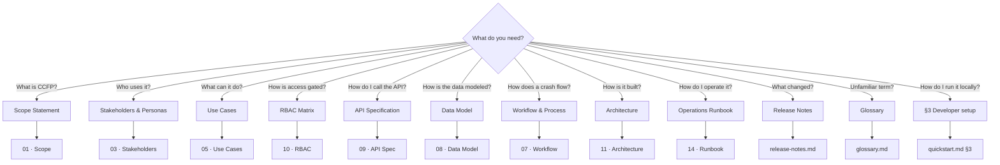

# Getting Started

**Phase:** Getting Started · **Artifact family:** Onboarding

A guided orientation to the **FMCSA Crash Causal Factors Program (CCFP) IT
Solution** — Phase 1 Heavy-Duty Truck Study. Three paths let an executive
understand the program in five minutes, a reviewer tour the working demo as six
personas, and a developer bring the stack up locally.

| Audience | Reading time | Prerequisites |
|---|---|---|
| Executive reviewer | ~5 min | Modern browser |
| Program reviewer / SME | ~10 min | Modern browser; demo URL access |
| Developer / integrator | ~20 min | Python 3.11+, Node 20+, PostgreSQL client, Git, ~500 MB free disk |

!!! tip "Three paths through this page"
    Pick the one that matches your goal:

    1. **Executive summary** — what CCFP is, the Phase 1 scope, and the key facts (~5 min)
    2. **Reviewer tour** — sign in as six personas and walk the crash lifecycle (~10 min)
    3. **Developer setup** — clone, install, run, and verify against the dev database (~20 min)

!!! warning "100% synthetic data"
    Every crash, person, carrier, inspection, and account in this demo is
    **fully synthetic** — generated for demonstration only. The `@ccfp.gov`
    email domain is fictitious and non-deliverable. There is **no real PII, no
    CIPSEA interview content, and no production data** anywhere in the system.

---

## 1. Executive summary

The **Crash Causal Factors Program (CCFP)** is a multi-year, multi-phase FMCSA
research program that identifies the factors contributing to crashes involving
commercial motor vehicles, so the agency can pursue evidence-based
countermeasures, policy, and enforcement toward the long-term goal of zero
roadway fatalities. The **CCFP IT Solution** is the platform that makes this
possible: it collects, integrates, manages, analyzes, and shares crash data from
many actors and systems in one controlled, audit-logged environment. See the
[Scope Statement](01-discover/01-scope-statement.md) for the formal boundary and
the [POC Charter](01-discover/02-poc-charter.md) for governance.

**Phase 1 is the Heavy-Duty Truck Study.** A **qualifying crash** is one
involving at least one fatality **and** at least one heavy-duty Class 7 or Class 8
truck (GVWR ≥ 26,001 lbs). An **in-scope** crash is a qualifying crash in a
participating State. The platform also retains **out-of-scope** supplemental
records — qualifying crashes in non-participating States, and heavy-duty
serious-injury crashes that received an advanced investigation — to provide a
comparison baseline.

**The platform is a digital substrate for a previously manual, fragmented
process.** Required data is scattered across MCSAP inspectors, State CMV
analysts, State crash repositories, SafeSpect, MCMIS, post-crash investigation
workflows, crash reconstruction reports, ELD/eRODS files, and BTS CIPSEA
interviews. CCFP brings every source into one system of record keyed by a single
stable **CCFP identifier** per crash, preserving provenance on every value so an
analyst can trace any attribute back to its origin.

**What is *not* in scope.** CCFP does not replace State crash-reporting systems,
SafeSpect, MCMIS, CDLIS, eRODS, or the BTS secure environment; it does not force
States to standardize their crash-report forms before participating; and it does
not make legal-causation determinations. It supplies data, analysis tools, and
workflow support to authorized users.

**Key facts at a glance:**

<div class="grid cards" markdown>

-   :material-clipboard-text-clock: __8-phase lifecycle__

    Study Setup → Crash Identification & Initial Incident → Notification &
    Routing → Source Data Collection → Data Mapping & Aggregation → Quality
    Control & Completeness → Analysis & Reporting → Publication & Data Sharing.

-   :material-account-key: __12 user roles__

    From `MCSAP_INSPECTOR` and `STATE_CMV_ANALYST` through CIPSEA agents to
    `PUBLIC_USER` — every request is gated server-side by role, organization,
    State, study phase, crash scope, and data sensitivity.

-   :material-truck: __Phase 1 = HDT__

    Fatal crashes involving Class 7/8 trucks. Configurable for future phases
    (medium-duty, buses, serious-injury, more States) **without a rebuild**.

-   :material-shield-lock: __Compliance-first__

    Section 508 / WCAG 2.1 AA, Privacy Act (PTA/PIA/SORN), NARA records,
    **CIPSEA** protection for BTS data, MFA (PIV/CAC), immutable audit logs.

</div>

- **Initial Incident Form (IIF)** — created within **24–48 hours** of a crash;
  it mints the CCFP record, validates the U.S. DOT number against SafeSpect, and
  triggers routing and notifications.
- **~38 core PostgreSQL tables** plus typed §19.2 Post-Crash Investigation child
  tables and 23 native enum types. See the [Data Model](02-analyze/08-data-model.md).
- **88 REST endpoints** across **16 router modules** under `/api/v1`. See the
  [API Specification](02-analyze/09-api-specification.md).
- **~42 permission keys** resolved through `user_role_assignments → roles →
  role_permissions`. See the [RBAC Matrix](02-analyze/10-rbac-matrix.md).
- **Published outputs are de-identified** and served from the public,
  no-authentication `/api/v1/public/...` surface, separated from operational
  records.

**Why this matters.** A single, RBAC-enforced, audit-logged platform eliminates
the reconciliation drift that comes from spreading one crash record across
email, shared drives, and a dozen source systems. Every figure in the demo
traces to the synthetic seed data in `Backend/database/seeds/` — you can read
every byte the system runs on.

**Next:** [Scope Statement](01-discover/01-scope-statement.md) ·
[POC Charter](01-discover/02-poc-charter.md) ·
[Workflow & Process](02-analyze/07-workflow-process.md).

---

## 2. Reviewer tour — sign in as six personas

Open the live demo at
<https://nexgile-dot-ccfp.nexgiletechnologies.com/login>. **Every seeded account
shares the password `Second@123`.** Authentication in the demo is a thin JWT
shim over a mock identity provider; production swaps in the DOT-approved OIDC IdP
(MFA / PIV / CAC) and disables dev auth via `CCFP_DEV_AUTH_ENABLED=false`. See
the [Architecture & Sequence](03-design/11-architecture-sequence.md) page for the
production authentication flow, and the
[Demo Credentials](reference/demo-credentials.md) page for the full account list.

!!! warning "Synthetic accounts only"
    These logins exist solely in the demo database. State-scoped users see only
    their own State's crashes — a deliberate **scope isolation** control, not a
    bug. See the [RBAC Matrix](02-analyze/10-rbac-matrix.md).

### 2.1 `MCSAP_INSPECTOR` — file the Initial Incident Form

```
Email:    nora.kowalczyk@ccfp.gov
Password: Second@123
Role:     MCSAP_INSPECTOR  (State scope: KS)
```

Nora Kowalczyk is a Kansas MCSAP inspector. She lands on her **assigned crashes**
workspace, scoped to Kansas. Open a crash in early lifecycle and try the
**Initial Incident Form**:

- Capture the local crash report number, date/time, location, vehicles,
  drivers, motor carriers, non-motorists, and witnesses.
- Enter a **U.S. DOT number** and submit — the form validates it against the
  SafeSpect mock adapter before routing.
- Notice the **synthetic-data banner**, the crash **status pill**, and the
  **timeline** that fuses status, source-data, and notification events.

See the [Use Cases](01-discover/05-use-cases.md) for the IIF round-trip and
[User Stories](01-discover/06-user-stories.md) for the inspector journey.

### 2.2 `STATE_CMV_ANALYST` — coordinate and code the record

Sign out. Sign in as:

```
Email:    elliot.fontaine@ccfp.gov
Password: Second@123
Role:     STATE_CMV_ANALYST  (State scope: KS)
```

Elliot Fontaine coordinates Kansas data collection, QC, coding, and analysis.
He lands on the **State analyst dashboard**. Try:

- Open a routed in-scope crash and **fill missing attributes** on the aggregated
  record (provenance is preserved per source value).
- Review the **PCR-derived contributing-factor prompt** and select the **top
  three primary contributing factors** across the BRD-specified groups
  (roadway / vehicle / non-motorist circumstances, driver actions, driver
  conditions, distraction, non-motorist actions).
- Watch the crash advance through **QC and completeness** evaluation.

### 2.3 `CCFP_PROJECT_TEAM` — program operations and QC

Sign out. Sign in as:

```
Email:    dana.whitfield@ccfp.gov
Password: Second@123
Role:     CCFP_PROJECT_TEAM  (no State scope)
```

Dana Whitfield is on the FMCSA/Volpe program team. She lands on the
**program operations** view with **cross-State visibility** (no State filter).
Try the **QC rules** view, the **completeness** status board, and the
**aggregated** raw-vs-canonical data view. See the
[Workflow & Process](02-analyze/07-workflow-process.md) page for the QC and
completeness state machines.

### 2.4 `CCFP_DATA_SCIENTIST` / `FEDERAL_USER` — analyze and report

Sign out. Sign in as the data scientist:

```
Email:    priya.ramanathan@ccfp.gov
Password: Second@123
Role:     CCFP_DATA_SCIENTIST  (no State scope)
```

Priya Ramanathan is the federal analytical role for causal-factor research. She
lands on the **analytics** environment: dashboards and **whitelisted,
parameterized** queries. Build a chart, then move to **reports** — create,
share, and publish a de-identified report.

For the federal reading role, sign in instead as:

```
Email:    omar.haddad@ccfp.gov
Password: Second@123
Role:     FEDERAL_USER  (no State scope)
```

Omar Haddad represents FMCSA/NHTSA/BTS approved federal users. He can
**view and download role-approved reports and tables**; PII appears only where
his permissions allow. See the [RBAC Matrix](02-analyze/10-rbac-matrix.md) for
how PII masking and download rights resolve.

### 2.5 `BTS_CIPSEA_AGENT` — confidential interview workflow

Sign out. Sign in as:

```
Email:    helena.brandt@ccfp.gov
Password: Second@123
Role:     BTS_CIPSEA_AGENT  (no State scope)
```

Helena Brandt conducts confidential driver, carrier, and witness interviews for
in-scope crashes. She receives **in-scope crash notifications** and her data
access is governed by **CIPSEA** — the `bts:read` permission gates protected
content, and her interview summaries are tagged and separated from the published
surface. This is the strongest data-sensitivity boundary in the system.

### 2.6 `PUBLIC_USER` — the published, de-identified surface

Sign out. Sign in as:

```
Email:    public.demo@ccfp.gov
Password: Second@123
Role:     PUBLIC_USER  (no State scope)
```

The Public Demo Account consumes **only summarized, de-identified, published**
outputs — the same data exposed on the no-authentication `/api/v1/public/...`
routes. There is no path from this account to operational records, raw source
data, or any PII/CIPSEA content. See the
[Solution Design](03-design/13-solution-design.md) for the publication boundary.

**Deeper walkthroughs:** [Use Cases](01-discover/05-use-cases.md) ·
[Stakeholders & Personas](01-discover/03-stakeholders-personas.md).

---

## 3. Developer setup

!!! info "Prerequisites"
    - **Python 3.11+** (FastAPI + SQLAlchemy 2.0 + Pydantic + PyJWT)
    - **Node 20+** (Vite 5 / TypeScript 5)
    - **PostgreSQL client** (to apply migrations and connect to the dev database)
    - **Git**
    - ~500 MB free disk for the repo + virtualenv + `node_modules`

!!! danger "Never print database credentials"
    The database host, port, user, and password are **never** written into docs
    or committed config. They are supplied **only** through the `DATABASE_URL`
    environment variable (sourced from a secrets manager in any shared
    environment). If you need the value for local work, read it from the single
    project config source — do not duplicate it anywhere.

### 3.1 Clone

```bash
git clone <private-repo-url>
cd DOT-CCFP-App/Proposal
```

### 3.2 Configure the database connection (env var only)

The backend reads its connection string from the **`DATABASE_URL`** environment
variable (a `CCFP_DATABASE_URL` alias is also accepted). Set it in your shell or
a git-ignored `.env` — **the value itself is not shown here and must not be
committed**:

```bash
# value supplied via your secrets manager / local .env — NOT shown in docs
export DATABASE_URL="<from-secrets-manager>"     # macOS / Linux
# PowerShell:  $env:DATABASE_URL = "<from-secrets-manager>"
```

In any shared or production environment the value comes from the DOT-approved
secrets store, and dev auth is disabled (`CCFP_DEV_AUTH_ENABLED=false`). See the
[Solution Design](03-design/13-solution-design.md) page for encryption and
secrets handling.

### 3.3 Apply schema + synthetic seeds

```bash
cd Backend/database
python migrate.py up        # apply migrations then seeds (idempotent)
python migrate.py status    # list applied / pending
```

This creates the **~38 core tables** plus the typed §19.2 Post-Crash
Investigation child tables and **23 native enum types**, then loads **100%
synthetic** seed data: roles, the ~42 permission keys, organizations, demo
users, study configuration, and demo crashes.

### 3.4 Install + run the backend

```bash
cd Backend
pip install -r requirements.txt
uvicorn app.main:app --reload
```

| Surface | Local URL |
|---|---|
| Interactive API docs (Swagger) | `http://localhost:8000/docs` |
| OpenAPI schema | `http://localhost:8000/openapi.json` |
| Health (app) | `http://localhost:8000/health` |
| Health (database) | `http://localhost:8000/health/db` |

### 3.5 Verify auth (sanity check)

```bash
# Get a JWT for a seeded user (all seeded accounts use Second@123)
curl -s -X POST http://localhost:8000/api/v1/auth/login \
  -H 'content-type: application/json' \
  -d '{"email":"elliot.fontaine@ccfp.gov","password":"Second@123"}'

# Use the token — State scope is enforced server-side
TOKEN='<paste-access-token>'
curl -s http://localhost:8000/api/v1/crashes \
  -H "Authorization: Bearer $TOKEN"
```

`elliot.fontaine@ccfp.gov` is a Kansas `STATE_CMV_ANALYST`, so the crash listing
returns **only Kansas crashes**. Compare against `dana.whitfield@ccfp.gov`
(`CCFP_PROJECT_TEAM`, no State filter) to see scope isolation in action.

### 3.6 Run the frontend

In another shell:

```bash
cd Frontend
npm install
npm run dev    # Vite dev server on localhost:5173
```

Vite proxies `/api` to the backend. Open the app at `http://localhost:5173` and
sign in with any account from §2 (or the
[Demo Credentials](reference/demo-credentials.md) page). The deployed equivalent
lives at <https://nexgile-dot-ccfp.nexgiletechnologies.com>.

### 3.7 Build the documentation site

```bash
cd Proposal
pip install mkdocs-material
mkdocs serve            # preview on localhost:8001 (pick a free port)
# or:
mkdocs build            # render the static site into ./site
```

The published docs are served at
<https://nexgile-dot-ccfp.nexgiletechnologies.com/docs>.

---

## 4. Decision tree — what to read next



---

## 5. Common first-timer tasks

| Task | How to do it | Cite |
|---|---|---|
| Log in / switch role | Sign out, then sign back in with another seeded email + `Second@123` | [Demo Credentials](reference/demo-credentials.md) |
| File an Initial Incident Form | Sign in as `MCSAP_INSPECTOR` → open an early-lifecycle crash → **Initial Incident** | [Use Cases](01-discover/05-use-cases.md) · [Workflow & Process](02-analyze/07-workflow-process.md) |
| Select top-3 contributing factors | Sign in as `STATE_CMV_ANALYST` → open a routed crash → **Contributing Factors** | [Workflow & Process](02-analyze/07-workflow-process.md) |
| Upload + parse an ELD/eRODS file | Open a crash → **Source Data** → **ELD upload** (CSV parsed into events) | [Data Model](02-analyze/08-data-model.md) · [API Specification](02-analyze/09-api-specification.md) |
| Run an analytics query | Sign in as `CCFP_DATA_SCIENTIST` → **Analytics** → whitelisted parameterized query | [API Specification](02-analyze/09-api-specification.md) |
| Publish a de-identified report | **Reports** → create → **Publish** (de-identified to public surface) | [Solution Design](03-design/13-solution-design.md) |
| Browse public outputs | Sign in as `PUBLIC_USER` (or hit `/api/v1/public/...` unauthenticated) | [Scope Statement](01-discover/01-scope-statement.md) |
| Read the audit log | Sign in as `SYSTEM_ADMIN` → **Audit** (immutable, append-only) | [RBAC Matrix](02-analyze/10-rbac-matrix.md) · [Operations Runbook](04-release/14-operations-runbook.md) |
| Build the docs site | `cd Proposal && mkdocs build` | §3.7 above |

---

## 6. Related documents

- [Documentation Portal Home](index.md) — landing page + artifact map
- [Scope Statement](01-discover/01-scope-statement.md) — boundary, assumptions, in/out of scope
- [POC Charter](01-discover/02-poc-charter.md) — governance, objectives, risks
- [Stakeholders & Personas](01-discover/03-stakeholders-personas.md) — the 12 in-app roles
- [Use Cases](01-discover/05-use-cases.md) — end-to-end crash-lifecycle scenarios
- [Workflow & Process](02-analyze/07-workflow-process.md) — the 8-phase lifecycle + QC state machines
- [RBAC Matrix](02-analyze/10-rbac-matrix.md) — roles, permission keys, scope, PII masking
- [Operations Runbook](04-release/14-operations-runbook.md) — bring-up + operator playbooks
- [Demo Credentials](reference/demo-credentials.md) — the full synthetic sign-in table
- [Glossary](glossary.md) — CCFP acronyms and domain terms

*End of Getting Started.*
