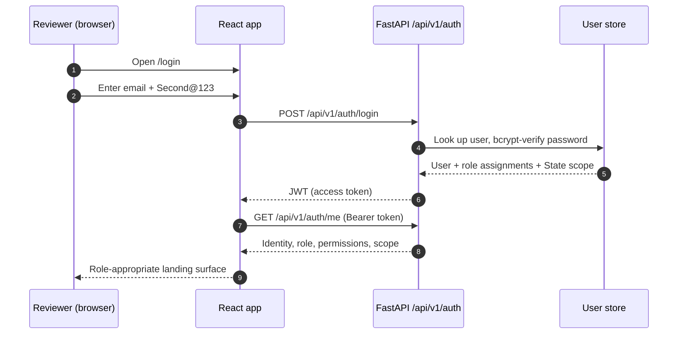
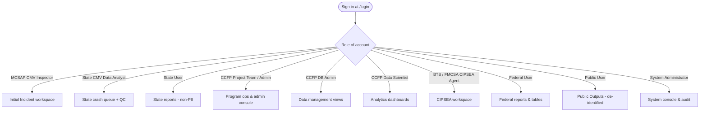
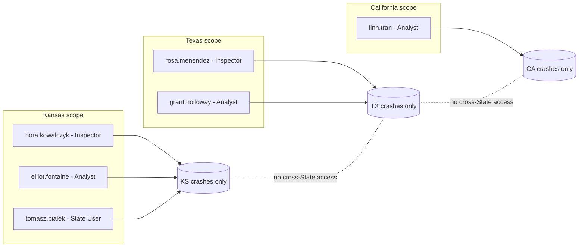

# Demo Access & Credentials

**Phase:** Release · **Artifact family:** Demo Enablement

This is the single source for **every demo login** to the **FMCSA Crash Causal
Factors Program (CCFP) IT Solution** — Phase 1 Heavy-Duty Truck Study. It lists
all 12 primary role accounts, the 3 extra State-scoped accounts used to prove
scope isolation, the shared password, where to sign in, and what each role lands
on. Use it to walk a reviewer through the working demo as any persona, end to
end, without touching the database or any infrastructure detail.

!!! warning "100% synthetic data — never production"
    Every account, name, crash, person, carrier, inspection, and report in this
    demo is **fully synthetic**, generated for demonstration only. The
    `@ccfp.gov` email domain is **fictitious and non-deliverable**. There is
    **no real PII, no CIPSEA interview content, and no production data**
    anywhere in the system. The shared password below is a **dev/demo
    convenience** and must never be reused for any production or
    internet-facing deployment.

!!! info "What this page covers"
    The dev / demo environment realizes the architecture in
    [Architecture & Sequence](../03-design/11-architecture-sequence.md) and the
    components in [Component Diagram](../03-design/12-component-diagram.md).
    Permissions behind each landing surface come from the
    [RBAC Matrix](../02-analyze/10-rbac-matrix.md); the endpoints exercised come
    from the [API Specification](../02-analyze/09-api-specification.md).

---

## 1. At a glance

-   :material-login-variant: __Where to sign in__

    ---

    [https://nexgile-dot-ccfp.nexgiletechnologies.com/login](https://nexgile-dot-ccfp.nexgiletechnologies.com/login)

    Enter one of the emails below + the shared password.

-   :material-key-variant: __Shared password__

    ---

    `Second@123`

    Every seeded account uses the same dev/demo password.

-   :material-account-group: __Accounts__

    ---

    **12 primary role accounts** (one per role) plus **3 extra State-scoped
    accounts** for isolation testing — 15 logins total.

-   :material-shield-lock: __Auth model (demo)__

    ---

    Dev **mock-IdP** issues a JWT (bcrypt-verified). Production swaps in a
    DOT-approved **OIDC IdP** with **MFA / PIV / CAC**.

| Asset | Value |
|---|---|
| Live demo (app) | `https://nexgile-dot-ccfp.nexgiletechnologies.com` |
| Sign-in page | `https://nexgile-dot-ccfp.nexgiletechnologies.com/login` |
| Documentation site | `https://nexgile-dot-ccfp.nexgiletechnologies.com/docs` |
| Public outputs (no login) | `https://nexgile-dot-ccfp.nexgiletechnologies.com` → Public Outputs |
| Shared demo password | `Second@123` (synthetic — dev/demo only) |
| Email domain | `@ccfp.gov` (fictitious, non-deliverable) |
| Primary role accounts | 12 (one per user role) |
| Extra State-scoped accounts | 3 (KS / TX / CA scope-isolation testing) |
| Auth (demo) | mock-IdP → JWT, bcrypt-verified against the seeded user store |
| Auth (production target) | DOT-approved OIDC IdP, MFA + PIV/CAC |

!!! danger "No infrastructure details here — by design"
    This page intentionally contains **no IP addresses, no database connection
    string, no DB host / port / password, and no internal service ports**. The
    only secret shown is the **demo sign-in password**, which is explicitly
    meant to be shared with reviewers. Database configuration is supplied to the
    backend through the `DATABASE_URL` environment variable / secrets manager
    (value not shown).

---

## 2. How to sign in

Signing in is the same for every persona — only the email changes.

**Steps**

1. Open [the sign-in page](https://nexgile-dot-ccfp.nexgiletechnologies.com/login).
2. Enter one of the emails from the tables below.
3. Enter the shared password `Second@123`.
4. You land on the surface that matches the account's role (see §4).

!!! tip "Switch personas fast"
    To compare what two roles see, sign out and back in with a different email —
    the same password works for all of them. State-scoped accounts (KS / TX / CA)
    are the quickest way to show that one State's users never see another
    State's crashes.

!!! note "Public Outputs need no login"
    The de-identified **Public Outputs** surface is reachable without signing in,
    matching the `/api/v1/public/...` routes that require no authentication.
    Use `public.demo@ccfp.gov` only when you want to demonstrate the
    **signed-in** Public User experience.

---

## 3. The complete credentials table

All 12 primary role accounts — **one per user role**. Every account shares the
password `Second@123`. State scope `—` means the account sees data across all
participating States (subject to its role's permissions); a two-letter code
means the account is filtered to that State only.

| Role | Name | Email | Password | State scope |
|---|---|---|---|---|
| System Administrator | Morgan Castellano | `sysadmin@ccfp.gov` | `Second@123` | — |
| CCFP Project Team Administrator | Avery Thornton | `avery.thornton@ccfp.gov` | `Second@123` | — |
| CCFP Project Team | Dana Whitfield | `dana.whitfield@ccfp.gov` | `Second@123` | — |
| CCFP Data Scientist | Priya Ramanathan | `priya.ramanathan@ccfp.gov` | `Second@123` | — |
| CCFP Database Administrator | Victor De La Cruz | `victor.delacruz@ccfp.gov` | `Second@123` | — |
| BTS CIPSEA Agent | Helena Brandt | `helena.brandt@ccfp.gov` | `Second@123` | — |
| FMCSA CIPSEA Agent | Marcus Ellingsworth | `marcus.ellingsworth@ccfp.gov` | `Second@123` | — |
| Federal User | Omar Haddad | `omar.haddad@ccfp.gov` | `Second@123` | — |
| MCSAP CMV Inspector | Nora Kowalczyk | `nora.kowalczyk@ccfp.gov` | `Second@123` | KS |
| State CMV Data Analyst | Elliot Fontaine | `elliot.fontaine@ccfp.gov` | `Second@123` | KS |
| State User | Tomasz Bialek | `tomasz.bialek@ccfp.gov` | `Second@123` | KS |
| Public User | Public Demo Account | `public.demo@ccfp.gov` | `Second@123` | — |

### 3.1 Extra State-scoped accounts (scope-isolation testing)

Three additional accounts exist so reviewers can prove that State scope is
enforced — a Kansas analyst and a Texas analyst, signed in side by side, never
see each other's crashes. Same shared password `Second@123`.

| Role | Email | State scope |
|---|---|---|
| MCSAP CMV Inspector | `rosa.menendez@ccfp.gov` | TX |
| State CMV Data Analyst | `grant.holloway@ccfp.gov` | TX |
| State CMV Data Analyst | `linh.tran@ccfp.gov` | CA |

!!! abstract "Why these three"
    Together with the Kansas-scoped primary accounts (`nora.kowalczyk@ccfp.gov`,
    `elliot.fontaine@ccfp.gov`, `tomasz.bialek@ccfp.gov`), these give you the
    same role in **three different States** (KS / TX / CA). Open them in separate
    browser profiles to demonstrate that a State's data never crosses the State
    boundary.

---

## 4. Role → landing surface

After sign-in, the app routes each account to a role-appropriate landing surface.
The permissions enforced on each surface are defined in the
[RBAC Matrix](../02-analyze/10-rbac-matrix.md); the workflow each surface advances
is described in [Workflow & Process](../02-analyze/07-workflow-process.md).

| Account email | Role | Lands on | Primarily exercises |
|---|---|---|---|
| `nora.kowalczyk@ccfp.gov` | MCSAP CMV Inspector | Initial Incident workspace (KS) | Initial Incident Form, post-crash inspection inputs |
| `elliot.fontaine@ccfp.gov` | State CMV Data Analyst | State crash queue (KS) | Source-data collection, QC, coding, contributing-factor selection |
| `tomasz.bialek@ccfp.gov` | State User | State reports (KS, non-PII) | Role-approved State reports and tables |
| `dana.whitfield@ccfp.gov` | CCFP Project Team | Program operations console | Cross-State crash review, QC, analysis, reporting |
| `avery.thornton@ccfp.gov` | CCFP Project Team Administrator | Admin console | Users, roles, study parameters, attributes, completeness rules |
| `victor.delacruz@ccfp.gov` | CCFP Database Administrator | Data management views | Data mappings, raw & aggregated datasets |
| `priya.ramanathan@ccfp.gov` | CCFP Data Scientist | Analytics dashboards | Dashboards, whitelisted parameterized queries |
| `helena.brandt@ccfp.gov` | BTS CIPSEA Agent | CIPSEA interview workspace | Confidential interviews (CIPSEA-governed) |
| `marcus.ellingsworth@ccfp.gov` | FMCSA CIPSEA Agent | CIPSEA-permitted views | Protected BTS data where permitted |
| `omar.haddad@ccfp.gov` | Federal User | Federal reports & tables | Role-approved reports across States |
| `public.demo@ccfp.gov` | Public User | Public Outputs | De-identified, summarized published data only |
| `sysadmin@ccfp.gov` | System Administrator | System console | Configuration, environments, audit, support |

!!! note "Permissions, not just routing"
    The landing surface is a convenience. **Authorization is enforced
    server-side on every request** by role, organization, State, study phase,
    crash scope, and data sensitivity. A State-scoped account that hand-edits a
    URL to another State's crash still gets a `403` — see
    [RBAC Matrix](../02-analyze/10-rbac-matrix.md).

---

## 5. State-scope isolation

State scope is applied at the data layer, not just in the UI. A KS-scoped
account's queries are filtered to Kansas crashes; the same is true for TX and CA.

**How to demonstrate it**

1. Sign in as `elliot.fontaine@ccfp.gov` (KS analyst) in one browser profile.
2. Sign in as `grant.holloway@ccfp.gov` (TX analyst) in a second profile.
3. Note the crash queues are disjoint — neither analyst sees the other State's
   crashes, and neither can open the other's crash by URL.
4. Sign in as `dana.whitfield@ccfp.gov` (CCFP Project Team, no State scope) to
   show the cross-State view that the program team has.

!!! tip "Pairing for a scope demo"
    The cleanest isolation story uses the **same role in two States**:
    `elliot.fontaine@ccfp.gov` (KS analyst) vs. `grant.holloway@ccfp.gov`
    (TX analyst). Same permissions, different State — different data.

---

## 6. Security model: demo vs. production

The demo uses a **mock identity provider** purely so reviewers can sign in
quickly with a shared password. None of this carries to production.

=== "Demo (what you are using)"

    - Sign-in: email + shared password `Second@123`.
    - Auth: dev **mock-IdP** issues a JWT, bcrypt-verified against the seeded
      user store.
    - Data: 100% synthetic; `@ccfp.gov` is non-deliverable.
    - Enabled by the `CCFP_DEV_AUTH_ENABLED` flag being on.

=== "Production target"

    - Sign-in: DOT-approved **OIDC IdP** with **MFA**; **PIV / CAC** for federal
      users.
    - No shared passwords; no mock-IdP. `CCFP_DEV_AUTH_ENABLED=false` removes the
      demo login path entirely.
    - Encryption in transit and at rest; signed-URL object access; immutable
      audit logs; least privilege.
    - CIPSEA protection for BTS interview data; Privacy Act and NARA records
      management.

!!! warning "Rotate / disable before any non-team exposure"
    The shared password `Second@123` is for the delivery team and invited
    reviewers only. Before any wider exposure, disable the mock-IdP
    (`CCFP_DEV_AUTH_ENABLED=false`) and front the app with the DOT-approved
    OIDC provider. The demo password must never reach an internet-facing,
    real-data deployment.

---

## 7. Quick reference card

A copy-pasteable summary for a live walkthrough.

| Need | Use |
|---|---|
| Sign-in URL | `https://nexgile-dot-ccfp.nexgiletechnologies.com/login` |
| Password (all accounts) | `Second@123` |
| Full-access admin | `sysadmin@ccfp.gov` |
| Program team (cross-State) | `dana.whitfield@ccfp.gov` |
| Analytics / data science | `priya.ramanathan@ccfp.gov` |
| KS inspector (Initial Incident) | `nora.kowalczyk@ccfp.gov` |
| KS analyst (QC + coding) | `elliot.fontaine@ccfp.gov` |
| TX analyst (scope contrast) | `grant.holloway@ccfp.gov` |
| CA analyst (scope contrast) | `linh.tran@ccfp.gov` |
| CIPSEA interview demo | `helena.brandt@ccfp.gov` |
| Federal reports | `omar.haddad@ccfp.gov` |
| Public (signed-in) | `public.demo@ccfp.gov` |
| Public (no login) | Open Public Outputs directly |

!!! abstract "Where the accounts come from"
    These identities are seeded as **synthetic** users. Names, emails, and roles
    are dev/demo fixtures; see [Getting Started](../quickstart.md) for the
    end-to-end persona tour and [Data Model](../02-analyze/08-data-model.md) for
    how users, roles, and State scope are represented.

---

## Related documents

- [Getting Started](../quickstart.md) — guided persona tour that uses these logins
- [RBAC Matrix](../02-analyze/10-rbac-matrix.md) — roles, permissions, and State-scope enforcement
- [Workflow & Process](../02-analyze/07-workflow-process.md) — the lifecycle each role advances
- [API Specification](../02-analyze/09-api-specification.md) — the `auth` and `public` endpoints behind sign-in
- [Data Model](../02-analyze/08-data-model.md) — users, roles, and scope tables
- [Architecture & Sequence](../03-design/11-architecture-sequence.md) — how the demo environment is wired
- [Component Diagram](../03-design/12-component-diagram.md) — the React app, FastAPI API, and data store
- [Solution Design](../03-design/13-solution-design.md) — the rationale behind the auth and scope model
- [Home](../index.md) — program overview and entry point

---

*End of Demo Access & Credentials.*
