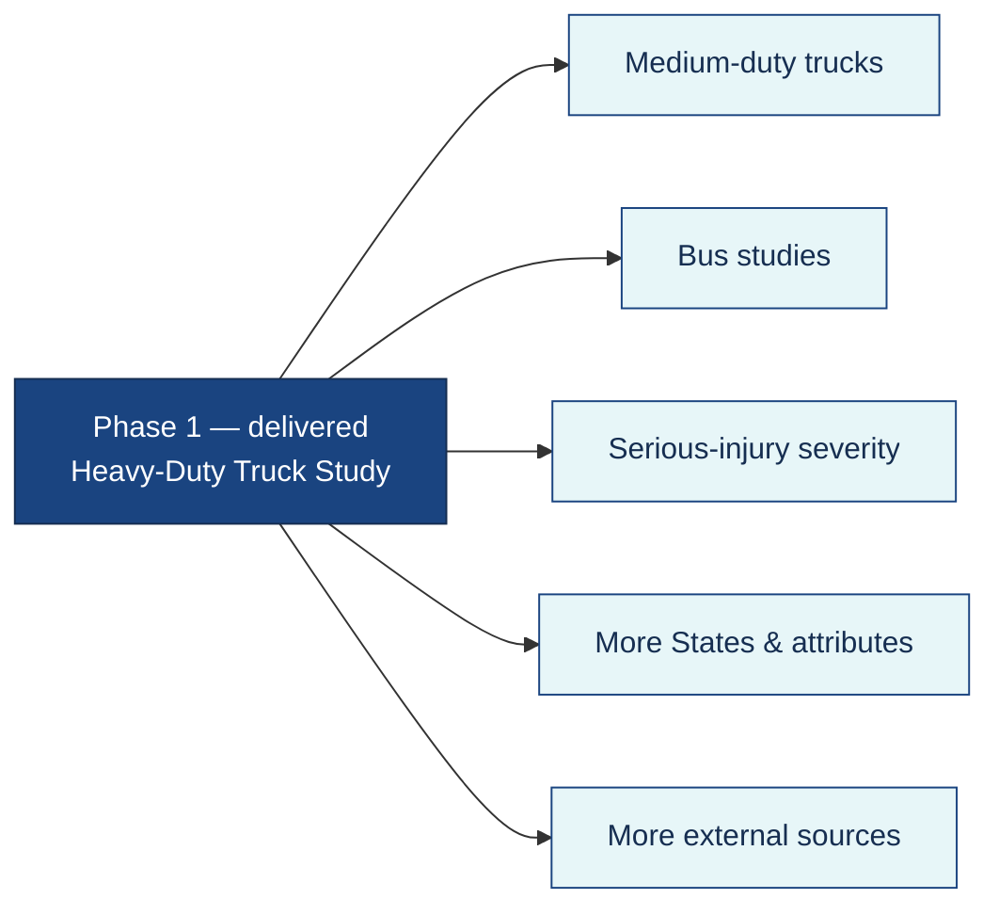

# Release Notes

**Phase:** Release · **Artifact family:** Delivery Record

Chronological changelog for the **Crash Causal Factors Program (CCFP) IT
Solution** platform **and** this documentation site. Newest entries first.
The live proof-of-concept runs at
[`https://nexgile-dot-ccfp.nexgiletechnologies.com`](https://nexgile-dot-ccfp.nexgiletechnologies.com).

!!! warning "100% synthetic data"
    Every crash, organization, user, and demo record referenced in this
    release is **fully synthetic**. The `@ccfp.gov` sign-in domain is
    fictitious and non-deliverable. No real PII, CIPSEA interview data, or
    production crash data exists in any release described here.

!!! info "Versioning policy"
    Semantic versioning. **Breaking** API or schema changes bump major
    (`X.0.0`); **new features** bump minor (`1.Y.0`); **bug fixes and
    documentation** bump patch (`1.1.Z`). The documentation site keeps its
    own cadence; see §3.

---

## 1. v1.0 — 2026-06 · Delivered

**Headline:** End-to-end CCFP proof-of-concept delivered — the full
eight-phase crash lifecycle, role-based access for all 12 personas, public
de-identified outputs, and a seeded synthetic demo at
[`https://nexgile-dot-ccfp.nexgiletechnologies.com`](https://nexgile-dot-ccfp.nexgiletechnologies.com).

### Platform

- **Full crash lifecycle** from Study Setup through Publication, anchored by
  one stable **`ccfp_identifier`** per crash, with source provenance preserved
  on every value.
- **Phase 1 scope engine** — qualifying-crash logic (≥1 fatality **and** ≥1
  heavy-duty Class 7/8 truck, GVWR ≥ 26,001 lbs), plus in-scope vs.
  out-of-scope / supplemental classification driven by participating-State
  configuration rather than hardcoded assumptions.
- **Electronic Initial Incident Form** created within the 24–48 h window,
  with repeatable vehicle / non-motorist / witness groups, save / submit /
  delete workflow, synthetic U.S. DOT validation, and automatic routing to
  the `STATE_CMV_ANALYST` and (for in-scope crashes) `BTS_CIPSEA_AGENT`.
- **Typed Post-Crash Investigation (§19.2) forms** — the multi-section PCI
  workspace ships as 14 structured child tables (`pci_carrier_power_unit`,
  `pci_driver_load`, `pci_medical_certificate`, `pci_hours_of_service`,
  `pci_exemptions`, `pci_vehicle_condition`, `pci_brake_system`,
  `pci_seating_positions`, `pci_axles`, `pci_tires`, `pci_trailers`,
  `pci_hazmat`, `pci_additional_towed_units`, `pci_field_definitions`) with
  per-field required/optional flags and per-seating-position seat-belt/airbag
  capture.
- **State PCR mapping & coverage** — State-specific Police Crash Report fields
  map to CCFP canonical attributes through `pcr_field_mapping`, with per-State
  / per-section coverage tracking and a correctable State-feedback loop, so
  States are not forced to change their existing forms.
- **ELD / eRODS ingestion with summary** — CSV upload, event extraction into
  `eld_events`, duty-code mapping, and an hours-of-service ELD summary linked
  to the correct crash via the unique CCFP output-file comment code.
- **12-role RBAC enforced server-side** through
  `Backend/app/core/permissions.py` on the FastAPI dependency layer
  (~42 `group:action` permission keys resolved via
  `user_role_assignments → roles → role_permissions`), with State-scope
  filtering and PII / CIPSEA masking; the frontend mirrors the same rules for
  hide-vs-disable UI gating.
- **16 router modules, 88 endpoints** under `/api/v1` — `auth`, `admin`,
  `studies`, `crashes`, `initial_incident`, `source_data`, `data_management`,
  `analytics`, `reports`, `public`, `documents`, `notifications`, `search`,
  `audit`, and `integrations`.
- **Public de-identified outputs** — the `public` router serves summarized,
  de-identified study data with **no authentication** (`/api/v1/public/...`),
  separated from operational records.
- **Document handling** — upload with synthetic malware scan, metadata
  capture, and signed-URL download.
- **Immutable audit + notifications** — every state-changing action writes an
  `audit_logs` row; lifecycle events create `notifications`.
- **~38 core tables + typed §19.2 PCI child tables** on PostgreSQL (UUID PKs
  via `gen_random_uuid`, `created_at` / `updated_at` triggers, cascade on
  crash-owned children, restrict on reference FKs, partial unique indexes for
  one current canonical value per `(crash, attribute)` and one completeness
  status per crash, `pg_trgm` for search).
- **Synthetic seed data** — all 12 roles, organizations, study configuration,
  participating States (KS / TX / CA scopes), and demo crashes spanning the
  lifecycle. All seeded accounts share the password `Second@123`.
- **USWDS-aligned theme** — federal navy palette, Recharts visualizations, and
  mobile-responsive layouts across the React + TypeScript + Vite frontend.

### Mock integrations (feature-flagged)

External adapters ship as **mock implementations behind stable interfaces**,
toggled by `CCFP_INTEGRATION_*_LIVE` flags so production wiring is a config
change, not a rewrite.

-   :material-shield-search: **FMCSA-owned (mock)**

    ---

    SafeSpect (inspections / DOT validation), CDLIS (driver licensing via
    AAMVA), MCMIS (carrier & census), eRODS (ELD / HOS).

-   :material-database-import: **Non-FMCSA (mock)**

    ---

    State PCR / crash repositories, NHTSA recalls, FHWA HPMS/MIRE, NOAA HRRR
    weather, and BTS interview data (CIPSEA-governed).

### Documentation

- **14 primary artifacts** published across the four delivery phases:
    - **Discover (6):** Scope Statement, POC Charter, Stakeholders &
      Personas, Business Requirements, Use Cases, User Stories.
    - **Analyze (4):** Workflow & Process, Data Model, API Specification,
      RBAC Matrix.
    - **Design (3):** Architecture & Sequence, Component Diagram, Solution
      Design.
    - **Release (1):** Operations Runbook.
- **5 supplementary references:** this index, Quickstart, Glossary, FAQ, and
  these Release Notes, plus a Demo Credentials reference page.
- **MkDocs Material theme** with the DOT navy / federal blue palette mirroring
  the application UI; **Mermaid diagrams throughout** (flowchart, sequence,
  state, ERD) — **no raster images**.
- **Cross-linked** — every primary artifact carries 6–10 outbound links;
  source of truth remains `Documentation/project_documentation.md`.

### Notable capabilities this cycle

| Area | Delivered capability |
|---|---|
| Lifecycle | All eight phases wired end-to-end with audit + notifications |
| Identity | One stable `ccfp_identifier` per crash; provenance on every value |
| Forms | Typed §19.2 PCI (14 child tables) with required/optional flags |
| ELD | CSV upload, event extraction, duty-code mapping, HOS summary |
| PCR | State-specific mapping + correctable coverage tracking |
| RBAC | 12 roles, ~42 permission keys, State scope + PII/CIPSEA masking |
| Public | De-identified outputs with no-auth `/api/v1/public/...` routes |

### Known issues / limitations

!!! abstract "Dev-only stand-ins — replaceable via the adapter pattern"
    Each limitation below maps to a clearly marked seam designed for a
    DOT-approved production swap.

- **Mock identity provider in dev** — `POST /api/v1/auth/login` issues a
  bcrypt-verified JWT for seeded synthetic users. Setting
  `CCFP_DEV_AUTH_ENABLED=false` swaps in the DOT-approved OIDC IdP with
  MFA and PIV/CAC for federal users; the OIDC slot is present but not wired.
- **Mock external adapters** — SafeSpect, CDLIS, MCMIS, eRODS, State PCR
  repositories, NHTSA, FHWA, NOAA, and BTS interview exchange all return
  synthetic responses behind their interfaces; `CCFP_INTEGRATION_*_LIVE`
  flags gate live cut-over.
- **`BackgroundTasks` instead of Celery/Redis** — routing, validation,
  ingestion, and report generation run **in-process** via FastAPI
  `BackgroundTasks`; the production target is a Celery/Redis worker tier.
- **Local-disk document storage** — uploaded files are written to local disk
  with metadata in PostgreSQL; production targets DOT-approved encrypted object
  storage with versioned signed-URL access.
- **Synthetic malware scan** — the upload scan is a no-op stub in dev;
  production substitutes a real AV engine that holds visibility on scan
  failure.
- **PostgreSQL-only analytics & search** — analytics, SQL `ILIKE` / `pg_trgm`
  search, and document metadata all live in the single PostgreSQL store; a
  dedicated lakehouse / enterprise search service is a future option.
- **English only** — no internationalization in v1.0.

### Breaking changes

None — initial delivery.

### Security notes

- **Demo credentials are synthetic.** All seeded accounts share the password
  `Second@123` and sign in at
  [`/login`](https://nexgile-dot-ccfp.nexgiletechnologies.com/login). The full
  table lives on the [Demo Credentials](reference/demo-credentials.md) page.
  **Rotate and disable dev auth before any non-POC deployment.**
- **Database credentials are never committed.** The connection is supplied at
  runtime via the `DATABASE_URL` environment variable / secrets manager; the
  value is not shown in code or docs.
- **State-scoped isolation enforced server-side** — State users
  (`MCSAP_INSPECTOR`, `STATE_CMV_ANALYST`, `STATE_USER`) see only their State's
  data; CIPSEA-protected BTS data requires `bts:read`.
- **Audit logs are append-only** and capture user, action, and timestamp for
  every state-changing request.
- All dev-only stand-ins (mock IdP, mock adapters, `BackgroundTasks`,
  no-op malware scan, local-disk storage) are explicitly marked and swappable
  via the adapter / feature-flag pattern.

---

## 1.1 v1.1 — 2026-08 · Delivered

**Headline:** ELD/eRODS extraction now reads the **real** ELD output file, and
no ELD upload can fail without saying why (BRD Jan-2026 **Appendix E**, §8.7).

**What was wrong.** The parser understood exactly one shape — a flat CSV whose
header read `sequence,timestamp,duty,…`. A genuine ELD output file is the
*sectioned* CSV defined by 49 CFR 395 Appendix A to Subpart B, so a realistic
file either produced rows of NULLs or a bare `FAILED` with no stored reason.
Encoding fallbacks, unmapped columns, unreadable values and duplicate sequence
numbers were discarded without a trace.

**Delivered**

- **Full ELD output-file extraction.** Header segment (driver, co-driver, CDL,
  carrier, U.S. DOT, VIN, power unit, trailers, time-zone offset, ELD
  registration/identifier, Output File Comment), User and CMV lists, the event
  list, annotations, driver certifications, malfunction and data-diagnostic
  events, login/logout, engine power-up/shut-down, unidentified-driver records
  and the end-of-file check value. Event type/code, record status and record
  origin are interpreted per the rule, so an edited-out record is no longer
  counted as a live duty period.
- **Hours-of-service summary** derived per file — duty hours by status, driving
  and total on-duty hours, duty-status changes, days covered, mileage and
  engine-hour spans, malfunction and unidentified-driver counts.
- **Nothing fails silently.** Structural pre-flight refuses an empty, oversize,
  PDF, `.xlsx`, image or non-delimited upload in the request with the reason and
  the fix. Everything accepted ends `PARSED`, `PARSED_WITH_ERRORS` or `FAILED`
  with a machine-readable `error_code`, an actionable `error_message`, an
  aggregated per-problem list in `eld_parse_issues`, and a notification to the
  uploader.
- **Robustness.** UTF-8/UTF-16/CP1252 and BOM handling, delimiter sniffing,
  NUL stripping, ragged rows, malformed quoting, duplicate sequence numbers
  (kept and flagged — the old unique key rejected valid files), out-of-range
  values, an event cap and a time budget, both reported rather than truncating
  quietly.
- **New endpoints.** `POST …/eld-files/validate` (dry run — what *would* be
  extracted, storing nothing), `GET …/eld-files/{id}/issues`, and
  `POST …/eld-files/{id}/reparse` for re-running extraction after a provider's
  columns are configured.
- **Appendix E authorization fix.** `eld:upload` granted to
  `CCFP_PROJECT_TEAM` — the requirement names *"the MCSAP CMV Inspector and
  analysts on the CCFP Project Team"*, and the analyst was getting a 403.
- **Workspace UI.** Per-file extraction report with every issue by severity,
  line and occurrence count; inline failure reason; expandable driver / carrier /
  HOS panel; "Check file" pre-upload dry run; and a "Re-run" action.

**Schema:** migrations `0030` (`PARSED_WITH_ERRORS` status) and `0031`
(`eld_files` diagnostics + header columns, `eld_events` ELD-standard columns,
new `eld_parse_issues`). Seed `0021` adds the standard column vocabulary and the
Appendix E grant.

---

## 2. Previous cycles (abbreviated)

### v0.6 — 2026-05

- Typed Post-Crash Investigation §19.2 model with validation and the
  multi-section PCI form UI; ELD summary surfaced on the crash workspace.
- State-PCR → CCFP field mapping model and interface.

### v0.5 — 2026-05

- Source Data Collection wired: post-crash inspection ingestion, PCR + mapping,
  reconstruction upload & coding, ELD CSV upload and event extraction.
- Data Management interface: raw vs. aggregated views, QC rules, completeness
  status, and top-three contributing-factor selection.

### v0.4 — 2026-04

- Crash lifecycle, scope classification, and the Initial Incident Form with
  routing and notifications to State analysts and BTS agents.
- Aggregated canonical attributes with provenance and crash timeline.

### v0.3 — 2026-04

- 12-role RBAC enforced server-side; ~42 permission keys; State-scope filtering
  and PII / CIPSEA masking.
- Public de-identified output routes (`/api/v1/public/...`, no auth).

### v0.2 — 2026-03

- Initial PostgreSQL schema (~38 core tables), 23 native enum types, UUID PKs,
  audit + notifications, `pg_trgm` search.
- Synthetic reference, study-config, and demo-crash seed scripts; dev-password
  seed (`Backend/database/seeds/0005_dev_passwords.sql`).

### v0.1 — 2026-03

- Project skeleton: FastAPI app, SQLAlchemy 2.0 models, Vite + React 18 +
  Tailwind frontend, MkDocs Material docs site, dev mock-IdP auth scaffold.

---

## 3. Documentation site changelog

| Date | Site version | Change |
|---|---|---|
| 2026-06 | v1.0 | Full 14-document set + supplementary references published; Demo Credentials page added; cross-link audit complete; Mermaid diagrams throughout. |
| 2026-05 | v0.8 | Design phase added: Architecture & Sequence, Component Diagram, Solution Design. |
| 2026-04 | v0.7 | Analyze phase added: Workflow & Process, Data Model, API Specification, RBAC Matrix. |
| 2026-03 | v0.5 | Discover phase initial drop: Scope Statement, Stakeholders & Personas, Business Requirements. |
| 2026-03 | v0.1 | MkDocs Material scaffold; federal navy theme + navigation skeleton. |

---

## 4. Roadmap pointer

CCFP is **multi-phase by design**, and v1.0 was built to extend to future
phases without a rebuild.

!!! tip "Configurable, not hardcoded"
    Study parameters, canonical attributes, completeness rules, and scope
    logic are data-driven (`studies`, `study_parameters`, `data_attributes`,
    `attribute_requirements`, `completeness_rules`). Adding a medium-duty,
    bus, or serious-injury phase — or a new participating State, attribute, or
    source — is configuration, not a re-platform. Production cut-over targets
    (DOT-approved OIDC, Celery/Redis, object storage, managed PostgreSQL, live
    integrations) are tracked as feature-flagged seams. See the
    [Solution Design](03-design/13-solution-design.md) for the full extension
    model.

---

## Related documents

- [Home](index.md)
- [Quickstart](quickstart.md)
- [FAQ](faq.md)
- [Glossary](glossary.md)
- [Demo Credentials](reference/demo-credentials.md) — synthetic sign-in accounts
- [Workflow & Process](02-analyze/07-workflow-process.md) — the eight-phase lifecycle
- [Data Model](02-analyze/08-data-model.md) — tables, enums, and provenance
- [API Specification](02-analyze/09-api-specification.md) — the 16 routers / 88 endpoints
- [RBAC Matrix](02-analyze/10-rbac-matrix.md) — roles and permission keys
- [Solution Design](03-design/13-solution-design.md) — adapters and extension model
- [Operations Runbook](04-release/14-operations-runbook.md) — deploy and support

*End of Release Notes.*
